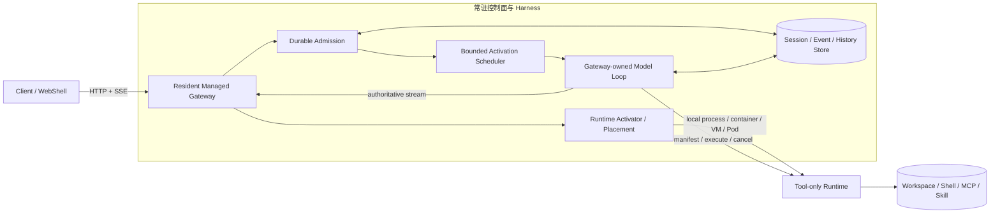
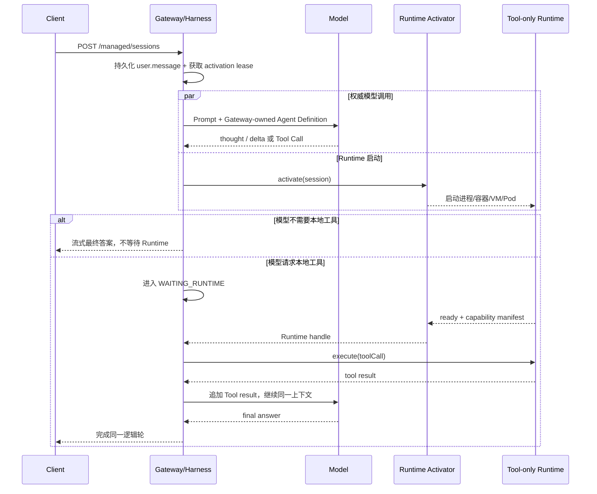

# Qwen Code Managed Agents 方案

> 状态：架构方案 + P0～P8 本地实验总结，尚未进入
> [QwenLM/qwen-code](https://github.com/QwenLM/qwen-code) `main`。本文中的“已实现”仅指实验工作树；生产调度、Kubernetes 接入与完整安全隔离仍是后续工作。
> 整理日期：2026-09-07。

## 1. 结论

推荐把现在“模型循环和本地执行环境一起启动”的 daemon 拆成两个生命周期：

- **常驻、逻辑多租户的 Managed Gateway/Harness**：接入请求、维护会话、调用模型、流式返回、持久化历史，并在后台请求 Runtime；
- **按需、租户和会话隔离的 Tool-only Runtime**：提供工作区文件、Shell、MCP、Skill 等依赖本地环境的能力，不持有模型会话，也不生成最终答案。

首轮 Prompt 到达时，即使 Runtime Pod 还不存在，Gateway 也立即开始唯一且权威的模型调用。只有当模型真正发出本地 Tool Call 时，同一轮执行才等待 Runtime 就绪；工具结果返回后，由 Gateway 继续同一个模型上下文。

因此这不是“前置模型先回答，第二、三轮再把会话迁到 Pod”，而是：

```text
模型会话始终在 Gateway
本地工具执行在 Runtime 就绪后接入
```

这个边界同时解决首轮 TTFT、双模型回答不一致和模型上下文迁移问题。它与 Anthropic 公开的 [Managed Agents](https://www.anthropic.com/engineering/managed-agents) 方向一致：把 Agent Harness 与隔离执行环境分层；本文则进一步给出适配 Qwen Code daemon 的会话、租约和 Tool-only 协议设计。

## 2. 问题与目标

当前若完整 daemon 运行在按需 Pod 内，请求关键路径通常是：

```text
请求 -> 调度 Pod -> 拉镜像/挂载 -> Pod Ready -> daemon 启动
     -> Provider/MCP/Skill 初始化 -> 模型调用 -> 首个有效输出
```

Pod 和 daemon 冷启动会直接叠加到 TTFT。简单增加一个前置 Web 服务，如果它仍需等待后端 daemon 才调用模型，只是提前返回了 ACK，并没有缩短“首个有效模型输出”。

目标路径应改为：

```text
请求 -> 常驻 Gateway 立即调用模型 ---------------------> 流式输出
              `-> 并行申请 Runtime -> Pod/进程 Ready -> 本地 Tool
                                                   `-> 模型继续
```

设计目标：

1. Runtime 未启动时也能接收首个 Prompt 并开始权威模型推理；
2. 无本地工具的请求完全不等待 Runtime；
3. 需要工具时只在 Tool Call 边界等待，并在同一逻辑轮内继续；
4. 多轮会话的模型历史不随 Pod 生命周期丢失；
5. Gateway 可多租户共享，Runtime 保持租户、会话和工作区隔离；
6. 调度抽象不依赖 Kubernetes，也可落到进程、容器或 VM。

## 3. 总体架构



### 3.1 组件职责

| 组件              | 生命周期     | 主要职责                                          | 明确不负责                 |
| ----------------- | ------------ | ------------------------------------------------- | -------------------------- |
| Managed Gateway   | 常驻         | 鉴权、租户/会话身份、HTTP/SSE、幂等请求、最终响应 | 工作区内执行               |
| Harness Worker    | 常驻、可替换 | 组装上下文、执行模型循环、推进会话状态            | 永久绑定某个会话           |
| Session Store     | 持久化       | 用户消息、模型历史、状态、事件、租约和恢复        | 模型或工具执行             |
| Runtime Activator | 可插拔       | 选择、创建、等待、释放 Runtime                    | Agent 协议与模型循环       |
| Tool-only Runtime | 按需或池化   | 工作区、Shell、MCP、Skill、工具执行               | Prompt、模型凭据、最终答案 |

### 3.2 Gateway 与 Harness 的关系

Gateway 是对客户端暴露 HTTP/SSE 的 Web 服务。Harness 是推进 Agent 状态机和模型循环的逻辑执行层；第一阶段可以与 Gateway 位于同一个 Node.js 进程，后续再按故障隔离和容量需要拆成 Worker 进程。

“Harness 实例池”不是“一会话一个进程”，也不是“一会话一个 Pod”。建议的资源模型是：

```text
常驻服务实例（进程 / 容器 / Pod）
  -> 少量 Harness Worker 进程
       -> 每个进程承载有上限的异步 activation slots
            -> 每个 slot 临时推进一个 Session
```

一个 Session 没有永久线程或进程归属。模型流式请求和远程工具等待使用异步 I/O；只有 CPU 密集任务才进入共享、受限的线程池。这样不会因会话数放大进程基础内存，也不会把架构绑定到 Kubernetes。

Kubernetes 部署通常可采用“一 Pod 一 Worker 进程”，但这是部署映射，不是协议语义。非 Kubernetes 环境可由 systemd、supervisor、本地父进程或容器平台启动同一个 Worker。

### 3.3 多租户边界

推荐“一个逻辑多租户服务 + 常驻无状态 Harness 实例池”，但“无状态”仅表示 Worker 可替换、不是会话的唯一持久化所有者，不表示进程内部完全没有临时缓存，也不表示实例池可以缩容到零。

每个请求和持久化对象都必须绑定：

```text
tenantId + userId + sessionId + workspaceId
```

每次推进会话还需持有带单调 epoch 的 `SessionActivationLease`；每个 Runtime 绑定需持有独立的 `RuntimeLease`。旧 Worker 或旧 Runtime 的迟到结果必须因 epoch 过期而被拒绝。

为了 TTFT，Harness 必须保留 warm capacity floor。容量满时进入有界、公平队列，而不是退化为无限排队：

- 全局与单租户队列上限；
- 每租户并发和公平调度；
- activation slot 与内存水位双重准入；
- 队列等待超限返回明确的可重试过载；
- 扩容只是性能优化，不是正确性前提。

## 4. 首轮和多轮流程

### 4.1 首轮：Runtime 未启动



关键点：首轮不需要“临时回答再切换”。Gateway 的第一次模型调用就是权威调用。模型可在 Runtime 启动期间做意图理解、任务规划和纯模型回答；若它很快就发出 Tool Call，只在该边界等待。

### 4.2 第二、三轮

首轮启动的 Runtime 通常已经就绪，后续 Prompt 复用同一个受租约保护的 Runtime。Gateway 继续持有完整模型历史，Runtime 仅保存工作区执行态和受控的 Tool 会话：

```text
follow-up Prompt
  -> Gateway 从 durable history 继续模型轮
  -> Runtime 已就绪：立即执行本地 Tool
  -> Runtime 已回收/重启：重新 activate 或 resume，再继续同一轮
```

所以“第二、三轮切到 Pod”更准确的说法是“第二、三轮通常已经能直接使用 Pod 内的工具”，而不是把模型会话迁移到 Pod。

### 4.3 会话恢复与幂等

- 客户端每个 Prompt 提供稳定的 `Idempotency-Key`；
- 完整用户输入先持久化，再进入 activation queue，再返回成功；
- 同一个 key 和相同 payload 返回已有结果，不重复执行；
- 同一个 key 和不同 payload 失败关闭；
- 一次只允许一个未完成的 Prompt 推进同一 Session；
- Worker 重启后用更高 lease epoch 恢复，旧执行结果不能提交；
- Tool 已分发但结果不确定时默认不自动重试，直到具备副作用账本。

## 5. Agent Definition 与 Tool-only Runtime

模型要在 Runtime Ready 前开始，Gateway 必须预先知道可展示给模型的工具定义。推荐把它作为版本化、不可变的 `AgentDefinition`：

```text
AgentDefinition
  = model + instructions + tool schemas + skills + policy + definitionDigest
```

P8 实验采用 Gateway 内置的只读 `Read`、`Search`、`Fetch` 工具定义。模型发出 Tool Call 后，Gateway 再读取 Runtime manifest 并逐项校验：

1. Runtime capability digest 与 manifest 绑定；
2. Tool 同时存在于 Agent Definition 和 Runtime manifest；
3. 名称和规范化后的输入 schema 一致；
4. Runtime 仍将其分类为只读；
5. execute 请求固定当前 capability digest。

任何身份、schema、版本或 digest 漂移都在分发 Tool 前失败关闭。Runtime 动态发现的 MCP 和 workspace Skill 不能临时加入已经开始的首轮模型请求；生产方案需要控制面预发布或缓存版本化能力目录。

### 5.1 Runtime 私有协议

当前 P8 进程边界原型使用 Bearer 认证的私有 HTTP v1：

```text
POST /internal/managed-runtime/v1/prepare
POST /internal/managed-runtime/v1/manifest
POST /internal/managed-runtime/v1/execute
POST /internal/managed-runtime/v1/cancel
POST /internal/managed-runtime/v1/release
```

请求包含协议版本、租户、工作区、Session、Turn、Tool Call、执行 ID 与 capability digest。协议中禁止出现：

- 原始用户 Prompt；
- 模型历史和最终回答；
- Provider 配置和模型凭据；
- Runtime 内部 ACP client id。

网络拒绝、连接重置、HTTP 429/503 可作为“尚未就绪”进行有上限、可取消的 prepare 重试。认证失败、其他 4xx、畸形响应和协议版本错误为永久失败。Tool execute 一旦分发不自动重试。

### 5.2 公共 Managed API

实验 API 保持很小：

```text
POST /managed/sessions
POST /managed/sessions/:id/prompts
GET  /managed/sessions/:id
GET  /managed/sessions/:id/events
```

创建和续轮请求使用 `Idempotency-Key`，当前本地原型还使用 `X-Qwen-Managed-Client-Id` 做调用者关联。生产实现必须从已认证请求上下文派生 tenant/user 身份，不能相信请求 body 或普通 header 自报身份。

事件流至少区分：

```text
accepted
agent_started
assistant_thought
assistant_delta
tool_requested
runtime_starting
runtime_ready | runtime_failed
tool_completed
completed | failed
```

Runtime readiness 与 Prompt outcome 是两个独立状态轴：无 Tool 的轮次可以先完成，Runtime 稍后 Ready；客户端可在后续状态读取或重连中观察它。

## 6. Runtime Activator：不绑定 Kubernetes

P8 仅支持配置一个固定 Runtime URL，证明了远程协议边界，还没有自动创建 Pod。下一步应先增加一个部署中立接口：

```ts
interface ManagedRuntimeActivator {
  activate(request: ManagedRuntimePrepareRequest): ManagedRuntimeActivation;
  release(sessionId: string): Promise<void>;
}

interface ManagedRuntimeActivation {
  ready: Promise<{
    baseUrl: string;
    token: string;
    leaseId: string;
    epoch: number;
  }>;
}
```

实现顺序建议：

1. **LocalProcessActivator**：由父进程启动、探活和回收 Tool-only Runtime，先验证生命周期、超时、取消和崩溃恢复；
2. **StaticPoolActivator**：从预热 Runtime 池分配，验证容量和租约复用；
3. **KubernetesActivator**：把同一接口映射为 Pod 创建、Service/地址发现、readiness 与回收；
4. 后续再加入 placement、镜像缓存、快照或预测预热，不修改 Agent 协议。

不同环境只替换 Activator：

| 环境                 | Runtime 载体                              |
| -------------------- | ----------------------------------------- |
| 本地开发             | 子进程或本地容器                          |
| VM / 裸机            | supervisor 管理的进程或容器               |
| Kubernetes           | 每个隔离 Runtime 一个 Pod，或受控池化 Pod |
| Serverless container | 独立 task/container                       |

## 7. 语言选择

首版建议继续使用 TypeScript/Node.js：

- Qwen Code 的模型、工具 schema、daemon、ACP bridge 和会话语义已经在 TypeScript；
- 最小改动即可复用现有 Provider、SSE、鉴权、工具验证与测试；
- Harness 的主负载是模型流和远程 Tool 等待，异步 I/O 比一会话一线程更合适；
- 多租户是否安全由隔离、配额、租约和持久化边界决定，不由语言自动保证。

Rust 适合未来独立的高吞吐 Gateway、placement service 或 sandbox supervisor，尤其当需要更强内存可控性、长尾延迟和单二进制部署时。但现在直接用 Rust 重写 Harness 会同时重建 Qwen Code 的模型循环、工具 schema、事件与恢复语义，验证成本大于收益。

建议先用 TypeScript 验证协议和真实负载；只有监控证明 Node.js 的 RSS、GC 或 event-loop lag 成为瓶颈，再将稳定协议后的局部控制面替换为 Rust。

## 8. 数据依据

### 8.1 DataAgent 前三轮方向性样本

2026-09-01 对此前 24 小时的只读 SLS 小样本按环境和 `interaction.sequence` 各取最多 30 条最新 interaction trace，不读取 Prompt 内容。把 shell、文件、搜索、Skill 和 workspace-aware agent tool 视为本地 Runtime 能力：

| 环境 | 轮次 | traces / users | 无本地 Tool | 首个本地 Tool p50 / p95 | 高频调用                      |
| ---- | ---: | -------------: | ----------: | ----------------------: | ----------------------------- |
| 内部 |    1 |         30 / 5 |       30.0% |            9.8s / 33.2s | shell 251, skill 29, read 19  |
| 内部 |    2 |         16 / 2 |       12.5% |           11.5s / 38.5s | shell 93, read 8, skill 6     |
| 内部 |    3 |         11 / 1 |        9.1% |          12.4s / 121.1s | shell 71, skill 8, read 6     |
| 公共 |    1 |        30 / 13 |       93.3% |             3.1s / 4.0s | read 6, skill 2, shell 2      |
| 公共 |    2 |        30 / 23 |       20.0% |           11.1s / 99.9s | shell 202, read 43, skill 14  |
| 公共 |    3 |        30 / 20 |       30.0% |           20.7s / 76.3s | shell 125, read 33, search 12 |

工具使用轮次通常给 Runtime 大约 10 秒的中位预热窗口，支持“模型与 Runtime 并行启动”。但样本很小，内部第二、三轮分别只有 2 和 1 个用户，可能混入自动任务，因此不能当作总体分布。当前样本也没有可靠的 Pod/daemon 启动 p50/p95，这仍是上线前必须补齐的观测缺口。

### 8.2 P8 双进程实测

本地用两个真实 `qwen serve` 进程和 `moonshot/kimi-k3` 验证：Gateway 先启动，Runtime 端口在模型发出 Tool Call 后才启动。

| 相对 accepted 的事件        |      时间 |
| --------------------------- | --------: |
| `runtime_starting`          |     11 ms |
| `agent_started`             |     15 ms |
| 首个模型 thought            |  2,632 ms |
| Runtime 不存在时请求 `glob` |  4,676 ms |
| Runtime Ready               | 15,804 ms |
| `glob` 完成                 | 15,877 ms |
| 请求 `read_file`            | 18,618 ms |
| `read_file` 完成            | 18,649 ms |
| 首个 final-text delta       | 21,005 ms |
| `completed`                 | 21,055 ms |

同一逻辑轮在首个 Tool 边界等待约 11.1 秒，随后跨私有 HTTP 执行 `glob` 和 `read_file`，最终答案精确为 `P8_REMOTE_RUNTIME_BOUNDARY_7C4E19`。Gateway 记录 3 轮模型调用；Runtime 没有模型 usage，且对其 source-bound Session 发普通 Prompt 返回 `404 session_not_found`。

这证明“权威推理不依赖 Runtime Ready”，但本次 Runtime Ready 前产生的是 thought，不是用户可见 final text；是否能在工具前展示有价值的自然语言，仍取决于模型和 Prompt。评估时必须区分 HTTP ACK、thought、首个 final delta 和首个 Tool result，不能把 ACK 当 TTFT。

## 9. P0～P8 演进与当前有效口径

| 阶段 | 结论                                                        | 当前状态                               |
| ---- | ----------------------------------------------------------- | -------------------------------------- |
| P0   | 定义 Harness/Runtime 边界、同轮 Tool 等待与部署中立资源模型 | 早期 in-Core broker 已移除；边界保留   |
| P1   | 文件日志、activation lease、epoch fencing、slot/内存准入    | 底层实验保留                           |
| P2   | 完整 `user.message` 先持久化，再排队和 ACK                  | 底层实验保留                           |
| P3   | 首个 live Managed Prompt 进入现有 Runtime                   | 历史过渡方案                           |
| P4   | 前置非权威 bootstrap 模型与 Runtime 并行                    | 已被 P7 替代                           |
| P5   | Managed 多轮绑定、幂等、Runtime resume                      | 多轮契约保留，Runtime 模型所有权已替代 |
| P6   | Gateway 持有模型和历史，ACP Runtime 只执行工具              | 所有权边界保留                         |
| P7   | 第一次权威模型调用与 Runtime 并行，只在 Tool 边界等待       | 当前关键行为                           |
| P8   | Gateway 与 Runtime 拆为两个进程，以私有 HTTP v1 连接        | 当前原型边界                           |

实验代码的主要锚点：

- `packages/core/src/managed-runtime/managed-session-inbox.ts:FileManagedSessionInbox`
- `packages/core/src/managed-runtime/managed-activation-store.ts:FileManagedActivationStore`
- `packages/core/src/managed-runtime/embedded-harness-scheduler.ts:EmbeddedHarnessScheduler`
- `packages/cli/src/serve/managed-prompt-service.ts:createManagedPromptService`
- `packages/cli/src/serve/managed-gateway-model-runtime.ts:ResidentManagedGatewayModelRunner`
- `packages/cli/src/serve/managed-runtime-provider.ts:LocalManagedRuntimeProvider`
- `packages/cli/src/serve/managed-runtime-provider.ts:RemoteManagedRuntimeProvider`
- `packages/cli/src/serve/routes/managed-runtime-worker.ts:registerManagedRuntimeWorkerRoutes`

## 10. 当前体验方式

实验工作树完成构建后，可以用两个端口验证进程边界：

```bash
# Tool-only Runtime worker
QWEN_SERVER_TOKEN=runtime-secret qwen serve --no-web --port 4181 \
  --experimental-managed-runtime-worker --workspace /workspace

# 常驻 Gateway
QWEN_SERVER_TOKEN=gateway-secret \
QWEN_MANAGED_RUNTIME_TOKEN=runtime-secret \
qwen serve --no-web --port 4170 \
  --experimental-managed-agents \
  --experimental-managed-runtime-url http://127.0.0.1:4181 \
  --workspace /workspace
```

不设置 `--experimental-managed-runtime-url` 时，实验保留 P7 的本地进程内 Provider。远程模式要求 Runtime Bearer token；非 loopback 地址必须使用 HTTPS。

这只是架构验证，不应直接部署为生产多租户服务。

## 11. 安全和失败语义

必须保持以下不变量：

1. 只有持有当前 activation lease epoch 的 Harness 能推进 Session 和提交最终答案；
2. Runtime 只持有执行租约，永远不成为 Session 所有者；
3. 身份来自 Gateway 鉴权上下文，不来自模型输出或 Runtime payload；
4. Runtime 只接收选中的 Tool Call 和最小权限凭据；
5. 模型凭据、宽泛云凭据和完整 Prompt 不进入 Runtime；
6. Tool schema 在一轮内不可因 Runtime Ready 而改变；
7. Runtime replacement 后的旧结果被 epoch fencing 拒绝；
8. mutating Tool 在没有副作用账本前不做分发后自动重试；
9. 工作区不可信、identity 不一致、capability drift 和协议异常全部失败关闭；
10. 用户断开 SSE 不等于取消已经持久化的工作。

当前 P8 还复用了普通 `qwen serve` 作为 Runtime worker，因此进程可能加载普通 Qwen Code 模块，其监听器也保留非 Managed API。虽然 source-bound Managed Session 已被普通 API 隐藏，生产版仍需独立的、credential-minimal 的 Tool-only 可执行程序或监听器。

## 12. 容量与可观测性

Harness 容量不能只看 Pod 数。建议预算：

```text
worker count * (base RSS + process-local cache budget)
  + active activation slots * p95 activation working set
  + safety headroom
```

核心扩缩容信号：

- available activation slots；
- queue depth 与 oldest queued age；
- event-loop lag；
- RSS/heap pressure；
- Runtime pool hit rate 与 activation latency；
- 每租户并发和等待时间。

端到端至少记录：

```text
prompt admitted
harness queued / assigned
model request started / first thought / first final delta
first tool requested
runtime requested / ready
tool started / completed
authoritative answer completed
```

首要 SLO 应分别观察 model TTFT、Harness 排队、Runtime 等待、首个 Tool result 和总完成时间。把这些指标合成一个“首字节”会掩盖真实瓶颈。

## 13. 已完成验证与限制

P8 实验累计的针对性自动化验证包括：

- Core Managed runtime：29 个测试；
- Gateway 模型、会话事件、历史与 Runtime Provider：49 个测试；
- CLI 参数回归：74 个测试；
- server 针对性回归：13 个测试；
- cross-layer 集成：8 个测试；
- ACP bridge 全量：838 个测试；
- Core 与 ACP bridge typecheck 通过；CLI typecheck 被工作树既有 Ink 类型漂移阻塞，未发现 Managed Agents 新增错误。

仍未完成：

- 固定 Runtime URL 之外的自动创建、placement、探活选择和 fenced lease；
- 生产级多租户身份、分布式 Session store、持久事件 replay 与原子恢复边界；
- Runtime 动态 MCP/Skill 能力发布、权限回传和 progress streaming；
- Shell、写文件和其他 mutating Tool 的权限与 side-effect ledger；
- Runtime idle eviction、预热池、资源配额和成本模型；
- 独立 credential-minimal Runtime 镜像/可执行程序；
- Runtime 启动 p50/p95、真实 workload 命中率和大样本前三轮分布。

## 14. 下一阶段：P9

先做最小的 **LocalProcessActivator**，不要直接写 Kubernetes controller：

1. 把“固定 Runtime URL”替换为 `ManagedRuntimeActivator` 接口；
2. Gateway admission 后立即调用 `activate()`，并保持模型立即开始；
3. 本地 adapter 启动一个受控 Runtime 子进程，等待 authenticated readiness；
4. 返回带 `leaseId + epoch` 的 handle，并验证 release、超时、取消和崩溃重启；
5. 用与 P8 相同的双进程 E2E 证明 API、时序和同轮 Tool 行为不变；
6. 接口稳定后再增加 Kubernetes adapter，只替换生命周期实现。

P9 的通过标准：

- 用户第一次 Prompt 到达时 Runtime 可以完全不存在；
- `agent_started` 仍先于 `runtime_ready`；
- 无 Tool 请求在 Runtime 启动失败时仍能完成；
- Tool 请求可等待自动启动的 Runtime，并只执行一次；
- Gateway 或 Runtime 重启不会让旧 lease 的结果推进 Session；
- 本地进程与 Kubernetes 实现共享同一组 Activator 合约测试。

## 15. 非目标

当前阶段不做：

- 每 Session 一个 Harness 进程、线程或 Pod；
- 在 Runtime 内保留第二个模型循环；
- 把 bootstrap 文本冒充权威答案；
- 为追求 ACK 速度而忽略有效模型 TTFT；
- 在协议尚未稳定前重写 Rust Gateway；
- 自动重试可能产生副作用的 Tool；
- 用 Kubernetes 对象替代 Session、租约和恢复语义。

最终建议是：**保留常驻多租户 Gateway/Harness，把模型和会话留在 Gateway，把本地能力收敛为按需 Tool-only Runtime；先以 TypeScript 和 LocalProcessActivator 打通 P9，再接 Kubernetes。**
