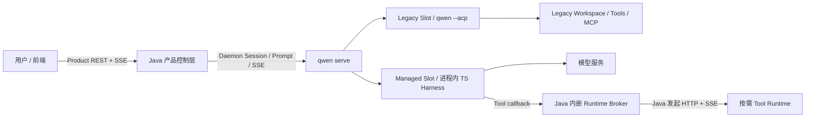

# Managed Agent 双链路方案：Java、qwen serve 与 Tool Runtime

> 当前基准：[Managed Agent 双链路技术方案 HTML v1.4](managed-agent-dual-path-architecture.html)。同步日期：2026-09-19；v1.3 补充首版运行条件，v1.4 补齐普通工具的跨组件接线。本文将 HTML 的职责、部署、协议、状态和 A～H 阶段整理为可检索的 Markdown；发生冲突时以 HTML 为准。这里的目标契约不等于当前代码已全部实现或验收。
>
> 此前以 `JavaAgentProvider`、Java 首阶段统一 Session authority 和 M0～M8 为主线的版本已移入[历史归档](managed-agent-java-hosted-runtime-history.md)。现有代码和测试记录继续保留，但不能据此改写 HTML 的目标顺序。具体实现差异见第 17 节。

## 0. 首版运行条件（2026-09-19）

当前交付以[首版运行契约](managed-agent-first-runtime.md)为准：五项基础必需为 Prompt 持久受理与幂等、Broker 调用及原执行查询、预发布 AgentBundle、Session 固定归属与持久存储、Runtime 有界生命周期。需要交互的已开放工具必须接通审批；跨 Session 共享 Runtime 仅在隔离验收后开放。独立公共 SSE/Item 投影按 D 后置，既有产品 SSE/历史查询必须可用。

首版验证配置为单 Java + qwen Sidecar、静态 Bundle、Session 独占 Runtime；同 Session 多轮复用，Harness 仍可承载多个 Session。多实例部署必须先补原 owner 路由和跨副本 provision 去重，不能使用单实例证明。tenantId 相关设计暂缓，不作为本轮运行验收项；不改变既有鉴权和 Session/Workspace 校验。

首版只支持普通工具，以 Read、Write、Edit 和前台 Shell 为最小验收集；自动记忆、子 Agent、后台 Shell 暂不涉及。范围复用现有配置和 Bundle 表达，不新增开关协议；普通工具审批、输出/文件历史保存及 Shell 后代进程的取消清理仍须完成。范围外能力的配置在创建前按既有 selector 处理，不能静默裁剪后进入 Managed。

A～H 保留为能力阶段；首个闭环使用 A/B/C/E 与 F 的必要验收，不依赖完整 D 公共投影或 G 共享 Authority。下文各节中的全量能力按所属阶段开放，不将完整目标自动视为首版必需。

v1.4 的[普通工具接线设计](managed-agent-ordinary-tools-integration.md)固定 Bundle 发布/装载和 Session DTO、命令回执查询、完整 tool/history control、结果 bytes 交付与干净回收后的第二轮；补充验收 S01～S08 与 M01～M10 同属首版条件。

## 1. 架构总览

Java 作为产品控制面并内嵌 Runtime Broker；`qwen serve` 保留统一 Session/Prompt/Load/Resume/SSE 契约和 TS Agent 内核，在同一 daemon 内承载 Legacy 与 Managed 两种执行引擎。Managed Harness 从第一轮起负责唯一模型循环，Workspace、MCP 和本地工具交给按需启动的 Tool Runtime。



本地模式可使用 Local Runtime Provider；托管模式调用 Java 内嵌 Broker。第一阶段不新增独立 Broker 服务，不为每个 Session 创建一个 Harness 进程，也不使用 Java 重写 Agent Loop。

## 2. 目标与边界

- 第一次 Prompt 不等待 Runtime Pod；无 Tool Turn 可以在 Runtime 未就绪时完成。
- 有 Tool Call 时在同一 Turn 内等待 Runtime，结果返回后继续同一个模型上下文。
- 完整复用 TS Agent Loop、Context、压缩、权限编排和工具语义。
- Legacy 与 Managed 在同一系统内渐进迁移，已有 Session 不原地切换引擎。
- Java 管理 Runtime 生命周期、路由、配额和审计；Runtime 不持有模型凭据、不接收用户 Prompt。
- 第一阶段不一次性迁移 Channels、Scheduled Task、Hooks 和全部 MCP。
- 不承诺外部副作用 exactly-once，不维护两份权威模型 Transcript。
- Session Authority 外置、可替换 Harness 与取消实例粘性属于阶段 G，不前置为阶段 B 的完整交付要求。

## 3. 组件职责与权威边界

| 组件 | 做什么 | 怎么做 / 边界 |
| --- | --- | --- |
| Java 产品控制层 | 鉴权、租户、配额、Session 后端路由、审计、产品 SSE | 由 Product API、SessionRouter、HarnessClient、ClientEventAdapter 组成；调用 qwen serve，不运行第二套 Agent |
| qwen serve | 统一会话协议与执行引擎容器 | 提供 Session/Prompt、Load/Resume、SSE/replay、Legacy/Managed selector，持久化固定 owner 并保留客户端兼容层 |
| Managed Harness | 完整 TS Agent 内核 | 管理 Context、模型调用、压缩、Tool 选择、Approval 协调和结果生成；第一阶段在 qwen serve 内执行 |
| Java Runtime Broker | Runtime 生命周期、绑定、租约与逻辑执行账本 | RuntimeBrokerService、RuntimeBindingRepository、ToolExecutionRepository、RuntimeLeaseManager；独立内部路由、鉴权和资源预算，与产品服务同进程部署 |
| Tool Runtime | 隔离 Workspace 和实际工具副作用 | 文件、Shell、Git、搜索、MCP、Artifact、进程树取消；提供原执行回执，不推进模型 |

Java 管理公共 Agent、Session、Turn、Item、Artifact ID 和读模型；内部 ACP/Harness/Runtime ID 不作为公共 ID。qwen 侧的 Session Authority、正式 Transcript 和 checkpoint 保留执行事实与恢复依据，Java 的公共投影不成为第二份可以覆盖模型历史的日志。阶段 G 再将权威事件和 checkpoint 移入共享存储，明确迁移后的唯一写入权威和 activation fencing。

Broker 的基础设施接口为 RuntimeProvisioner、RuntimeTransport、ArtifactStore、ExecutionEventSubscriber。将来确需独立扩缩容或隔离 Kubernetes 权限时，可替换为 RemoteRuntimeBrokerClient；首版不增加第二套部署服务。

## 4. 部署模式

| Profile | Agent 实现 | Runtime | 用途 / Java 依赖 |
| --- | --- | --- | --- |
| Local Legacy | `qwen --acp` | 当前本地环境 | 保持现有行为；不依赖 Java |
| Local Managed | 进程内 TS Harness | Auto Local Runtime | 开发、验证、单机部署；不依赖 Java |
| Hosted Managed | 进程内 TS Harness | 经 Java 内嵌 Broker 管理 | DataAgent / 生产托管；依赖 Java |
| Hosted Legacy | `qwen --acp` | 原 Workspace | 迁移期保留未覆盖能力；Java 路由 |

初期双引擎：

```text
qwen serve
├── Legacy Session  -> qwen --acp
└── Managed Session -> in-process Harness -> Runtime
```

托管部署目标：

```text
Java Pod
├── Java Control Plane
│   ├── Product API / Session Router
│   └── Embedded Runtime Broker
└── qwen serve Sidecar
    └── TS Harness

Tool Runtime Pod / Process（按需）
```

第一阶段使用 Sidecar，不建设独立 Worker Pool；首版验证采用单 Java 实例。物理 Harness 进程可承载多个 Session；后续共享权威存储与可替换 Harness 按阶段 G 推进。Runtime 载体不绑定 Kubernetes。Transcript/checkpoint、资源和 Broker Ledger 必须有明确持久保存位置；Pod 替换不自动证明可恢复。多副本路由、单容器/整 Pod 重启的保证按[部署故障矩阵](managed-agent-first-runtime.md#5-session-归属存储与事件)启用。

## 5. 双链路选择与固定 Owner

新建普通用户 Session 只有在 Workspace 已信任、cwd 精确匹配、无未迁移的 Hooks/动态 MCP/Extension、Harness/AgentBundle/Runtime 协议版本兼容时才选择 Managed。Channel、Scheduled Task、Standalone、Worktree、Branch 首阶段保留 Legacy。

已有 Legacy、兼容性未知、owner 或配置证明不完整、服务端策略明确保留的会话继续走 Legacy。选择结果在首次副作用前持久化：

```json
{
  "schemaVersion": 1,
  "sessionId": "session_xxx",
  "executionEngine": "managed"
}
```

初始化、模型调用或工具执行失败均不得调用 Legacy factory 重跑。配置变化不改变活 Session 的 owner；缺少恢复证明时 fail closed。具体 selector 与 Bridge 接缝见[执行引擎设计](managed-session-execution-engine.md)。

## 6. 第一轮 Prompt 与低 TTFT

```text
Client -> Java: Prompt
Java: 鉴权、原 Session 路由、持久请求 ID 映射
Java -> qwen serve Harness: 转发同一请求      [并行]
Java -> Runtime Broker: 创建/复用 RuntimeBinding [并行]
qwen: 持久提交同一输入 + WakeIntent，返回 CommitReceipt
Java -> Client: accepted（收到 qwen 持久 ACK 后）
Harness -> Model: 使用预发布 AgentBundle 推理（不等待 Java 返回 ACK）
Harness -> Java -> Client: Model Stream

无 Tool: Harness -> Final（Runtime 仍可 provisioning）
有 Tool: Harness -> Broker -> 等待 Runtime ready
         Runtime -> Tool Result -> Harness -> Model -> Final
```

AgentBundle 包含 System Prompt、Tool Schema、权限摘要和 agentDefinitionRevision；启用扩展时另含 Skill 静态描述和 MCP 能力快照。普通工具首版的未启用扩展目录为空，不以生成扩展快照作为准入条件。首版由可信发布步骤生成不可变 Bundle 及配置资源；缺少必要快照拒绝 Managed 准入，不在首轮启动 Runtime 做隐式发现。模型开始不依赖 Runtime 在线发现工具；Runtime ready 后核验同一 revision/manifest digest。不使用临时模型回答再迁移到 Pod 的双模型路径。

可重试请求使用调用前已确定的业务 ID/Idempotency-Key，同键不同内容拒绝。Java 等 qwen 持久提交后才返回 accepted；ACK 丢失查原 commandId，不换 Turn 重跑。首版不新增 Java 提前 ACK 后异步交付的输入队列。完整受理与失败窗口见[最小幂等链路](managed-agent-first-runtime.md#2-prompt-受理与最小幂等链路)。

## 7. 通信协议与连接方向

以下按 HTML 冻结为目标接口。当前代码存在另一组 Broker 路由，差异与适配要求见第 17 节；不能把目标路径当成已部署地址。

### 7.1 前端到 Java

浏览器继续使用产品 REST/SSE，不直连 Harness、Broker 或 Runtime：

```text
POST /sessions
POST /sessions/{id}/prompt
POST /sessions/{id}/cancel
GET  /sessions/{id}/events
POST /sessions/{id}/actions/{requestId}/responses
```

审批优先复用现有产品入口；最后一项仅在原入口不能承载时新增。必须把原 requestId、版本、actor 和稳定 responseId 交给 qwen 原仲裁，不能把投票登记视为最终批准；纯问答不依赖 Runtime。首版不因此要求完成公共 Agent API。

### 7.2 Java 到 qwen serve

第一阶段复用 daemon 的 Session/Prompt/Load/Resume/SSE 契约：

```text
POST /session
POST /session/{id}/prompt
POST /session/{id}/cancel
POST /session/{id}/resume
GET  /events
GET  /session/{id}/commands/{commandId}
```

保留普通 `/session + executionEngines` 作为 Harness 接线。HTML 未规定前端 Provider 类名，也未要求 Java 实现全部 daemon 管理路由；不能从“复用契约”推导出两者。

v1.4 创建 DTO 固定 sessionId/commandId、bundleRef 和服务端 Workspace storage binding，创建成功须取得 qwen 持久回执；Prompt 同样返回 input/WakeIntent 的 CommitReceipt。新增 commands 查询要求 operation 参数，只读原提交，不触发 create/prompt。not_found/回执过期不等于未执行证明；具体字段见[Session 接线](managed-agent-ordinary-tools-integration.md#3-session-创建与受理回执)。

### 7.3 qwen serve 到 Java 内部 Broker

通过 HTML 命名的 `JavaBrokerManagedRuntimeProvider` 调用：

```text
POST /internal/agent-runtime/v1/prepare
POST /internal/agent-runtime/v1/manifest
POST /internal/agent-runtime/v1/execute
POST /internal/agent-runtime/v1/cancel
POST /internal/agent-runtime/v1/release
GET  /internal/agent-runtime/v1/executions/{executionCallId}
POST /internal/agent-runtime/v1/control
POST /internal/agent-runtime/v1/executions/{executionCallId}/ack
GET  /internal/agent-runtime/v1/resources/{resourceId}
```

v1.4 将 control 补齐为 activation/tool/history/receipt 四个 domain 的严格封闭操作：stageGate/enableGate/renewGate/revokeGate/queryGate；prepareInvocation/getConfirmation/confirmInvocation/preflightInvocation/cancelInvocation/queryInvocation；bindHistory/beginTurn/checkpoint/readHistory；queryReceipt。各操作映射现有门禁与 tool v2，完整 schema/调用资格在[普通工具接线](managed-agent-ordinary-tools-integration.md#4-普通工具各阶段与-broker-映射)冻结。环境 prepare 不代替真实工具 build，status/cancel 不得创建 execution。

execute accepted 不是终态；响应丢失查询原执行。Java 代理 Runtime 资源分片，qwen 校验并持久接收结果/必要 bytes 后返回 CommitReceipt，再由 coordinator ACK 记 delivered；轮末 readHistory/备份持久化与 authority checkpoint 完成后才可回收。原 fileHistory.checkpoint 是起始快照，不能当作轮末提交。逐路由契约见[最小 Broker 协议](managed-agent-first-runtime.md#3-broker-到-runtime-的最小协议)。

### 7.4 Java 到 Runtime

| 接口 | 用途 | 返回 |
| --- | --- | --- |
| `GET /healthz` | 存活与版本探测 | 状态和协议版本 |
| `POST /v1/prepare` | 安装 Workspace、租约和门禁 | ready/accepted |
| `GET /v1/manifest` | 核验能力与 digest | 版本化 manifest |
| `POST /v1/control` | 封闭门禁、tool v2、history 与原命令回执操作 | 原 commandId 的类型化结果/receipt |
| `POST /v1/executions` | 提交稳定 executionCallId | accepted |
| `GET /v1/executions/{id}` | 查询原执行状态 | 权威 snapshot |
| `GET /v1/executions/{id}/events` | Java 发起 SSE | 进度与终态 |
| `POST /v1/executions/{id}/cancel` | 请求物理取消 | cancel accepted |
| `GET /v1/resources/{resourceId}` | 原调用登记的有界资源分片；校验授权、用途和原绑定 | bytes、分片与完整内容摘要/长度 |
| `POST /v1/release` | 释放绑定或进入 draining | release receipt |

Runtime 不主动连接 Java。命令由 Java 发起 HTTP POST，事件由 Java 发起 SSE GET。产品请求与 Broker 回调形成异步回路，使用独立内部鉴权和预算，不通过浏览器转发。

## 8. 状态与幂等身份

```json
{
  "sessionId": "session_xxx",
  "engine": "managed",
  "backendType": "qwen-serve-harness",
  "backendInstanceId": "harness_xxx",
  "workspaceGeneration": 4,
  "state": "active"
}
```

上述 SessionBackendBinding 固定会话后端。RuntimeBinding 保存 runtimeBindingId、tenantId、workspaceId、runtimeInstanceId、epoch 和 state；ToolExecution 保存 executionCallId、sessionId、turnId、runtimeBindingId、activationEpoch 和 state。

ToolExecution 的主路径为：

```text
accepted -> dispatched -> runtime_accepted -> started -> completed -> delivered
```

另有 cancel_requested、recovery_blocked、failed、cancelled。executionCallId 是恢复和幂等的核心；网络中断后查询原 ID，不生成新 ID 重放副作用。同一 Session 的 Turn 串行。

已有 Java 实现中的 `UNKNOWN` 可以作为结果不确定的内部记录，但必须显式映射为此方案的 recovery_blocked 语义；它不代表普通可重试失败，不改变上述目标状态命名。未核验映射前不能宣称协议对齐。

## 9. Runtime 复用与生命周期

首版默认 Session 独占 Runtime；binding 绑定原 Workspace scope、workspaceGeneration、canonicalCwd 与 sessionId，同 Session 多轮复用。同 key 只允许一个 active provision。原 workspace 级跨 Session 复用方案作为可选优化，启用前必须有独立 ToolSessionBinding、配置/权限/文件历史/gate 和共享资源引用计数；不同 Session 的 activationEpoch 不作为整个 Runtime 的同一计数器。endpoint 由服务端决定，不能由 Harness 或模型指定。tenantId 语义本轮不扩展设计。

```text
absent -> provisioning -> preparing -> ready -> idle -> draining -> released
```

Workspace generation 变化创建新 binding，旧 generation 先 draining。Idle Runtime 按有限保留时间和容量预算服务原 Session 的后续轮次。外部创建前保存稳定 provisionRequestId 和需求归属；结果不明时查询原请求，无法确认则保留待处理，不新建 ID 再创建。取消后的迟到 ready 必须重新核验 Session/generation/需求引用，无人持有则 draining。多副本另须持久竞争控制，完整规则见[Runtime 生命周期](managed-agent-first-runtime.md#6-独占-runtime-生命周期与可选共享)。

环境 ready 与 activation gate 分开记录：无活跃 Turn 时可完成预热并保持 gate closed；实际 Tool Call 仍需原 Session/activation 的门禁安装与 enable ACK，不能因环境 ready 或迟到回调获得执行资格。

未决副作用未收敛、Artifact 唯一副本未持久转存时不能清理。Cancel ACK 不等于进程树退出；释放必须产生可查询 receipt。停止响应、资源计数和物理进程回收分别核验。

干净 idle 回收只释放计算环境；Workspace 文件、稳定 ownerSessionId 的备份和 qwen 历史/资源保留。下一轮新 binding/incarnation 挂回原存储并 bindHistory，workspaceGeneration 保持不变，旧执行仍查旧 Ledger。新 Turn 与回收在同 binding 状态更新内串行决策，旧环境 unknown 不允许走此正常重建路径。同 Workspace 工具轮次从起始快照至 history 持久提交串行占用，独占 Runtime 不等于物理文件隔离。存储布局和验证预算见[接线设计](managed-agent-ordinary-tools-integration.md#6-workspace-持久性与空闲环境回收)。
## 10. Legacy 迁移

```text
Legacy Session A（保留原历史与 owner）
    -> 显式 summary / canonical history 转换；无活跃副作用
    -> Managed Session B（新 ID，migratedFrom = A）
```

第一阶段采用语义续接：总结历史，携带必要消息、文件引用和任务状态，创建新 ID 并保留审计关系。完整迁移后续再封存 Legacy writer、转换模型历史/压缩/Tool Result、核验 MCP/Hooks/Skills、新 owner 持久化后首次执行。

不支持同一 Session ID 的 legacy → managed 热切换。原 Session 仍可查看、归档或继续由 Legacy 执行。

## 11. 故障、取消与恢复

| 场景 | 处理 | 禁止 |
| --- | --- | --- |
| Harness 崩溃 | 读取正式 Transcript、checkpoint、Java Ledger，按已具备的 fencing 能力授予新 activation epoch；完整跨实例替换在 G 验收 | 接受旧 Harness 迟到写入；没有恢复证明仍接管 |
| Runtime started 后断开 | 查询原 executionCallId 和原 Runtime；无法证明终态则 recovery_blocked | 换 Runtime 自动重跑 |
| Java 重启 | 恢复 SessionBackendBinding、RuntimeBinding、Execution Ledger | 为旧调用生成新 ID |
| Cancel | 先持久 cancel_requested，再持续查询模型、工具和进程树终态 | 把 HTTP abort / Cancel ACK 当作物理停止 |
| ACK 丢失 | 原 commandId/executionCallId 查询并返回原 receipt | 新业务 ID 重复提交 |

保证稳定 ID、at-most-once dispatch、可查询回执和不确定时阻塞；不把 HTTP 重试描述为外部副作用 exactly-once。F 覆盖已有部署的故障恢复，G 验收共享存储及跨 Harness 接管新增的恢复能力。

## 12. 安全与 Artifact

租户语义和多租户专项按本轮决定暂缓；下列租户条目保留为全量目标，不作为首版已具备能力或本轮验收门槛。现有认证和 Session/Workspace 访问检查继续执行。

- 浏览器只访问 Java；Hosted qwen serve 仅监听 loopback，由同 Pod 的 Java 调用。
- Java 仅代理必要 Session、Prompt、Cancel、Event 及已开放能力所需审批/问答 API，不将整个 daemon 管理面公开。
- Runtime endpoint 不返回浏览器或模型；Java 与 Runtime 使用短期 Token 或 mTLS，绑定 tenant/workspace/generation/epoch。
- Runtime 不持有模型凭据，Harness 不持有 Kubernetes 管理凭据。
- Hosted Managed 禁止本地 Tool fallback；tenantId 来自服务端鉴权上下文。
- 不同租户不得复用 RuntimeBinding 或 Workspace。

大输出使用有界 preview、artifactRef、sha256、size、truncated。SSE 不长期中转完整大结果，Java 不长期持有大输出；Artifact 未持久接收前不删除 Runtime 唯一副本。公共 Artifact ID、授权和内部对象存储位置由 Java 映射。

## 13. 容量与观测

Harness 限制 active turns，同 Session 串行，测量 RSS、Heap、Event Loop Lag、SSE backlog，不只统计 Session 数。第一阶段 Sidecar 不等于一 Session 一进程。

Runtime 的 Provisioning、Ready、Idle、Draining 分开计量，同时统计 Tool 并发、Workspace、子进程和未决副作用。Harness 与 Runtime 容量分开规划；这不意味着首阶段已经实现独立 Harness Worker Pool。

统一关联 traceId、tenantId、workspaceId、sessionId、turnId、executionCallId、runtimeBindingId、harnessInstanceId、runtimeInstanceId、activationEpoch。指标包括：

| 指标 | 含义 |
| --- | --- |
| time_to_first_token | 首个模型 token，不能以 ACK 或 Turn 总时长替代 |
| runtime_provision_latency | absent 到 ready |
| first_tool_runtime_wait | 首个工具等待 Runtime 的额外耗时 |
| harness_active_turns | 实际并发模型循环 |
| runtime_recovery_blocked_total | 未知结果且禁止重放的调用 |
| tool_duplicate_prevented_total | 稳定 ID 阻止的重复派发 |

## 14. 公共 Agent API

首版复用现有产品 SSE/状态/历史，暂不建立独立持久 Item/eventSequence。阶段 D 由 Java 提供 Agent、Session、Event、Turn、Item MVP；Environment 和 Artifact 纳入资源模型。按照 HTML 的资源语义演进，不承诺第三方字段级完全兼容。公共资源与 ACP、进程、Pod、RuntimeBinding 解耦。

| 资源 | Java 持有 / 投影 | 执行侧约束 |
| --- | --- | --- |
| Agent | AgentDefinition、revision、元数据 | Harness 加载固定 AgentBundle，Session 不自动漂移到最新 revision |
| Session | tenant、Agent、Workspace、BackendBinding | qwen Session Authority / Harness activation；固定 engine |
| Turn | 状态、幂等键、错误、终态 | 一次完整 Loop/checkpoint；同 Session 串行 |
| Item | 稳定且版本化的公共读模型 | 由 message、reasoning、tool call/result 等内部记录投影 |
| Environment | RuntimeTemplate、Binding、Provisioner | 执行载体可为 Pod、VM、进程；endpoint/lease/token 不公开 |
| Artifact | 元数据、授权、对象存储引用 | Runtime 发布受控产物引用，大结果不压入 SSE |

```typescript
interface AgentBundle {
  agentId: string;
  revision: string;
  model: ModelConfig;
  instructions: string;
  tools: ToolDefinition[];
  skills: SkillDefinition[];
  mcpServers: McpDefinition[];
  permissionPolicy: PermissionPolicy;
  environmentTemplateId?: string;
  digest: string;
}
```

Java 保存 definition/revision；Harness 获取完整 bundle 后即可推理，Runtime ready 后校验 revision/digest。上述类型为方案示意，不声明当前源码已有相同 DTO。

HTML 的第一版公共接口：

```text
POST   /v1/agents
GET    /v1/agents/{agentId}
POST   /v1/agents/{agentId}
POST   /v1/agent-sessions
GET    /v1/agent-sessions/{sessionId}
DELETE /v1/agent-sessions/{sessionId}
POST   /v1/agent-sessions/{sessionId}/events
GET    /v1/agent-sessions/{sessionId}/events
GET    /v1/agent-sessions/{sessionId}/turns
GET    /v1/agent-sessions/{sessionId}/turns/{turnId}
GET    /v1/agent-sessions/{sessionId}/items
GET    /v1/agent-sessions/{sessionId}/artifacts
GET    /v1/agent-sessions/{sessionId}/artifacts/{artifactId}/content
```

可重试写入必须使用调用前可确定的稳定幂等键；只在响应中返回的新生成 ID 不足以处理首次响应丢失。创建 Session 固定 agentRevision、executionEngine、workspaceGeneration；首版沿用第 6 节的 qwen 持久受理后 ACK，不等待 Turn 完成。Cancel 是持久输入事件，不以断开 HTTP 代替。将来若 Java 自己持久输入后提前 ACK，必须同步交付 outbox/恢复语义，不能仅改变响应时机。

D 开放公共接口前须冻结源事件键、公共 Item 版本、源进度与公共事件的原子提交及过旧 cursor 重建。公共事件使用单调 eventSequence 与 Last-Event-ID；客户端断线不取消后台 Turn，可重新查询或订阅。公共游标与 Harness 私有游标分别映射，不能把旧实验整数 cursor 或 Bridge epoch 直接混用。模型和工具记录投影为稳定 Item，turn.settled 投影为唯一 Turn 终态。

旧 `/managed/sessions*`、ManagedPromptService、EmbeddedHarnessScheduler 和 Gateway conversation/event store 不升级为公共 Agent API。待 Java 覆盖 admission、事件、查询、幂等后删除过渡控制面，保留普通 `/session + executionEngines` 接线。前端 Provider 的具体类名不是 HTML 冻结项；不将旧 `JavaAgentProvider` 或厂商 Adapter 路线作为阶段 D 的前置要求。

## 15. A～H 实施顺序

| 阶段 | 做什么 | 怎么做 / 完成门槛 |
| --- | --- | --- |
| A：冻结协议和基线 | 固定资源、状态、身份、接口 | 固定 Agent/Session/Turn/Item/RuntimeBinding/ToolExecution/trace identity；采集 TTFT、Pod 启动和前三轮工具分布；登记目标与实现接口差异 |
| B：双引擎正式接线 | 普通 qwen serve 接 executionEngines | Legacy/Managed 同 Bridge 共存，owner 持久化，兼容 selector，先指定流量；失败不跨引擎重跑 |
| C：Java 内嵌 Runtime Broker | 绑定、账本、租约与 Runtime HTTP/SSE | 在现有 Java 服务实现 Broker/Repository/Transport，不新增独立部署；稳定 executionCallId 和可查询回执 |
| D：Public Agent API MVP | Agent/Session/Event/Turn/Item | 固定 AgentBundle revision，内部记录投影公共资源；覆盖 admission/事件/查询/幂等后退役旧实验 API |
| E：Hosted Harness | Java Pod + qwen serve Sidecar | Prompt 与 provisioning 并行，loopback/鉴权，禁止本地工具 fallback |
| F：可靠性与故障注入 | 已有部署下的完整故障矩阵 | ACK 丢失、SSE 重连、started 后断线、Harness/Java/Runtime 崩溃、Cancel 竞争、Artifact 失败 |
| G：Session Authority 外置 | 共享权威事件、checkpoint、可替换 Harness | activation epoch/fencing、原调用对账；通过接管验收后取消粘性要求 |
| H：扩大 Managed 范围 | 扩展完整能力面 | 按 HTML 顺序迁移 Built-in Tools、Skills、MCP、Hooks、Media、Channels、Scheduled Tasks、Worktree、历史操作；逐项验收 |

阶段编号表示能力归属，不要求完整 D 先于 E 首次运行。A/B/C/E 与 F 的最小验收先完成[首版闭环](managed-agent-first-runtime.md#8-首版验收与阶段关系)，D/G/H 按各自能力门槛后续开放。

P0～P9a、D1～D5、R1～R5/F1～F8 保留为历史实验与专项切片编号，不能替代 A～H。已有局部实现可以复用，不因阶段调整回滚能力，也不能用局部绿色测试宣布整个阶段完成。C01～C18 的阶段对应见[全量覆盖表](managed-agent-full-design.md)。

## 16. 核心验收

首版使用[运行验收 M01～M10](managed-agent-first-runtime.md#8-首版验收与阶段关系)及[普通工具 S01～S08](managed-agent-ordinary-tools-integration.md#9-补充验收与实施顺序)。以下为跨 A～H 的全量清单；跨租户项本轮暂缓，共享 Runtime/多副本项只在启用时前置，公共 eventSequence/Items 归 D，跨实例接管归 G。

1. Runtime 人为延迟 15 秒，模型首 token 仍提前返回。
2. 无 Tool Turn 在 Runtime 未就绪时可以完成。
3. 同一 Turn 的 Tool Call 等待 Runtime 后继续。
4. Legacy 与 Managed Session 在同一 daemon 中同时工作。
5. Session 冷恢复后仍使用原执行引擎。
6. Managed 失败不切换 Legacy 重试。
7. Legacy 仅通过新 Managed continuation 显式续接。
8. Runtime started 后断线不重复执行工具。
9. Cancel 后根进程与后代进程最终退出。
10. Harness 崩溃后旧 epoch 的迟到写入被拒绝。
11. Java 重启后可查询原 executionCallId。
12. 不同 tenant/workspace 无法复用 RuntimeBinding。
13. 大输出通过 artifactRef 返回，不压垮 SSE 或 Java 堆。
14. 多 Session 共享 Harness 时无 Context/权限串扰。
15. Session 固定 Agent revision，更新 Agent 不改变已有 Session。
16. 客户端断线后按 eventSequence 续传，查询相同 Turn/Items。
17. 公共 API 不暴露 Runtime endpoint、Pod 或内部 ACP/Harness ID。

首个可交付闭环保持 qwen serve 外部协议和 TS Agent Loop，在 Java 中加入 Broker，用 15 秒 Runtime 延迟验证模型首输出、同轮工具等待、固定 owner 和无重复副作用。完整验收按所属阶段交付，不能把 HTML 中的验收清单当成已通过证据。

## 17. 实现快照与待对齐项

HTML 第 17 节的“已有基础/待补齐”保留为原 v1.2 实现快照，v1.3/v1.4 新增运行契约不代表代码已完成：当时记录已有 qwen serve HTTP/SSE、双引擎接缝、进程内 Host、Local/Remote Provider、私有五操作、Auto Local 激活和部分 owner 恢复；当时待补 Broker/Ledger、JavaBrokerManagedRuntimeProvider、Hosted Profile、Java→Runtime HTTP/SSE、公共 API/投影、AgentBundle 校验、Artifact/RuntimeTemplate、共享 Authority、continuation、扩展迁移及旧实验控制面退役。2026-09-19 的定向调研另见[普通工具源码依据](managed-agent-ordinary-tools-integration.md#1-调研依据与可复用基础)，不能将这张历史表当作当前全量缺失项。

后续实现记录已报告其中部分工作进展，因此不能简单把该快照的所有“待补齐”当作今天的代码事实：

| 项目 | HTML 目标 | 已知实现 / 本次文档处理 |
| --- | --- | --- |
| Harness→Broker | `JavaBrokerManagedRuntimeProvider`、`/internal/agent-runtime/v1/*`（v1.3 增补查询/control/ack） | 本次源码抽查为 `BrokerManagedRuntimeProvider`、`/internal/runtime-broker/v1/tool-sessions:acquire`、`/control`、`executions`、查询、`:cancel`、`:release`；作为待适配差异，不冒称路径兼容 |
| Java→Runtime | `/v1/prepare`、`/v1/executions` 等 HTTP/SSE | 现有 Broker 切片复用 Managed Runtime v1/v2 worker；目标接口需要显式适配及契约验收 |
| Hosted Profile | loopback、内部鉴权、无本地 fallback | 本次源码可见对应 Profile 和版本/boot ID 检查；不据此认定 E/F 全部验收 |
| 未知工具结果 | `recovery_blocked` | 先前 Java 文档记录 durable `UNKNOWN`；需要冻结内部枚举到目标状态的映射和原调用查询语义 |
| Java authority / 前端 | qwen 会话契约与阶段 D 公共投影；G 外置 Authority | 先前首阶段 Java 全权威、指定 `JavaAgentProvider`、M0～M8 路线已归档；实际代码差异须按 A～H 逐项核验 |
| 已有 E2E 记录 | 15 秒冷启动、首模型输出、无重复副作用 | 原文记录模型首事件约 495 ms、Runtime ready 约 15.916 s、physical execute=1、响应丢失恢复；保留为历史证据，本次未复跑，模型首事件不自动等于首 token |
| 产品与分布式验收 | F/G 及各阶段门槛 | 原记录仍列真实产品/ACS E2E、双 JVM+MySQL、故障注入、容量安全灰度等缺口；不能用本地 fixture 替代 |

记录来源：同名 qwen-code 工作树中的 `packages/cli/src/serve/broker-managed-runtime-provider.ts`、`hosted-harness-contract.ts`、`hosted-harness-profile.ts`、`docs/design/2026-09-17-managed-agent-java-runtime-broker-mvp.zh-CN.md`，以及[调整前产品记录](managed-agent-java-hosted-runtime-history.md)。这些路径用于定位抽查，不将工作树状态当成上游 main 已发布能力。

本次只更新文档，未改生产源码、运行产品、复跑历史 E2E 或发布接口。后续每个实现切片应记录 commit、构建摘要、实际环境和故障证据，再更新对应 A～H 完成状态。
