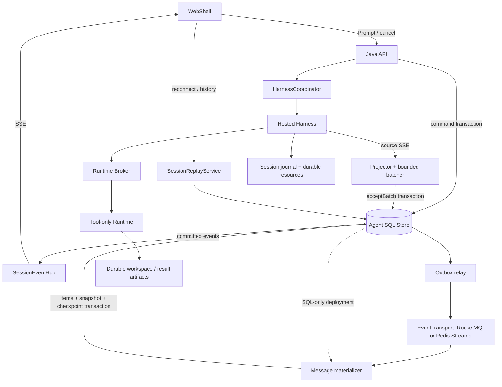
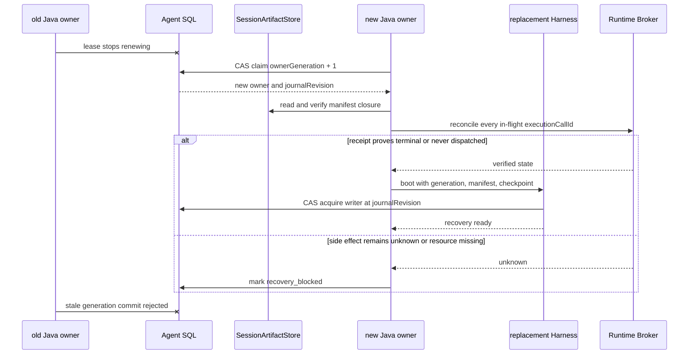

# Managed Agent 存储、事件与会话恢复设计

> **源码实现（2026-09-20）：** `qwen-code` 分支 [`feature/managed-agents-p0-p8`](https://github.com/doudouOUC/qwen-code/tree/feature/managed-agents-p0-p8) 的提交 [`2695220a3a`](https://github.com/doudouOUC/qwen-code/commit/2695220a3ad1ca2654633aed4a7cef46c7469d74) 已实现本文所列 P0 和基于 SQL 的 P1 物化切片。源码仓库同时保留[中文设计](https://github.com/doudouOUC/qwen-code/blob/feature/managed-agents-p0-p8/docs/design/2026-09-20-managed-agent-storage-event-architecture.zh-CN.md)和[英文设计](https://github.com/doudouOUC/qwen-code/blob/feature/managed-agents-p0-p8/docs/design/2026-09-20-managed-agent-storage-event-architecture.md)。

状态：总体架构仍为提议；对应的 `qwen-code` 源码分支已实现 P0 和基于 SQL 的 P1 物化切片。日期：2026-09-20。本文按下面的集成代码快照设计，不表示完整架构已经通过生产验收。

v1.6 的机器可读接口契约见 [`managed-agent-public-api.openapi.yaml`](managed-agent-public-api.openapi.yaml)，接口语义见[Public API 与 WebShell 契约](managed-agent-api-contract.md)，MySQL 8.0 的目标增量结构见 [`managed-agent-storage-schema.mysql.sql`](managed-agent-storage-schema.mysql.sql)。这三项冻结目标结构；当前 Java 已执行其中 V2 Item/Snapshot 子集，但尚未从 OpenAPI 生成 DTO、通过完整契约测试或迁移目标 DDL 的其余部分。

## 1. 决策

保留 WebShell → Java 控制面 → Hosted Harness → Runtime Broker → Tool-only Runtime 的分工。Harness 运行 Qwen Agent 循环，Java 负责准入、状态、事件投影和客户端接口，Runtime 负责工具与工作区。模型推理与 Runtime 预热仍并行，实际调用工具时才等待 Runtime。

按职责抽接口，首个实现沿用 MySQL；PostgreSQL 是同一业务契约的另一个实现。有现成 RocketMQ 平台时优先接入它做可靠异步分发；没有时先用 SQL 批次扫描驱动物化，不为 SSE 额外部署 MQ。Redis Streams 保留为可选适配器，不和 RocketMQ 同时成为默认依赖。

第一阶段采用**短期 SQL 批次日志兼 Outbox → 提交后立即 SSE 推送 → 异步分发与消息物化**。这是对前面“直接写 MQ，再异步入库”的收敛：现有代码把 Session 序号、Turn 状态和 Harness 游标放在一个数据库事务里，直接拆开会引入双写缺口。保留一个有限的事务边界，先消除永久逐片段存储和每连接轮询。

代价也明确：SQL 仍处于事件接受路径；MQ 故障可以缓冲，SQL 故障仍会阻塞新事件接受。这不是“数据库故障时继续无限接收输出”的方案。若这项能力是硬要求，应优先完成第 12 节的持久化源日志方案，再评估 MQ 优先链路。

本文随首批表结构和 SDK 集成一同更新，但不承诺任意模型 token 位置恢复、工具恰好执行一次、数据库在线热切换或所有 MQ 功能完全等价。

当前实现切片已经加入 `AgentStateStore`、有界 Harness 事件批处理、稳定 Item/Part 身份、游标/序号/终态单事务更新，以及提交后的本机 SSE 直推与持久化补发。Flyway V2 新增 Item、Item Part、Snapshot 和消费进度表；SQL 扫描器按连续事件前缀在同一事务中更新物化内容、Snapshot 与进度，WebShell 读取一致 Snapshot、控制事件和未物化尾部。为保持兼容，目前每个公开事件仍保留一条 SQL 记录。批次日志/Outbox、保留清理、外部 EventTransport、PostgreSQL 适配器、多实例唤醒和 Harness/Runtime 持久恢复仍是后续工作。

## 2. 核实的代码基线

源码集成基线为 `qwen-code` 分支 `feature/managed-agents-p0-p8`、提交 `fc32ab0c9502a0b44020ef1a66c88e9b3a2a1484`；本节核实的 P0/P1 实现头为 `2695220a3ad1ca2654633aed4a7cef46c7469d74`。下列源码路径均指这一分支快照。Runtime Broker 持久化是后续独立切片，对应头为 `c9c68760a2fe7d016bcabca0723e80bcbae38953`。

Java 服务源码根目录为 `packages/sdk-java/managed-agent-server/src/main/java/com/alibaba/qwen/code/managedagent/`。

| 位置                                                                       | 当前行为及设计影响                                                                                                              |
| -------------------------------------------------------------------------- | ------------------------------------------------------------------------------------------------------------------------------- |
| `store/ManagedAgentStore.java`                                             | 具体的 JDBC 类；事务同时维护命令幂等、Turn、源游标和公开事件，不能拆成互不相关的 CRUD 接口。                                    |
| `service/HarnessCoordinator.java`                                          | 消费 Harness SSE；按 `bootId:eventEpoch:eventId` 去重并提交有界源事件批次；还有 Java 产生的 Runtime 状态事件。                 |
| `service/HarnessEventProjector.java`                                       | 文本与工具投影已有确定性的 Item/Part 身份，并继续使用明确的公开字段白名单。                                                     |
| `service/ManagedEventStreamService.java`                                   | 实时路径使用提交后本机通知，缺口与重连通过周期 SQL 核对；浏览器不直接访问数据库。                                                |
| `service/ManagedAgentService.java`                                         | Transcript 读取最新物化 Snapshot、保留的控制事件和 `coveredSequence` 后的尾部；Snapshot 尚未产生时兼容旧事件分页。            |
| `harness/HarnessConnector.java`                                            | 已有连接器接口，可复用；当前包含提交、SSE、取消和启动代际信息。                                                                 |
| `src/main/resources/db/migration/V1__managed_agent_core.sql` 与 `V2__managed_agent_projection.sql` | V1 包含 Session、Turn、Command、Event；V2 增加 Item、Item Part、Snapshot 和投影进度，批次日志/Outbox 尚未实现。    |
| `packages/sdk-java/runtime-broker/`                                        | 三个 Repository 已有内存与 JDBC 实现，但 Embedded Broker / Spring 默认构造仍使用内存接线。                                         |
| `packages/core/src/managed-runtime/managed-session-assembly.ts`            | 直接组装本地 Session authority、资源存储和写者租约，尚非可替换的远端持久化实现。                                                |

最新代码已统一公开 Java Session、Harness、JSONL 与 Broker 使用的 Session UUID。`harnessSessionId` 仅为协议别名，不再设计第二套身份映射。租户隔离仍使用 `(tenantId, sessionId)`；`turnId` 与稳定的 `promptId` 各有用途。

普通投影事件会产生多次 UPDATE 和一次 INSERT；被过滤的源事件也要更新恢复游标。一个 chunk 不等于一个 token。当前基线未包含本文的合并、过期清理和聚合存储机制。

## 3. 数据分别由谁负责

| 数据                                              | 权威与存储                            | 保留方式                                         |
| ------------------------------------------------- | ------------------------------------- | ------------------------------------------------ |
| Session、Turn、Command、租约、幂等与权限范围      | Java 关系数据库                       | 业务保留期；幂等记录不能早于承诺的重试窗口删除。 |
| 已接受的公开事件                                  | 短期 SQL 批次日志；MQ 为分发副本      | 续传窗口及必要消费者进度共同决定清理。           |
| 展示用 Message/Item、工具卡片、Snapshot           | 从公开事件与已接受输入构建的 SQL 投影 | 长期保存完整内容；大对象引用对象存储。           |
| 模型上下文、私有 Session 记录、检查点及其资源引用 | Harness Session authority             | 独立持久化；不是公开 Message 表的反向重建结果。  |
| Runtime binding、工具执行账本                     | Broker 的持久化 Repository            | 至少覆盖执行核对及恢复期限。                     |
| Workspace、工具大结果、文件历史与恢复资源         | 持久卷或对象存储及引用清单            | 仍被 Session/执行引用的资源不得随 Runtime 回收。 |

SSE 是传输协议；MQ 是事件分发组件；关系数据库是业务状态及查询存储。三者都不自动替代 Harness Session 的恢复协议。

## 4. 第一阶段端到端链路



1. Java 在一个事务里保存 Prompt 的命令幂等、Turn、输入及控制事件，返回已接受的 Turn 身份。
2. Coordinator 取得带代际的租约，按稳定 `promptId` 提交 Harness，同时预热 Runtime。提交响应丢失时核对原提交，不创建新 Prompt 重跑。
3. Java 解析 Harness SSE，投影、去重并组成有大小上限的批次。`acceptBatch` 提交成功后，本节点直接把返回的事件发给 SSE Hub，无须再次读取数据库或等待 MQ。
4. Relay 读取同一批次日志并发往配置的 EventTransport；消费者聚合 Message/Item。无 MQ 部署由数据库批次扫描器执行相同的物化事务。
5. 浏览器重连由 Java 按 Session 序号补齐；历史查询读取完整 Item 与 Snapshot。

用户输入不是模型 delta。物化器从同事务保存的不可变 Turn 输入构建用户 Item；`turn.accepted` 需补稳定的输入 Item 引用及修订信息。当前事件只有 `turnId`，不能假设现有公开事件自身已经包含完整对话。输入与投影的身份、摘要及所属序号必须固定，Snapshot 只包含其覆盖序号内的版本。

“同时推送与入库”是**先确认可靠接受，再并行进行展示和后续处理**。不能只开两个异步任务分别发送 SSE、写 MQ，然后把它们视作一个可靠操作。Outbox 将本地状态提交和待发送内容置于同一事务，但 Relay 重试仍可能重复发布，消费者必须幂等。[Transactional outbox](https://microservices.io/patterns/data/transactional-outbox.html)

## 5. 接口边界

下面是职责草图，不是已实现 API，也不要求每张表都建立接口。

```java
interface AgentStateStore {
    CommandResult acceptCommand(Command command);
    Lease claimTurn(TurnKey turn, Duration duration);
    AcceptedBatch acceptBatch(Lease lease, IngressBatch batch);
    void applyProjection(ProjectionMutation mutation);
    ReplayPage readReplay(SessionKey session, long after, int limit);
    TranscriptSnapshot readSnapshot(SessionKey session);
}

interface EventTransport {
    CompletionStage<PublishReceipt> publish(CommittedBatchDescriptor batch);
    Subscription consume(ConsumerSpec consumer, BatchHandler handler);
    TransportHealth health();
}

interface SessionArtifactStore {
    ArtifactRef putImmutable(ArtifactScope scope, InputStream content);
    InputStream readVerified(ArtifactScope scope, ArtifactRef ref);
}
```

| 边界                      | 契约                                                                                                                                     |
| ------------------------- | ---------------------------------------------------------------------------------------------------------------------------------------- |
| `AgentStateStore`         | 业务事务、范围隔离、租约代际、游标及序号分配、幂等投影。命令及其事件、批次及其源游标必须由一个后端的同一事务提交。                       |
| `EventTransport`          | 已提交批次的至少一次分发、显式处理成功/失败、发布确认和健康状态。业务 `eventId` 不依赖 Broker message ID；客户端从不使用 Broker offset。 |
| `SessionReplayService`    | 应用服务，组合 Snapshot、短期范围读取和订阅；不是“所有 MQ 都支持按 Session seek”的适配器。                                               |
| `SessionArtifactStore`    | 不可变字节、大小/摘要校验、租户及 Session 范围。对象存储不负责租约、日志提交或工具去重。                                                 |
| Harness Session authority | 在现有 authority 边界上扩展可恢复的日志提交与 fencing；继续只有 Harness 写私有 Session，Java 不成为第二写者。                            |

`MySqlAgentStateStore`、`PostgresAgentStateStore` 可以共享行映射与业务类型，使用各自 SQL 和 Flyway 迁移。数据库异常在事务退出后转换成统一的冲突结果；不能在 PostgreSQL 已失败的事务里捕获唯一键异常后继续查询。统一锁顺序、事务隔离约定、数据库时间租约、字符串大小写语义、JSON 编码、分页和重试范围，不能只换 JDBC URL。[PostgreSQL transaction isolation](https://www.postgresql.org/docs/current/transaction-iso.html)

Broker 复用 `RuntimeBindingRepository`、`RuntimeSessionRepository`、`ToolExecutionRepository`，不另造一套 Broker 存储 API。[Runtime Broker JDBC 方案](managed-runtime-broker-jdbc.zh-CN.md)已在 `c9c68760a2` 实现 DataSource-only MySQL/JDBC 边界、四表 schema 和共同契约测试；PostgreSQL 适配、Spring 接线及多 Repository 业务事务仍是后续工作。涉及多个仓库的不变量仍需由其业务操作明确事务或 CAS 边界。

EventTransport 的通用保证保持较小：允许重复和跨重连乱序，应用按已提交序号检查、去重及补洞。适配器可以增强顺序和吞吐，不能静默降低确认或恢复语义。第一批只实现确实要部署的后端与共同契约测试，不预先实现全部 MQ。

`CommittedBatchDescriptor` 只包含 `schemaVersion`、租户范围、`sessionId`、`batchId`、序号区间、`eventCount`、`payloadSha256` 和 SQL `batchOffset`，正文由消费者按范围从 `AgentStateStore` 读取。`publish` 只有收到 Broker 的持久确认才成功；超时返回 unknown 并由 Relay 使用同一 `batchId` 重试。`BatchHandler` 只有在副作用与 `managed_agent_consumer_progress` 同事务提交后才 ACK，异常或超时必须重投。

| 适配器 | 必须实现 | 不得假设 |
| --- | --- | --- |
| `RocketMqEventTransport` | 以 `(tenantId, sessionId)` 为 message group；同步或异步等待持久发送确认；共享物化消费组与每节点 SSE 广播组分开配置 | FIFO 不提供 writer fencing；Broker offset 不是浏览器游标 |
| `RedisStreamsEventTransport` | 明确 consumer group、pending reclaim、持久化/副本配置和最大长度；裁剪前检查 SQL 修复窗口 | 写入内存即等于跨故障持久；`XTRIM` 后仍可回放 |
| `SqlEventTransport` | 首版固定 `shardId=0`，用 `managed_agent_consumer_progress` 的 lease/CAS 顺序扫描 `batch_offset`，处理后推进连续进度；扩分片必须新增 assignment epoch 并迁移进度 | 它不是第二份 Outbox，也不提供跨节点低延迟广播；不能直接改变取模数 |

部署一次只选择一个物化 Transport。数据库、Transport 和 ArtifactStore 都通过接口注入，但“可替换”只表示实现同一契约并通过共同测试，不表示运行中热切换或所有后端能力完全相同。

## 6. 事件协议与接受事务

事件至少携带 `schemaVersion`、`projectionVersion`、`tenantId`（内部）、`sessionId`、`turnId`、`sequence`、`eventId`、`type`、`data`、`createdAt`。文本还需要稳定的 `itemId` 和 `contentPartId`。身份来自 Harness 协议扩展，不能依赖 Java 内存里的临时计数器。

稳定 Item/Part 身份与 Snapshot 重置分别进行能力协商。Harness 未提供前者时保留旧投影路径；客户端未支持后者时保留旧续传路径。不把缺少身份的片段猜测合并，也不提前对不兼容的会话启用清理。

内部批次记录 `batchId`、`firstSequence`、`lastSequence`、`producerGeneration`、源 `bootId/eventEpoch` 与已接受的源游标。公开序号是本 Session 的提交顺序，源游标用于 Harness 恢复，二者不可混用。重放保留最初提交的投影版本、序号和内容，不重新运行最新版投影器。

`acceptBatch` 必须在一个事务内完成：

1. 按统一顺序锁 Session 与 Turn，验证租户、活动 Turn、数据库时间租约、单调递增的 owner generation 及源 epoch。过期写者不能提交，即使它还活着。
2. 丢弃当前 epoch 下已提交源游标以前的输入，再进行合并。IngressBatch 在提交前保留源事件边界，以便处理重试批次与已接受前缀重叠；不同 epoch 不能用数字大小比较。
3. 为新公开事件分配连续 `sequence`，保存不可变批次，推进源游标和 Session 水位；终态与其终态事件同事务更新。全部被过滤时只提交游标检查点，不产生空公开事件。
4. 事务提交后才向 Hub 发布；命令产生的控制事件使用同一序号分配机制。Runtime 异步回调还需验证对应操作的 generation/状态，拒绝失效操作的晚到结果。

SQL 提交响应丢失时，先按稳定提交身份核对结果；已提交的批次复用原 `batchId`、序号和内容，不重新分配序号。相同身份携带不同摘要属于协议冲突，应停止该流并报警。接受凭据和源游标去重元数据至少保留到承诺的重试窗口结束，不能随短期正文一起提前删除。

第一段可见文本立即提交；后续同一 `turnId/itemId/contentPartId/type` 的文本允许合并。候选参数为 `50–100ms` 或 `64KiB` 达任一上限即提交，需压测确定。终态、工具边界、审批、错误和取消先刷新前序文本，再及时提交；不能把它们按文本拼接。

内存缓冲有单 Session 与全局上限。接受前崩溃的尾部只在 Harness 源流确实还能回放时可重取；当前源流跨 boot 恢复未经证明，不能把短期内存窗口说成绝对不丢。数据库确认的可靠性同样取决于刷盘、副本及故障切换配置。

## 7. 推送、续传与 MQ 消费

### 7.1 SSE 与多实例

同节点由提交回调推送完整批次。每个节点的 Hub 为同一 Session 共享有界缓冲，再分发给多个浏览器连接；慢连接超限就断开并要求续传，不阻塞 Harness，也不取消 Turn。

第一版生产多实例拓扑固定如下，不再在广播、共享消费组和任意节点执行之间运行时切换：

1. `managed_agent_session_owner` 保存 Harness owner 节点、单调 `ownerGeneration` 和数据库时间租约。Prompt、Cancel、Approval 与恢复命令到达任意入口节点后，入口查询 owner 并通过认证的内部 RPC 转发；owner 变化必须先 CAS 提升 generation，旧 owner 的接受事务被数据库拒绝。
2. SSE 连接可以停留在任意入口节点。提交节点在 `afterCommit` 先推本地 Hub；Outbox Relay 再向 `managed-agent-public-event-v1` 发布仅含 batch 身份、水位和摘要的通知。每个 Java 节点使用独立广播订阅身份，只对本机有订阅的 Session 读取 SQL 批次并唤醒 Hub。
3. RocketMQ 通知不是可靠历史。每个节点周期核对本机活跃订阅的 SQL 水位；启动、重连、消息重复、乱序和漏通知都由公开 sequence 修复。消息体不得携带私有 Harness 数据或完整大对象。
4. Item/Snapshot 物化使用共享消费组，每个 batch 只需一个消费者处理；SSE 广播订阅与物化消费组分开。达到广播规模阈值后，下一阶段将 SSE 订阅也按 Session hash 路由到固定节点，不能直接把所有节点放进同一个共享组而丢掉通知。

节点离开先停止接收新 Session、把 owner 状态改为 `draining`、停止续租并等待在途接受事务结束；新节点取得更高 generation 后才能恢复。旧节点即使延迟恢复也不能以旧 generation 提交事件或工具回执。

### 7.2 无缝衔接历史与实时

先注册本地订阅并缓冲通知，再读取一致的 Snapshot 和日志高水位 `H`，发送 `(afterSequence, H]` 内的数据，然后排空缓冲中 `sequence > H` 的部分。客户端和服务端均按序号去重；遇到缺口先补齐，不能直接跳过。范围分页需短期读取租约或等效保护，避免清理任务在分页中间删掉数据；保护到期时显式重试或重置。

保留现有 SSE 的数字 `id` / `Last-Event-ID`，由服务端固定到已鉴权的 Session；前端使用十进制字符串或安全整数策略，避免大序号精度丢失。新增能力协商后返回 `minReplaySequence`、`lastSequence`、`coveredSequence`。超出保留窗口时，流建立前返回明确的游标过期错误；流建立后发送不推进业务序号的 `resync.required` 控制帧并关闭。

前端拿到物化 Snapshot，整体替换其覆盖的状态，再从 `coveredSequence` 之后读取尾部，不能把同一段文本追加两次。Snapshot 必须绑定一致版本的 Item 内容及水位；若历史分页，所有页面固定在同一 Snapshot 版本。清理仅能推进到已物化的连续前缀，保证该 Snapshot 之后仍有连续日志。旧客户端未具备重置能力前，不能对它依赖的数据启用过期删除。

### 7.3 消费和重试

以 `(tenantId, sessionId)` 作为消息分组键，Relay 按 Session 串行发布；超时不确定时重发同一 `batchId`。发布确认与本地标记之间崩溃会重复发送，这是正常恢复路径。

RocketMQ 的组内顺序需要单生产者串行发送；跨生产者接管仍需应用检查序号，MessageGroup 不代替 fencing。[RocketMQ ordered messages](https://rocketmq.apache.org/docs/featureBehavior/03fifomessage/)

消费者在一个数据库事务里更新 Item/Snapshot 和自己的连续进度，然后 ACK；重投不重复追加文本。缺口从短期日志补齐；日志也缺失时暂停该 Session 的物化并报警，不把后续内容当作连续状态。消费者不能仅因超过重试次数进入死信就推进业务水位。

浏览器续传使用 Session 的公开序号，不重置物化消费者组。RocketMQ 的消息位置由 topic/queue/offset 描述，消费者进度属于消费组，不是用户会话游标。[RocketMQ consumer progress](https://rocketmq.apache.org/docs/featureBehavior/09consumerprogress/)

## 8. 表结构、聚合与保留

| 提议结构                          | 作用                                                                                                          |
| --------------------------------- | ------------------------------------------------------------------------------------------------------------- |
| `managed_agent_event_batch`       | 单行保存一个有界批次、序号区间和编码后的公开事件；兼作 Outbox 与续传日志，不再额外复制一张相同的 SQL Outbox。 |
| `managed_agent_item`              | 按稳定 Item/Part 保存展示内容、类型、状态、修订号及大对象引用。                                               |
| `managed_agent_snapshot`          | 一致的 Transcript 版本、`coveredSequence`、活动 Item 状态及终态；不能只有水位而没有可恢复的对应内容。         |
| `managed_agent_consumer_progress` | 每个必要投影的连续消费进度；发布进度独立记录，不能用 Broker ACK 代替物化进度。                                |
| Session/Turn 增量列               | 租约 generation、日志最低/最高水位、存储版本、恢复状态和持久化资源引用。                                      |

MySQL 8.0 的列、索引、约束及迁移不变量已经冻结在 [`managed-agent-storage-schema.mysql.sql`](managed-agent-storage-schema.mysql.sql)。`managed_agent_event_batch.batch_offset` 只用于 Relay/消费者的全局顺序扫描；公共 API 不返回它。`eventCount=0` 表示只推进 Harness 源游标的检查点，不发布 MQ，也不占用公开 sequence。`managed_agent_session_owner.ownerGeneration` 是 Java/Harness 接管 fence，和 Runtime `activationEpoch` 分开。

所有写事务采用 `READ COMMITTED`，按 Session → Turn → SessionOwner 的顺序取得行锁；v1.9 Workspace 准入/变更如需锁 Registry，则统一在 Session 前取得，Registry 失效流程也不得逆序；Snapshot/Item 物化按 batch 连续进度执行 CAS。MySQL 使用二进制/大小写敏感语义保存稳定 ID 与摘要；PostgreSQL 适配器使用等价约束、自增 sequence 和事务外重试，不能在已经失败的事务中继续查询冲突结果。两种实现必须通过相同的事务、幂等、分页和故障注入测试。

批次按 `(tenantId, sessionId, firstSequence)` 定位，并支持查找覆盖请求起点的批次；分页在应用层展开事件。长期 Item 可以在内容块结束、终态或有上限的周期检查点更新；不要每个 delta 都重写累计增长的整段正文。长输出使用不可变分段及清单，避免累计写放大。

周期物化可以延后写入，但不能先推进消费进度或 ACK，再把尚未保存的正文留在内存里。处理成功必须对应同事务持久化的内容（或已验证的不可变分段引用）与连续进度；Snapshot 的覆盖水位还必须对应可读取的一致内容版本。

清理条件必须全部成立：

- 批次超过公开续传窗口 `W`，且没有有效范围读取保护。
- 完整内容、控制状态及所需 Snapshot 已覆盖到该批次末尾。
- 所有必要消费者都已完成；启用 MQ 时也已完成分发及必要下游处理。新增消费者先从 Snapshot 初始化，不能假设旧批次仍在。
- 不存在调查、恢复或资源引用 pin；按有界分页删除，避免长期持锁。

`W` 是待确认参数，不预设永久保存。可用 `24h` 作为容量测算示例，但它不是已经承诺的产品配置。超过窗口并不等于无条件删除；若消费者长时间落后，限流、暂停新 Turn 并告警，不能无限积压或静默丢弃。

RocketMQ 自身会按保留和空间策略清理，包括尚未消费的数据，应用不能假设“未 ACK 就永远保留”。必要进度落后时由 SQL 日志承担修复来源，并在容量边界前停止接受新工作。[RocketMQ storage policy](https://rocketmq.apache.org/docs/featureBehavior/11messagestorepolicy/)

合并主要减少行数、索引和重复封装；内容字节不会凭空消失。原始速率约为 `C × r × s` 字节/秒，未压缩的窗口容量约为 `C × r × s × W`，还要计入 SQL/MQ 副本和索引。例如 `C=100`、`r=20` 次/秒、`s=200` 字节时，仅原始内容就是 `34.56GB/天`；`100ms` 合并平均约合入两个事件，并不能保证数量级下降。若测得 SQL 批次日志仍超出预算，就不能以“已经加 MQ”为由直接上线，应缩短经确认的窗口、限制并发或推进第 12 节的源日志方案。

## 9. Harness 与 Runtime 恢复

Workspace 与 Session cwd 的 v1.9 目标契约见[专项设计](managed-agent-workspace-context.md)。当前 Java Session 尚未持久保存该绑定，Broker 使用启动时的单一静态 Workspace。新增 Registry、Session context 与 cwd operation ledger 的[增量 DDL](managed-agent-workspace-schema.mysql.sql)以实际 Flyway V1/V2 为基线；尚未作为生产 migration 执行，与本文批次日志/Outbox 目标 DDL 分开。恢复必须保留稳定 workspaceStorageId 与 cwdRelative，挂载后的绝对路径只是内部安装快照。目录变更的持久 operation、两端安装回执与 Java 提交屏障见专项 W2，不能以一条 Session UPDATE 代替。

当前本地聊天文件由 Storage 与 ChatRecordingService 放在运行目录下的 `projects/<sanitized-cwd>/chats/<sessionId>.jsonl`；根目录受 `QWEN_RUNTIME_DIR`、运行配置和用户目录影响。JSONL 在磁盘上并不自动意味着无法解耦，关键是进程替换后能否寻址、恢复字节并阻止旧写者继续提交。

完整恢复单元包含私有日志、检查点、被引用资源的闭包、Workspace 身份/快照、文件历史，以及 Broker 中的 binding/执行账本。当前 `LocalProcessRuntimeProvisioner.stopNow` 会删除 generation 目录，不能把其 `outputRoot` 当成长期资源位置；也不能只把 JSONL 上传而遗漏其引用的大结果或检查点资源。

提议的恢复顺序：

1. 按租户与 Session 找到已提交的 manifest 和日志修订，确认旧 writer 已被 fencing；旧 generation 的运行结果需要核对。
2. 验证资源摘要、长度和引用闭包，挂载原 Workspace 或恢复已确认的快照。缺少资源时进入 `recovery_blocked`，不假装是一个空 Session。
3. 在同一 Session UUID 下取得新的写者 generation，恢复 Harness authority，再创建可替换的 Runtime 执行句柄。
4. 对不确定工具调用按原 `executionCallId` 查询或核对。停止响应、超时或进程死亡不证明工具未产生副作用；无法确定时阻止自动重放。
5. 只从协议明确允许的恢复边界继续。私有日志恢复、公开 SSE 补发、运行中模型请求续算是三件不同的事。

生产存储位置固定为：私有 journal segment、checkpoint 和资源闭包写入 `SessionArtifactStore` 的不可变对象；SQL 保存 Session owner、最新已提交 `journalRevision`、manifest 引用与摘要。Harness 或 Java Pod 的临时磁盘只允许作为写入缓存，不能成为恢复所需唯一副本。Workspace 使用独立持久卷或已验证快照引用，Runtime generation 目录不承担长期保存。

每个 Harness manifest 至少包含：

```json
{
  "schemaVersion": 1,
  "tenantId": "internal-scope",
  "sessionId": "uuid",
  "ownerGeneration": 7,
  "journalRevision": 42,
  "journalSegments": [{"ref": "...", "sha256": "...", "size": 123}],
  "checkpointRef": {"ref": "...", "sha256": "...", "size": 456},
  "resourceClosureRef": {"ref": "...", "sha256": "...", "size": 789},
  "workspaceStorageId": "...",
  "workspaceGeneration": 4,
  "lastSettledTurnId": "...",
  "inFlightExecutionIds": ["..."],
  "createdAt": 0
}
```

manifest 提交使用 `(sessionId, expectedJournalRevision, ownerGeneration)` CAS。不可变对象全部上传并核验摘要后才能提交新 revision；CAS 失败的对象成为可延迟回收的 orphan。SQL 中的 `journalRevision` 只指向已验证的完整闭包，不能先推进 revision 再异步补资源。



节点接管的成功条件是新 writer fence、资源闭包校验与未决执行核对同时成立。只有公开事件可补发而 Harness 私有状态不可恢复时，Session 保持可读并进入 `recovery_blocked`，不能从 Item/Snapshot 反向拼出模型上下文继续运行。

资源先不可变发布并校验，再通过带 expected revision 与 writer generation 的条件提交发布 manifest/日志提交点。上传成功但提交失败产生可回收孤儿；提交点不能引用尚未持久化的对象。对象存储插件之外，必须有实际拒绝旧 generation 的权威提交机制，不能仅依赖本地锁或“租约已经过期”的客户端判断。

生产恢复能力需扩展 Harness 协议，明确 `journalRevision`、资源 manifest 与可恢复边界的确认。恢复状态与 Turn 完成状态分别记录；成功生成回复不自动证明可迁移恢复。持久化确认和执行核对完成前禁止回收仍被引用的资源。现有 boot mismatch 拒绝路径在这些验收完成前继续保留，不改成无条件重新 attach。

## 10. 后端选择与部署配置

| 组件                  | 首选及替换边界                                                                                                                                             |
| --------------------- | ---------------------------------------------------------------------------------------------------------------------------------------------------------- |
| 关系数据库            | 先沿用 MySQL，减少迁移变量；已有 PostgreSQL 平台的部署可以选其适配器。当前问题不能通过换数据库类型直接解决。                                               |
| 消息分发              | 已有平台时优先 RocketMQ，承担多消费者和积压恢复；无平台时先启用 SQL 扫描器。Redis Streams 是短窗口场景的候选实现，仍需验证持久化、pending 消息恢复和容量。 |
| 浏览器续传            | 首版统一 SQL 批次日志；选择 Redis 适配器不意味着续传存储也必须再复制一份。                                                                                 |
| 大对象与 Session 资源 | 使用现有对象存储或符合写者约束的持久存储。开发环境可以用本地实现，不能据此宣称跨节点恢复。                                                                 |

后端选择发生在部署启动时，使用依赖注入和厂商迁移目录；这是本文提议的配置形状，不是当前已有配置：

```yaml
qwen:
  managed-agent:
    storage:
      backend: mysql # mysql | postgresql
    event-transport:
      backend: rocketmq # rocketmq | redis-streams | sql
    artifacts:
      backend: local # development only; production uses a durable provider
```

`sql` 表示不启用外部 EventTransport，由批次扫描器驱动物化。内存实现仅用于测试/开发。启动时校验所选适配器支持部署要求的确认、消费恢复和资源校验；缺能力就拒绝启用相应模式。凭证由部署配置注入，不进入公共事件或日志。

运行时不能按一次请求任意切换 MySQL/PG 或 MQ。切换需暂停写入、排空或保存检查点、迁移数据、核对序号与摘要，再切换并恢复；不能通过双跑工具或双写两个数据库模拟无损切换。

## 11. 故障语义

| 故障点                         | 处理与可承诺的边界                                                        |
| ------------------------------ | ------------------------------------------------------------------------- |
| Java 在批次提交前崩溃          | 从最后持久化源游标重取；源不可回放则报告缺口/恢复阻塞，未提交尾部无保证。 |
| 提交成功但尚未推 SSE           | 日志补发，浏览器按原序号去重。                                            |
| MQ 发送成功但 Relay 未标记     | 同 batch 重发，物化事务去重；不重复追加文本。                             |
| SSE 通知丢失或节点崩溃         | 节点水位核对或重连续传修复，浏览器不控制 Turn 生存期。                    |
| SQL 暂时不可写                 | 有界缓冲和背压；源无法可靠暂停/回放时显式失败，不继续承诺已接受。         |
| MQ 不可用                      | 已接受输出仍可由 SQL 支持展示；Outbox 有界积压，达到阈值停止新准入。      |
| 消费者乱序、死信或漏段         | 检查连续进度并补洞，无法补齐则暂停该 Session 投影；不推进 Snapshot 水位。 |
| 租约切换后旧 Java/Harness 回来 | 数据库接受事务和私有日志提交均校验 generation；MQ 顺序能力不承担此防护。  |
| 工具结果未知或 Workspace 缺失  | `recovery_blocked`，不自动执行第二次，也不创建空工作区冒充恢复。          |

所有查询、重放、资源下载与内部通知都保留租户鉴权。`X-Qwen-Tenant-Id` 是可信入口传递的范围，不是身份凭证。MQ 内部元数据和私有 Harness 记录不得直接透传前端；保留当前显式公开投影及敏感字段过滤。

## 12. 落地顺序与代码改造

| 阶段                           | 工作与退出条件                                                                                                                                                                                                                             |
| ------------------------------ | ------------------------------------------------------------------------------------------------------------------------------------------------------------------------------------------------------------------------------------------ |
| P0：契约与基线                 | **基础已实现。** 已有 `AgentStateStore`、有界入口批处理、幂等准入和提交后 Hub 直推；H2 与真实 MySQL 集成测试覆盖当前契约。性能基线和 PostgreSQL 对等能力仍待完成。                                                                             |
| P1：批次与直推                 | **基于 SQL 的切片已实现。** 已有稳定 Item/Part 身份、V2 投影表、连续进度/Snapshot 同事务物化、带 Snapshot 水位的公共 Item 列表，以及 WebShell 的 Snapshot 加尾部恢复。长输出写放大、Snapshot 分页保护和生产故障/性能证据仍待完成。                         |
| P2：传输与保留                 | 增加实际选中的 MQ 适配器、Outbox Relay、多实例通知及续传重置；物化核对通过后，才启用窗口清理。已有 RocketMQ 平台时在此接入。                                                                                                               |
| P3：恢复持久化                 | **Broker Repository 边界已实现。** 继续接入 Spring DataSource/Flyway，补 Harness authority 和资源 manifest、Runtime lease reconcile、Workspace 恢复与回收屏障。跨 JVM/Harness/Runtime 故障测试通过后，才开放自动接管能力。 |
| P4：按测量决定是否改变接受路径 | 若 SQL 接受吞吐或 SQL 故障隔离不达标，先让 Harness/入口具备独立持久化源日志、单写者 fencing、稳定事件身份与重放确认，再设计 MQ 接受后直推、SQL 异步物化。此时必须重定控制事件与文本的统一顺序及公开游标，不能只替换 `acceptBatch` 的实现。 |

P4 是明确的后续设计门槛，不是当前接口已经实现的能力。当前不引入多套运行模式、通用查询 DSL、自动 MQ 热切换或新的 Java Agent 循环。

迁移采用增量表与逐 Session 的 `storageVersion`，老 Session 暂时保留旧事件路径，新 Session 灰度使用新路径。历史回填缺少稳定 Item 身份时只保留为旧 Transcript，不能猜测后删除原记录。旧客户端继续使用保留路径，具备新能力的客户端才能进入窗口清理模式。

灰度先做只读投影对比，绝不双发 Prompt/工具。回滚优先停止新模式准入并保留兼容读取；已有新模式 Session 继续由兼容服务处理或明确暂停。启用清理后，旧版本无法仅凭已经删掉的 delta 恢复历史，因此不能只回滚二进制。

## 13. 验收与待确认参数

验收应针对实际部署的 MySQL、PostgreSQL 和 MQ 版本，不以 H2 或内存适配器通过代替：

- 两个 JVM 同时提交相同幂等键、竞争 Turn 和租约，只有一次准入；失效 generation 不能推进源游标、事件或状态。
- 注入提交前后、发布确认前后、投影事务前后崩溃，核对事件、完整文本、终态和消费进度，既无静默缺口也无重复文本。
- 切换 Java 节点、丢通知、慢消费者、重连与 Snapshot 分页同时发生，验证缓冲到补发的衔接、游标过期与清理互斥。
- 多 Part 文本、工具/审批交错、取消和错误终态均保持边界；确认公开投影不包含私有内容。
- 清理时模拟必要消费者落后、Broker 提前清理和资源 pin；达到容量阈值前正确限流，仍可由保留日志补洞。
- 删除 Runtime 进程及临时 generation 目录后恢复同一 Workspace 和 Session；缺少资源或工具结果未知时明确阻塞，不重复执行。
- 各数据库适配器执行同一事务/幂等/CAS 测试；MQ 适配器执行同一确认丢失、重复、乱序和恢复测试；源码集成时再执行对应构建、类型检查和 E2E。

性能对比记录：首字延迟及段间延迟 p50/p95/p99、每 Session 事务/秒、SQL 实际字节与索引占用、重放吞吐、物化延迟、MQ 积压、每节点/SSE 连接缓冲和资源恢复耗时。本文没有跑性能实验，不声称固定倍数提升。

上线前需明确：现有 RocketMQ 平台及版本、活跃 Session 数与事件速率、续传窗口 `W`、最大可容忍积压、数据库/MQ 确认的故障保证、历史与资源保留期、允许的恢复点和恢复时间。接口和分阶段设计不依赖立刻确定这些数值；容量、清理和跨节点恢复的生产配置依赖它们。

参考现有方案：[双链路总方案](managed-agent-java-hosted-runtime.md)、[Session 存储](managed-agent-session-storage.md)、[Session/Harness/Runtime](managed-agent-session-harness-runtime.md)与[客户端和事件](managed-agent-client-surfaces.md)。本文补充其 Java 存储与公开事件边界，不把已有设计文档视作功能验证结果。
