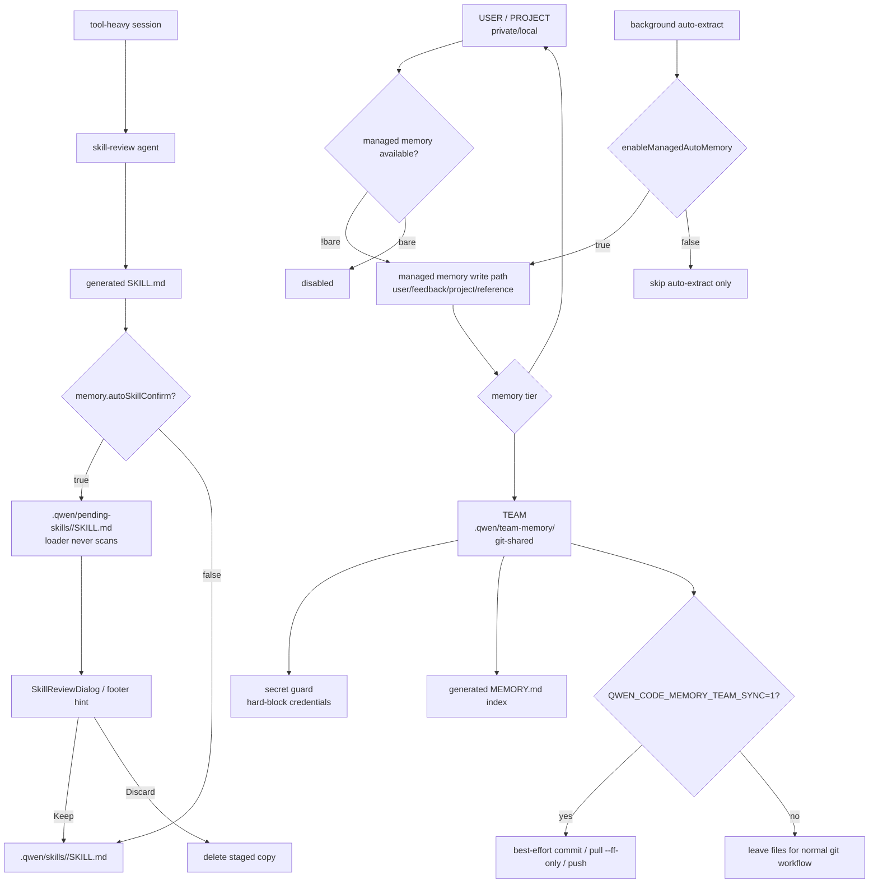

# Managed memory 技术方案

> 适用范围：`QwenLM/qwen-code` managed memory、`/remember` / `/dream` / `/forget`、auto-generated skills persistence。
> 涉及 PR：#5616（confirm auto-generated skills before persisting）、#5814（decouple `/remember` from auto-extract, stop writing to QWEN.md）、#5886（git-shared team memory tier）。
> 状态：2026-06-27 已合入本周主线。

---

## 1. 背景与动机

Managed memory 负责把长期有用的信息保存到 qwen-code 的 memory/skill 体系里。它有两类写入来源：

- 用户显式命令：`/remember`、`/dream`、`/forget` 等手动管理入口。
- 后台自动流程：tool-heavy session 结束后触发 skill-review / auto-extract，把可能复用的经验整理成 skill 或 memory。

本周三个 PR 解决的是“自动流程不能污染用户长期状态”和“团队知识如何受控共享”的边界：

1. #5616：auto-generated skills 不再直接进入 `.qwen/skills/`，而是先 staged 到 `.qwen/pending-skills/`，用户确认后才变成可加载 skill。
2. #5814：`enableManagedAutoMemory` 不再是 managed memory 的总开关，只控制后台 auto-extract；`/remember` 等手动能力只在 `--bare` 下禁用，且绝不再回退写 QWEN.md。
3. #5886：新增 opt-in TEAM memory tier，写入 `.qwen/team-memory/`，适合被 Git 共享的项目/团队知识；默认不启用，且只在 trusted workspace 中可写。

---

## 2. 整体架构

关键边界：

- `.qwen/pending-skills/` 是 `.qwen/skills/` 的 sibling，不会被 skill loader 扫描；未确认 skill 对模型不可见。
- `memory.autoSkillConfirm` 默认 `true`。设为 `false` 时恢复旧的直接持久化行为。
- `enableManagedAutoMemory=false` 只关闭后台 auto-extract，不关闭手动 `/remember`、memory prompt injection、recall prefetch、`/dream` / `/forget` 注册。
- `--bare` 是 managed memory 的真正全局禁用边界。
- TEAM memory 是 opt-in：`memory.enableTeamMemory` 或 `QWEN_CODE_MEMORY_TEAM` 开启，且要求 trusted workspace；未开启时不扫描/不写 `.qwen/team-memory/`。
- TEAM memory 写入前跑 curated secret guard，命中 credential/token/private-key 等高风险 pattern 时 hard block；通过后的写入仍按默认 `ask` 权限进入审批和 git diff。

---

## 3. 关键实现

### 3.1 pending skills staging（#5616）

#5616 在 `MemoryManager.runSkillReview` 的持久化出口加确认门。skill-review agent 的生成逻辑不变；代码根据 `Config.getAutoSkillConfirmEnabled()` 决定最终落点：

| 模式 | 落点 | 用户可见性 |
|---|---|---|
| confirm enabled | `.qwen/pending-skills/` | 不被 loader 扫描，等待 review |
| confirm disabled | `.qwen/skills/` | 与旧行为一致，立即可加载 |

确认 UI：

- idle session 弹 `SkillReviewDialog`，支持 Keep / Discard / Keep all / Discard all。
- session busy 或用户 Esc 选择 later 时，footer 显示 pending count。
- Keep 会把 staged skill 移入 `.qwen/skills/`；Discard 删除 staged copy。

限制：pending task record 仍在内存里，session 重启后不会自动重新弹出 review；文件仍留在 `.qwen/pending-skills/`，后续跨 session recovery 是另一个问题。

### 3.2 `/remember` 与 auto-extract 解耦（#5814）

#5814 把 `enableManagedAutoMemory` 从“总开关”缩小为“后台 auto-extract 开关”。新增的 `isManagedMemoryAvailable()` 以 `!getBareMode()` 作为手动 memory 能力 gate：

| 行为 | #5814 前 | #5814 后 |
|---|---|---|
| background auto-extract | 受 `enableManagedAutoMemory` 控制 | 仍受 `enableManagedAutoMemory` 控制 |
| `/remember` routing | auto memory 关闭时可能回退写 QWEN.md | 只要不是 `--bare`，走 managed memory；不写 QWEN.md |
| `/dream` / `/forget` | auto memory 关闭时隐藏 | 只要不是 `--bare`，仍注册 |
| memory prompt injection / recall prefetch | 受 auto memory 总开关影响 | 只要不是 `--bare`，仍可用 |

这个改动保护 QWEN.md 的用户控制权：QWEN.md 类似 AGENTS.md / CLAUDE.md，应由用户手动维护，不应被 `/remember` 或自动流程半自动改写。

### 3.3 git-shared team memory tier（#5886）

#5886 在原有 USER / PROJECT 私有 memory 之外新增 TEAM tier。TEAM memory 的落点固定在 repo 内 `.qwen/team-memory/`，设计目标是让“项目约定、服务拓扑、团队已验证做法”可以跟代码一起 review 和共享，而不是写进个人全局 memory 或 QWEN.md。

实现边界：

| 子系统 | 做法 |
|---|---|
| 启用 | `memory.enableTeamMemory` 或 `QWEN_CODE_MEMORY_TEAM` 显式开启；未 trusted 的 workspace 不允许写 TEAM。 |
| 写入 | 复用 managed memory 写入管线，但 TEAM tier 映射到 `.qwen/team-memory/<path>`；默认权限仍是 `ask`，用户可在 diff 中审查。 |
| secret guard | 写入前用 curated gitleaks-style 规则扫描候选内容；命中 credential、token、private key 等高风险片段时 hard block，不落盘。 |
| index | 运行时扫描 TEAM memory 文件并按 path deterministic 排序，自动生成 `MEMORY.md` index 给模型读取；index 不是让模型自由编辑的冲突热点。 |
| sync | `QWEN_CODE_MEMORY_TEAM_SYNC=1` 时，session start best-effort 只提交 team-memory 目录、`pull --ff-only`、再 push；失败不抛到主流程。 |

选择“生成 index 而不是让模型维护同一个 `MEMORY.md`”是为了降低多人协作冲突：每条 team memory 可以是独立文件，最终 `MEMORY.md` 由扫描结果重建，排序稳定，避免多个 agent 同时编辑同一汇总文件。

sync 也是保守的：默认关闭，不自动合并；开启后只做 fast-forward pull，遇到冲突或远端拒绝时降级为普通本地文件，用户用正常 Git 流程处理。作者身份按本地 git 配置/用户 attribution 走 cooperative 模型，不把 daemon 变成强一致同步服务。

---

## 4. 涉及 PR

| PR | 状态 | 作用 |
|---|---|---|
| #5616 | merged | auto-generated skills 先 staged 到 `.qwen/pending-skills/`，经 `SkillReviewDialog` Keep/Discard 后才进入 `.qwen/skills/`；新增 `memory.autoSkillConfirm`。 |
| #5814 | merged | `enableManagedAutoMemory` 只控制后台 auto-extract；`/remember`、`/dream`、`/forget`、memory injection 和 recall prefetch 改由 `!bare` gate，且 `/remember` 不再写 QWEN.md。 |
| #5886 | merged | 新增 opt-in TEAM memory tier：`.qwen/team-memory/` git-shared 存储、secret guard hard block、deterministic `MEMORY.md` index 和可选 best-effort git sync。 |

---

## 5. 已知限制 / 后续

1. **pending skills 跨 session 恢复未落地**。#5616 只保证 staged 文件不会被加载；重启后如何重新提示用户处理 `.qwen/pending-skills/` 仍是后续工作。
2. **memory 开关粒度仍不如 Codex 三开关完整**。#5814 先把 auto-extract 与手动 memory 解耦；更细的 read/write/tool 独立开关尚未展开。
3. **TEAM memory sync 不是强一致协作协议**。#5886 的 sync 默认关闭；开启后只做 best-effort commit / `pull --ff-only` / push，不解决 merge conflict、不保证跨用户实时同步。
4. **secret guard 只覆盖 TEAM managed write path**。模型或用户通过 shell/editor 直接写 `.qwen/team-memory/` 不经过 managed-memory secret guard；仍需要 code review 和仓库级 secret scanning。
5. **TEAM memory 只适合 trusted workspace**。未 trusted workspace 不允许写 TEAM，避免把不可信目录变成可被模型修改并参与 Git 共享的长期知识库。

_新增于 2026-06-26_
