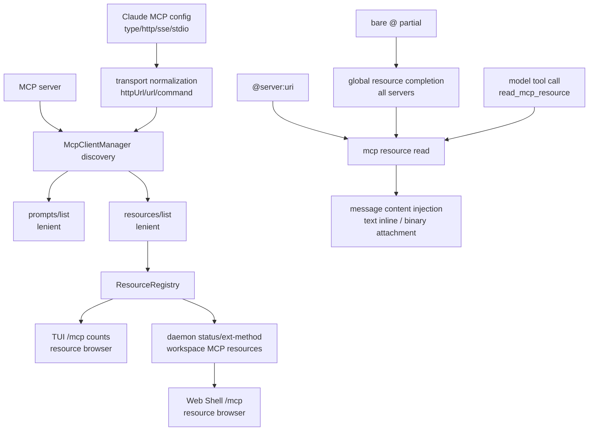

# MCP resources / prompts 技术方案

> 适用范围：`QwenLM/qwen-code` MCP prompt discovery、resource discovery、`/mcp` resource browser、`@server:uri` / 裸 `@` 注入。
> 涉及 PR：#5367（create MCP OAuth token file on first save）、#5544（support MCP resources and reliably surface prompts）、#5561（MCP live settings reconcile）、#5589（MCP OAuth guidance/runtime recovery）、#5635（MCP resource browser in `/mcp` dialog）、#5733（resource completion by friendly name and server discovery）、#5774（bare `@` global resource matching and full references）、#5781（model-callable MCP resource read tool）、#5812（Claude MCP transport mapping）、#5879（Web Shell `/mcp` resource browser）。

---

## 1. 背景与动机

MCP server 可以暴露 prompts、tools、resources。#5544 之前，qwen-code 对 prompts 的发现过度依赖 initialize capability；一些 server 实现了 `prompts/list` 却没声明 `prompts` 能力，导致 prompts 在 qwen-code 里不可见。resources 更直接：此前没有完整 `resources/list` discovery 和 `@server:uri` 注入体验。

#5544 做了两件事：

1. prompts/resources discovery 改成宽松尝试：即使 capability 没声明，也尝试 list；`Method not found` 被视为“没有这类资源”而不是错误。
2. resources 成为一等输入来源：注册进 `ResourceRegistry`，在 `/mcp` 中展示计数，输入 `@server:uri` 读取并注入内容。

后续 PR 把这条资源链路补齐成可发现、可浏览、可恢复、可由模型显式调用的用户体验：#5635 在 TUI `/mcp` dialog 里加 resource browser 和 detail view；#5733 让 `@server:uri` completion 能按 friendly name/title、大小写不敏感匹配，并在输入 `@server` 前发现有资源的 server；#5774 进一步允许裸 `@<partial>` 跨所有 server 匹配资源 URI/name，并保证 dropdown 中完整显示 `server:uri` 引用；#5781 新增 `read_mcp_resource` 工具，让模型在普通 tool-call turn 中按 server name + URI 读取资源。#5879 再把同样的 resource browser 通过 daemon/ACP/SDK/webui 链路带到 Web Shell。#5589 则把 MCP OAuth 失效凭据的恢复提示统一指向 `/mcp`，避免用户按过期 `/mcp auth` 文档操作；#5367 修复 OAuth token file storage 首次保存时目标文件不存在导致写入失败的问题，保证恢复路径真的能落盘。#5812 补的是配置入口的互操作：Claude 风格 MCP server `type` 字段会被规范化成 qwen 使用的 transport 字段，降低迁移后资源不可达的概率。

---

## 2. 整体架构

| 子系统 | 作用 |
|---|---|
| `mcp-client-manager.ts` / `mcp-client.ts` | prompts/resources list 与 read，宽松 capability gate |
| `resource-registry.ts` | 记录 server resources，供 session 与 UI 查询 |
| `session-mcp-view.ts` | 把 discovered resources 应用到 session MCP view |
| `mcpResourceRef.ts` / `atCommandProcessor.ts` | 解析 `@server:uri`、读取并注入 |
| TUI `/mcp` dialog | resource server 列表、resource detail view、复制/插入 canonical reference |
| Web Shell `/mcp` dialog | 通过 daemon `GET /workspace/mcp` 与 `GET /workspace/mcp/:server/resources` 展示 resource/prompt count 和资源详情 |
| `useAtCompletion.ts` | `@server:` URI/name 补全、resource server discovery、裸 `@` 全局资源匹配 |
| `read-mcp-resource.ts` | 模型可调用工具，通过 server name + URI 读取 MCP resource |
| MCP config import/extension ingestion | Claude `type:http|sse|stdio` 到 qwen `httpUrl|url|command` 的 transport 规范化 |

---

## 3. 关键实现

### 3.1 宽松 discovery

能力声明不再是 prompts/resources 的唯一 gate。qwen-code 会尝试 `prompts/list` 与 `resources/list`；如果 server 返回 `Method not found`，则吞掉并记录为空。这样兼容“实现了方法但漏声明 capability”的 server，同时不会让纯 tools server 因额外 list 请求失败。

### 3.2 ResourceRegistry

每个 MCP server 的 resource entries 注册到 `ResourceRegistry`，`/mcp` 对话框按 server 显示 Prompts 和 Resources 数量。ACP/pooled sessions 通过同一 discovery 路径获得 resources，避免 CLI 与 daemon session 看到不同 MCP surface。

### 3.3 `@server:uri` 注入

`@` 处理器新增 resource 引用语法：只有 `server` 匹配已配置 MCP server name 时才激活，否则回退普通文件路径处理。资源读取后：

- 文本 resource inline 注入模型消息。
- binary blob 作为 attachment 注入。
- UI 显示 “Read MCP Resource” 工具卡片，便于用户理解消息里新增了外部上下文。

### 3.4 `/mcp` resource browser 与补全演进

#5635 在 `/mcp` dialog 中给支持 resources 的 server 加 “View resources” action。用户可以浏览 resource list、进入 detail view，并看到可直接输入的 canonical `@server:uri` reference。这让 discovery 与注入语法第一次连起来。

#5733 修补输入框补全的可发现性：冒号后的 partial 不只匹配 URI，也匹配 `/mcp` dialog 展示的 friendly `title || name`，并且大小写不敏感。排序是 URI prefix → name prefix → URI substring → name substring。冒号前输入 `@<partial>` 时，会把“名字前缀匹配且至少有一个 resource”的 MCP server 作为目录式候选插到文件结果前面，Tab 进入 `@server:`。

#5774 再把裸 `@<partial>` 做成全局 resource 匹配：没有 `<server>:` 前缀时，partial 会跨所有已发现资源匹配 URI 和 friendly name，候选仍插入 canonical `@server:uri`。空的裸 `@` 保持 files-only，避免最常见的文件选择被资源噪音淹没。dropdown 渲染也改为完整保留 `server:uri` 引用，描述列让出宽度并截断，避免多个长 URI 被截成相同前缀。

#5879 把资源浏览器从 TUI 补到 Web Shell。因为 Web Shell 不能直接访问进程内 `ResourceRegistry` / `PromptRegistry`，该 PR 增加了完整 daemon 数据链路：

| 层 | 新增/变化 |
|---|---|
| daemon status | `GET /workspace/mcp` 给每个 server 增加 `resourceCount` / `promptCount`。 |
| daemon drill-down | 新增 `GET /workspace/mcp/:server/resources`，对应 ACP ext-method `qwen/status/workspace/mcp/resources`，返回该 server 的 resource metadata。 |
| SDK / webui | TypeScript SDK 增加 `workspaceMcpResources` helper；webui workspace provider 暴露 resources action/hook。 |
| Web Shell UI | `McpDialog` 展示资源/prompt count badge，server 展开后浏览资源列表和 detail view，包含 URI、MIME type、size、description 和 `@server:uri` 引用。 |

兼容性边界：这些字段和路由都是 additive；老 daemon 没有 `/resources` route 时，Web Shell 降级为空结果并提示，不影响工具列表。该 PR 不新增 prompt browser，prompt 仍只显示 count 并通过 slash command surface 暴露。

### 3.5 MCP OAuth 恢复提示与 token file 首次写入（#5589/#5367）

#5589 把 MCP OAuth 错误与 invalid stored credentials 的恢复路径统一到 `/mcp`：运行时 warning、CLI/web-shell completion 和 docs 不再引导用户使用过期的 `/mcp auth` 参数。这个 PR 不改变 resource read/inject 逻辑，但影响 MCP 资源不可用时用户该怎么恢复 server 凭据。

#5367 补齐的是这条恢复路径的落盘前提：当 MCP OAuth 使用 file token storage 且 `mcp-oauth-tokens-v2.json` 还不存在时，首次 `setCredentials` 会以 allow-missing 模式加载存储，再创建并保存 token 文件。此前首次保存可能因为读取缺失文件失败而中断，用户即便重新授权也无法把新 token 写入磁盘。这个修复只放宽“首次保存可创建文件”，不把其它读/删除/枚举路径的缺失文件错误静默吞掉，避免掩盖真正的存储损坏。

### 3.6 model-callable resource read tool（#5781）

#5781 把 resource 读取从“用户输入 `@server:uri` 后系统读取”扩展为“模型在需要时显式调用工具读取”。新增的 `read_mcp_resource` 工具接收 MCP server name 与 resource URI，走现有 MCP client manager 的 read path，结果再以文本 inline 或 binary attachment 形式进入模型上下文。

这个工具的定位和 `@server:uri` 不同：

| 入口 | 触发者 | 适用场景 |
|---|---|---|
| `@server:uri` | 用户 | 用户已经知道要引用的 resource，直接把它插入当前 prompt。 |
| `read_mcp_resource` | 模型 | 用户提到某个已配置资源或任务需要补上下文时，模型可在 tool-call turn 中读取指定 URI。 |

边界保持保守：

- 只新增 read tool，不新增 resource listing/search tool；模型仍不能枚举所有资源再自行探索。
- 工具仍受 trusted folder、permission manager、tool-name rule parser 等核心工具门控约束。
- server 与 URI 都必须显式给出，避免把 `@` 补全的 UI 发现逻辑挪到模型侧。

### 3.7 Claude MCP transport config normalization（#5812）

#5812 解决配置迁移问题：Claude 生态常用 `{ type: "http"|"sse"|"stdio", url?, command? }` 描述 MCP server，而 qwen-code 内部按字段区分 transport，例如 streamable HTTP 用 `httpUrl`、SSE 用 `url`、stdio 用 `command`。如果原样导入，server 可能存在但 transport 不被识别，最终表现为 prompts/resources 都不可达。

规范化规则：

- `type: "http"` + `url` → qwen streamable HTTP server 的 `httpUrl`。
- `type: "sse"` + `url` → qwen SSE server 的 `url`。
- `type: "stdio"` + `command` → qwen stdio server 的 `command`。
- Claude `type` 字段在 qwen shape 中被剥离；只有 `type: "sdk"` 这类既有 qwen 特殊值保留。

该改动覆盖 `/import-config`、extensions/plugins 与 `.mcp.json` 等 ingestion 路径。它不改变 resource read 的 runtime 语义，但会直接影响配置迁移后 resource discovery/read 能否工作。

### 3.8 live settings reconcile（#5561）

#5561 把 MCP server 配置从“启动时固定”推进到 runtime hot-reload：用户编辑 `mcpServers`、`mcp.allowed`、`mcp.excluded`，或 extension 安装/启停改变 MCP server 列表后，当前 session 可以只 reconcile 受影响的 server，不再要求重启 CLI 或 daemon session。

实现要点：

- `Config` 增加 runtime entry point，settings watcher 发现 MCP 相关配置变化后触发 reconcile。
- reconcile 只连接/断开/重启变化的 server，保留未变化 server 与当前 conversation context。
- shared-pool discovery path 与 single-session approval gate 对齐；热加载后若 server 进入 gated/pending 状态，会重新触发 mid-session approval。
- `/mcp` dialog 不再只显示笼统 `Disconnected`，而是区分 denied、pending approval、真实连接失败等原因。

这项能力也改变了本文件原先的已知限制：MCP settings live reconcile 已落地，但“resource 内容截断”和“模型侧 resource listing/search”仍未落地。

---

## 4. 涉及 PR

| PR | 状态 | 作用 |
|---|---|---|
| #5367 | merged | MCP OAuth file token storage 首次 `setCredentials` 允许 token 文件不存在，创建 `mcp-oauth-tokens-v2.json` 后写入，修复重新授权无法落盘的问题。 |
| #5544 | merged | 放宽 MCP prompts/resources discovery，新增 `ResourceRegistry`、`@server:uri` 注入、补全、`/mcp` resources count 和 tests。 |
| #5561 | merged | settings / extension 改动触发 MCP server live reconcile，只重启变化项，并在 `/mcp` 中展示 gated/pending/denied 原因。 |
| #5589 | merged | 更新 MCP OAuth/runtime recovery guidance，失效凭据提示指向 `/mcp`，清理过期 `/mcp auth` 文档和 completion。 |
| #5635 | merged | `/mcp` dialog 新增 resource browser/detail view，展示并复用 canonical `@server:uri` reference。 |
| #5733 | merged | `@server:` completion 支持 friendly name/title、大小写不敏感匹配；冒号前可发现有 resource 的 server。 |
| #5774 | merged | 裸 `@<partial>` 跨 server 全局匹配 resource URI/name，并在 dropdown 中完整显示 `server:uri`。 |
| #5781 | merged | 新增 model-callable `read_mcp_resource` 工具，按 server name + URI 在普通 tool-call turn 读取 MCP resource。 |
| #5812 | merged | Claude MCP server transport config 规范化为 qwen MCP shape，修复 import / extension / `.mcp.json` 中 http/sse/stdio 映射。 |
| #5879 | merged | Web Shell `/mcp` dialog 通过 daemon/ACP/SDK 链路浏览 MCP resources，展示 resource/prompt count 与 `@server:uri` detail。 |

---

## 5. 已知限制 / 后续

1. **resource 内容暂未做文件式截断**。PR body 明确 files 有 `read_many_files` 截断，但 resources 当前没有同等截断策略。
2. **启动时多两个 list 请求**。纯 tools server 会收到 prompts/resources list；合规 server 应快速返回 `Method not found`，但异常 server 仍可能拖慢 discovery。
3. **模型侧没有 resource listing/search**。#5781 只提供 `read_mcp_resource`，模型必须已经知道 server name 和 URI；资源发现仍主要靠用户 `/mcp` browser 与 `@` completion。

_新增于 2026-06-23；更新于 2026-06-27_
