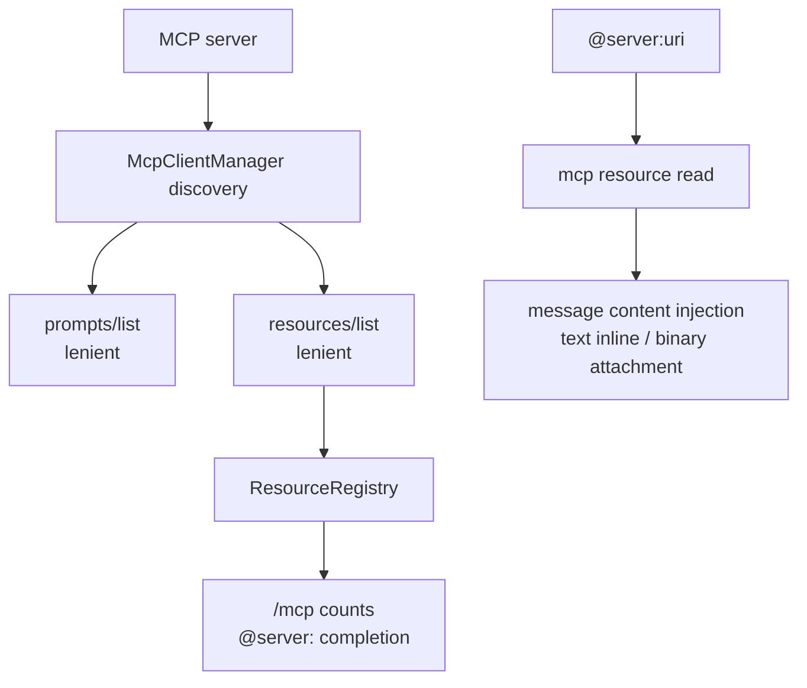

# MCP resources / prompts 技术方案

> 适用范围：`QwenLM/qwen-code` MCP prompt discovery、resource discovery、`@server:uri` 注入。
> 涉及 PR：#5544（support MCP resources and reliably surface prompts）。

---

## 1. 背景与动机

MCP server 可以暴露 prompts、tools、resources。#5544 之前，qwen-code 对 prompts 的发现过度依赖 initialize capability；一些 server 实现了 `prompts/list` 却没声明 `prompts` 能力，导致 prompts 在 qwen-code 里不可见。resources 更直接：此前没有完整 `resources/list` discovery 和 `@server:uri` 注入体验。

#5544 做了两件事：

1. prompts/resources discovery 改成宽松尝试：即使 capability 没声明，也尝试 list；`Method not found` 被视为“没有这类资源”而不是错误。
2. resources 成为一等输入来源：注册进 `ResourceRegistry`，在 `/mcp` 中展示计数，输入 `@server:uri` 读取并注入内容。

---

## 2. 整体架构

| 子系统 | 作用 |
|---|---|
| `mcp-client-manager.ts` / `mcp-client.ts` | prompts/resources list 与 read，宽松 capability gate |
| `resource-registry.ts` | 记录 server resources，供 session 与 UI 查询 |
| `session-mcp-view.ts` | 把 discovered resources 应用到 session MCP view |
| `mcpResourceRef.ts` / `atCommandProcessor.ts` | 解析 `@server:uri`、读取并注入 |
| `useAtCompletion.ts` | `@server:` resource URI 补全 |

---

## 3. 关键实现

### 3.1 宽松 discovery

能力声明不再是 prompts/resources 的唯一 gate。qwen-code 会尝试 `prompts/list` 与 `resources/list`；如果 server 返回 `Method not found`，则吞掉并记录为空。这样兼容“实现了方法但漏声明 capability”的 server，同时不会让纯 tools server 因额外 list 请求失败。

### 3.2 ResourceRegistry

每个 MCP server 的 resource entries 注册到 `ResourceRegistry`，`/mcp` 对话框按 server 显示 Prompts 和 Resources 数量。ACP/pooled sessions 通过同一 discovery 路径获得 resources，避免 CLI 与 daemon session 看到不同 MCP surface。

### 3.3 `@server:uri` 注入

`@` 处理器新增 resource 引用语法：只有 `server` 匹配已配置 MCP server name 时才激活，否则回退普通文件路径处理。资源读取后：

- 文本 resource inline 注入模型消息。
- binary blob 作为 attachment 注入。
- UI 显示 “Read MCP Resource” 工具卡片，便于用户理解消息里新增了外部上下文。

---

## 4. 涉及 PR

| PR | 状态 | 作用 |
|---|---|---|
| #5544 | merged | 放宽 MCP prompts/resources discovery，新增 `ResourceRegistry`、`@server:uri` 注入、补全、`/mcp` resources count 和 tests。 |

---

## 5. 已知限制 / 后续

1. **resource 内容暂未做文件式截断**。PR body 明确 files 有 `read_many_files` 截断，但 resources 当前没有同等截断策略。
2. **启动时多两个 list 请求**。纯 tools server 会收到 prompts/resources list；合规 server 应快速返回 `Method not found`，但异常 server 仍可能拖慢 discovery。
3. **live settings reconciliation 仍在后续 PR**。#5561 处于 open 状态，MCP server settings live reconcile 不计入本次已合入 feature。

_新增于 2026-06-23_
