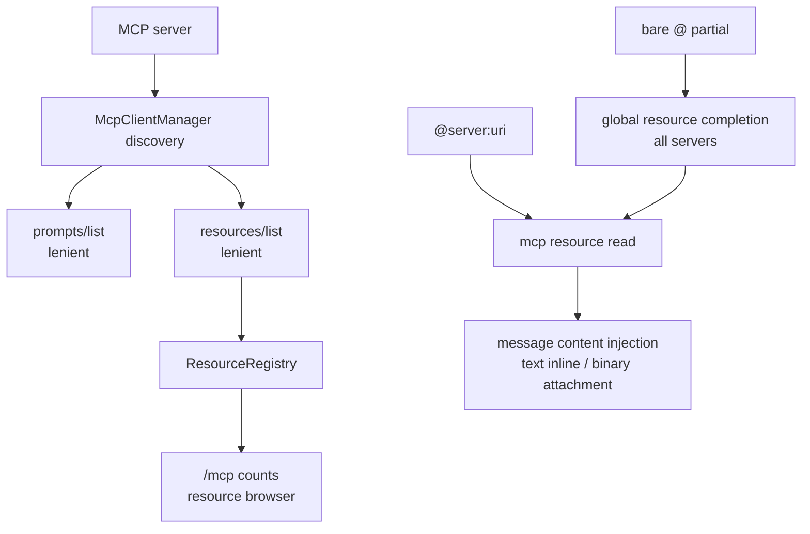

# MCP resources / prompts 技术方案

> 适用范围：`QwenLM/qwen-code` MCP prompt discovery、resource discovery、`/mcp` resource browser、`@server:uri` / 裸 `@` 注入。
> 涉及 PR：#5544（support MCP resources and reliably surface prompts）、#5589（MCP OAuth guidance/runtime recovery）、#5635（MCP resource browser in `/mcp` dialog）、#5733（resource completion by friendly name and server discovery）、#5774（bare `@` global resource matching and full references）。

---

## 1. 背景与动机

MCP server 可以暴露 prompts、tools、resources。#5544 之前，qwen-code 对 prompts 的发现过度依赖 initialize capability；一些 server 实现了 `prompts/list` 却没声明 `prompts` 能力，导致 prompts 在 qwen-code 里不可见。resources 更直接：此前没有完整 `resources/list` discovery 和 `@server:uri` 注入体验。

#5544 做了两件事：

1. prompts/resources discovery 改成宽松尝试：即使 capability 没声明，也尝试 list；`Method not found` 被视为“没有这类资源”而不是错误。
2. resources 成为一等输入来源：注册进 `ResourceRegistry`，在 `/mcp` 中展示计数，输入 `@server:uri` 读取并注入内容。

后续 PR 把这条资源链路补齐成可发现、可浏览、可恢复的用户体验：#5635 在 `/mcp` dialog 里加 resource browser 和 detail view；#5733 让 `@server:uri` completion 能按 friendly name/title、大小写不敏感匹配，并在输入 `@server` 前发现有资源的 server；#5774 进一步允许裸 `@<partial>` 跨所有 server 匹配资源 URI/name，并保证 dropdown 中完整显示 `server:uri` 引用。#5589 则把 MCP OAuth 失效凭据的恢复提示统一指向 `/mcp`，避免用户按过期 `/mcp auth` 文档操作。

---

## 2. 整体架构

| 子系统 | 作用 |
|---|---|
| `mcp-client-manager.ts` / `mcp-client.ts` | prompts/resources list 与 read，宽松 capability gate |
| `resource-registry.ts` | 记录 server resources，供 session 与 UI 查询 |
| `session-mcp-view.ts` | 把 discovered resources 应用到 session MCP view |
| `mcpResourceRef.ts` / `atCommandProcessor.ts` | 解析 `@server:uri`、读取并注入 |
| `/mcp` dialog | resource server 列表、resource detail view、复制/插入 canonical reference |
| `useAtCompletion.ts` | `@server:` URI/name 补全、resource server discovery、裸 `@` 全局资源匹配 |

---

## 3. 关键实现

### 3.1 宽松 discovery

能力声明不再是 prompts/resources 的唯一 gate。qwen-code 会尝试 `prompts/list` 与 `resources/list`；如果 server 返回 `Method not found`，则吞掉并记录为空。这样兼容“实现了方法但漏声明 capability”的 server，同时不会让纯 tools server 因额外 list 请求失败。

### 3.2 ResourceRegistry

每个 MCP server 的 resource entries 注册到 `ResourceRegistry`，`/mcp` 对话框按 server 显示 Prompts 和 Resources 数量。ACP/pooled sessions 通过同一 discovery 路径获得 resources，避免 CLI 与 daemon session 看到不同 MCP surface。

### 3.3 `@server:uri` 注入

`@` 处理器新增 resource 引用语法：只有 `server` 匹配已配置 MCP server name 时才激活，否则回退普通文件路径处理。资源读取后：

- 文本 resource inline 注入模型消息。
- binary blob 作为 attachment 注入。
- UI 显示 “Read MCP Resource” 工具卡片，便于用户理解消息里新增了外部上下文。

### 3.4 `/mcp` resource browser 与补全演进

#5635 在 `/mcp` dialog 中给支持 resources 的 server 加 “View resources” action。用户可以浏览 resource list、进入 detail view，并看到可直接输入的 canonical `@server:uri` reference。这让 discovery 与注入语法第一次连起来。

#5733 修补输入框补全的可发现性：冒号后的 partial 不只匹配 URI，也匹配 `/mcp` dialog 展示的 friendly `title || name`，并且大小写不敏感。排序是 URI prefix → name prefix → URI substring → name substring。冒号前输入 `@<partial>` 时，会把“名字前缀匹配且至少有一个 resource”的 MCP server 作为目录式候选插到文件结果前面，Tab 进入 `@server:`。

#5774 再把裸 `@<partial>` 做成全局 resource 匹配：没有 `<server>:` 前缀时，partial 会跨所有已发现资源匹配 URI 和 friendly name，候选仍插入 canonical `@server:uri`。空的裸 `@` 保持 files-only，避免最常见的文件选择被资源噪音淹没。dropdown 渲染也改为完整保留 `server:uri` 引用，描述列让出宽度并截断，避免多个长 URI 被截成相同前缀。

### 3.5 MCP OAuth 恢复提示

#5589 把 MCP OAuth 错误与 invalid stored credentials 的恢复路径统一到 `/mcp`：运行时 warning、CLI/web-shell completion 和 docs 不再引导用户使用过期的 `/mcp auth` 参数。这个 PR 不改变 resource read/inject 逻辑，但影响 MCP 资源不可用时用户该怎么恢复 server 凭据。

---

## 4. 涉及 PR

| PR | 状态 | 作用 |
|---|---|---|
| #5544 | merged | 放宽 MCP prompts/resources discovery，新增 `ResourceRegistry`、`@server:uri` 注入、补全、`/mcp` resources count 和 tests。 |
| #5589 | merged | 更新 MCP OAuth/runtime recovery guidance，失效凭据提示指向 `/mcp`，清理过期 `/mcp auth` 文档和 completion。 |
| #5635 | merged | `/mcp` dialog 新增 resource browser/detail view，展示并复用 canonical `@server:uri` reference。 |
| #5733 | merged | `@server:` completion 支持 friendly name/title、大小写不敏感匹配；冒号前可发现有 resource 的 server。 |
| #5774 | merged | 裸 `@<partial>` 跨 server 全局匹配 resource URI/name，并在 dropdown 中完整显示 `server:uri`。 |

---

## 5. 已知限制 / 后续

1. **resource 内容暂未做文件式截断**。PR body 明确 files 有 `read_many_files` 截断，但 resources 当前没有同等截断策略。
2. **启动时多两个 list 请求**。纯 tools server 会收到 prompts/resources list；合规 server 应快速返回 `Method not found`，但异常 server 仍可能拖慢 discovery。
3. **live settings reconciliation 仍在后续 PR**。#5561 处于 open 状态，MCP server settings live reconcile 不计入本次已合入 feature。
4. **MCP resource read tool 仍在 open PR**。#5781 如果合入，应单独补充“模型显式读取 MCP resource”的工具面；当前已落地的是用户输入引用后的读取/注入。

_新增于 2026-06-23；更新于 2026-06-24_
