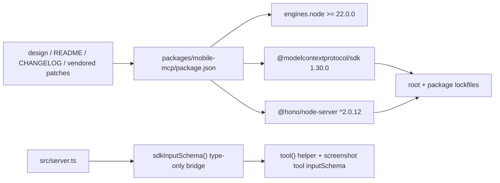

# Mobile MCP 技术方案

> 适用范围：`QwenLM/qwen-code` 中独立发布的 `@qwen-code/mobile-mcp` package。
> 当前记录：#8311 仍为 open PR，只记录当前 diff 方案，不能视为 `main` 已落地能力。

---

## 1. 背景与动机

`@qwen-code/mobile-mcp` 是从 `mobile-next/mobile-mcp` vendored 进仓库的独立发布包，用于让 MCP client 通过截图、accessibility tree、坐标点击和移动端工具操作 iOS/Android 设备。它有独立 `package-lock.json`、独立 README/CHANGELOG 和 tag-triggered release workflow，不等同于 qwen-code 主 CLI 发布物。

PR #8311 处理的是 mobile-mcp 自身的运行时和依赖安全边界。此前包声明 Node.js 18 兼容，但仓库 `.nvmrc` 与 release workflow 已使用 Node.js 22，且没有 Node.js 18 release validation。旧 `@modelcontextprotocol/sdk` 1.26.0 会把 Hono Node Server 留在受 GHSA-frvp-7c67-39w9 影响的 1.x 依赖路径上；只升级 SDK 也不能保证既有 consumer lockfile 不继续解析到 Hono 1.x。

这个 PR 与 #8206 分工不同：#8206 只收敛 direct external-context integration 的 MCP SDK / Hono / parser dependency path，并没有迁移 mobile-mcp。mobile-mcp 的 Node.js 22 / Hono 2 迁移由 #8311 单独记录。

---

## 2. 当前实现

### 2.1 Runtime baseline

#8311 将 `packages/mobile-mcp/package.json` 的 engine 提升到 `>=22.0.0`。这是一个明确的 breaking change：Node.js 18/20 consumer 需要在下一次 mobile-mcp release 前升级 runtime。当前 diff 记录 `engines` 对 npm 来说仍是 advisory，因此安全结果不能只依赖 engine 字段，还必须依赖实际 dependency resolution。

### 2.2 Dependency hardening

mobile-mcp 升级到 `@modelcontextprotocol/sdk` 1.30.0，并直接依赖 `@hono/node-server` `^2.0.12`。这里的 Hono 依赖是 resolution floor，而不是源码中的直接 import：它的作用是让 consumer lockfile 不能继续保留 `@hono/node-server` 1.x，同时仍允许后续 2.x patch 被接收。

根 `package-lock.json` 与 `packages/mobile-mcp/package-lock.json` 都随之更新。根 lockfile 移除了 `packages/mobile-mcp/node_modules/@modelcontextprotocol/sdk` 1.26.0 以及其嵌套的 `@hono/node-server` 1.x tree；standalone lockfile 记录 mobile-mcp 发布图中的 Node.js 22、MCP SDK 1.30.0 和 Hono 2 resolution。

### 2.3 Split-Zod type boundary

工作区安装时，根依赖和 `packages/mobile-mcp` 可能解析到不同的受支持 Zod 副本。SDK 1.30.0 runtime 可以处理 Zod 3/4 schema，但 TypeScript 会把跨安装位置的 schema 类型视为不兼容。#8311 在 `packages/mobile-mcp/src/server.ts` 增加 `sdkInputSchema()`，把 mobile-mcp 本地 Zod shape 通过 type-only boundary 传给 SDK。

该函数不 transform schema，也不改变 validation 行为；它只集中处理 TypeScript 类型不兼容。当前 diff 中 `inputSchema` 只有两个注册点：通用 `tool()` helper 和直接注册的 screenshot tool，二者都经过 `sdkInputSchema()`。

### 2.4 Vendored fork 记录

mobile-mcp 是 vendored package，因此本地改动需要在 fork 文档里显式记录。#8311 同步更新：

- `docs/design/mobile-mcp-node22-baseline.md`: 运行时、依赖、Zod boundary、验证和 rollback 决策。
- `packages/mobile-mcp/.vendored-patches.md`: 将 Node runtime / MCP SDK / Hono / Zod bridge 作为本 fork patch。
- `packages/mobile-mcp/README.md`: 对 consumer 展示 Node.js 22 要求。
- `packages/mobile-mcp/CHANGELOG.md`: 记录未发布的 breaking/security 变更；后续 release 需要用 minor bump 承载 breaking runtime baseline。

---

## 3. 关键代码路径

- `packages/mobile-mcp/package.json`: runtime engine 与 MCP SDK/Hono dependency boundary。
- `package-lock.json`: monorepo workspace resolution，移除 mobile-mcp 嵌套旧 SDK/Hono 1.x tree。
- `packages/mobile-mcp/package-lock.json`: 独立发布包 resolution。
- `packages/mobile-mcp/src/server.ts`: `sdkInputSchema()` 和 tool registration boundary。
- `docs/design/mobile-mcp-node22-baseline.md`: Node.js 22 baseline 与依赖决策。
- `packages/mobile-mcp/.vendored-patches.md`: 本 fork 相对 upstream 的本地 patch 清单。
- `packages/mobile-mcp/README.md`、`packages/mobile-mcp/CHANGELOG.md`: consumer-facing runtime 和 release notes。

---

## 4. 验证方式

PR 中登记的验证证据包括：

- macOS + Node.js 22.22.3。
- 仓库工作区安装并构建 `@qwen-code/mobile-mcp`。
- `packages/mobile-mcp` standalone install/build。
- 四组非设备 Playwright suites，合计 32 个用例通过，覆盖 coordinate normalization、UI dump、payload filtering 和 server boundary。
- `npm pack`，并检查 packed CLI `--version` / `--help`。
- lockfile resolution 检查，确认 mobile-mcp 不再通过 MCP SDK/Hono 报告 Hono 1.x advisory path。
- production dependency audit；mobilewright 独立依赖树里的无关 findings 不在 #8311 范围内。

本文档没有在 code_agent 仓库复跑这些验证，只登记 PR 当前 diff、changed files、review 记录和 PR 已声明的验证结果。

---

## 5. 已知限制 / 后续

- #8311 仍为 open，合入前文档只能作为当前 diff 记录。
- 设备相关 Playwright coverage 需要 ADB、mobilecli 或真机/模拟器环境，不在当前非设备验证内。
- Windows/Linux 本地执行未验证。
- `sdkInputSchema()` 仍是对 split-Zod 工作区布局的 type-only bridge；更长期方案是收敛 monorepo Zod 解析，或把 mobile-mcp build/test 纳入持续 CI。
- `@hono/node-server` 是安全 resolution floor，未来依赖清理不能因为源码未直接 import 就移除。
- mobilewright 依赖树中的其它 advisory 是独立升级决策，不能用 #8311 的 MCP SDK/Hono 修复范围覆盖。

---

## 6. 涉及 PR

| PR | 状态 | 子主题 | 作用 |
|---|---|---|---|
| [#8311](https://github.com/QwenLM/qwen-code/pull/8311) | OPEN | Node.js 22 / MCP SDK 1.30 / Hono 2 | 当前 open diff 提升 mobile-mcp runtime baseline，移除旧 MCP SDK/Hono 1.x dependency path，并记录 split-Zod type bridge 与发布/CI follow-up。 |

_按个人 PR 口径更新于 2026-08-01_
