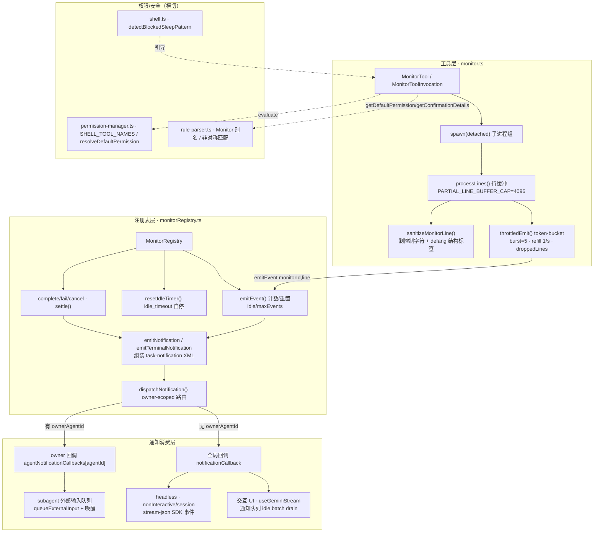
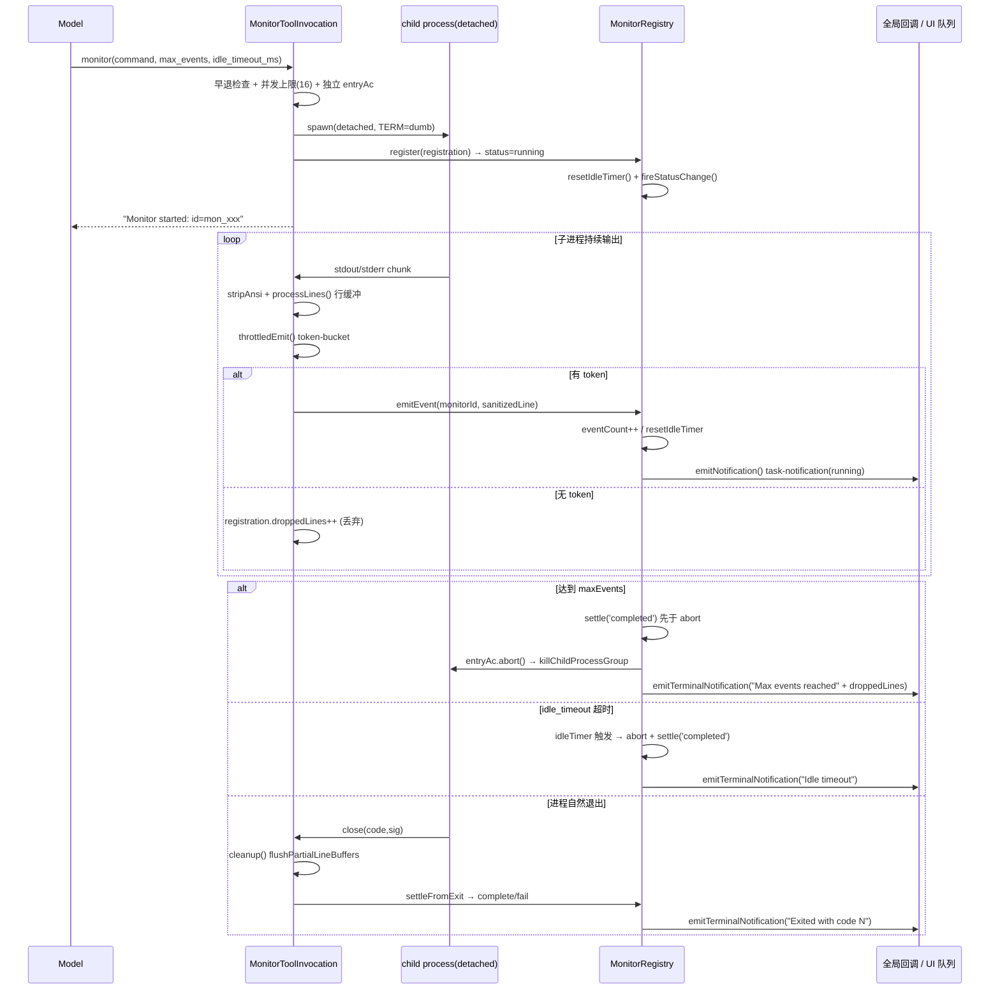
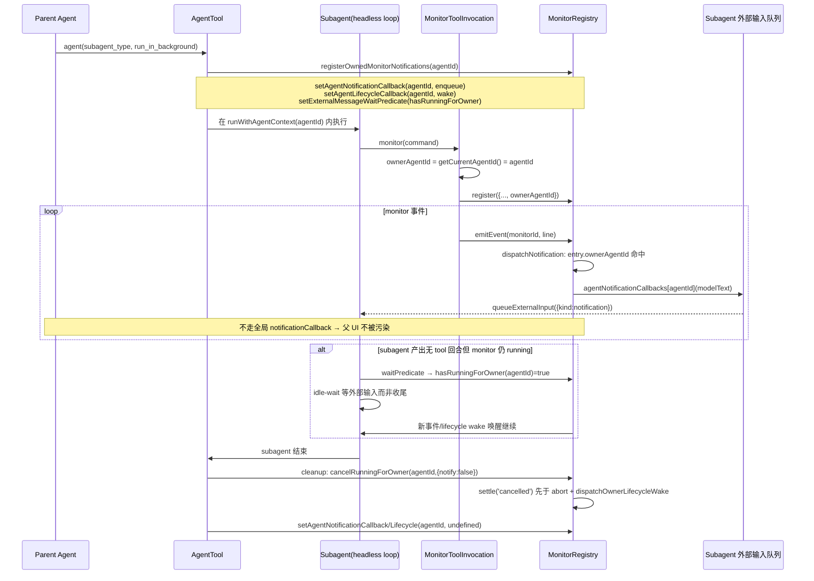

# monitor 事件工具技术方案

> 适用代码库：`QwenLM/qwen-code`（`main`）
> 涉及 PR：#3684（主工具）、#3726（`Monitor(...)` 权限命名空间）、#3792（合并后修复 + UI 路由）、#3933（subagent 通知路由修复）、#5165（通知 batch drain 降 token waste）
> 关联 issue：#3634（后台任务管理 roadmap）、#3666（Phase C 跟踪）、#3925（subagent monitor bug）、#3488（注册表统一）、#4093 / #4386（命令替换告警 vs 硬拒绝）

---

## 1. 背景与动机

### 1.1 长时运行命令的事件流监控

qwen-code 的 `run_shell_command`（Bash 工具）是一次性（one-shot）执行模型：发起命令 → 等待进程退出 → 一次性返回全部输出。这个模型对于 `tail -f`、`npm run build --watch`、健康检查轮询、`fswatch` 这类**永不自然退出、持续产生增量输出**的命令完全不适用：

- 前台同步执行会**阻塞整个 agent turn**，模型无法在等待期间继续工作；
- 即使放到后台（`is_background: true`），输出也只能在任务结束后批量回收，无法做到「边产生边消费」的事件流式反馈。

`monitor` 工具填补的正是这块空白：它 spawn 一个长时运行进程，把它的 stdout/stderr **逐行**转成事件通知（event notification）流式推回给 agent，agent 在 idle 时消费这些通知，从而实现「一边监控、一边干别的活」。#5165 后，交互与非交互路径会把连续同类 notification 批量 drain 成一次模型调用，避免一行 stdout 触发一次完整上下文 roundtrip。这是后台任务管理 roadmap（#3634）的 **Phase C**，由 #3666 跟踪。

### 1.2 与 Bash 工具的区别

| 维度 | `run_shell_command`（Bash） | `monitor` |
|---|---|---|
| 执行模型 | 一次性，等退出取全量输出 | 长时运行，逐行流式推事件 |
| 输出投递 | turn 结束一次性返回 | `<task-notification>` 增量通知，idle 时 batch drain |
| 生命周期 | 进程退出即结束 | running → completed/failed/cancelled，支持 maxEvents / idle_timeout 自动停止 |
| 中断 | 受当前 turn 的 `AbortSignal` 控制，Ctrl+C 杀掉 | **独立 `AbortController`**，Ctrl+C 不杀 monitor（`monitor.ts:330` `entryAc`） |
| 背压控制 | 无 | token-bucket 节流（burst=5，1/s），超额丢弃并计数 `droppedLines` |
| 适用场景 | 需要完整输出的一次性命令 | 看日志、看构建、轮询状态、看文件变化 |

工具描述里明确给模型划了边界（`monitor.ts:678-681`）：一次性命令用 `run_shell_command`、需要完整输出用 `run_shell_command`、无输出的后台命令用 `run_shell_command` + `is_background: true`，只有「流式事件」才用 `monitor`。

### 1.3 sleep 拦截：把模型从 `sleep` 引导到 monitor

模型常用 `sleep N && check` 这种前台阻塞来「等一会再看结果」，既阻塞 turn 又拿不到流式反馈。#3684 在 shell 工具里加了 **sleep 拦截**（`shell.ts:4282` `detectBlockedSleepPattern`）：前台 `sleep N`（N≥2）被拒绝，并引导模型改用 `is_background` 或 `monitor`。

### 1.4 subagent 通知污染（#3925 → #3933）

#3684 落地后暴露出一个 bug：subagent 启动的 monitor 复用了**父 agent 的全局通知回调**，导致 monitor 事件污染父上下文，而真正拥有该 monitor 的 subagent 反而消费不到自己的输出。#3933 通过 `ownerAgentId` owner-scoped 路由修复了这个串扰问题。

---

## 2. 整体架构

monitor 子系统分三层：**工具层**（`MonitorTool`，负责 spawn、节流、行缓冲）→ **注册表层**（`MonitorRegistry`，负责生命周期、自动停止、通知组装与路由分发）→ **通知消费层**（全局回调 → UI；owner-scoped 回调 → subagent 外部输入队列）。



关键集成点：
- 工具注册：`config.ts:4012` 懒加载 `new MonitorTool(this)`，工具名 `ToolNames.MONITOR='monitor'`、显示名 `'Monitor'`（`tool-names.ts:42,89`）。
- 中止集成：`task-stop.ts:119-135` 通过 `monitorRegistry.cancel(taskId)` 停止指定 monitor。
- 阻塞判定：`backgroundWorkUtils.ts:hasBlockingBackgroundWork` 把 `getMonitorRegistry().getRunning().length > 0` 计入「是否有后台工作未完成」，`/clear`、`/resume` 据此阻断。

---

## 3. 子系统详解

### 3.1 工具执行与节流流式

**锚点**：`monitor.ts:MonitorToolInvocation.execute`、`throttledEmit`、`processLines`

#### spawn 与进程隔离

`execute`（`monitor.ts:288`）的核心步骤：

1. **早退检查**：若 turn 在启动前已 abort，直接返回不 spawn（`monitor.ts:290`）。
2. **并发上限**：`registry.getRunning().length >= MAX_CONCURRENT_MONITORS(16)` 则拒绝（`monitor.ts:320-326`，注册表层 `monitorRegistry.ts:191` 再兜一道，throw）。
3. **独立 AbortController**：`const entryAc = new AbortController()`（`monitor.ts:330`）——这是 monitor 与 Bash 工具最本质的区别，Ctrl+C 取消当前 turn 不会杀掉用户主动启动的 monitor。
4. **spawn 配置**（`monitor.ts:360-370`）：`detached: true`（独立进程组，便于整组 kill）、`stdio: ['ignore','pipe','pipe']`、注入 `TERM=dumb`/`PAGER=cat` 抑制颜色与分页、`QWEN_CODE=1` 标记。
5. **进程组清理**：`killChildProcessGroup`（`monitor.ts:451`）POSIX 下 `process.kill(-pid, SIGTERM)`，200ms 后未退出升级 `SIGKILL`；Windows 用 `taskkill /f /t`。

#### token-bucket 节流（背压防护）

`throttledEmit`（`monitor.ts:399`）是流式核心：

- 桶容量 `THROTTLE_BURST_SIZE=5`，补充速率 `THROTTLE_REFILL_INTERVAL_MS=1000`（每秒 1 个 token）（`monitor.ts:67-68`）。
- 每行先 `sanitizeMonitorLine` 清洗；清洗后为空或纯空白则**不消耗预算**直接返回（`monitor.ts:403-404`）。
- 补充逻辑按 `elapsed / refillInterval` 整数补 token，封顶 burst（`monitor.ts:421-425`）。
- 有 token：`tokenBucket--` 并 `registry.emitEvent(monitorId, sanitized)`；无 token：`registration.droppedLines++`（`monitor.ts:428-433`）——**丢弃而非缓冲**，避免无界内存增长。
- **时钟回拨防护**（#3792）：`elapsed < 0`（系统挂起/恢复、NTP 校时导致 `Date.now()` 倒退）时重置 `lastRefill = now`，避免桶被「饿死」（`monitor.ts:409-419`）。

#### 行缓冲与 partial-line 上限

`processLines`（`monitor.ts:521`）处理每个 stdout/stderr chunk：

- `stripAnsi` 去转义后累加到 `buffer.value`；stdout/stderr **各自独立缓冲**（`stdoutBuf`/`stderrBuf`，`monitor.ts:394-395`），避免交错损坏。
- **无界增长防护**：若缓冲区无换行且长度超过 `PARTIAL_LINE_BUFFER_CAP=4096`（`monitor.ts:64`），强制截断为一条 `...` 结尾事件并清空缓冲（`monitor.ts:533-543`），防止「一条超长无换行流」让缓冲无限膨胀、且每个 chunk 重复 split 整个串。
- 正常按 `\n` 切行，最后一段（不完整行）留在缓冲；每条非空行 trim 后超过 cap 也截断（`monitor.ts:548-556`）。
- **partial-line flush**：`flushPartialLineBuffers`（`monitor.ts:441`）在 abort 与 cleanup 两条路径都会调用，把残留的不完整行通过节流路径补发，保证子进程在「abort 信号与进程退出之间」写的最后几行不丢。abort 路径必须**先 flush 再 kill**，因为 `cancel()` 会把状态翻成 `cancelled` 后 `emitEvent` 即 no-op（`monitor.ts:487-500`）。

#### ownerAgentId 捕获

`const ownerAgentId = getCurrentAgentId() ?? undefined`（`monitor.ts:317`），通过 AsyncLocalStorage（`agent-context.ts:getCurrentAgentId`）拿到当前执行帧的 agent id，写入 registration（`monitor.ts:353`）。这是 #3933 owner-scoped 路由的数据基础。

### 3.2 事件发射与终态

**锚点**：`monitorRegistry.ts:emitEvent`、`settle`、`resetIdleTimer`、`complete/fail/cancel`

#### emitEvent 与 maxEvents「先 settle 再 abort」

`emitEvent`（`monitorRegistry.ts:232`）：

1. 非 running 直接 no-op（`monitorRegistry.ts:234`）。
2. `eventCount++`、更新 `lastEventTime`、`resetIdleTimer`（每来一条事件就刷新 idle 计时器）。
3. 行超过 `EVENT_LINE_TRUNCATE=2000` 截断为 `...[truncated]`，再 `emitNotification`。
4. **maxEvents 自动停止**（`monitorRegistry.ts:253-267`）：达到上限时，**先 `settle(entry,'completed')` 再 `entry.abortController.abort()`，最后发终态通知**。顺序至关重要——abort 会同步触发 monitor 工具里 `flushPartialLineBuffers` 回调，若先 abort，flush 中的 `emitEvent` 会发现 `status==='running'` 继续累加越过 maxEvents 并发出重复终态；先 settle 则 flush 看到非 running 立即短路。同时持久化 `entry.error='Max events reached'` 供详情视图回看。

#### idle_timeout 自动停止

`resetIdleTimer`（`monitorRegistry.ts:491`）每次事件后重置 `setTimeout`，超时未有新事件则 abort + settle('completed') + 终态通知，`error='Idle timeout'`。计时器 `unref()`，不阻止进程退出。

#### 终态分流

monitor 工具的 `settleFromExit`（`monitor.ts:591`）根据进程退出码/信号决定走哪条终态：
- `entryAc.signal.aborted` → `registry.cancel`
- 非 0 退出码 → `registry.fail('Exit code N')`
- 被信号杀 → `registry.fail('Killed by signal X')`
- 正常退出 → `registry.complete(code)`

注册表三个终态方法（`complete`/`fail`/`cancel`，`monitorRegistry.ts:271/287/317`）都以 `status !== 'running'` 守卫并发竞争。`settle`（`monitorRegistry.ts:443`）统一写 `endTime`、清 idle 计时器、`pruneTerminalEntries`（终态条目按时间排序，超过 `MAX_RETAINED_TERMINAL_MONITORS=128` 淘汰最旧）、`fireStatusChange` 通知 UI 快照订阅者。

#### 通知组装

- `emitNotification`（流式，`monitorRegistry.ts:518`）：组装 `displayText`（`Monitor "desc" event #N: line`）+ `<task-notification>` XML（`<kind>monitor</kind>`、`<status>running</status>`、`<event-count>`、`<result>`），全程 `escapeXml`。
- `emitTerminalNotification`（终态，`monitorRegistry.ts:553`）：状态文案 completed/failed/was cancelled，`droppedLines>0` 时追加 `, N lines dropped due to throttling` 后缀（#3792 的 I7 测试覆盖）。

### 3.3 MonitorRegistry 与通知路由

**锚点**：`monitorRegistry.ts:dispatchNotification`、`agentNotificationCallbacks`、`cancelRunningForOwner`、`dispatchOwnerLifecycleWake`

#### owner-scoped 路由（#3933 核心）

`dispatchNotification`（`monitorRegistry.ts:601`）是路由分叉点：

```
callback = entry.ownerAgentId
  ? agentNotificationCallbacks.get(entry.ownerAgentId)   // subagent 拥有 → 投给 owner
  : notificationCallback;                                 // 顶层 → 全局回调
```

- **顶层 monitor**：无 `ownerAgentId`，走全局 `notificationCallback`，由 UI 层注册：交互模式 `useGeminiStream.ts` 推入通知队列、idle 时按 #5165 的 batch drain 合并连续同类 notification；headless stream-json `nonInteractive/session.ts` 转成 SDK 事件；one-shot `nonInteractiveCli.ts` 也走同类 batch drain。
- **subagent monitor**：有 `ownerAgentId`，走 `agentNotificationCallbacks[ownerAgentId]`，把 `modelText` 作为外部输入入队给那个 subagent（`agent.ts:726-730` `enqueue({kind:'notification', text:modelText})`）。
- **缺回调降级**：若 owner 没有注册回调，`dispatchNotification` 丢弃该通知并 `debugLogger.warn`（`monitorRegistry.ts:610-616`）——保证不会错投到父 UI 造成串扰，但代价是 owner 退出后的尾行 flush 会产生噪声 warn（见 §7）。

#### 顶层通知 batch drain（#5165）

#5165 的改动发生在通知消费层，而不是工具层：`MonitorRegistry` 仍按事件逐条发 `<task-notification>`，但交互 CLI、nonInteractive session、nonInteractiveCli 会在 idle drain 队列时把连续同类 `Notification` item splice 出来，合并成一次 `submitQuery` / `sendMessageStream` 输入。这样 20 行 monitor stdout 在模型忙碌期间积累后，idle 时只触发 1 次 LLM roundtrip，而不是 20 次带完整上下文的 roundtrip。

Cron item 不参与这个 batch，因为 cron 需要逐项做 slash/shell/@ preprocessing。ACP session path 也刻意保持 per-item 处理：它只接收 terminal notification（running 事件已在 push-time 过滤），且每条 terminal notification 带不同 task metadata，不能安全合并。

同 PR 还做两层去噪：monitor callback 入队前查询 registry 状态，丢弃已经 settled 的 stale running 事件；`MonitorRegistry.emitTerminalNotification` 复用 `TaskBase.notified` 防止 complete/cancel/idle-timeout 竞态路径重复发 terminal notification。

#### owner 回调的注册/清理

`agent.ts:registerOwnedMonitorNotifications`（`agent.ts:720`）在 subagent 启动时安装「三件套」并返回清理闭包：
1. `setAgentNotificationCallback(agentId, cb)` —— 通知入队；
2. `setAgentLifecycleCallback(agentId, wake)` —— 生命周期唤醒；
3. 清理闭包：`cancelRunningForOwner(agentId, {notify:false})` + 两个 callback 置 `undefined`。

这套逻辑在**四条启动路径**都装好：后台 subagent（`agent.ts:1963`）、前台 subagent（`agent.ts:2158`）、fork（`agent.ts:2247`）、resume（`background-agent-resume.ts:696-715`）。

#### owner-scoped 取消与唤醒

- `cancelRunningForOwner`（`monitorRegistry.ts:406`）：遍历找出该 owner 的 running monitor 全部 `cancel`。owner agent 退出时静默清理（`notify:false`）。
- `cancel` 的两条分支顺序不同（`monitorRegistry.ts:317`）：`notify:false`（owner teardown）**先 settle 再 abort**，锁定 `cancelled` 状态后通过 `dispatchOwnerLifecycleWake` 唤醒 owner（而非走通知通道）；默认（用户可见取消）**先 abort 再复查 status**，让自然完成的操作走自己的终态，只有仍 running 才强制 cancelled。
- `reset`（`monitorRegistry.ts:422`）：会话切换时 `agentNotificationCallbacks.clear()` + `agentLifecycleCallbacks.clear()` + abort 所有 running + 清空（Copilot review 提出的「reset 未清 per-agent callback」已在此修复）。

### 3.4 Monitor(...) 权限命名空间（#3726）

**锚点**：`rule-parser.ts:toolMatchesRuleToolName` / `SHELL_TOOL_NAMES` / `CANONICAL_TO_RULE_DISPLAY`，`permission-manager.ts:resolveDefaultPermission`，`monitor.ts:getConfirmationDetails`

#### 问题：复用 Bash 规则的副作用

#3684 初版 monitor 发射的是 `Bash(...)` 权限规则，导致两个问题：
1. monitor 的「Always Allow」对未来的 monitor 调用失效（因为存的是 Bash 规则）；
2. 同时**意外授予了 `run_shell_command` 权限**——用户为 monitor 点的允许被 shell 工具白嫖。

#### 解决：独立命名空间 + 非对称匹配

#3726 引入独立的 `Monitor(...)` 命名空间：
- `rule-parser.ts:127-129` 注册 `Monitor`/`monitor`/`MonitorTool` 别名 → `'monitor'`；
- `CANONICAL_TO_RULE_DISPLAY` 把 `monitor → 'Monitor'`（`rule-parser.ts:331`），`DISPLAY_NAME_TO_VERB` 加 `Monitor: 'monitor commands'`（`rule-parser.ts:451`）；
- monitor 工具 `getConfirmationDetails` 发射 `Monitor(${rule})` 而非 `Bash(...)`（`monitor.ts:249-251`），且**刻意不调用 `pm.isCommandAllowed()`**——避免已有 `Bash(...)` allow 规则缩小 monitor 的确认范围（`monitor.ts:206-212` 注释）。

**非对称设计**（`rule-parser.ts:toolMatchesRuleToolName`，`rule-parser.ts:223-227`）是安全核心：

```
Bash(run_shell_command) 规则  → 覆盖 monitor   ✅（防止用 monitor 绕过已有 shell deny/ask）
Monitor(monitor) 规则         → 不覆盖 shell    ❌（monitor 的允许不外溢给 shell）
```

即「Bash 规则向下覆盖 monitor，Monitor 规则不向上覆盖 shell」。回归测试验证：`Monitor(npm *)` 不允许 `run_shell_command` 跑 `npm install`；`Bash(npm *)` 不允许 `monitor` 跑 `npm install`。

#### SHELL_TOOL_NAMES：shell-like 评估路径统一

`SHELL_TOOL_NAMES = Set(['run_shell_command','monitor'])`（`rule-parser.ts:138-141`，`ReadonlySet<string>`）。#3726 最初在 permission-manager 里叫 `SHELL_LIKE_TOOLS`，#3792 发现它与 rule-parser 的 `SHELL_TOOL_NAMES` 是同一个 Set 的重复定义，遂统一从 `rule-parser.ts` 导出、permission-manager 导入。所有 shell-like 评估路径都用它判断「是否要走命令语义」：`evaluate`（`permission-manager.ts:208`）、`evaluateSingle`（`286`）、`hasRelevantRules`（`629/670`）、`hasMatchingAskRule`（`706/738`）。

#### resolveDefaultPermission 兜底 ask

monitor 的默认权限链：

1. `monitor.ts:getDefaultPermission`（`monitor.ts:169`）：AST 判定 `isShellCommandReadOnlyAST(safetyCommand)`，只读 → `allow`，否则 → `ask`；AST 异常 → 兜底 `ask`（#3792 补的 `debugLogger.warn`，此前是静默 catch）。
2. `permission-manager.ts:evaluate`（`187`）：`decision==='default'` 且属于 `SHELL_TOOL_NAMES` 且有 command 时，调 `resolveDefaultPermission(command)`（`permission-manager.ts:413`）——AST 只读 → `allow`，否则 → `ask`，确保 shell-like 工具**永不返回 default**。
3. **命令替换不硬拒**（#4093/#4386）：`$()`、反引号、`<()`、`>()` 不在此硬 deny，而是和其他非只读命令一样 fall through 到 `ask`，由用户/YOLO 决定；告警通过 `getConfirmationDetails` 的 `buildShellExecWarnings` 在确认框展示（`monitor.ts:264-267`）。理由：硬 deny 既无法被 YOLO 覆盖，又与 shell 工具路径不一致。
4. **monitor 命令归一化**：`normalizePermissionContext`（`permission-manager.ts:441`）对 `toolName==='monitor'` 的 command 取 `normalizeMonitorCommand(cmd).safetyCommand`，剥掉 shell wrapper、保留 env 赋值与 `-c` 脚本，使权限分析看到真实可执行文本。

### 3.5 sleep 拦截与空闲等待

**锚点**：`shell.ts:detectBlockedSleepPattern`、`shell.ts:4282`（拦截点）

#### sleep 拦截

`detectBlockedSleepPattern`（`shell.ts:1029`）检测**独立或前导**的 `sleep N`（N≥2 秒）：

- 先 `trimTrailingShellComment` 去尾部注释，否则 `sleep 5 # wait` 会让 `# wait` 当后缀绕过判定（`shell.ts:1030-1035`）；
- 必须以 `sleep` 开头且后跟空白（`shell.ts:1036-1038`）；
- 解析 duration token（支持 `5`/`2.5`/`2s`/`ms` 等单位，`parseSleepDurationToSeconds`），<2 秒放行；
- 后缀必须是序列分隔符（`&&`/`||`/`;`/`\n`）才算「独立 sleep 或 sleep 后接命令」——管道、子 shell、后台、脚本里的 sleep 都放行。

拦截点在 `shell.ts:4287`：仅前台（`!params.is_background`）才查，且**先 `stripShellWrapper`** 再检测，防止 `bash -c 'sleep 5'` 把前台 sleep 藏进 `-c` 脚本绕过。命中后返回引导文案：用 `is_background: true` 跑阻塞命令、用 Monitor 跑流式事件、真要延时则保持 <2 秒。

#### 空闲等待（subagent 消费异步 monitor 输出）

subagent 模型可能产出「无 tool 调用」的回合，正常情况下该回合即结束，但若它拥有 running monitor，事件是**异步到达**的，需要让 subagent **idle-wait** 而非立即收尾。#3933 通过 `setExternalMessageWaitPredicate` 注入判定（`agent.ts:1977-1979`/`2154-2155`/`2258-2259`、`background-agent-resume.ts:693-694`）：

```
setExternalMessageWaitPredicate(() => monitorRegistry.hasRunningForOwner(agentId))
```

只要该 agent 还有 running monitor，headless reasoning loop 就在回合间等待外部输入（SendMessage 或 owned Monitor 通知），由 `dispatchOwnerLifecycleWake` / `wakeExternalInputWaiters` 唤醒。`hasRunningForOwner`（`monitorRegistry.ts:350`）遍历判断 owner 是否有 running monitor。

---

## 4. 关键流程（时序图/调用链）

### 流程①：顶层 monitor 启动长任务 → 节流推事件 → maxEvents/超时终态



### 流程②：subagent 触发 monitor → ownerAgentId 路由到正确 agent，不污染父 UI



---

## 5. 关键设计决策与权衡

### 5.1 节流「丢弃」vs「缓冲」

`throttledEmit` 在 token 耗尽时**丢弃并计数 `droppedLines`**，而非缓冲排队。

- **选丢弃的理由**：缓冲意味着无界内存增长——一个疯狂刷日志的进程（如 `yes` 或死循环 build error）能在几秒内产生百万行，若缓冲会 OOM，且会形成「背压堆积，事件越积越延迟」的恶性循环。丢弃保证内存有界、延迟有界。
- **代价补偿**：`droppedLines` 全程计数，并在终态通知里以 `, N lines dropped due to throttling` 明示（`monitorRegistry.ts:564-568`），让模型知道「我漏看了 N 行」，可决定是否换更精确的过滤命令。
- **参数选型**：burst=5 允许短突发（启动 banner 等），sustain=1/s 匹配人/模型的消费节奏——monitor 本就是「采样式观察」，不是「完整日志收集」（那是 `run_shell_command`）。
- **多层有界**：单行 `PARTIAL_LINE_BUFFER_CAP=4096`（工具层）+ `EVENT_LINE_TRUNCATE=2000`（注册表层）+ 终态保留 `MAX_RETAINED_TERMINAL_MONITORS=128` + 并发 `MAX_CONCURRENT_MONITORS=16`，每一层都防无界。

### 5.2 权限非对称设计的安全考量

「Bash 规则覆盖 monitor，Monitor 规则不覆盖 shell」（`rule-parser.ts:toolMatchesRuleToolName`）是**故意的不对称**：

- **防绕过**：若 monitor 不受 Bash 规则约束，用户精心配置的 `Bash(deny: rm *)` 就能被「改用 monitor 跑 rm」绕过。所以 Bash 的 deny/ask 必须向下覆盖 monitor。
- **防外溢**：monitor 是长时运行、风险画像不同于一次性 shell 的进程，为它点的「允许」不应让一次性 shell 白嫖（否则用户为「监控 npm」点的允许会变成「随便 npm install」）。所以 Monitor 规则不向上覆盖 shell。
- **配套**：monitor 确认时刻意不查 `isCommandAllowed()`（不让 Bash allow 规则缩小 monitor 确认范围）、独立发射 `Monitor(...)` 规则、`resolveDefaultPermission` 兜底 `ask`——共同维持独立权限边界。

### 5.3 owner-scoped 通知防串扰

`dispatchNotification` 按 `ownerAgentId` 路由（#3933），而非所有 monitor 共用全局回调：

- **问题根因**：subagent 的 monitor 若用父的全局回调，事件会出现在父上下文（污染父对话、误导父模型），而真正该看到输出的 subagent 反而拿不到（#3925）。
- **owner 模型**：`ownerAgentId` 在 spawn 时由 AsyncLocalStorage 捕获（`getCurrentAgentId`），随 entry 流转；分发时顶层走全局、subagent 走 per-agent 队列，物理隔离两条通道。
- **生命周期对齐**：owner 退出时 `cancelRunningForOwner(notify:false)` 静默清理其 monitor，避免「孤儿 monitor 继续往已死的 callback 推事件」；`reset()` 同时清空 per-agent callback map 防跨会话泄漏。
- **idle-wait 配套**：`hasRunningForOwner` 作为 wait predicate，保证 subagent 不会在 monitor 还在跑、事件还没到时就过早收尾。

### 5.4 batch drain vs mid-turn 注入

#5165 选择在 idle 队列 drain 时合并 notification，而不是实现 Claude Code 式的 mid-turn attachment injection。原因是 batch drain 只改消费边界：事件仍按原 `<task-notification>` XML 表达，模型一次看到多段通知并逐段处理；实现复杂度和协议风险都低。代价是批量通知仍要等到当前 LLM turn 结束后才能作为下一次输入送入模型，无法做到真正的 mid-turn 增量注入。

---

## 6. 涉及 PR

| PR | 子主题 | 作用 |
|---|---|---|
| **#3684** | Monitor 工具主体（Phase C） | 新增 `MonitorTool` + `MonitorRegistry`：token-bucket 节流流式、生命周期管理、idle/maxEvents 自停、并发上限、独立 AbortController、进程组清理、`<task-notification>` 投递、sleep 拦截、权限/headless/`task_stop`/shutdown 接线、输出 sanitize。 |
| **#3726** | `Monitor(...)` 权限命名空间 | 让 monitor 与 shell 有独立权限边界：新增 `Monitor` 别名、`SHELL_TOOL_NAMES`、`CANONICAL_TO_RULE_DISPLAY`/`DISPLAY_NAME_TO_VERB`；引入 `SHELL_LIKE_TOOLS`（后被 #3792 统一）让所有 shell-like 评估路径同时处理 `run_shell_command` 与 `monitor`；monitor 改发 `Monitor(...)` 规则。 |
| **#3792** | 合并后修复 + UI 路由 | token-bucket 时钟回拨防护；AST 解析失败补 `debugLogger.warn`；`SHELL_LIKE_TOOLS`/`SHELL_TOOL_NAMES` 重复定义统一为单一导出；抽取 `backgroundWorkUtils`（`hasBlockingBackgroundWork`/`resetBackgroundStateForSessionSwitch`）；抽取 `routing.ts` 统一 `getToolCallComponent`（补 `web_search` 别名）；补 `droppedLines`/`exit(null,null)` 等测试。 |
| **#3933** | subagent 通知路由修复（#3925） | `ownerAgentId` owner-scoped 路由：per-agent 通知回调、owner-scoped 取消、`hasRunningForOwner`；headless loop 支持回合间接收/等待外部输入（SendMessage + owned Monitor 通知）含 idle-wait；覆盖前台/后台/fork/resume 四条路径。 |
| **#5165** | monitor notification batch drain | 交互 CLI、nonInteractive session、nonInteractiveCli 批量 drain 连续同类 notification，减少 monitor stdout 引发的 LLM roundtrip；push-time 过滤 settled monitor 的 stale running 事件；`TaskBase.notified` 防重复 terminal notification。 |

---

## 7. 已知限制 / 后续

### 7.1 subagent idle-wait 的有界性（review 关注点）

- **挂起风险**：`setExternalMessageWaitPredicate(hasRunningForOwner)` 让 subagent 在拥有 running monitor 时 idle-wait 等通知。若 monitor 长时间静默（但未触发 idle_timeout），subagent 会一直挂着等。当前依赖 monitor 自身的 `idle_timeout_ms`（默认 5 分钟、最大 10 分钟）与 `max_events` 兜底——monitor 终态后 `hasRunningForOwner` 返回 false，wait 解除。idle-wait 本身在 `agent-core.ts` 还有 timeout/cancel/max-turns 处理作为二级保护。
- **后续**：idle-wait 的边界完全继承自 monitor 的自停参数，没有独立于 monitor 的 subagent 级等待上限；若未来支持「无 idle_timeout 的常驻 monitor」需重新评估。

### 7.2 deferred-approval 下的 owner 归属（#3933 review，Critical 已修）

`runInAgentFrames()`（`agent-core.ts:502`）此前只恢复 subagent 的 name/runtime view，**未恢复 agent-id 的 async context**。延迟审批（deferred approval）的 `respond` 路径会经此恢复执行，导致需要审批的 subagent monitor 可能以 `getCurrentAgentId()===null` 执行、被**误注册为顶层**而非 owner 所有。需在重入延迟审批续体时用 `runWithAgentContext(...)` 恢复 owner agent id。

### 7.3 通知回调清理的边缘情况（review，低优先级）

- **resume 路径回调泄漏**：resume 服务在 `runBody` 之前注册 agent 通知回调，但 unregister 在 `runBody` 的 `finally`。若 start hook 或 `runBody` 之前的任何 await 抛错，外层 catch 不会清回调，per-agent callback map 中残留一个 entry，直到同 agent id 被复用覆盖或 registry reset。影响有限（`queueExternalInput` 对非 running entry 会拒绝，事件静默丢弃）。
- **clean-shutdown 噪声 warn**：owner cleanup 闭包先清回调、再 `cancelRunningForOwner(notify:false)`。`notify:false` 只抑制显式终态通知，cancel 仍 abort 子进程并触发 abort handler 的 partial-line flush；flush 走 dispatch 发现回调已被移除，触发「missing-callback」warn（本意是暴露真实路由 bug）。功能正确（agent 已结束，丢尾行是对的），但尾行无换行的 chatty monitor 会在每次 subagent 干净关闭时产生噪声 warn。

### 7.4 预留但未启用的能力

- **per-monitor 文件 writer**：`getMonitorOutputPath`（`monitorRegistry.ts:65`）为每个 monitor 预留了 `monitors/<session>/monitor-<id>.log` 路径并写入 `outputFile`，但**当前无 writer**——事件只通过通知回调流入对话记录。该路径为满足 `TaskBase` 契约（每个 task 都有「若产出主流则写入的路径」）及未来落盘 writer 预留。
- **注册表统一**：`MonitorRegistry` 刻意沿用 `BackgroundTaskRegistry` 的结构模式，待 #3488 落地后两者可合并为单一注册表。
- **#3684 明确未做**：footer pill / dialog 集成、`send_message` 集成（后者已由 #3933 的外部输入通道部分打通）。

### 7.5 batch drain 的边界

- #5165 没有新增 batch size 上限；实际上限仍由 `max_events`、token-bucket 丢弃、push-time stale filter 和上下文窗口共同约束。
- Batch drain 合并的是连续同类 notification；cron item、ACP terminal notification、不同类型队列项仍按原粒度处理。
- 该方案降低 roundtrip 数，不保证降低单次输入峰值。极端情况下，长时间忙碌后积累的大批 notification 会变成一次较大的 user message。

---

## 8. 各 PR 代码贡献

### PR #3684 — event monitor tool Phase C

- `monitor.ts:throttledEmit`：token-bucket 节流（burst=5、refill 1/s），超额丢弃并累计 `droppedLines`
- `monitor.ts:processLines`：行缓冲 + `PARTIAL_LINE_BUFFER_CAP=4096` 防无界增长；无换行长流强制截断为 `...` 结尾事件
- `shell.ts:detectBlockedSleepPattern`：前台 `sleep N`（N≥2）拦截，先 `trimTrailingShellComment` 去尾注释再匹配
- `monitorRegistry.ts:MonitorRegistry`：生命周期管理（register/emitEvent/settle）、idle_timeout + maxEvents 自停、`emitNotification`/`emitTerminalNotification` XML 组装

### PR #3726 — Monitor 权限命名空间

- `rule-parser.ts:TOOL_NAME_ALIASES`：注册 `Monitor`/`monitor`/`MonitorTool` → `'monitor'`；`SHELL_TOOL_NAMES` 从 `['run_shell_command']` 扩展为含 `monitor`
- `permission-manager.ts:SHELL_LIKE_TOOLS`：新建 `Set(['run_shell_command','monitor'])`，统一 `evaluate`/`hasRelevantRules`/`hasMatchingAskRule` 的 shell-like 评估路径
- `monitor.ts:getConfirmationDetails`：规则从 `Bash(...)` 改发 `Monitor(...)`，不调用 `isCommandAllowed` 避免 Bash allow 规则缩小 monitor 确认范围
- `rule-parser.ts:CANONICAL_TO_RULE_DISPLAY` / `DISPLAY_NAME_TO_VERB`：添加 `monitor → 'Monitor'` 和 `Monitor: 'monitor commands'`

### PR #3792 — post-merge 修复

- `monitor.ts:throttledEmit`：时钟回拨守卫——`elapsed < 0` 时 `lastRefill = now`，防止 NTP/挂起恢复后 bucket 饿死
- `backgroundWorkUtils.ts:hasBlockingBackgroundWork` / `resetBackgroundStateForSessionSwitch`：从 `clearCommand.ts` 和 `useResumeCommand.ts` 抽取统一导出
- `routing.ts`：抽取 `getToolCallComponent` 统一工具视图路由，补 `web_search` 别名

### PR #3933 — subagent notifications

- `monitorRegistry.ts:dispatchNotification`：按 `entry.ownerAgentId` 路由——有 owner 走 `agentNotificationCallbacks[ownerAgentId]`，无 owner 走全局回调
- `monitorRegistry.ts:cancelRunningForOwner`：遍历并取消指定 owner 的所有 running monitor；`notify:false` 时先 settle 再 abort
- `background-agent-resume.ts`：resume 路径注册 `setAgentNotificationCallback` + `setAgentLifecycleCallback` + cleanup 闭包
- `agent-core.ts:ReasoningLoopOptions`：新增 `waitForExternalMessages` + `shouldWaitForExternalMessages`，支持 subagent 回合间 idle-wait 消费异步 monitor 输出

### PR #5165 — monitor notification batch drain

- `useGeminiStream.ts` / `nonInteractive/session.ts` / `nonInteractiveCli.ts`：idle drain 时 splice 连续同类 `Notification` item，合并为一次模型输入；cron item 保持逐项处理。
- `Session.ts`：ACP 路径过滤 stale running notification，但 terminal notification 仍逐项处理，保留每条 task metadata。
- `monitorRegistry.ts`：terminal notification 读取并设置 `TaskBase.notified`，防 complete/cancel/idle-timeout 竞态重复通知。
