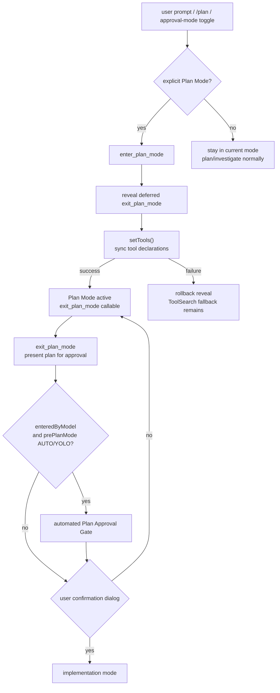

# Plan Mode 技术方案

> 适用范围：`QwenLM/qwen-code` 的 Plan Mode / approval mode 切换、`enter_plan_mode` / `exit_plan_mode` deferred tools 与默认 prompt 指引。
> 涉及 PR：#5311（auto-reveal `exit_plan_mode` when entering plan mode）、#5433（require opt-in for plan mode prompt）、#5595（require confirmation when user manually enters plan mode）。

---

## 1. 背景与动机

Plan Mode 是 qwen-code 的只读规划形态：用户显式进入后，模型可以先调查、整理计划，再通过 `exit_plan_mode` 请求用户批准并切回实现模式。它和“普通对话里让助手先写一个计划”不是同一件事。

6 月中旬的两个 PR 修的是这条边界：

1. **退出工具不可见（#5311）**：进入 Plan Mode 后，`exit_plan_mode` 是 deferred tool。如果模型还要先调用 ToolSearch 才能发现退出工具，就会多一轮无意义往返，甚至让计划模式卡在“知道要退出但没有工具声明”的状态。
2. **默认 prompt 过度鼓励自动切换（#5433）**：用户说“先计划/调查一下”时，模型不应在 YOLO/AUTO 等非 plan approval mode 下自行切到 Plan Mode。Plan Mode 会改变权限语义，必须来自用户显式请求、已有 Plan Mode 状态，或用户确认。
3. **手动进入 Plan Mode 不应跳过确认（#5595）**：用户通过 Shift+Tab、`/plan`、approval-mode dialog 或远程客户端手动进入 Plan Mode，是为了看计划并确认；不能因为进入前的 `prePlanMode` 恰好是 AUTO/YOLO，就把 `exit_plan_mode` 交给自动 Plan Approval Gate 静默批准。

核心目标：**Plan Mode entry 必须 opt-in；一旦进入，exit tool 必须可靠可见；手动进入后的退出必须给用户确认；工具声明同步失败时不能让 registry 与 chat declaration set 分裂。**

---

## 2. 整体架构

关键边界：

- **prompt/tool contract 层**：默认系统指引不再把“任务复杂、需要计划、需要调查”视为自动进入 Plan Mode 的理由。
- **tool registry 层**：`enter_plan_mode` 成功后主动 reveal `exit_plan_mode`，并通过 `setTools()` 同步到当前 chat declaration set。
- **entry-source 层**：Plan Gate 不再只看 `prePlanMode`，而是记录 `enteredByModel`，区分模型自主进入和用户手动进入。
- **一致性层**：如果 `setTools()` 失败，已 reveal 的 deferred tool 会回滚，避免 registry 认为工具可用但模型声明集里没有它。

---

## 3. 关键实现

### 3.1 Plan Mode entry 必须 opt-in（#5433）

#5433 调整默认 plan-mode guidance 和 `enter_plan_mode` 工具描述：助手可以在当前模式下写计划、继续只读调查、列实施步骤，但不能因为“需要计划”就自行调用 `enter_plan_mode`。

允许进入 Plan Mode 的来源收敛为三类：

| 来源 | 行为 |
|---|---|
| 用户显式要求进入 Plan Mode，例如 `/plan` 或自然语言明确要求切换。 | 可调用 `enter_plan_mode`。 |
| 会话已经处于 Plan Mode。 | 继续遵守 Plan Mode 语义。 |
| 助手询问后用户确认切换。 | 可进入 Plan Mode。 |

不属于以上来源时，模型应在当前 approval mode 内完成规划或调查。这对 YOLO/AUTO 尤其重要：用户要的是“先想清楚”，不是“把会话切成只读 approval mode”。

### 3.2 进入后自动 reveal `exit_plan_mode`（#5311）

#5311 让 `enter_plan_mode` 在切换成功时自动揭示 `exit_plan_mode` deferred tool。实现复用 ToolSearch select path 的一致性模式：

1. reveal `exit_plan_mode`；
2. 调用 `setTools()` 把工具声明集同步给模型；
3. 如果同步失败，回滚 reveal，让模型仍可通过 ToolSearch 作为 fallback 发现工具。

这样避免 Plan Mode 中为了退出再做一次 ToolSearch，同时避免失败路径留下半可见状态。`setTools()` 是异步 IPC/模型声明同步点，不能只改 registry 而不处理失败。

### 3.3 手动进入 Plan Mode 时必须确认退出（#5595）

#5595 修的是 #5574：Plan Approval Gate 会在模型于 AUTO/YOLO 中自主进入 Plan Mode 后自动评审并批准 `exit_plan_mode`，这是为了 autonomous flow。但用户手动 Shift+Tab 进入 Plan Mode 时，模式循环顺序是 `... -> auto -> yolo -> plan`，因此 `prePlanMode` 常常也是 `yolo`。若只看 `prePlanMode`，手动进入会被误判成 autonomous flow，退出时跳过用户确认。

修复方式是记录 entry source：

- `PlanGateState` 增加 `enteredByModel`；
- `setApprovalMode(mode, { enteredByModel })` 记录来源；
- 只有 `enter_plan_mode` 工具传 `enteredByModel: true`；
- Shift+Tab、`/plan`、approval-mode dialog、ACP/Web 客户端等用户驱动入口默认 `false`；
- `exit_plan_mode` 只有在 `enteredByModel === true && prePlanMode in {AUTO, YOLO}` 时才走自动 Plan Approval Gate，否则显示用户确认框。

这个设计 fail-safe：新入口如果忘记传来源，默认是用户驱动，结果是显示确认框，而不是静默自动批准。

### 3.4 用户合约

Plan Mode 的对外合约可以概括为：

- 普通“帮我制定计划”不会自动切换模式；
- 明确 `/plan` 或用户确认后才进入 Plan Mode；
- 进入后模型可以直接调用 `exit_plan_mode` 提交计划；
- 用户手动进入 Plan Mode 后，`exit_plan_mode` 必须显示确认框；
- 只有模型在 AUTO/YOLO 中自主进入的 Plan Mode，才允许保留自动 Plan Approval Gate；
- `exit_plan_mode` 的可见性是 additive，不改变既有 ToolSearch fallback；
- 同步失败时回滚 reveal，优先保持工具 registry 与模型声明一致。

---

## 4. 涉及 PR

| PR | 状态 | 子主题 | 作用 |
|---|---|---|---|
| #5311 | merged | auto-reveal exit tool | `enter_plan_mode` 进入后自动 reveal `exit_plan_mode`，同步 tool declarations，并在 `setTools()` 失败时回滚 reveal。 |
| #5433 | merged | opt-in plan prompt | 默认 prompt 和工具描述要求 Plan Mode 必须由用户显式请求、已有状态或确认触发；普通规划/调查保持当前模式。 |
| #5595 | merged | manual entry confirmation | `PlanGateState.enteredByModel` 区分模型自主进入和用户手动进入；手动 Shift+Tab/`/plan` 进入后 `exit_plan_mode` 不再跳过确认框。 |

---

## 5. 已知限制 / 后续

1. **Plan Mode prompt 仍是模型行为约束，不是硬权限闸。** #5433 收紧了默认指引和工具描述，但真正的安全边界仍来自 approval mode、工具权限和 `exit_plan_mode` 审批流程。
2. **`setTools()` 失败只能回滚 reveal，不能保证退出工具立即可用。** 失败后模型仍需通过 ToolSearch fallback 或等待后续工具声明同步恢复。
3. **本文只覆盖 Plan Mode entry/exit 工具可见性与确认边界。** 计划内容质量、计划审批 UI、以及实现阶段如何跟踪计划执行，不在 #5311/#5433/#5595 范围内。
4. **自动 Plan Approval Gate 仍保留在模型自主进入路径。** #5595 只修手动入口误判；如果模型在 AUTO/YOLO 中自主调用 `enter_plan_mode`，`exit_plan_mode` 仍可按既有 gate 自动评审。

---

## 6. 代码贡献

### #5311 — auto-reveal `exit_plan_mode`

- `enter_plan_mode` tool path：进入 Plan Mode 后主动 reveal `exit_plan_mode` deferred tool。
- tool declaration sync：调用 `setTools()` 同步当前可用工具集，让模型无需 ToolSearch 即可调用退出工具。
- rollback guard：`setTools()` 失败时撤销 reveal，保持 registry 与 chat declaration list 一致。
- tests / smoke：覆盖 reveal、退出工具可调用、同步失败回滚。

### #5433 — require opt-in for Plan Mode

- default guidance：普通 planning / investigation / uncertainty 不再作为自动进入 Plan Mode 的理由。
- `enter_plan_mode` description：强调只有用户显式要求、当前已在 Plan Mode，或用户确认后才可切换。
- prompt/tool-description tests：覆盖非 plan approval mode 下要求规划时不应自动调用 `enter_plan_mode`，显式 `/plan` 或直接请求仍可进入。

### #5595 — manual Plan Mode entry requires confirmation

- `PlanGateState`：新增 `enteredByModel`，不再只用 `prePlanMode` 推断是否 autonomous flow。
- `setApprovalMode`：增加可选 `{ enteredByModel }` 参数；只有 `enter_plan_mode` 工具传 true，用户驱动入口默认 false。
- `exit_plan_mode`：仅在 `enteredByModel && prePlanMode is AUTO/YOLO` 时自动走 Plan Approval Gate；手动 Shift+Tab / `/plan` / dialog / ACP/Web 入口显示确认框。
- tests：真实 `Config` + `ExitPlanModeTool` 回归覆盖 user-initiated YOLO→PLAN 为 `ask`、model-initiated 为 `allow`。

_新增于 2026-06-29_
