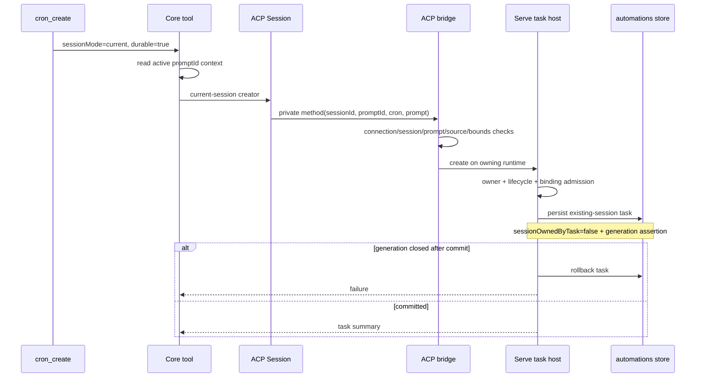

# Scheduled Tasks 技术方案

> 当前实现来源：[#9838](https://github.com/QwenLM/qwen-code/pull/9838)（open）。本文只记录 2026-08-25 复核到的 current-session reuse 方案；该能力尚未合入 `main`，最终行为以合入后的 diff 为准。

## 背景与目标

daemon scheduled task 既有模式会创建 dedicated session，并由 task lifecycle 负责启动、keepalive、rehydration 和删除。#9838 希望增加一个显式 opt-in：用户在当前 daemon 会话中调用 `cron_create` 时，可让未来调度继续复用该会话，而不是创建新会话。

这不是单纯给 task 多存一个 `sessionId`。当前会话可能正处于 prompt、权限/AUQ、parent/child、Live/standalone special source、跨 workspace owner 或已有 task binding 状态；错误复用会让 scheduler 与用户前台同时写同一 transcript，或让 task 接管不属于它的 session。因此方案把“模型工具意图”“ACP caller identity”“Serve runtime/session admission”“持久化与 UI capability”分成四层校验。

## 整体架构

## Core 工具入口

`packages/core/src/tools/cron-create.ts` 给现有 schema 增加 optional `sessionMode: 'unbound' | 'current'`：

- 省略或 `unbound` 完全沿用 dedicated-session 行为，保持旧客户端和旧 prompt 兼容。
- `current` 必须同时 `durable:true`；临时 task 不允许绑定用户会话。
- 工具从 `promptIdContext` 读取当前 prompt，调用 host 注入的 current-session creator。普通 CLI、没有 active daemon prompt 或没有 host callback 时 fail loud，不退回 dedicated，也不猜 session。

Core 只表达意图，不持有 Serve runtime、workspace owner 或 automations store，因此不会跨层直接写 task。

## ACP 身份与输入边界

`packages/cli/src/acp-integration/session/Session.ts` 只在 daemon-owned Session 上注册 creator，并把当前 `sessionId` 和 `promptId` 盖入 private ACP 请求。`packages/acp-bridge/src/bridgeClient.ts` 再验证：

- 当前 connection 确实拥有 caller session；
- prompt ID 非空，并与该 session 正在执行的 prompt 精确相等；
- cron 表达式不超过 200 字符且 shape 合法，prompt 不超过 100,000 字符；
- session 是 top-level ordinary/default source，没有 parent、sourceId 或特殊 source。

这些检查防止模型伪造别的 session/prompt，也把无界输入挡在 host/store 之前。private ACP surface 不替代 public capability；它只是 daemon 内的受控桥接协议。

## Serve 准入与持久化

`packages/cli/src/serve/routes/scheduled-tasks.ts` 在 selected runtime 上执行第二层准入：

- live owner 必须唯一、可用且属于请求 workspace；
- REST 复用路径要求 session idle；cron tool private path 只允许发起调用的精确 active prompt；
- session 不能等待 permission/AUQ，不能有 parent、special source 或 scheduled-task source；
- 一个 session 不能已经被另一 task 绑定；
- 继续服从现有 task 数量、cron/prompt 与 durable storage 限制。

成功后 task 记录指向 existing session，并设置 `sessionOwnedByTask:false`。这一区分很关键：task 删除或失败清理不能把用户原有 session 当作自身创建的资源删除。现有 keepalive、启动 rehydration、scheduler dispatch 和 task deletion 继续复用，只改变 session 的取得方式。

mutation 绑定 runtime generation assertion。若持久化完成后 generation 已关闭，host 回滚刚创建的 task，避免 store 留下指向 retired runtime 的半提交 binding。

## 能力与 Runtime Wiring

新增条件能力 `scheduled_task_session_reuse`。它只在完整 current-session callback、scheduled-task store 和 managed runtime wiring 可用后广告；primary、startup secondary 与动态 workspace runtime 都需要安装同一 host callback。fast-path bootstrap envelope 可以暂时缺少该 tag，runtime mount 后才进入 advertised set；caller-injected bridge、测试/嵌入式 partial bridge 或旧 daemon 不广告，客户端必须回落到 dedicated 模式。

该 capability 只表示 daemon 支持这条准入链，不保证任意当前 session 都可复用。具体 session 是否可用仍由实时 owner、prompt、pending interaction、source 与 binding 状态决定。

## Web Shell 交互

`packages/web-shell/src/ScheduledTasksDialog.tsx` 在 capability 存在时显示 session mode 选择，默认保持 dedicated。选择 current 前会检查当前 session 是否存在、是否 busy、是否等待 permission/AUQ、是否 parented/sourced、是否跨 workspace、是否已有 task binding；任一条件不满足就禁用 current，并且不会发送 `sessionId`。

只有用户明确选择 current 后，请求才携带 session reuse intent。UI 检查用于及时反馈，不是安全边界；Serve host 仍会独立重做全部准入。

## 失败路径与兼容性

- 缺 daemon callback、无 active prompt、非 durable current request：Core 直接拒绝。
- connection/session/prompt 不匹配或输入超限：bridge 拒绝，不到达 store。
- owner 不安全、session busy/pending/special/already-bound：host 拒绝，不产生 task。
- generation 在 commit 后关闭：回滚刚创建的 task。
- capability 缺失：Web Shell 只提供 dedicated；旧客户端省略 `sessionMode` 也保持原行为。
- task 后续触发时若 session 不可立即使用，仍走既有 keepalive/rehydration/active-work 调度策略，不在创建请求里绕过生命周期门控。

## 验证策略

PR 当前声明通过 Core cron-create、ACP bridge、Serve scheduled-task routes、Web Shell dialog，以及 ACP Session、capability/server、runtime wiring 和 lazy tool generator 的聚焦测试。覆盖重点包括：

- omitted/unbound 默认兼容与 durable/current schema；
- exact active prompt 和 connection ownership；
- parent/source/pending interaction/cross-workspace/already-bound 拒绝；
- primary/secondary/dynamic runtime 条件 wiring；
- generation-close rollback；
- capability-gated UI、默认 dedicated 与 request shaping。

文档复核没有独立执行 qwen-code 测试。PR 合入前仍需重新核对最终 head、capability 名称、private method 和 store schema，并执行包级 build/typecheck/lint 与聚焦测试。

## 已知限制

- #9838 仍为 open，本文不能作为 `main` 能力说明。
- v1 只支持当前 daemon 顶层 ordinary session；不覆盖 subagent、Live/standalone special source、跨 daemon handoff 或任意 session picker。
- 一个 session 只允许一个 task binding，不设计多 task 共享同一 transcript 的公平调度。
- 创建时的 UI 可用性是快照；最终安全性依赖 host 在提交边界重查 owner/generation/interaction/binding。

## 涉及 PR

| PR | 状态 | 作用 |
|---|---|---|
| [#9838](https://github.com/QwenLM/qwen-code/pull/9838) | open | current-session `cron_create`、private ACP creator、Serve admission/persistence/rollback、条件 capability 与 Web Shell selector。 |

_按个人 PR 口径更新于 2026-08-25_
