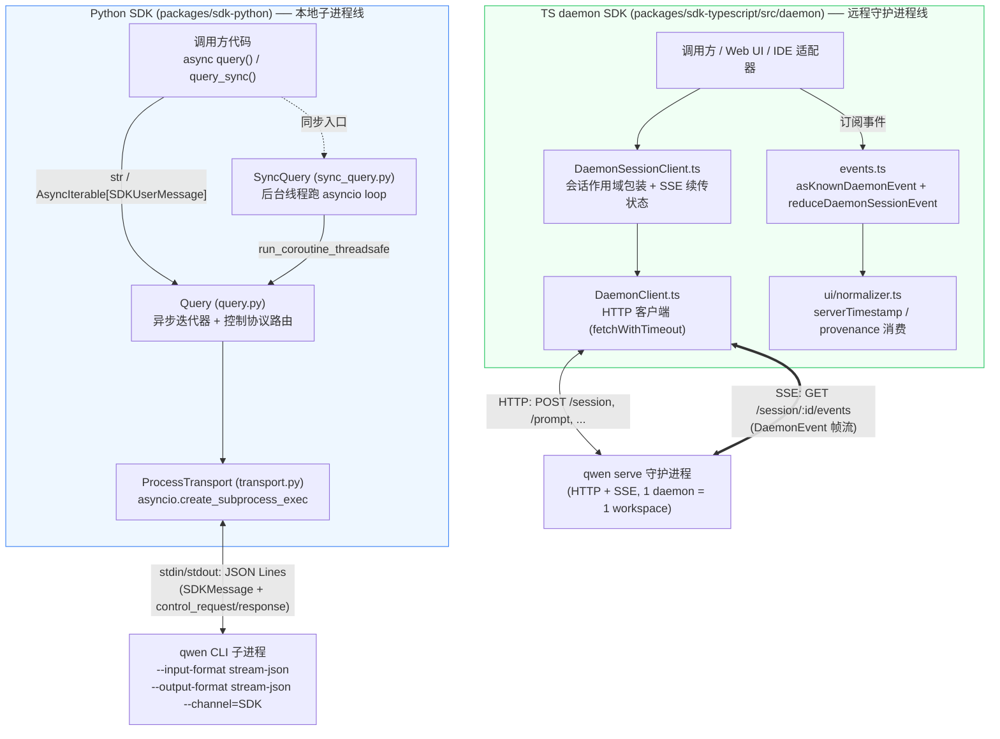
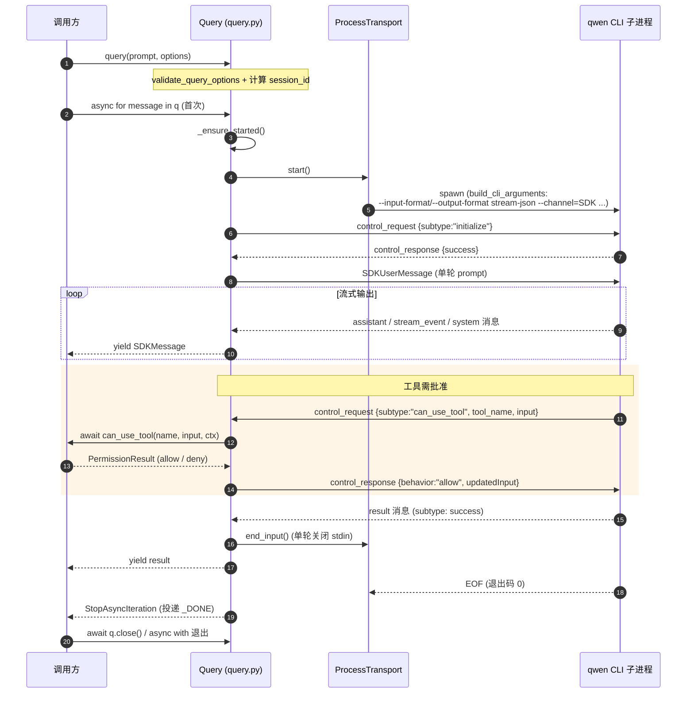
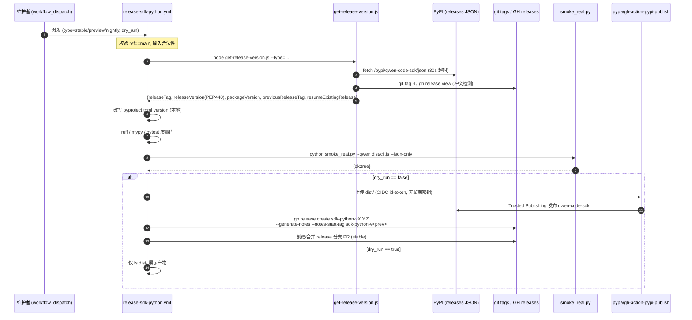

# SDK (Python / TypeScript) 技术方案

> 适用范围：qwen-code 对外的两套编程式 SDK——Python SDK（`packages/sdk-python`，子进程驱动 CLI）与 TypeScript daemon SDK（`packages/sdk-typescript/src/daemon`，HTTP/SSE 连接 `qwen serve` 守护进程）。
>
> 代码锚点均以 `file:symbol` 形式给出。Python SDK 在 `main` 分支；TS daemon SDK 的 daemon 相关部分在 `daemon_mode_b_main` 分支（用 `git -C <repo> show daemon_mode_b_main:<path>` 查看）。

---

## 1. 背景与动机

qwen-code 的主入口是交互式 CLI（TUI）与一次性非交互模式。但越来越多的场景需要**编程式驱动 agent**：CI/CD 流水线里跑代码修复、上层应用把 qwen 当作一个「会用工具的模型」嵌入、批处理多个仓库、或在远端把 agent 当作长生命周期服务对接。这正是 issue **#3010** 提出 Python SDK 的初衷。

两条独立但互补的诉求催生了两套 SDK：

1. **本地子进程式（Python SDK，#3010 / #3494）**：调用方在本机拉起一个 `qwen` CLI 子进程，通过 `stdin/stdout` 上的 **stream-json** 协议双向通信。它不引入新的运行时——CLI 已有的非交互控制协议（control request/response、`can_use_tool` 权限回调）被原样复用，SDK 只是这套协议的 Python 客户端。优点是零额外部署、与本机 CLI 行为一致；适合脚本、CI、本地自动化。

2. **远程守护进程式（TS daemon SDK，#4226 / #4360）**：调用方通过 HTTP + SSE 连接一个常驻的 `qwen serve` 守护进程（见 daemon/serve 技术方案）。一个 daemon 绑定一个 workspace，多个客户端（Web UI、IDE、TUI、第三方适配器）可同时 attach 到同一会话，共享 MCP 连接池、跨客户端权限协商、断线重连续传事件。适合「agent 即服务」的远程、多端、协作场景。

这两条线**协议不同、不可互换**：Python SDK 说的是 stream-json（stdio），daemon SDK 说的是 ACP 风格的 SSE 事件（HTTP）。`DaemonClient` 在文档里被明确定位为 `ProcessTransport` 的「兄弟」而非替代（见 `DaemonClient.ts` 头部注释）。本方案分别详解两者，并在第 6 节描述支撑 Python SDK 上架 PyPI 的发布工具链。

---

## 2. 整体架构

两套 SDK 共享「把 agent 当作可编程对象」的目标，但落在不同的进程边界与协议上。



关键区分点：

| 维度 | Python SDK | TS daemon SDK |
| --- | --- | --- |
| 进程边界 | 本机 fork 一个 CLI 子进程 | 通过网络连远端常驻 daemon |
| 传输协议 | stdio 上的 stream-json（JSON Lines） | HTTP（请求/响应）+ SSE（事件流） |
| 入口符号 | `query()` / `query_sync()` | `DaemonClient` / `DaemonSessionClient` |
| 多客户端 | 否（1 调用方 = 1 子进程） | 是（多端 attach 同一会话） |
| 包名/版本 | PyPI `qwen-code-sdk` (`pyproject.toml`) | npm `@qwen-code/sdk` (`package.json` v0.1.8) |
| 权限模型 | `can_use_tool` 异步回调（拉模式） | SSE `permission_request` 事件 + `respondToPermission`（推模式 + 投票） |

> 注：TS SDK 包内也有一套子进程式 `query()`（`packages/sdk-typescript/src/query/createQuery.ts`），与 Python SDK 同构；但本方案第 4 节聚焦其 **daemon** 部分，因为那是 TS 侧独有、与 Python SDK 形成对照的能力。

---

## 3. Python SDK 详解

包结构（`packages/sdk-python/src/qwen_code_sdk/`）：`query.py`（异步核心）、`sync_query.py`（同步包装）、`transport.py`（子进程传输）、`types.py`（类型与选项解析）、`protocol.py`（协议消息 + TypeGuard）、`validation.py`（选项校验）、`errors.py`（错误分层）、`json_lines.py`（JSON Lines 序列化）、`__init__.py`（公共导出）。

### 3.1 async `query()` 与 sync `query_sync()`

**异步入口** `query()`（`query.py:589`）是一个工厂函数：归一化选项 → 校验 → 计算 `session_id` → 构造 `ProcessTransport` 与 `Query`，返回一个 `Query` 对象。`Query`（`query.py:54`）本身是一个**异步迭代器**（实现 `__aiter__`/`__anext__`，`query.py:559`），也是异步上下文管理器（`__aenter__`/`__aexit__` 自动 `close()`）。典型用法：

```python
async for message in query("修复 README 里的拼写错误", options):
    ...   # message: SDKMessage 联合体
```

`Query` 采用**惰性启动**：`_ensure_started()`（`query.py:87`）在首次迭代/首次控制调用时才拉起子进程，并启动三个后台 task：
- `_message_router()`（`query.py:141`）——从传输读取消息、分发，结束时投递终止哨兵 `_DONE`；
- `_initialize()`（`query.py:110`）——发送 `initialize` 控制请求完成握手；
- 输入 task——单轮 prompt 走 `_send_single_turn_prompt()`（`query.py:117`），流式 prompt 走 `stream_input()`（`query.py:439`）。

消息经 `asyncio.Queue`（`_message_queue`）解耦：router 投递 `SDKMessage`/异常/`_DONE`，`__anext__` 消费。出现 `result` 消息时（单轮模式）会主动 `end_input()` 关闭 stdin（`query.py:174-178`）。

**会话 id 策略**（`query.py:600`）：`resume`/`session_id` 优先；否则在非 `continue_session` 时生成一个 `uuid4()`。运行中若收到带 `session_id` 的消息且当前未锁定，会回填并锁定（`_maybe_update_session_id`，`query.py:190`）。

**同步入口** `query_sync()`（`__init__.py:57`）返回 `SyncQuery`（`sync_query.py:20`）。其实现要点：在构造时新建一个独立的 `asyncio` 事件循环并在**守护线程**里 `run_forever()`（`sync_query.py:34-40, 57`），通过 `asyncio.run_coroutine_threadsafe` 把异步 `Query` 的迭代桥接成线程安全的 `queue.Queue`（`_consume()`，`sync_query.py:70`）。`SyncQuery` 实现普通的 `__iter__`/`__next__`，对调用方完全是同步的；同步控制方法（`interrupt`/`set_model`/`set_permission_mode`/`supported_commands`/`mcp_server_status`）都通过 `run_coroutine_threadsafe(...).result(timeout=control_request_timeout + 5s)` 转发到后台循环。`close()`（`sync_query.py:152`）有专门的顺序：先关 `Query`，再等 `_consume()` 投出 `_STOP`（避免阻塞在 `queue.get()` 的消费者死锁），最后停循环、join 线程。`__del__`（`sync_query.py:196`）在未显式关闭时发 `ResourceWarning` 并兜底清理。

### 3.2 `ProcessTransport` 与 `build_cli_arguments`

`ProcessTransport`（`transport.py:47`）封装子进程生命周期：

- `prepare_spawn_info()`（`transport.py:26`）解析可执行文件——纯命令名直接用（默认 `qwen`）；`.py` 用 `sys.executable` 跑；`.js/.mjs/.cjs` 用 `node` 跑；其余按绝对路径执行。这让 SDK 既能对接已安装的 `qwen`，也能对接仓库里的 `dist/cli.js`（发布流水线 smoke 测试正是这么用的）。
- `start()`（`transport.py:64`）用 `asyncio.create_subprocess_exec` 拉起进程，`stdin/stdout` 接 PIPE；`stderr` 仅在 `debug` 或传了 `stderr` 回调时接 PIPE（否则 `DEVNULL`），并由 `_forward_stderr()`（`transport.py:91`）逐行转发。环境变量是 `{**os.environ, **options.env}` 合并。
- `read_messages()`（`transport.py:131`）是异步生成器：逐行读 stdout、`strip` 后用 `parse_json_line` 解析，**JSON 解析失败的行静默跳过**（容忍 CLI 偶发的非协议输出），EOF 时 `_finalize_exit()` 检查退出码（非 0 → `ProcessExitError`）。
- 写侧 `write()`/`drain()`/`end_input()`/`close()` 管理 stdin 与优雅退出（`close()` 先 `terminate()`，5s 超时再 `kill()`，`transport.py:186-193`）。

`build_cli_arguments(options)`（`transport.py:197`）是 Python 选项到 CLI flag 的唯一映射点，固定头部为：

```
--input-format stream-json --output-format stream-json --channel=SDK
```

`--channel=SDK` 标识这是 SDK 发起的会话（用于 CLI 侧遥测/行为区分）。随后按需追加：`--model`、`--system-prompt`/`--append-system-prompt`、`--approval-mode <permission_mode>`、`--max-session-turns`、`--core-tools`/`--exclude-tools`/`--allowed-tools`（逗号拼接）、`--auth-type`、`--include-partial-messages`，以及会话续接三选一：`--resume <id>` / `--continue` / `--session-id <id>`（`transport.py:236-241`）。

### 3.3 控制协议与权限回调（`can_use_tool`）

SDK 与 CLI 之间除了普通的 `SDKMessage`，还有一条**控制信道**（control request/response），双向复用同一 stdio。

**SDK → CLI（出站请求）**：`_send_control_request(subtype, data)`（`query.py:355`）生成 `uuid4` 作为 `request_id`，登记一个带超时的 `_PendingControlRequest`，写出 `{"type":"control_request","request_id":...,"request":{"subtype":...}}`，返回一个 `Future`。除 `initialize` 外都会先 `await _wait_initialized()` 等握手完成。超时由 `loop.call_later(timeout.control_request, ...)` 触发，抛 `ControlRequestTimeoutError`。对外暴露的控制方法（均先 `_ensure_started()`）：`interrupt()`、`set_permission_mode(mode)`、`set_model(model)`、`supported_commands()`、`mcp_server_status()`（`query.py:465-483`）。

**CLI → SDK（入站请求）**：`_route_message` 收到 `control_request` 时起一个后台 task 处理（`_start_incoming_control_request`，`query.py:199`）。`_handle_control_request`（`query.py:219`）按 `subtype` 分派：
- `can_use_tool` → 走权限回调（下述）；
- `mcp_message` → 抛 `RuntimeError("mcp_message is unsupported in python sdk v1")`；
- 其它未知子类型 → 抛 `RuntimeError`。
处理完用 `_send_control_response`（`query.py:406`）回 success/error。

**权限回调** `_handle_permission_request`（`query.py:254`）是 SDK 的核心扩展点。当 CLI 想执行一个需要批准的工具时，发来 `can_use_tool` 请求，SDK 调用用户提供的 `options.can_use_tool` 协程：

```python
CanUseTool = Callable[[str, dict, CanUseToolContext], Awaitable[PermissionResult]]
```

- 若**未提供** `can_use_tool`，默认 `{"behavior":"deny","message":"Denied"}`（安全默认拒绝，`query.py:264`）。
- 回调在 `asyncio.wait_for(timeout=timeout.can_use_tool)` 下执行；超时/取消/异常都归一为 deny（带说明消息，`query.py:278-294`），保证 CLI 侧永远拿到响应而不会挂死。
- 结果按 `behavior` 整形：`allow` 回 `{"behavior":"allow","updatedInput":...}`（允许改写工具入参）；`deny` 回 `{"behavior":"deny","message":...,(可选)"interrupt":...}`（`query.py:296-312`）。
- `CanUseToolContext`（`types.py:49`）携带 `cancel_event`、`suggestions`（权限建议）、`blocked_path`，供回调做更细的决策。

**取消语义**：CLI 可发 `control_cancel_request`，`_handle_control_cancel_request`（`query.py:336`）会同时取消「在途的出站请求」（置 `AbortError`）和「正在处理的入站请求」（设 `cancel_event` 并 cancel task）。

### 3.4 类型与校验（`types.py` / `validation.py`）

**双形态选项**：`QueryOptions`（`types.py:119`，dataclass）是规范内部表示；`QueryOptionsDict`（`types.py:95`，`TypedDict, total=False`）是给调用方的友好字面量形态。`query()` 接受 `QueryOptions | QueryOptionsDict | Mapping | None`，统一经 `QueryOptions.from_mapping()`（`types.py:143`）解析。解析阶段做**严格逐字段类型检查**（`_as_optional_str`/`_int`/`_bool`/`_str_list`/`_str_dict`/`_nested_dict`，`types.py:189+`），类型不符立刻抛 `TypeError`，避免错误的入参悄悄漏到 CLI。

`can_use_tool`/`stderr` 回调在解析期就做签名校验（`_validate_can_use_tool_callable`，`types.py:231`）：必须是协程函数、且能接受恰好 3 个（resp. 1 个）位置参数（`_supports_argument_count`，`types.py:260`，兼容 `*args`）。

**枚举类型别名**：`PermissionMode = Literal["default","plan","auto-edit","yolo"]`、`AuthType = Literal["openai","anthropic","qwen-oauth","gemini","vertex-ai"]`（`types.py:18`）。`TimeoutOptions`（`types.py:69`）三项默认 60s：`can_use_tool` / `control_request` / `stream_close`。

**语义校验** `validate_query_options()`（`validation.py:19`）在 `from_mapping` 之后运行，覆盖跨字段约束：
- `permission_mode` / `auth_type` 必须在白名单内；
- `resume` 与 `continue_session` 互斥；`session_id` 不能与 `resume`/`continue_session` 并用（`validation.py:38-50`）；
- `session_id`/`resume` 必须是合法 **RFC 4122 UUID**（`validate_session_id`，`validation.py:83`）；
- `max_session_turns >= -1`；`path_to_qwen_executable` 非空白；
- **`mcp_servers` 在 v1 直接拒绝**（`validation.py:67`，抛 `ValidationError` 提示用 TS SDK）——这是 Python SDK v1 的明确范围边界。

### 3.5 错误分层（`errors.py`）

错误以 `QwenSDKError`（`errors.py:6`）为基类，便于调用方一处 `except`：

| 异常 | 触发场景 |
| --- | --- |
| `QwenSDKError` | 所有 SDK 错误基类 |
| `ValidationError` | 选项非法（来自 `validation.py`） |
| `AbortError` | 操作被调用方/传输中止（如控制请求被取消） |
| `ProcessExitError` | CLI 子进程非 0 退出（携带 `exit_code`，`errors.py:18`） |
| `ControlRequestTimeoutError` | 控制请求等待响应超时 |

`_finish_with_error()`（`query.py:547`）是错误终结路径：标记关闭、failing 所有在途控制请求、取消入站请求、关闭传输，并把异常投进消息队列让 `__anext__` 抛出——保证迭代器消费者一定能感知失败。

### 3.6 真实 smoke（`smoke_real.py`，无 mock）

`packages/sdk-python/scripts/smoke_real.py` 是面向维护者的**真端到端**验证脚本，刻意不使用任何 test double（`smoke_real.py:2-3`）。它直接 `import qwen_code_sdk` 并对真实 `qwen` CLI + 真实模型跑三个阶段：

1. **async 单轮**（`run_async_single`，`smoke_real.py:151`）：`query("Reply exactly with SDK_REAL_ASYNC_OK")`，校验 assistant 文本与 result 文本都含 token。
2. **async 控制**（`run_async_controls`，`smoke_real.py:181`）：用一个受 `asyncio.Event` 门控的流式 prompt，先后调用 `supported_commands()`、`set_permission_mode("plan"/"yolo")`、可选 `set_model()`，再放行 prompt 并验证收到 system/result 消息。
3. **sync**（`run_sync_with_timeout`，`smoke_real.py:271`）：在工作线程里跑 `query_sync(...)` 并带超时兜底。

入口 `main()`（`smoke_real.py:327`）先 `check_qwen_cli_available()` 预检 `--version`，每个阶段用 `run_stage(asyncio.wait_for(...))` 加超时，最终输出结构化 JSON（`ok`/`stage`/各阶段结果）。仓库通过 `npm run smoke:sdk:python` 调用它；CI 在发布流水线里用 `dist/cli.js` 作为被测 CLI（见第 6 节）。该脚本还硬性要求 Python ≥ 3.10（`smoke_real.py:12-23`）。

> 注意：smoke 覆盖了 `supported_commands` 控制路径，但**未**调用 `mcp_server_status()`——后者的端到端核验缺口见第 8 节。

---

## 4. TS daemon SDK 详解

目录 `packages/sdk-typescript/src/daemon/`（`daemon_mode_b_main` 分支）：`DaemonClient.ts`（HTTP 客户端）、`DaemonSessionClient.ts`（会话作用域包装）、`events.ts`（类型化事件 schema + 归一/reducer）、`types.ts`（wire 类型）、`sse.ts`（SSE 解析）、`DaemonAuthFlow.ts`（设备码登录助手）、`ui/normalizer.ts`（UI 事件归一）。包名 `@qwen-code/sdk`。

### 4.1 `DaemonClient`：HTTP 客户端

`DaemonClient`（`DaemonClient.ts:283`）是对 daemon HTTP 路由的薄封装，定位为「`ProcessTransport` 的兄弟」（头部注释）。要点：

- **构造与鉴权**：`DaemonClientOptions`（`DaemonClient.ts:75`）含 `baseUrl`、`token`、可注入 `fetch`、`fetchTimeoutMs`（默认 30s）。`baseUrl` 末尾斜杠用手写循环 `stripTrailingSlashes` 去除（规避 CodeQL ReDoS 误报，`DaemonClient.ts:132`）。token 缺省时回退读环境变量 `QWEN_SERVER_TOKEN`（`readTokenFromEnv`，`DaemonClient.ts:164`），且做了浏览器安全（`globalThis.process` 间接访问）、trim、空串视为未设三重防御——这是为了让 SDK 能被 `@qwen-code/webui` 直接 import。
- **超时模型** `fetchWithTimeout`（`DaemonClient.ts:334`）：短命方法套 `fetchTimeoutMs`，且把 body 读取也纳入计时窗口（避免代理 mid-body 卡死）；`prompt()` 与 SSE 订阅**绕过**该超时（模型+工具回合可达数分钟），靠 `AbortSignal` 取消。`restartMcpServer`/runtime MCP 增删用更宽的 `MCP_RESTART_DEFAULT_TIMEOUT_MS = MCP_RESTART_SERVER_DEADLINE_MS + MCP_RESTART_CLIENT_HEADROOM_MS`（300s + 30s = 330s），两个常量从 `@qwen-code/acp-bridge/mcpTimeouts` 共享导入（#4658），bridge 侧的 race deadline 也引用同一 `MCP_RESTART_SERVER_DEADLINE_MS`，消除了之前 SDK 硬编码 `330_000` / bridge 硬编码 `300_000` 的文档级耦合（`DaemonClient.ts:107-110`）。多信号用 `composeAbortSignals`（`AbortSignal.any` + polyfill，`DaemonClient.ts:2002`）合并。
- **错误模型** `DaemonHttpError`（`DaemonClient.ts:185`）：所有非 2xx 抛出，携带 `status` 与 `body`（先 `text()` 再尝试 JSON.parse，避免流被消费两次），让调用方按标准语义分支（404 缺会话 / 401 token / 400 入参 / 500 agent 失败）。
- **路由覆盖**（节选）：lifecycle/discovery（`health`/`capabilities`）、workspace 只读（`workspaceMcp`/`workspaceSkills`/`workspaceProviders`/`workspaceTools`/`workspaceEnv`/`workspacePreflight`）、workspace 文件读写（`readWorkspaceFile`/`writeWorkspaceFile`/`editWorkspaceFile`/`fileStat`/`dirList`/`glob`）、workspace memory（`workspaceMemory`/`writeWorkspaceMemory`）、workspace agents CRUD、会话（`createOrAttachSession`/`listWorkspaceSessions`/`loadSession`/`resumeSession`/`closeSession`）、prompt（`prompt`/`promptNonBlocking`）、事件订阅（`subscribeEvents`）、权限（`respondToPermission`/`respondToSessionPermission`）、auth 设备码（`startDeviceFlow`/`getDeviceFlow`/`cancelDeviceFlow`/`getAuthStatus`，懒构造的 `auth` 访问器返回 `DaemonAuthFlow`）。
- **能力门控约定**：大量方法的 JSDoc 要求调用前先 `caps.features.includes('<tag>')` 预检（如 `workspace_memory`/`session_recap`/`prompt_absolute_deadline`），老 daemon 缺失能力时返回 404。`requireWorkspaceCwd(caps)`（`types.ts`）在需要非空 `workspaceCwd` 时抛 `DaemonCapabilityMissingError` 而非让调用点踩 undefined。
- **阻塞 vs 非阻塞 prompt**：`prompt()`（`DaemonClient.ts:1405`）兼容旧版 200 直返与新版 202 + SSE。202 时它**临时**开一条 SSE 订阅等匹配 `promptId` 的 `turn_complete`/`turn_error`（`_awaitTurnComplete` + `matchTurnEvent`，`DaemonClient.ts:1474, 2054`）。已维护长连 SSE 的调用方应改用 `promptNonBlocking()`（`DaemonClient.ts:1450`，只返回 `{promptId,lastEventId}`）以避免多开一条连接。
- **SSE 订阅** `subscribeEvents`（`DaemonClient.ts:1564`）：仅对**连接阶段**（请求→收到响应头）套 `fetchTimeoutMs`，body 流本身长寿不计时；校验 `content-type` 必须含 `text/event-stream`（防代理把 SSE 替换成 JSON/HTML 导致「静默零事件」）；用 `Last-Event-ID` 头实现断点续传，可选 `?maxQueued=N`；最终 `yield* parseSseStream(res.body, signal)` 产出 `DaemonEvent` 帧。

### 4.2 `DaemonSessionClient`：会话作用域包装

`DaemonSessionClient`（`DaemonSessionClient.ts:64`）把「每个方法都要传 `sessionId`」的 `DaemonClient` 收敛为「绑定一个会话」的适配器层，面向 TUI/IDE/Web/channel 后端。它**刻意不解释事件负载**——类型化 reducer 属于 schema 层（其 docstring 明确指向 `events.ts` 的 `asKnownDaemonEvent`/`reduceDaemonSessionEvent`，这是 #4226 修正的指引）。要点：

- **三种入口**：`createOrAttach`/`load`/`resume`（静态工厂，`DaemonSessionClient.ts:90/130/166`）。它们会按窗口需要把首个订阅的 `lastEventId` 播种为 `0`（从 daemon replay ring 头部回放），以免会话创建/恢复期间产生的事件（如 MCP 预热的 `mcp_budget_warning`、`available_commands_update`）落在 ring 里却早于首次 `events()` 而丢失。
- **SSE 续传状态**：内部维护 `lastSeenEventId`，每收到带 `id` 的事件就 `Math.max` 更新（`iterateEvents`，`DaemonSessionClient.ts`）。`events()`（`DaemonSessionClient.ts`）默认 `resume:true`，自动用上次游标续传；`setLastEventId`/`lastEventId` 暴露给需要持久化游标的适配器。`subscribeEvents` 是 `events` 的 `@deprecated` 别名。
- **单订阅保护**：`openEventSubscription` 用 `acquire`/`release` 闸保证同一会话同时只有一条活跃订阅（否则抛错提示复用现有 generator）。
- **prompt 关联**：当已有活跃订阅时，`prompt()` 走 `promptNonBlocking` 并把 `promptId` 登记到 `_pendingPrompts`，由订阅循环里的 `_dispatchTurnEvent` 用 `matchTurnEvent` 完成 resolve/reject（复用 `DaemonClient` 的同一匹配逻辑），从而**不额外开 SSE 连接**。`AbortSignal` 触发时会 `cancel()` 会话并 reject。
- 其余方法（`setModel`/`recap`/`shellCommand`/`context`/`contextUsage`/`supportedCommands`/`tasks`/`respondToPermission`/`heartbeat`/`updateMetadata`/`close`）都是绑定 `sessionId`+`clientId` 的转发。

### 4.3 类型化事件 schema + 公共面围栏（#4226 / #4217）

`events.ts` 定义了 daemon SSE 事件的**类型化消费层**：

- **已知事件清单** `DAEMON_KNOWN_EVENT_TYPE_VALUES`（`events.ts:14`，`as const`）枚举全部已知 `type`（`session_update`、`permission_request`、`model_switched`、`session_died`、`stream_error`、`state_resync_required`、`mcp_budget_warning`、`memory_changed`、`auth_device_flow_*`、`approval_mode_changed`、`mcp_server_added/removed`、`turn_complete/error` 等数十种）。
- **信封与联合** `DaemonEventEnvelope<TType,TData>`（`events.ts:123`）把原始 `DaemonEvent` 收窄为 `{type,data}` 强类型；各事件有专属 `*Data` 接口 + `*Event` 别名，再聚合成 `DaemonSessionEvent`/`DaemonControlEvent`/`DaemonStreamLifecycleEvent`/`DaemonMcpGuardrailEvent`/`DaemonWorkspaceMutationEvent`/`DaemonAuthEvent`/`DaemonAssistEvent`/`DaemonTurnEvent`，顶层合并为 `KnownDaemonEvent`（`events.ts:891`）。
- **归一函数** `asKnownDaemonEvent(event)`（`events.ts:1222`）是核心：按 `event.type` switch，对每种类型用**结构化谓词**（`isPermissionRequestData` 等）逐字段校验 `data`，通过则 `as` 收窄返回 `KnownDaemonEvent`，否则返回 `undefined`。这意味着「类型名已知但负载畸形」与「类型名未知」都被安全过滤。配套 `isKnownDaemonEvent`/`isDaemonEventType<T>`（`events.ts:1181/1187`）。
- **前向兼容设计**：多处谓词刻意放宽以避免「老 SDK 静默丢弃新 daemon 事件」。例如 `isAuthDeviceFlowErrorKind` 接受任意非空字符串（`events.ts:2313`），错误种类用 `'...' | (string & {})` 开放联合（`DaemonAuthDeviceFlowErrorKind`，`events.ts:447`）；`isMcpBudgetWarningData` 校验 `thresholdRatio` 为有限数而**不**钉死字面量 `0.75`（阈值语义归 daemon 所有，`events.ts:2175`）；MCP restart refused 的 `reason` 用闭集 `MCP_RESTART_REFUSED_REASONS`（`events.ts:2388`），未知 reason 走 `unrecognizedKnownEventCount` 计数而非崩溃。
- **状态归约** `reduceDaemonSessionEvent(state, rawEvent)`（`events.ts:1367`）把事件流折叠成 `DaemonSessionViewState`（`events.ts:901`）：先 `advanceLastEventId`，再 `asKnownDaemonEvent`；未识别但属已知类型名的事件累加 `unrecognizedKnownEventCount`。视图态包含 `pendingPermissions`、`currentModelId`、`terminalEvent`、各类计数器（slow client / mcp budget / approval mode / tool toggle / forbidden votes 等）。auth 设备码事件在会话 reducer 里是 no-op，由 workspace 级 `reduceDaemonAuthEvent`（`events.ts:1796`）投影成 `DaemonAuthState`（按 provider 单例 + 单调 `lastSeenEventId` 防乱序覆盖）。
- **公共面围栏**（#4226）：`test/unit/daemon-public-surface.test.ts` 通过 `import * as Public from '../../src/index.js'` + 大量 type-only import，断言 `asKnownDaemonEvent`/`isKnownDaemonEvent`/`reduceDaemonSessionEvent`/`createDaemonSessionViewState`/`isWorkspaceScopedBudgetEvent`、auth 面（`DaemonAuthFlow`/`reduceDaemonAuthEvent`/`DEVICE_FLOW_EXPIRY_GRACE_MS`）、以及 `mcp_server_added/removed`、`DAEMON_ERROR_KINDS` 等**确实从已发布入口 `src/index.ts` 导出**。这是针对「在 `src/daemon/index.ts` 有、但两跳 re-export 后从 `src/index.ts` 漏掉」这类漂移的回归栅栏——#4226 的主要价值正是这层 pin（因为类型 union/narrow/reducer 本体已由 #4217 在 main 落地，#4226 退化为「补能力 tag + pin 公共面」）。

### 4.4 协议补全的 SDK 消费（#4360：serverTimestamp / provenance / errorKind / state_resync_required）

#4360 是 F4（客户端适配器波次）的前置协议补全，daemon 侧开始 stamp 三类字段，SDK 侧（已由 #4353 前向兼容就绪）消费：

- **`serverTimestamp`**（daemon 权威时间戳）：daemon 在 `formatSseFrame` 写帧边界 stamp 到 `_meta.serverTimestamp`（保留既有 `_meta` 键）。SDK 的 `ui/normalizer.ts:extractServerTimestamp`（`normalizer.ts:350`）按**三处候选顺序**读取并容忍缺失：① 顶层 `event.serverTimestamp` ② `event._meta.serverTimestamp`（Anthropic 约定）③ `event.data._meta.serverTimestamp`（sessionUpdate 嵌套位置），均非有限数则 `undefined`。这种「读 daemon 最终落在哪就读哪」的设计使 SDK 无需与 daemon 协调发版即可消费。
- **`provenance`**（工具来源）：daemon 的 `ToolCallEmitter.resolveToolProvenance` 在 emitStart/Result/Error 都 stamp `{provenance:'builtin'|'mcp'|'subagent', serverId?}`（让重连客户端能从任一 update 重建来源）。SDK 在 `normalizer.ts:extractToolProvenance`（`normalizer.ts:597`）消费：优先显式 `provenance` 字段，否则用 `mcp__<server>__<tool>` 命名启发式回退，真未知时 UI 默认 `'unknown'`。
- **`errorKind`**（结构化错误分类）：`stream_error` 帧通过 daemon 的 `mapDomainErrorToErrorKind` stamp。SDK 侧 `DaemonStreamErrorData.errorKind`（`events.ts:268`）类型为 `DaemonErrorKind | (string & {})`——`DaemonErrorKind` 是闭集 taxonomy（`types.ts:DAEMON_ERROR_KINDS`，含 `missing_binary`/`blocked_egress`/`auth_env_error`/`init_timeout`/`protocol_error`/`missing_file`/`parse_error`/`budget_exhausted`，并由 #4514 追加 `prompt_deadline_exceeded`/`writer_idle_timeout` 等），`(string & {})` 加宽保留对未来新种类的前向兼容与 IDE 自动补全。UI 据此做类型化重试/补救（`init_timeout` 重试 vs `missing_binary` 提示安装）而非正则匹配错误字符串。
- **`state_resync_required`**（SSE 续传 gap 检测）：daemon 的 `eventBus.subscribe()` 回放路径发现 `earliest > lastEventId + 1`（ring 已驱逐了客户端缺失的区间）时，force-push 一个**无 `id` 的合成终止帧** `{type:'state_resync_required', data:{reason:'ring_evicted', lastDeliveredId, earliestAvailableId}}`。SDK reducer 收到后置 `awaitingResync = true`（`events.ts` 的 `state_resync_required` case），随后**自动跳过所有非终止 delta 事件**（仍推进 `lastEventId`），仅放行 `RESYNC_PASSTHROUGH_TYPES`（`events.ts:1117`：`state_resync_required` 自身 + `session_died`/`session_closed`/`client_evicted`/`stream_error` 终止帧）。消费方恢复契约：检测到 `awaitingResync` 后调用 `loadSession` 取 daemon 权威快照，再用 `createDaemonSessionViewState({...})` 重建视图态（新实例隐式清零该标志）。daemon 在合成帧后**继续回放**而非断流（网络友好，SDK 可后续算 diff）。

---

## 5. 关键流程（时序图 / 调用链）

### 5.1 Python `query()` → 拉起 CLI → 流式消息 → 权限回调往返 → 结束



### 5.2 发布流水线：get-release-version → PyPI Trusted Publishing → tag



调用链锚点：`.github/workflows/release-sdk-python.yml`（job `release-sdk-python`）→ `node packages/sdk-python/scripts/get-release-version.js`（`getVersion`，`get-release-version.js:458`）→ 质量门 `ruff/mypy/pytest`（workflow `Run Python quality gates` step）→ `smoke_real.py`（`Run real smoke test` step，被测 CLI 为 `dist/cli.js`）→ `pypa/gh-action-pypi-publish`（SHA 钉死）→ `gh release create`。

---

## 6. 发布工具链

Python SDK 上架 PyPI 由一组协作的脚本与 workflow 支撑，核心目标是**版本可推导、发布可审计、无长期密钥、notes 不线性膨胀**。

### 6.1 PEP 440 版本推导（`get-release-version.js`，#3833 网络超时 / #3832 TAG_PREFIX）

`get-release-version.js` 是 SDK 的版本「单一事实源」。`parseVersion`（`get-release-version.js:37`）识别三种 PEP 440 形态：稳定 `X.Y.Z`、预览 `X.Y.Zrc N`、nightly `X.Y.Z.devN`，并区分 `releaseVersion`（带 `-preview.N`/`-nightly.<ts>.<sha>` 的 tag 形态）与 `packageVersion`（PyPI 包形态 `rcN`/`.devN`）。`getVersion`（`get-release-version.js:458`）按 `--type` 分派 nightly/preview/stable，`getNextBaseVersion`（`get-release-version.js:201`）综合 PyPI 上最新 stable/preview/nightly 与 `pyproject.toml` 当前版本推导下一个 base，并在 while 循环里做**三方冲突检测**：`getReleaseState`（`get-release-version.js:275`）同时查 PyPI（`packageVersionExistsOnPyPI`）、本地 git tag、GitHub release，冲突则 bump 或报错；还能识别「PyPI 已发但缺 GH release」的中断恢复（`resumeExistingRelease`）。

两个相关修复：
- **#3833 网络超时**：所有网络/本地命令都有超时常量——`NETWORK_COMMAND_TIMEOUT_MS = 30_000`（PyPI fetch 用 `AbortSignal.timeout`、`gh release view`）、`LOCAL_COMMAND_TIMEOUT_MS = 10_000`（`git rev-parse`/`git tag -l`），并用 `isTimeoutError`（`get-release-version.js:262`）把超时翻译成可读错误，避免本机 git/网络无响应时整个发布挂死。
- **#3832 TAG_PREFIX 标准化**：`TAG_PREFIX = 'sdk-python-v'`（`get-release-version.js:23`）统一带 `v` 后缀，使 git tag / GH release 命名一致（`sdk-python-vX.Y.Z`）。

### 6.2 共享 release helpers（#3834）

`scripts/lib/release-helpers.js` 抽出被 SDK 与主包发布共用的工具：`getArgs()`（解析 `--key=value`/裸 flag）、`readJson()`、`validateVersion(version, format, name)`（按 `X.Y.Z` / `X.Y.Z-preview.N` 正则校验）、`isExpectedMissingGitHubRelease(error)`（判定 `gh release view` 的「release not found / Not Found」为预期缺失而非真失败）。`get-release-version.js` 顶部即 `import { getArgs, isExpectedMissingGitHubRelease, validateVersion } from '../../../scripts/lib/release-helpers.js'`（`get-release-version.js:13`），消除了 SDK 与主包发布逻辑的重复。

### 6.3 PyPI OIDC Trusted Publishing + SHA 钉死 actions（#3685）

`release-sdk-python.yml`（#3685 引入）的安全要点：
- **OIDC Trusted Publishing**：job 声明 `permissions: id-token: write`（`release-sdk-python.yml:48-52`）并使用 `pypa/gh-action-pypi-publish`，**无需在仓库存任何 PyPI 长期 token**——发布凭据由 GitHub OIDC 短时签发，PyPI 侧按「可信发布者」校验。
- **第三方 actions 全部 SHA 钉死**：`actions/checkout@de0fac2...`、`actions/setup-node@48b55a0...`、`actions/setup-python@a309ff8...`、`pypa/gh-action-pypi-publish@cef2210...`（`release-sdk-python.yml:103/139/206/349`），杜绝 tag 漂移导致的供应链风险。
- **权限/分支护栏**：workflow 仅允许从受保护的 `main` 触发、`ref` 必须是 `main`（`release-sdk-python.yml:77-93`）；`dry_run=false` 时禁止 `force_skip_tests`；`environment: production-release` 提供发布审批闸。
- **可恢复发布**：`skip-existing` 绑定 `resumeExistingRelease`（`release-sdk-python.yml:353`），中断重跑时已上传产物不报错；版本写入走临时 stash + restore 的方式只在 release 分支上持久化（`Create and switch to a release branch` step）。

### 6.4 `--generate-notes` 解决 notes 线性增长（#3835）

早期发布把上一版的 release notes **逐字继承**进新版，导致 notes 随版本线性膨胀（每版都包含全部历史）。#3835 改为用 GitHub 原生 `gh release create --generate-notes --notes-start-tag <previous-tag>`（`release-sdk-python.yml:407-408`）：notes 只覆盖 `previousReleaseTag` 到当前 tag 之间的增量提交。并有降级兜底——若上一个 tag 在 git 中不存在（如此前发了 PyPI 却没建 tag），跳过 `--generate-notes` 改用静态 notes（`release-sdk-python.yml:409-417`），避免 PyPI 发布后 `gh release create` 失败。preview/nightly 与「首个 stable」因 `previousReleaseTag` 为空也走静态 notes，避免把非 SDK 提交混入。

---

## 7. 涉及 PR

| PR | 状态 | 子主题 | 作用 |
| --- | --- | --- | --- |
| #3010 | issue | Python SDK 需求 | 提出编程式驱动 agent 的 Python SDK 诉求（本方案 Python 线的源头） |
| #3494 | MERGED | Python SDK 实现 | 落地 `packages/sdk-python` 全包：async `query`/sync `query_sync`、`ProcessTransport`、控制协议、权限回调、`smoke_real.py` |
| #3492 | CLOSED | （标题为）smoke test | #3494 的重复尝试，标题写「real smoke test」实则提交整包 SDK（24 文件）；被关闭 |
| #3493 | CLOSED | （标题为）smoke test | 同 #3492 的另一重复 PR，同样标题/内容错配；被关闭 |
| #3995 | MERGED | 文档扩展 | 扩充 Python SDK 使用文档 |
| #3685 | MERGED | PyPI 发布 workflow | 引入 `release-sdk-python.yml`：OIDC Trusted Publishing + SHA 钉死 actions |
| #3834 | MERGED | 共享 release helpers | 抽出 `scripts/lib/release-helpers.js`，SDK 与主包复用 |
| #3833 | MERGED | 网络超时 | 给版本助手加 PyPI/git/gh 命令超时，防发布挂死 |
| #3832 | MERGED | TAG_PREFIX 标准化 | `TAG_PREFIX = 'sdk-python-v'`，统一 tag 命名带 `v` |
| #3835 | MERGED | `--generate-notes` | 用增量 notes 替代逐字继承，解决 notes 线性膨胀 |
| #4217 | MERGED | 类型化事件 schema v1 | （main 落地）daemon 事件 `KnownDaemonEvent` union + `asKnownDaemonEvent` + reducer 本体 |
| #4226 | MERGED | 能力 tag + 公共面 pin | daemon 通告 `typed_event_schema` 能力；`daemon-public-surface.test.ts` 围栏两跳 re-export |
| #4353 | MERGED | SDK 前向兼容就绪 | SDK 侧先就绪消费 serverTimestamp/provenance/errorKind 字段（与 #4360 配对） |
| #4360 | MERGED | 协议补全（F4 前置） | daemon stamp `serverTimestamp`/`provenance`/`errorKind` + 发 `state_resync_required`；SDK reducer/normalizer 消费 |

---

## 8. 已知限制 / 后续

结合代码与 review 反馈，记录当前缺口与后续方向：

1. **#3492 / #3493 标题与内容错配**：两个 PR 标题均为「Add Python SDK real smoke test」，描述也只讲 smoke test，但 `gh pr diff` 显示它们实际改动是**整包 SDK**（`packages/sdk-python/src/**` 全部源文件、`tests/**`、`docs/developers/sdk-python.md`、`.github/workflows/sdk-python.yml`、`README.md` 共 24 文件）。二者作为 #3494 的重复实现被关闭。后续 PR 标题/描述应与实际变更范围一致，避免 review 误判规模。

2. **#3494 夹带无关 SettingsDialog 测试**：合入的 Python SDK 实现 PR #3494 里除 `packages/sdk-python/**` 与文档外，还包含一个与 SDK 无关的 `packages/cli/src/ui/components/SettingsDialog.test.tsx` 改动。这类「顺手带入」的跨域文件应拆分到独立 PR，保持发布单元聚焦。

3. **`mcp_server_status` 控制子类型缺端到端核验**：Python SDK 暴露了 `Query.mcp_server_status()` / `SyncQuery.mcp_server_status()`（`query.py:481`、`sync_query.py:137`），CLI 侧也确有处理器（`packages/cli/src/nonInteractive/control/controllers/sdkMcpController.ts` 的 `mcp_server_status` case）。但 `smoke_real.py` 只跑了 `supported_commands()` 而**未**调用 `mcp_server_status()`，且 Python SDK v1 在 `validation.py:67` 直接拒绝 `mcp_servers` 配置——意味着 SDK 端根本无法注册 SDK-MCP server，该控制路径实际上无法被有意义地端到端验证。后续应在 smoke 或集成测试中补一条 `mcp_server_status` 往返用例，并明确「无 SDK-MCP server 时返回空」的契约。

4. **TS `narrowDaemonEvent` 注释引用不存在的符号**：`packages/cli/src/serve/capabilities.ts:57` 的注释写道「`narrowDaemonEvent` falls back to `kind: 'unknown'` for daemons that don't advertise the tag」，但 SDK 中**并不存在** `narrowDaemonEvent` 这个符号——实际的归一函数是 `asKnownDaemonEvent`（`events.ts:1222`），且其语义是「不识别则返回 `undefined`」而非「回退到 `kind:'unknown'`」（`kind:'unknown'` 是 `ui/normalizer.ts` 里 UI 层 provenance 的默认值，与事件归一无关）。该注释会误导读者，应改为引用 `asKnownDaemonEvent` 并修正其回退语义描述。

5. **范围边界（非缺陷，记录待演进）**：Python SDK v1 不支持 `mcp_servers`、入站 `mcp_message` 控制子类型直接判为 unsupported（`query.py:235`）；这些是有意的 v1 边界，TS SDK 提供了对应的更完整能力（runtime MCP 增删、guardrail 事件等）。两套 SDK 的能力对齐可作为后续方向。

---

## 9. 各 PR 代码贡献

### #3494 — Python SDK 实现

- `transport.py:ProcessTransport`：封装 CLI 子进程生命周期（`start` / `read_messages` / `close`），`asyncio.create_subprocess_exec` + PIPE；`prepare_spawn_info` 按后缀 `.py`/`.js`/命令名分派可执行文件。
- `transport.py:build_cli_arguments`：Python 选项→CLI flag 唯一映射点，固定头部 `--input-format stream-json --output-format stream-json --channel=SDK`；按需追加 `--model`/`--approval-mode`/`--resume`/`--session-id` 等。
- `query.py:query` / `query.py:Query`：异步工厂 + 异步迭代器（`__aiter__`/`__anext__`），惰性启动 `_ensure_started`；`_message_router` 分发消息，`_handle_permission_request` 路由 `can_use_tool` 回调。
- `sync_query.py:SyncQuery` / `__init__.py:query_sync`：守护线程跑独立 `asyncio` 事件循环，`run_coroutine_threadsafe` 桥接同步 `__iter__`/`__next__`；`close()` 先关 `Query` 再停循环防死锁。
- `smoke_real.py`：真端到端验证脚本（无 mock），三阶段 async 单轮 / async 控制 / sync，输出结构化 JSON；CI 用 `dist/cli.js` 作被测 CLI。

### #3685 — PyPI 发布 workflow

- `.github/workflows/release-sdk-python.yml`：完整发布流水线，`permissions: id-token: write` 启用 OIDC Trusted Publishing；`pypa/gh-action-pypi-publish` SHA 钉死，无长期 PyPI token。
- `release-sdk-python.yml`：分支/ref 护栏（仅 `main`）、`dry_run=false` 禁止 `force_skip_tests`、`environment: production-release` 审批闸。
- `release-sdk-python.yml`：版本写入走临时 stash + release 分支持久化；`skip-existing` 绑定 `resumeExistingRelease` 支持中断重跑。

### #3832–3835 — release helpers cluster

- `get-release-version.js:TAG_PREFIX`（#3832）：从 `'sdk-python-'` 改为 `'sdk-python-v'`，统一 tag 命名；`getReleaseState` 参数从 `releaseTag` 改为 `releaseVersion`，消除 `v` 拼接不一致。
- `get-release-version.js:NETWORK_COMMAND_TIMEOUT_MS` / `LOCAL_COMMAND_TIMEOUT_MS`（#3833）：PyPI fetch 用 `AbortSignal.timeout(30s)`、`git tag -l` / `git rev-parse` 用 `execSync timeout:10s`；`isTimeoutError` 统一识别 `ETIMEDOUT`/`killed+SIGTERM`。
- `scripts/lib/release-helpers.js`（#3834）：抽出 `getArgs` / `readJson` / `validateVersion` / `isExpectedMissingGitHubRelease` 供 SDK 与主包发布共用，消除重复实现。
- `release-sdk-python.yml`（#3835）：`gh release create --generate-notes --notes-start-tag <previous-tag>` 替代逐字继承 notes；前一 tag 不存在时降级静态 notes；preview/nightly 跳过 `--generate-notes` 避免混入非 SDK 提交。

### #3995 — Python SDK docs 扩充

- `docs/developers/sdk-python.md`：从 168 行扩充至约 450 行；新增 `Sync Usage`、`QueryOptions` 完整选项表、`Permission Handling` 回调示例（含 `project_path` 路径围栏）、`Multi-Turn Sessions` 异步迭代器用法、`Runtime Controls` 在线控制示例、`Session Resume` 续接模式。
- `docs/developers/sdk-python.md`：Quick Start 改用 `async with query(...)` 上下文管理器 + `is_sdk_assistant_message` 流式打印；新增 `extract_text` / `print_result` 辅助函数；`asyncio.run()` 与事件循环共存说明。
- `README.md`：`TypeScript SDK` 改为 `SDKs (TypeScript, Python, Java)`，新增 Python SDK 代码示例与链接。
