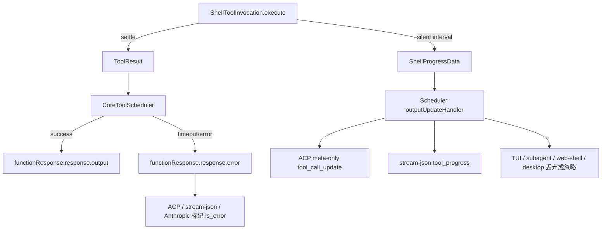

# Shell 工具执行语义技术方案

> 适用代码库：`QwenLM/qwen-code`。
> 当前记录：#6864 shell timeout error semantics、#6876 silent foreground shell heartbeat，均按当前 open diff 复核。

---

## 1. 背景与动机

Shell 工具是 qwen-code 中最容易长时间运行、产生大量输出或完全静默的工具。7 月 14 日的两组改动聚焦同一类可靠性问题：前台命令的“运行中、失败、超时、取消”必须在 core scheduler、ACP、stream-json、TUI、SDK/Web Shell normalizer 和模型上下文中保持一致。

- #6864 解决 timeout 被当作成功的问题。旧实现把 timeout 摘要放在成功 `ToolResult` 的 `response.output` 里，导致 UI/JSON/ACP/Anthropic/speculative 路径都可能把被终止的命令显示为成功。
- #6876 解决静默命令没有活性信号的问题。命令 spawn 后长时间无输出时，headless gateway 看不到任何事件，无法区分“命令仍在运行”和“执行链已死”。

---

## 2. 整体架构

Shell 执行语义分成两条互不混淆的通道：

1. **最终结果通道**：命令 settle 后进入 `ToolResult` / `ToolCallResponseInfo`。成功走 `response.output`；timeout 等 soft failure 走 `response.error`，并把状态标为 error。
2. **运行中心跳通道**：命令仍在运行且持续无输出时，`ShellProgressData` 通过 `updateOutput` 旁路传给 headless consumer。它只携带统计信息，不进入模型上下文，也不替换 TUI live output。



---

## 3. Shell timeout 错误语义（#6864）

### 3.1 结构化 timeout failure

`packages/core/src/tools/shell.ts` 在前台命令 timeout 时返回带 `ToolErrorType.EXECUTION_TIMEOUT` 的 `ToolResult`。模型侧内容保留详细 timeout 结果：timeout 摘要、命令已输出的部分内容、无输出说明或 truncation pointer。运维侧 `error.message` 保持短摘要，避免把大量 stdout/stderr 写入 hook、telemetry、span 或顶层 error metadata。

`CoreToolScheduler` 增加 `convertToFunctionErrorResponse()`，把 failed tool 的 model-facing result 写进 `functionResponse.response.error`，而不是成功路径的 `output`。timeout 分支会先走 `maybePersistLargeToolResult()`，使大 error 文本仍可落盘并保留错误状态。

### 3.2 timeout 与 cancel 的竞态

全局 scheduler timeout 和 shell 自身 timeout 都会触发 abort。#6864 增加 `schedulerTimeoutResultSelected` / `schedulerTimeoutWon` 判断：只有 timeout 先赢且不是后到 cancel 覆盖时，才把结果归类为 `EXECUTION_TIMEOUT`。用户在 timeout 前取消仍是 cancelled。

Shell startup 也增加 pre-abort guard：signal 已 abort 或在 PTY discovery 期间 abort 时，流程停止在 spawn 前，避免已经取消的命令继续创建进程。

### 3.3 协议与输出适配

- ACP `Session.runTool()` 对 soft failure 使用 `convertToFunctionErrorResponse()`，并把 tool execution span 的错误细分为 `tool_timeout`。
- non-interactive JSON 输出优先读取 `responseParts` 中的 `error` 文本，保留 timeout 详细内容。
- TUI speculative tool result 遇到 `response.error` 时显示 failed tool，而不是 success。
- Anthropic converter 输出 `tool_result.is_error: true`。
- context estimation、batch offload、active tool result history 开始统计 error 文本，但不会把 error 改成 success。

---

## 4. 静默命令心跳（#6876）

### 4.1 `ShellProgressData`

`packages/core/src/tools/tools.ts` 新增 `ShellProgressData`，并加入 `ToolResultDisplay` union：

```typescript
interface ShellProgressData {
  type: 'shell_progress';
  elapsedMs: number;
  lastOutputAgeMs?: number;
  totalLines?: number;
  totalBytes?: number;
  timeoutMs?: number;
}
```

所有时间都用 `performance.now()` 的单调 delta。payload 只包含运行统计，不包含命令输出，也不会进入模型上下文。

### 4.2 生产端

`ShellToolInvocation.execute()` 在进程真正 spawn 后才启动 heartbeat interval，避免 PTY 初始化阶段为不存在的进程发心跳。interval 来自 `tools.shell.heartbeatIntervalMs`：默认 10 秒，`0` 禁用。真实 data/binary progress 会刷新 last output time；只有无输出达到完整 interval 才发心跳。

timer 清理与 trailing flush、timeout warning 一样集中在三类路径：service throw、result settle 和 abort。abort 后不会继续发“仍在运行”的心跳。

### 4.3 消费端

- `CoreToolScheduler` 识别 `isShellProgressData()`，只转发给 `outputUpdateHandler`，不覆盖 `liveOutput`。
- ACP `Session.runTool()` 把心跳转成 fire-and-forget `tool_call_update`，只有 `status:'in_progress'` 和 `_meta.shellProgress`；`toolSettled` gate 防止 completed 后迟到 in_progress。
- stream-json 通过 `tool_progress` 事件转发，受 `--include-partial-messages` 控制。
- TUI hook、subagent runtime、desktop `QwenAgent`、channel `DaemonChannelBridge` 和 web-shell normalizer 都忽略或丢弃心跳，避免把 meta-only frame 当作最终 tool result 或覆盖 UI title。

---

## 5. 验证方式

- `packages/core/src/tools/shell.test.ts`: timeout result、partial output、startup abort、heartbeat cadence、payload shape、disable knob、timer cleanup。
- `packages/core/src/core/coreToolScheduler.test.ts`: timeout error envelope、large error offload、heartbeat forwarding without live-output replacement。
- `packages/core/src/services/shellExecutionService.test.ts`: abort reason 区分 timeout/cancel/background promotion refused。
- `packages/cli/src/acp-integration/session/Session.test.ts`: ACP error envelope、tool timeout span、meta-only heartbeat frame 与 settle gate。
- `packages/cli/src/nonInteractive/io/BaseJsonOutputAdapter.test.ts`、`StreamJsonOutputAdapter.test.ts`: JSON timeout detail 与 stream-json `tool_progress`。
- `packages/cli/src/ui/AppContainer.test.tsx`、`useToolScheduler.test.ts`: speculative error display 与 TUI 忽略 heartbeat。
- `packages/sdk-typescript/test/unit/daemonUi.test.ts`: web-shell normalizer 丢弃 heartbeat frame。

---

## 6. 涉及 PR

| PR | 状态 | 子主题 | 作用 |
|---|---|---|---|
| [#6864](https://github.com/QwenLM/qwen-code/pull/6864) | open | shell timeout error semantics | 前台 shell timeout 从成功输出改为结构化 `EXECUTION_TIMEOUT` 错误，协议/JSON/Anthropic/speculative/batch offload 都读取 error envelope。 |
| [#6876](https://github.com/QwenLM/qwen-code/pull/6876) | open | silent shell heartbeat | 静默前台 shell 命令周期性发 `ShellProgressData`，ACP/stream-json 可见，TUI/模型上下文不受影响。 |

---

## 7. 已知限制 / 后续

- #6864 不改变非零退出码语义，也不处理后台 shell timeout 自动提升。
- #6876 不向 ACP 流式转发命令输出，只提供 liveness heartbeat。
- MCP tool progress、subagent heartbeat 透传和 TUI 可视化增强仍是后续项。
- 两个 PR 当前仍为 open；本文记录当前 diff 的最终实现观察，合入后需再次核对状态和统计。
