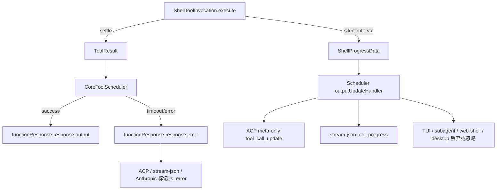

# Shell 工具执行语义技术方案

> 适用代码库：`QwenLM/qwen-code`。
> 当前记录：#6864 shell timeout error semantics、#6876 silent foreground shell heartbeat、#7053 shell safety tri-state classification、#7172 Plan-mode shell safety routing。

---

## 1. 背景与动机

Shell 工具是 qwen-code 中最容易长时间运行、产生大量输出或完全静默的工具。7 月 14 日的两组改动聚焦同一类可靠性问题：前台命令的“运行中、失败、超时、取消”必须在 core scheduler、ACP、stream-json、TUI、SDK/Web Shell normalizer 和模型上下文中保持一致。

- #6864 解决 timeout 被当作成功的问题。旧实现把 timeout 摘要放在成功 `ToolResult` 的 `response.output` 里，导致 UI/JSON/ACP/Anthropic/speculative 路径都可能把被终止的命令显示为成功。
- #6876 解决静默命令没有活性信号的问题。命令 spawn 后长时间无输出时，headless gateway 看不到任何事件，无法区分“命令仍在运行”和“执行链已死”。
- #7053 解决 shell safety 事实层过于粗糙的问题。旧 boolean 只能表达“只读/非只读”，无法把明确写操作和静态未知分开；scheduler 也不能先 unwrap wrapper 再把不确定命令当成同步只读。
- #7172 在 #7053 的事实层之上接入 Plan mode 策略：模型在 Plan mode 发起的 shell/monitor 命令按 read-only/write/unknown 分流，只读沿用既有权限，明确写入直接拒绝，unknown 走一次性精确审批且审批后重放前必须校验计划和命令未漂移。

---

## 2. 整体架构

Shell 执行语义分成两条互不混淆的通道：

1. **最终结果通道**：命令 settle 后进入 `ToolResult` / `ToolCallResponseInfo`。成功走 `response.output`；timeout 等 soft failure 走 `response.error`，并把状态标为 error。
2. **运行中心跳通道**：命令仍在运行且持续无输出时，`ShellProgressData` 通过 `updateOutput` 旁路传给 headless consumer。它只携带统计信息，不进入模型上下文，也不替换 TUI live output。



---

## 3. Shell timeout 错误语义（#6864）

### 3.1 结构化 timeout failure

`packages/core/src/tools/shell.ts` 在前台命令 timeout 时返回带 `ToolErrorType.EXECUTION_TIMEOUT` 的 `ToolResult`。模型侧内容保留详细 timeout 结果：timeout 摘要、命令已输出的部分内容、无输出说明或 truncation pointer。运维侧 `error.message` 保持短摘要，避免把大量 stdout/stderr 写入 hook、telemetry、span 或顶层 error metadata。

`CoreToolScheduler` 增加 `convertToFunctionErrorResponse()`，把 failed tool 的 model-facing result 写进 `functionResponse.response.error`，而不是成功路径的 `output`。timeout 分支会先走 `maybePersistLargeToolResult()`，使大 error 文本仍可落盘并保留错误状态。

### 3.2 timeout 与 cancel 的竞态

全局 scheduler timeout 和 shell 自身 timeout 都会触发 abort。#6864 增加 `schedulerTimeoutResultSelected` / `schedulerTimeoutWon` 判断：只有 timeout 先赢且不是后到 cancel 覆盖时，才把结果归类为 `EXECUTION_TIMEOUT`。用户在 timeout 前取消仍是 cancelled。

Shell startup 也增加 pre-abort guard：signal 已 abort 或在 PTY discovery 期间 abort 时，流程停止在 spawn 前，避免已经取消的命令继续创建进程。

### 3.3 协议与输出适配

- ACP `Session.runTool()` 对 soft failure 使用 `convertToFunctionErrorResponse()`，并把 tool execution span 的错误细分为 `tool_timeout`。
- non-interactive JSON 输出优先读取 `responseParts` 中的 `error` 文本，保留 timeout 详细内容。
- TUI speculative tool result 遇到 `response.error` 时显示 failed tool，而不是 success。
- Anthropic converter 输出 `tool_result.is_error: true`。
- context estimation、batch offload、active tool result history 开始统计 error 文本，但不会把 error 改成 success。

---

## 4. 静默命令心跳（#6876）

### 4.1 `ShellProgressData`

`packages/core/src/tools/tools.ts` 新增 `ShellProgressData`，并加入 `ToolResultDisplay` union：

```typescript
interface ShellProgressData {
  type: 'shell_progress';
  elapsedMs: number;
  lastOutputAgeMs?: number;
  totalLines?: number;
  totalBytes?: number;
  timeoutMs?: number;
}
```

所有时间都用 `performance.now()` 的单调 delta。payload 只包含运行统计，不包含命令输出，也不会进入模型上下文。

### 4.2 生产端

`ShellToolInvocation.execute()` 在进程真正 spawn 后才启动 heartbeat interval，避免 PTY 初始化阶段为不存在的进程发心跳。interval 来自 `tools.shell.heartbeatIntervalMs`：默认 10 秒，`0` 禁用。真实 data/binary progress 会刷新 last output time；只有无输出达到完整 interval 才发心跳。

timer 清理与 trailing flush、timeout warning 一样集中在三类路径：service throw、result settle 和 abort。abort 后不会继续发“仍在运行”的心跳。

### 4.3 消费端

- `CoreToolScheduler` 识别 `isShellProgressData()`，只转发给 `outputUpdateHandler`，不覆盖 `liveOutput`。
- ACP `Session.runTool()` 把心跳转成 fire-and-forget `tool_call_update`，只有 `status:'in_progress'` 和 `_meta.shellProgress`；`toolSettled` gate 防止 completed 后迟到 in_progress。
- stream-json 通过 `tool_progress` 事件转发，受 `--include-partial-messages` 控制。
- TUI hook、subagent runtime、desktop `QwenAgent`、channel `DaemonChannelBridge` 和 web-shell normalizer 都忽略或丢弃心跳，避免把 meta-only frame 当作最终 tool result 或覆盖 UI title。

---

## 5. Shell safety 三态分类（#7053）

### 5.1 三态事实层

`packages/core/src/utils/shellAstParser.ts` 新增 `classifyShellCommandSafety(command)`，返回 `read-only`、`write`、`unknown`。聚合规则固定为 `write > unknown > read-only`：

- `read-only`：当前规则能证明所有实际执行路径都是只读。
- `write`：存在明确文件、Git、进程或系统状态修改证据，不要求命令最终执行成功。
- `unknown`：parser、语法、wrapper、env、substitution、动态执行、外部 helper 或规则覆盖不足导致无法证明安全。

AST 中出现 `ERROR` 节点直接归 unknown。command/process substitution 会给外层加 unknown floor，但 substitution 内部若发现明确 writer 仍提升到 write。control flow 扫描所有可能分支；function definition 本身不是执行 body；纯 assignment 和 `cd` 保持兼容行为。

### 5.2 规则收敛与 fallback

`packages/core/src/utils/shell-safety-rules.ts` 集中维护 sed/awk scanner、shell pattern helper、direct writer 判定和 option parser。规则显式识别 file/process writers、output redirection、Git mutation family，以及 `find`、`sed`、`awk`、`sort`、`tree`、`uniq`、`tee`、`dd` 的写入参数；动态执行、外部脚本、解释器/wrapper、pager、Git signature/textconv/helper、ripgrep preprocessor、hostname helper、archive search helper、未知 Git global option 和大小写不匹配命令都归 unknown。

三态 API 遇到 parser load/runtime failure 时返回 unknown，不再用 regex fallback 制造确定性。旧 boolean API `isShellCommandReadOnlyAST()` 仍兼容历史行为：只有三态结果为 `read-only` 时返回 true；parser 无法加载或抛错时才使用原 regex fallback；语法错误 AST 是正常 unknown，不走 fallback。

### 5.3 调度与权限影响

`CoreToolScheduler` 的同步只读判断改为检查原始命令，不再先 `stripShellWrapper(command)`。因此 `git log`、`ls` 仍可并发，`bash -c 'git status'` 这类 wrapper 会保守排队，`sort -o output input`、`npm install` 等明确写/unknown 命令继续阻断后续 shell。

权限 manager 的默认非 Plan routing 仍消费 boolean 兼容 API：read-only 走默认 allow，write/unknown 走 ask。#7053 本身只把事实层拆成 read-only/write/unknown；#7172 当前 diff 才在 Plan mode 模型发起的 shell/monitor 调用上消费三态事实并做策略分流。

## 6. Plan mode shell safety routing（#7172）

### 6.1 三态策略

#7172 新增 `plan-mode-shell-policy`，只作用于 Plan mode 中模型发起的 `run_shell_command` / `monitor` 调用，不改变用户手动 `!command`、普通执行态或既有 permission rule 的语义。策略把 #7053 的事实层收敛为三类结果：

- `read-only`：继续进入既有权限 manager 与默认只读放行路径，保持 `git status`、`ls`、`rg` 这类只读命令在 Plan mode 中可用于调查。
- `write`：在 permission UI 之前直接拒绝，向模型返回 Plan-mode shell blocked result，避免模型在计划阶段执行 `npm install`、`rm`、重定向写文件、`git commit` 等明确改写动作。
- `unknown`：发起一次性精确审批，审批对象绑定原始命令、工具名、当前 `cwd`、approval mode、permission policy、Plan revision 与 raw invocation。

### 6.2 一次性审批与重放校验

unknown 审批不是新增一条持久权限规则，而是针对这一次 raw shell invocation 的 allow/deny。用户允许后，host 在真正执行前重新校验：

- 仍处于同一个 Plan revision，避免模型在审批期间改写计划后复用旧批准。
- `cwd`、permission policy、tool name、command、raw request 和 invocation id 均与审批时一致。
- host 没有注入 `rewritten` / `newContent` / `persistent` / 未展示 option 等额外信息。

任一条件漂移都会取消这次执行，模型需要重新发起命令。这个 fencing 保证 unknown shell 的放行粒度是“这条命令、这次请求、这个计划版本”，而不是“以后所有相似命令”。

### 6.3 覆盖面

路由结果在 ACP session、stream-json、dual-output、subagent/team agent、background task、teammate 和 speculation gate 中保持一致：Plan mode write shell 都返回 blocked，unknown 都需要可见的一次性批准，read-only 仍按原权限系统处理。TUI 的 shell confirmation message 同步压缩为适合 Plan-mode unknown 的布局，避免把原始命令、风险说明和 allow/deny 按钮挤出确认框。

## 7. 验证方式

- `packages/core/src/tools/shell.test.ts`: timeout result、partial output、startup abort、heartbeat cadence、payload shape、disable knob、timer cleanup。
- `packages/core/src/core/coreToolScheduler.test.ts`: timeout error envelope、large error offload、heartbeat forwarding without live-output replacement。
- `packages/core/src/services/shellExecutionService.test.ts`: abort reason 区分 timeout/cancel/background promotion refused。
- `packages/cli/src/acp-integration/session/Session.test.ts`: ACP error envelope、tool timeout span、meta-only heartbeat frame 与 settle gate。
- `packages/cli/src/nonInteractive/io/BaseJsonOutputAdapter.test.ts`、`StreamJsonOutputAdapter.test.ts`: JSON timeout detail 与 stream-json `tool_progress`。
- `packages/cli/src/ui/AppContainer.test.tsx`、`useToolScheduler.test.ts`: speculative error display 与 TUI 忽略 heartbeat。
- `packages/sdk-typescript/test/unit/daemonUi.test.ts`: web-shell normalizer 丢弃 heartbeat frame。
- `packages/core/src/utils/shellAstParser.test.ts`、`shellReadOnlyChecker.test.ts`、`shell-ast-parser-lazy.test.ts`: 三态 shell safety、parser/fallback、bounded scanner 和 sync checker 兼容语义。
- `packages/core/src/core/plan-mode-shell-policy.test.ts`、`coreToolScheduler.test.ts`、`packages/cli/src/acp-integration/session/permissionUtils.test.ts`、`Session.test.ts`、`SubAgentTracker.test.ts`: Plan mode shell read-only/write/unknown 分流、一次性审批 fencing、subagent/team/background/speculation 覆盖。
- `packages/cli/src/nonInteractive/io/StreamJsonOutputAdapter.dualOutput.test.ts`、`nonInteractiveCli.test.ts`、`dualOutput/DualOutputBridge.test.ts`、`ToolConfirmationMessage.test.tsx`: stream-json/dual-output/TUI 确认框和非交互输出的 Plan-mode shell routing 表达。

---

## 8. 涉及 PR

| PR | 状态 | 子主题 | 作用 |
|---|---|---|---|
| [#6864](https://github.com/QwenLM/qwen-code/pull/6864) | merged | shell timeout error semantics | 前台 shell timeout 从成功输出改为结构化 `EXECUTION_TIMEOUT` 错误，协议/JSON/Anthropic/speculative/batch offload 都读取 error envelope。 |
| [#6876](https://github.com/QwenLM/qwen-code/pull/6876) | merged | silent shell heartbeat | 静默前台 shell 命令周期性发 `ShellProgressData`，ACP/stream-json 可见，TUI/模型上下文不受影响。 |
| [#7053](https://github.com/QwenLM/qwen-code/pull/7053) | merged | shell safety tri-state classification | 新增 read-only/write/unknown 三态分类、bounded sed/awk/git 等规则和 wrapper 保守调度；默认非 Plan routing 仍保持兼容 allow/ask。 |
| [#7172](https://github.com/QwenLM/qwen-code/pull/7172) | merged | Plan-mode shell routing | Plan mode 中模型发起的 shell/monitor 按三态分流：read-only 走既有权限，write 直接拒绝，unknown 走一次性精确审批并在执行前做 Plan revision/cwd/policy/raw invocation fencing。 |

---

## 9. 已知限制 / 后续

- #6864 不改变非零退出码语义，也不处理后台 shell timeout 自动提升。
- #6876 不向 ACP 流式转发命令输出，只提供 liveness heartbeat。
- #7172 不处理用户手动 `!command`，也不把 unknown approval 持久化成规则；speculative interactive approval 仍保持 fail-closed。
- MCP tool progress、subagent heartbeat 透传和 TUI 可视化增强仍是后续项。
- #6864/#6876/#7053 均已合入；MCP tool progress、subagent heartbeat 透传和 TUI 可视化增强仍需单独设计。
