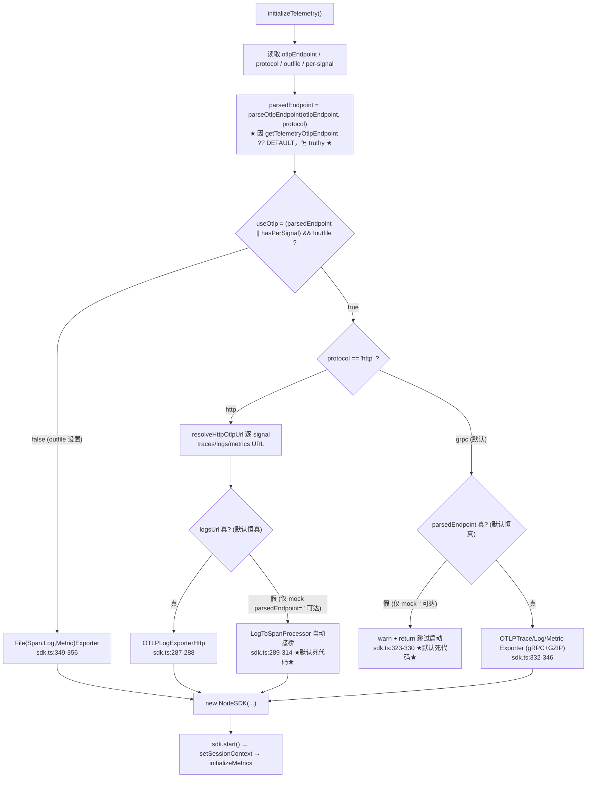
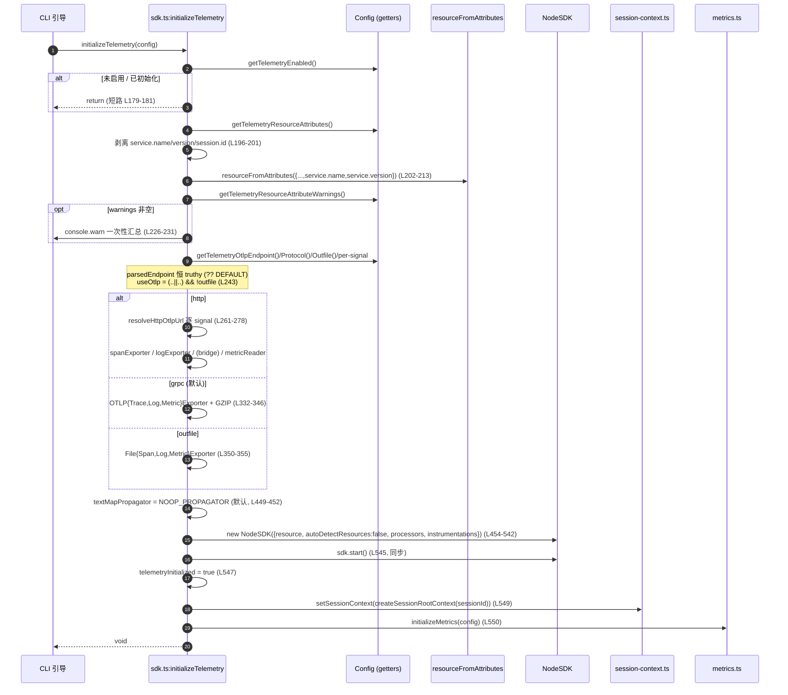

# OTel SDK 初始化与 OTLP 信号路由（深入）

> 子文档；总览见 [README.md](README.md)。本文 **SUPERSEDES** 总览 `telemetry-observability.md` 的 §3.1，进入 function / line 级。
> 代码基准：`QwenLM/qwen-code@main`。核心文件 `packages/core/src/telemetry/sdk.ts`（全文 630 行）。#7276 仍为 open diff：它把本文件描述的同步 heavy implementation 拆到 lazy-loaded `sdk-impl.ts`，本文在对应段落单独标注，不能视为 main 已落地。
> 引用约定：`file:symbol`（+行号），行号对应 `main` 当前快照，仅作定位锚点。

---

## 概述

`sdk.ts` 是整个 telemetry 子系统的「电源开关 + 配电盘」。它只暴露四个函数（`telemetry/index.ts:17-21` re-export）：

| 导出符号 | 位置 | 职责 |
|---|---|---|
| `initializeTelemetry(config)` | `sdk.ts:178` | 幂等地构造并启动 `NodeSDK`，按 signal 路由 exporter，建立 session 根 context，初始化 metrics |
| `shutdownTelemetry()` | `sdk.ts:570` | 幂等、有界（10s fail-open）地关闭 SDK，并复位所有模块级单例 |
| `refreshSessionContext(sessionId)` | `sdk.ts:561` | `/clear`、`/resume` 后重建 session 根 context |
| `isTelemetrySdkInitialized()` | `sdk.ts:124` | 读取 `telemetryInitialized` 标志（敏感属性、log 桥接 traceId 等都依赖它） |

它的设计目标可以概括为四条不变量，本文后续都围绕它们展开：

1. **单进程单例**：`sdk` / `telemetryInitialized` / `telemetryShutdownPromise` 三个模块级变量（`sdk.ts:120-122`）构成状态机，init/shutdown 均幂等。
2. **signal 级路由**：traces / logs / metrics 三个 signal 各自独立选择 `grpc` / `http` / `file` exporter；`outfile` 优先级最高、`http` 支持 per-signal override、`grpc` 只能共用 base endpoint。
3. **关闭绝不挂死**：`shutdownTelemetry` 用 `Promise.race` 给 `sdk.shutdown()` 套 10s 上限，超时即 fail-open（放进程退出），并在 `finally` 中无条件复位状态。
4. **诊断绝不污染 UI**：OTel SDK 自身的 `diag` 日志全部改道到 debug 文件（`createDebugLogger('OTEL')`），绝不写 console（Ink TUI 区）。

> 一个贯穿全文的「坑」先点名：`config.ts:getTelemetryOtlpEndpoint`（`packages/core/src/config/config.ts:3001-3003`）的实现是 `return this.telemetrySettings.otlpEndpoint ?? DEFAULT_OTLP_ENDPOINT;`，而 `DEFAULT_OTLP_ENDPOINT = 'http://localhost:4317'`（`telemetry/index.ts:13`）。这意味着该 getter **永远不返回 `undefined`**。后文「信号路由」「已知限制」两节会精确论证：这一默认值让 §3.5 末尾提到的 `LogToSpanProcessor` 自动接桥、以及 grpc 的「无 endpoint 跳过启动」两条分支，在默认配置下成为 **不可达死代码**。

---

## 涉及 PR

| PR | 状态 | 标题 | 落在本文的哪一部分 |
|---|---|---|---|
| [#3779](https://github.com/QwenLM/qwen-code/pull/3779) | MERGED `2026-05-01` | feat(telemetry): define HTTP OTLP endpoint behavior and signal routing | `resolveHttpOtlpUrl` 信号路径追加、per-signal endpoint、HTTP `LogToSpanProcessor` 自动接桥（及其默认不可达问题） |
| [#3807](https://github.com/QwenLM/qwen-code/pull/3807) | MERGED `2026-05-03` | fix(telemetry): suppress async resource attribute warning on startup | `NodeSDK({ autoDetectResources: false })`（`sdk.ts:459`） |
| [#3813](https://github.com/QwenLM/qwen-code/pull/3813) | MERGED `2026-05-05` | fix(telemetry): add bounded shutdown timeout and fix service.version resource attribute | `SHUTDOWN_TIMEOUT_MS`/`Promise.race`（`sdk.ts:95,601-616`）+ `service.version` 用 `getCliVersion()`（`sdk.ts:211-212`） |
| [#3986](https://github.com/QwenLM/qwen-code/pull/3986) | MERGED `2026-05-09` | feat(telemetry) suppress OpenTelemetry diagnostics from UI | `createTelemetryDiagLogger` + `diag.setLogger(..., WARN)`（`sdk.ts:42-56`） |
| [#4061](https://github.com/QwenLM/qwen-code/pull/4061) | MERGED `2026-05-11` | refactor(telemetry): remove dead useCollector setting and unreachable TelemetryTarget.QWEN | `TelemetryTarget` 仅余 `GCP`/`LOCAL`（`telemetry/index.ts:7-10`）；`parseTelemetryTargetValue` 拒 QWEN |
| [#4066](https://github.com/QwenLM/qwen-code/pull/4066) | MERGED `2026-05-13` | docs(telemetry): align config and docs semantics for target, outfile, and CLI flags | `getTelemetryTarget` 仅信息性、`outfile` 优先级、CLI flag 语义对齐 |
| [#4367](https://github.com/QwenLM/qwen-code/pull/4367) | MERGED | support custom resource attributes + metric cardinality | `service.name/version/session.id` 三重剥离（`sdk.ts:196-213`）+ 一次性告警汇总（`sdk.ts:223-233`） |
| [#4390](https://github.com/QwenLM/qwen-code/pull/4390) | MERGED | client-side HTTP span + opt-in W3C traceparent | `NOOP_PROPAGATOR`（`sdk.ts:110-118`）+ instrumentation 反馈环守卫（`sdk.ts:368-540`） |
| [#4482](https://github.com/QwenLM/qwen-code/pull/4482) | MERGED | improve LogToSpan bridge error info and TUI handling | 桥接的 `diagnosticsSink` 注入（`sdk.ts:309-311`） |
| [#7276](https://github.com/QwenLM/qwen-code/pull/7276) | OPEN | perf(telemetry): lazy-load the SDK and split OTLP exporter chains by protocol | 当前 open diff：`sdk.ts` 变轻量 async facade，heavy NodeSDK/instrumentation/exporter 在 `sdk-impl.ts` 与 protocol-specific exporter modules 中按需动态加载。 |

> 注：`#4390`/`#4482` 不属于「SDK init/路由」核心，但其代码与本文件强耦合（instrumentation、propagator、桥接诊断都在 `initializeTelemetry` 内构造），故一并标注。propagator 与 instrumentation 的完整展开见兄弟子文档「出站 HTTP span 与 traceparent 传播」，本文只覆盖它们在 init 序列中的装配位置。

---

## 初始化序列

`initializeTelemetry(config: Config): void`（`sdk.ts:178-554`）在当前 `main` 是一段 **完全同步** 的函数——它构造好 `NodeSDK` 后调用 `sdk.start()`（同步），不 `await` 任何东西。这点很关键：调用方（CLI 引导期）可以在 Ink 渲染之前同步完成遥测装配，因此此处的 `console.warn`（`sdk.ts:226`）不会与 TUI 交错。

> #7276 open diff 会把这个契约改成 async single-flight facade：关闭 telemetry 时 facade 直接短路且不加载 `@opentelemetry/sdk-node`、exporters、instrumentation；开启时动态 import heavy `sdk-impl.ts`，并按 protocol 只加载 HTTP 或 gRPC exporter chain。daemon runtime 在初始化 daemon metrics 前显式 await，普通 Config/startup 入口使用 fire-and-forget，避免默认 disabled path 把 telemetry heavy cluster 带进 ACP static closure。

### 步骤 0：幂等短路（`sdk.ts:179-181`）

```ts
if (telemetryInitialized || !config.getTelemetryEnabled()) {
  return;
}
```

两条短路：① 已初始化（`telemetryInitialized === true`，`sdk.ts:121`）直接返回，保证「单进程单例」；② `config.getTelemetryEnabled()`（`config.ts:2989-2991`，默认 `false`）为假时整段不执行——遥测默认关闭，零开销。

### 步骤 1：Resource 属性同步注入（`sdk.ts:188-213`）

这是「资源属性同步注入」的落点。先取出用户合并后的属性，再做 **纵深防御式剥离**：

```ts
const userAttrs = config.getTelemetryResourceAttributes() ?? {};   // L188
const userServiceName = userAttrs['service.name'];                  // L189
const {
  'service.name': _ignoredServiceName,
  'service.version': _ignoredServiceVersion,
  'session.id': _ignoredSessionId,
  ...nonReservedUserAttrs
} = userAttrs;                                                       // L196-201
const resource = resourceFromAttributes({
  ...nonReservedUserAttrs,
  [SemanticResourceAttributes.SERVICE_NAME]:
    userServiceName?.trim() || SERVICE_NAME,                         // L209-210
  [SemanticResourceAttributes.SERVICE_VERSION]:
    config.getCliVersion() || 'unknown',                            // L211-212
});
```

要点（function/line 级）：

- **三键剥离**（`sdk.ts:196-201`）：`service.name`、`service.version`、`session.id` 从用户属性中 destructure 剔除。`config.ts:resolveTelemetrySettings`（`telemetry/config.ts:142-158`）经 `stripReservedResourceAttributes` 通常已把 `service.version`/`session.id` 去掉；这里再剥一次是为了防御「绕过 resolver 直接 `new Config()`」的调用方（典型是单测）。`session.id` 尤其不能进 Resource——**Resource 属性会自动附着到每个 metric data point**，会绕过 metric 基数开关（详见兄弟文档「资源属性与基数控制」）。
- **`service.name` 空白回退**（`sdk.ts:209-210`）：`userServiceName?.trim() || SERVICE_NAME`。`|| `（而非 `??`）同时拦截空串 `""` 与纯空白 `" "`/`"\t"`——settings 不 trim、env 的 `%20` 会 decode 成空格，二者都可能投递空白值，某些后端会拒收空 `service.name`。`SERVICE_NAME = 'qwen-code'`（`constants.ts:7`）。
- **`service.version` 运行时权威**（`sdk.ts:211-212`，#3813）：用 `config.getCliVersion()`（`config.ts:3409`）回填，用户源的 `service.version` 一律被忽略（防版本伪造）。`getCliVersion()` 返回 `undefined` 时回退 `'unknown'`（单测 `sdk.test.ts:614` 覆盖）。

### 步骤 2：资源属性告警一次性汇总（`sdk.ts:223-233`，#4367）

```ts
const attrWarnings = config.getTelemetryResourceAttributeWarnings() ?? [];   // L223
if (attrWarnings.length > 0) {
  console.warn(`[qwen-code telemetry] ${attrWarnings.length} resource attribute issue(s):`);
  for (const w of attrWarnings) console.warn(`  - ${w}`);
}
```

这是 `initializeTelemetry` 中 **唯一刻意走 `console.warn` 的地方**。理由（见 `sdk.ts:215-222` 注释）：逐条 `diag.warn` 只进 OTEL debug 文件，运维者看不到「我的属性被静默丢了」；而 telemetry init 早于 Ink 渲染，此处 console 不会撞 TUI。`?? []` 防的是 `vi.mock` 把 Config 方法自动 stub 成 `undefined`。

### 步骤 3：路由输入读取与 `useOtlp` 判定（`sdk.ts:235-244`）

```ts
const otlpEndpoint = config.getTelemetryOtlpEndpoint();              // L235  ← 永不 undefined
const otlpProtocol = config.getTelemetryOtlpProtocol();             // L236  ← 默认 'grpc'
const parsedEndpoint = parseOtlpEndpoint(otlpEndpoint, otlpProtocol); // L237
const telemetryOutfile = config.getTelemetryOutfile();             // L238
const hasPerSignalEndpoint =
  !!config.getTelemetryOtlpTracesEndpoint() ||                      // L240
  !!config.getTelemetryOtlpLogsEndpoint() ||
  !!config.getTelemetryOtlpMetricsEndpoint();
const useOtlp =
  (!!parsedEndpoint || hasPerSignalEndpoint) && !telemetryOutfile;   // L243-244
```

详见下一节「信号路由」。这里只强调：`getTelemetryOtlpProtocol()`（`config.ts:3005-3007`）默认 `'grpc'`；`getTelemetryTarget()`（`config.ts:3021-3023`）在路由里 **完全不参与**——`target` 自 #4061/#4066 起仅为信息性配置（决定 GCP/LOCAL 的文档语义），不再驱动 exporter 选择。

### 步骤 4：各 signal exporter 装配（`sdk.ts:246-356`）

先声明四个可选变量（`sdk.ts:246-257`），它们是 union 类型，能同时容纳 grpc / http / file 三种实现：

```ts
let spanExporter:  OTLPTraceExporter | OTLPTraceExporterHttp | FileSpanExporter | undefined;
let logExporter:   OTLPLogExporter   | OTLPLogExporterHttp   | FileLogExporter  | undefined;
let metricReader:  PeriodicExportingMetricReader | undefined;
let logToSpanProcessor: LogToSpanProcessor | undefined;
```

随后是三选一的装配块（`useOtlp ? (http|grpc) : outfile ? file : 无`），细节在下一节。注意三种 metric 路径都用 `PeriodicExportingMetricReader({ exportIntervalMillis: 10000 })`（`sdk.ts:316/340/352`），即 10s 周期推送。

### 步骤 5：反馈环守卫前缀 + propagator 门（`sdk.ts:368-452`）

- `normalizeOtlpPrefix`（`sdk.ts:368-400`）：把 4 个 OTLP endpoint 配置（base + 3 个 per-signal，`sdk.ts:401-408`）解析成 `{origin, pathname}`，用于后续 instrumentation 的边界安全前缀匹配，杜绝「OTLP 上行请求自身被插桩 → 产生 span → 再次上行」的无限反馈环（#4390）。
- `matchesOtlpPrefix`（`sdk.ts:417-428`）：origin 精确相等 + path 边界字符（`/` `?` `#` 或结尾）匹配。
- `textMapPropagator` 门（`sdk.ts:449-452`）：`getOutboundCorrelationPropagateTraceContext()`（`config.ts:3042-3044`，默认 `false`）为假时取 `NOOP_PROPAGATOR`（`sdk.ts:110-118`，`inject` 空操作），出站 `fetch` 不写 `traceparent`；为真时取 `undefined`，让 NodeSDK 保留默认 W3C composite propagator。

> 这两块的完整语义（反馈环、出站关联）见兄弟子文档，本文止于「它们在 init 序列里的装配顺序」。

### 步骤 6：`NodeSDK` 构造（`sdk.ts:454-542`）

```ts
sdk = new NodeSDK({
  resource,                                                          // L455
  autoDetectResources: false,                                       // L459  (#3807)
  ...(textMapPropagator && { textMapPropagator }),                   // L460
  spanProcessors: spanExporter ? [new BatchSpanProcessor(spanExporter)] : [], // L461
  logRecordProcessors: logExporter
    ? [new BatchLogRecordProcessor(logExporter)]
    : logToSpanProcessor
      ? [logToSpanProcessor]                                         // L462-466
      : [],
  ...(metricReader && { metricReader }),                            // L467
  instrumentations: [ HttpInstrumentation, UndiciInstrumentation ],  // L468-541
});
```

function/line 级要点：

- **`autoDetectResources: false`（`sdk.ts:459`，#3807）**：关掉 host/process/env 异步 resource detector。它们会让 Resource 属性处于 pending，并在 detector 落定前的任意一次 resource 属性读取（如 `HttpInstrumentation` 创建 span 时）触发 OTel `diag.error`。关掉后 Resource 完全由步骤 1 同步注入的 `resource` 决定。
- **`spanProcessors`（`sdk.ts:461`）**：只有 `spanExporter` 存在才挂 `BatchSpanProcessor`，否则空数组（该 signal 静默跳过）。
- **`logRecordProcessors`（`sdk.ts:462-466`）三元嵌套**：优先 `BatchLogRecordProcessor(logExporter)`；否则若有 `logToSpanProcessor` 用桥接器；都没有则空数组。**注意 `logExporter` 与 `logToSpanProcessor` 互斥**——下一节会证明 `logToSpanProcessor` 默认不可达。
- **条件展开 `...(x && {x})`（`sdk.ts:460,467`）**：`textMapPropagator`/`metricReader` 为 `undefined` 时根本不出现在 options 里（而非传 `undefined`），交给 NodeSDK 用各自默认值。

### 步骤 7：`sdk.start()` 与 session 根 context（`sdk.ts:544-553`）

```ts
try {
  sdk.start();                                                       // L545 (同步)
  telemetryInitialized = true;                                       // L547
  const sessionId = config.getSessionId();
  setSessionContext(createSessionRootContext(sessionId), sessionId); // L549
  initializeMetrics(config);                                         // L550
} catch (error) {
  debugLogger.error('Error starting OpenTelemetry SDK:', error);     // L552
}
```

- `telemetryInitialized = true`（`sdk.ts:547`）在 `start()` 成功后才置位——若 `start()` 抛错则保持 `false`，`isTelemetrySdkInitialized()` 据此对外报告未初始化。
- `setSessionContext(createSessionRootContext(sessionId), sessionId)`（`sdk.ts:549`）：`createSessionRootContext`（`tracer.ts:260-270`）用 `deriveTraceId(sessionId) = SHA-256(sessionId)[:32]` 造一个 **合成根 context**（非真实 span），写入 `session-context.ts` 的模块级 `sessionRootContext`/`currentSessionId`（`session-context.ts:12-18`）。这保证同 session 内所有真实 span、log 桥接 span、debug 日志行共享同一 traceId。
- 整段包在 `try/catch`：`start()` 失败只记 debug，不抛——遵循「遥测绝不影响主流程」。

---

## 信号路由

路由的全部决策集中在 `sdk.ts:235-356`。下面按「判定 → 三大分支」拆解，并精确标注哪些分支默认不可达。

### `useOtlp` 判定（`sdk.ts:243-244`）

```
useOtlp = (!!parsedEndpoint || hasPerSignalEndpoint) && !telemetryOutfile
```

- **`!telemetryOutfile` 一票否决**：`outfile` 优先级最高（#4066）。一旦 `getTelemetryOutfile()` 非空，`useOtlp` 必为 `false`，三个 signal 全部走 `File{Span,Log,Metric}Exporter`（`sdk.ts:349-356`）。
- **`!!parsedEndpoint`**：`parseOtlpEndpoint`（`sdk.ts:128-151`）对空/非法输入返回 `undefined`；对 grpc 返回 `url.origin`（剥 path/query/hash，`sdk.ts:140-143`），对 http 返回 `url.href`（`sdk.ts:145-146`）。**但因为 `getTelemetryOtlpEndpoint()` 永不返回 falsy（默认 `http://localhost:4317`），生产中 `parsedEndpoint` 恒为 truthy**，于是 `useOtlp` 在「无 outfile」时恒为 `true`。
- `hasPerSignalEndpoint`（`sdk.ts:239-242`）：任一 per-signal endpoint 非空即真。它的存在意义在于「mock `getTelemetryOtlpEndpoint→''` 后仍能让 `useOtlp` 为真」——这是单测进入 http 分支的方式。

### 分支 A — `protocol === 'http'`（`sdk.ts:260-320`）

每个 signal 独立解析 URL，模式都是 `validateUrl(perSignal ?? (parsedEndpoint ? resolveHttpOtlpUrl(parsedEndpoint, signal) : undefined))`：

```ts
const tracesUrl = validateUrl(
  config.getTelemetryOtlpTracesEndpoint() ??
    (parsedEndpoint ? resolveHttpOtlpUrl(parsedEndpoint, 'traces') : undefined)); // L261-266
const logsUrl = validateUrl(
  config.getTelemetryOtlpLogsEndpoint() ??
    (parsedEndpoint ? resolveHttpOtlpUrl(parsedEndpoint, 'logs') : undefined));   // L267-272
const metricsUrl = validateUrl(/* ...metrics... */);                             // L273-278
```

- **`resolveHttpOtlpUrl(base, signal)`（`sdk.ts:77-90`，#3779）**：核心是 `OTLP_SIGNAL_PATHS`（`sdk.ts:62-66`，`traces→v1/traces` 等）。若 `url.pathname` 去尾斜杠后已以该 signal path 结尾（`sdk.ts:84`），原样返回 `url.href`——这支持 ARMS 那种非标准前缀全路径（如 `/token/api/otlp/traces`）；否则在 pathname 后追加 `/v1/<signal>`（`sdk.ts:88`），保留 query/hash。
- **per-signal override 仅 HTTP 支持**：override 来自 `getTelemetryOtlpTracesEndpoint()` 等（`config.ts:3009-3019`），优先于 base 推导。单测 `sdk.test.ts:301`（traces 用 override、logs/metrics 用 base 追加）证实。
- `validateUrl`（`sdk.ts:157-176`）：只接受 `http:`/`https:` 且 host 非空，否则 `diag.error` 后返回 `undefined`（该 signal 静默跳过）。

exporter 装配（`sdk.ts:284-320`）：

```ts
if (tracesUrl)  spanExporter = new OTLPTraceExporterHttp({ url: tracesUrl });     // L284-286
if (logsUrl)    logExporter  = new OTLPLogExporterHttp({ url: logsUrl });         // L287-288
else if (tracesUrl) {        // ★ 自动接桥分支 ★                                  // L289
  logToSpanProcessor = new LogToSpanProcessor(
    new OTLPTraceExporterHttp({ url: tracesUrl }),
    { includeSensitiveSpanAttributes: config.getTelemetryIncludeSensitiveSpanAttributes(), // L296-297
      ...(config.isInteractive() && {                                            // L309-311
        diagnosticsSink: (m) => debugLogger.warn(m) }) });
}
if (metricsUrl) metricReader = new PeriodicExportingMetricReader({ ... });        // L315-320
```

- **`else if (tracesUrl)` 自动接桥（`sdk.ts:289-314`，#3779）**：语义是「有 traces endpoint 但 **无** logs endpoint → 用 `LogToSpanProcessor` 把 LogRecord 转成 span，经一个 **专属** 的 `OTLPTraceExporterHttp` 发出」。专属 exporter（而非复用 `spanExporter`）是为了让桥接器自管 `forceFlush`/`shutdown` 生命周期。`includeSensitiveSpanAttributes`（`sdk.ts:296-297`）透传给桥接器做二次脱敏（`log-to-span-processor.ts:39-46` 的 `SENSITIVE_ATTRIBUTE_KEYS`）；`diagnosticsSink`（`sdk.ts:309-311`，#4482）仅交互模式注入，把桥接诊断导去 debug 文件、不污染 TUI。
- **接桥默认不可达**：`logsUrl` 为假是进入 `else if` 的前提，但 `logsUrl = ... ?? (parsedEndpoint ? resolveHttpOtlpUrl(...,'logs') : undefined)`，而生产中 `parsedEndpoint` 恒 truthy ⇒ `logsUrl` 恒 truthy ⇒ `if (logsUrl)` 恒命中 ⇒ `else if` 永不进入。详见「已知限制」。

### 分支 B — `protocol === 'grpc'`（`sdk.ts:321-348`，默认）

```ts
if (!parsedEndpoint) {                                               // L323
  diag.warn(/* "Per-signal OTLP endpoints are only supported with HTTP..." */);
  debugLogger.warn(warning);
  return;                                                            // L330  ← 跳过启动
} else {
  spanExporter = new OTLPTraceExporter({ url: parsedEndpoint, compression: GZIP });   // L332-335
  logExporter  = new OTLPLogExporter({ url: parsedEndpoint, compression: GZIP });     // L336-339
  metricReader = new PeriodicExportingMetricReader({
    exporter: new OTLPMetricExporter({ url: parsedEndpoint, compression: GZIP }),
    exportIntervalMillis: 10000 });                                                   // L340-346
}
```

- **不支持 per-signal**：grpc 用 service-based routing，三 signal 共用同一 `parsedEndpoint`（origin），统一 `CompressionAlgorithm.GZIP`。
- **`if (!parsedEndpoint)` 跳过启动（`sdk.ts:323-330`）也默认不可达**：能走到 grpc 分支说明 `useOtlp === true`；若同时 `parsedEndpoint` 为假，则必是「`hasPerSignalEndpoint===true` 但 base 为空」。可在生产中 `parsedEndpoint` 恒 truthy，故此分支只在单测 mock `getTelemetryOtlpEndpoint→''` + 配 per-signal + grpc 时可达（`sdk.test.ts:471`）。
- **默认路径就是这里的 `else`**：默认 `protocol='grpc'` + `parsedEndpoint='http://localhost:4317'` ⇒ 无条件创建 span/log/metric 三个 grpc exporter。这也解释了为什么 logs 在默认下永远有原生 exporter、根本用不到桥接。

### 分支 C — `else if (telemetryOutfile)`（`sdk.ts:349-356`）

```ts
spanExporter = new FileSpanExporter(telemetryOutfile);              // L350
logExporter  = new FileLogExporter(telemetryOutfile);              // L351
metricReader = new PeriodicExportingMetricReader({
  exporter: new FileMetricExporter(telemetryOutfile), exportIntervalMillis: 10000 }); // L352-355
```

三个 File exporter 都继承 `file-exporters.ts:FileExporter`（`fs.createWriteStream(path, {flags:'a'})` 追加写，`file-exporters.ts:22-38`），每条 record 经 `safeJsonStringify(data, 2) + '\n'` 序列化。`FileMetricExporter` 额外声明 `CUMULATIVE` 聚合（`file-exporters.ts:87-89`）。`outfile` 一旦设置即压倒 OTLP（因 `useOtlp` 的 `&& !telemetryOutfile`）。

### 路由决策总图



---

## 关闭序列

`shutdownTelemetry(): Promise<void>`（`sdk.ts:570-629`）的目标是「关得干净、绝不挂死、可重复调用」。

### 幂等与前置守卫（`sdk.ts:571-577`）

```ts
if (telemetryShutdownPromise) return telemetryShutdownPromise;   // L571-573  幂等
if (!telemetryInitialized || !sdk) return;                       // L574-576  未初始化直接返回
endInteractionSpan('cancelled');                                 // L577      收尾未结束 interaction
```

- **幂等靠缓存的 promise**（`sdk.ts:571-573`）：并发/重复调用拿到同一个 `telemetryShutdownPromise`，不会触发两次 `sdk.shutdown()`。
- **未初始化短路**（`sdk.ts:574-576`）：`telemetryInitialized` 为假或 `sdk` 为空直接 `return`（注意此处返回 `undefined`，被签名的 `Promise<void>` 自动包装）。
- **`endInteractionSpan('cancelled')`（`sdk.ts:577`）**：进程退出前把可能仍开着的 interaction span 以 `cancelled` 收尾（来自 `session-tracing.ts`），避免它被 batch processor 在 flush 前漏掉。

### 有界关闭主体（`sdk.ts:580-627`）

主体是一个立即执行的 async IIFE，赋给 `telemetryShutdownPromise`：

```ts
telemetryShutdownPromise = (async () => {
  let timer; let timedOut = false;
  try {
    const sdkShutdown = Promise.resolve(currentSdk.shutdown());    // L586
    sdkShutdown.catch((err) => {                                   // L591-600
      if (timedOut) debugLogger.warn('SDK shutdown rejected after timeout:', ...);
    });
    const timeout = new Promise<'timeout'>((resolve) => {
      timer = setTimeout(() => { timedOut = true; resolve('timeout'); }, SHUTDOWN_TIMEOUT_MS); // L601-605
      timer.unref?.();                                             // L606
    });
    const result = await Promise.race([sdkShutdown, timeout]);     // L608
    clearTimeout(timer);                                           // L609  (正常路径清 timer)
    if (result === 'timeout') { diag.warn(msg); debugLogger.warn(msg); }   // L610-613
    else debugLogger.debug('OpenTelemetry SDK shut down successfully.');   // L614-616
  } catch (error) {
    clearTimeout(timer);                                           // L618  (异常路径也清 timer)
    diag.error('Error shutting down SDK:', error);                 // L619-620
  } finally {
    telemetryInitialized = false;                                  // L622
    sdk = undefined;                                               // L623
    telemetryShutdownPromise = undefined;                          // L624
    setSessionContext(undefined);                                  // L625
  }
})();
```

function/line 级要点：

- **`Promise.resolve(currentSdk.shutdown())`（`sdk.ts:586`）**：包一层 `Promise.resolve` 是为了兼容「单测里 `shutdown()` 被 auto-mock 成返回 `undefined`」的情形——直接 `await undefined` 也行，但 `.catch()`（`sdk.ts:591`）需要一个真正的 promise。这里用 `currentSdk`（`sdk.ts:578` 的局部快照）而非模块级 `sdk`，因为 `finally` 会把 `sdk` 置空。
- **10s fail-open（`SHUTDOWN_TIMEOUT_MS = 10_000`，`sdk.ts:95`）**：`Promise.race([sdkShutdown, timeout])`（`sdk.ts:608`）让 `sdk.shutdown()` 与 10s 定时器赛跑。超时则 `result === 'timeout'`，只告警不阻塞——进程照常退出（fail-open）。注释（`sdk.ts:92-94`）指出：交互模式下 `runExitCleanup()` 另施加更紧的 2s/5s 超时（#3813），故该 10s 在交互模式下实际不可达，主要兜底非交互模式直接调用。
- **`timer.unref?.()`（`sdk.ts:606`）**：定时器 unref，避免它自己把 Node event loop 吊住、反而阻止进程退出。`?.` 兼容某些 mock 计时器无 `unref`。
- **超时后 reject 的兜底（`sdk.ts:591-600`）**：若 `sdk.shutdown()` 在 timeout 赢得 race 之后才 reject，这个 reject 已无人 `await`，会变成 unhandled rejection。预挂的 `.catch` 吸收它：仅当 `timedOut` 才 `debugLogger.warn`；未超时则交由下方 `try/catch`（经 `await Promise.race` 抛出）以 `diag.error` 完整记录（`sdk.ts:617-620`）。
- **`clearTimeout` 双路径（`sdk.ts:609` 与 `618`）**：正常完成与异常都清 timer，避免泄漏。
- **`finally` 无条件状态复位（`sdk.ts:621-626`）**：无论成功/超时/异常，都把 `telemetryInitialized=false`、`sdk=undefined`、`telemetryShutdownPromise=undefined`、`setSessionContext(undefined)` 全部复位。这意味着关闭后可以再次 `initializeTelemetry`（如测试套件多次 init/shutdown）。`setSessionContext(undefined)`（`session-context.ts:12-18`）清空 session 根 context 与 `currentSessionId`，避免下一轮误用旧 traceId。

> 一个微妙点：`telemetryShutdownPromise` 在 `finally` 里被清回 `undefined`（`sdk.ts:624`），所以「幂等」只在 **本次关闭尚未完成期间** 有效；关闭完成后再调用会因 `!telemetryInitialized`（已 false）在 `sdk.ts:574` 短路返回。两道闸合起来覆盖了「关闭中重复调用」与「关闭后重复调用」两种情形。

---

## 诊断日志路由（DiagLogger → debug，不污染 console）

OTel SDK 内部用 `@opentelemetry/api` 的全局 `diag` 输出诊断。默认 `diag` 写 console，会在 Ink TUI 渲染区炸出原始 stderr。#3986 的方案（`sdk.ts:42-56`）：

```ts
function createTelemetryDiagLogger(): DiagLogger {                  // L42
  const debugLogger = createDebugLogger('OTEL');
  return {
    error:   (m, ...a) => debugLogger.error(m, ...a),
    warn:    (m, ...a) => debugLogger.warn(m, ...a),
    info:    (m, ...a) => debugLogger.info(m, ...a),
    debug:   (m, ...a) => debugLogger.debug(m, ...a),
    verbose: (m, ...a) => debugLogger.debug(m, ...a),                // verbose→debug
  };
}
diag.setLogger(createTelemetryDiagLogger(), DiagLogLevel.WARN);     // L56  模块加载即生效
```

要点：

- **模块加载即注册（`sdk.ts:56`）**：`diag.setLogger(...)` 是模块顶层语句，`import sdk.ts` 时立刻执行——早于 `initializeTelemetry`，所以连 init 自己产生的 `diag.warn`/`diag.error`（如 `parseOtlpEndpoint` 的非法 URL、grpc 跳过启动告警）也被导去 debug 文件。
- **改道目标是文件 logger**：`createDebugLogger('OTEL')`（`utils/debugLogger.ts`）写 debug 日志文件，**绝不写 console**。
- **级别钳到 WARN（`sdk.ts:56`）**：默认只放 `warn`/`error`；排障时可改 `DiagLogLevel.DEBUG`（注释 `sdk.ts:53` 提示）。
- **`verbose` 折叠到 `debug`（`sdk.ts:49`）**：debugLogger 无 `verbose` 级，统一降到 `debug`。
- **唯一例外是 console**：前述步骤 2 的资源属性告警汇总（`sdk.ts:226-231`）故意走 `console.warn`——因为它必须让运维者看见，且发生在 Ink 渲染前。这与「诊断不污染 UI」不矛盾：那是 init 期一次性、运维必读的信号，不是 SDK 运行期的噪声。

此外，`getTelemetryTarget`（`config.ts:3021-3023`）与 `parseTelemetryTargetValue`（`telemetry/config.ts:30-41`）也与「不引入死路径」相关：`parseTelemetryTargetValue` 只认 `'local'`/`'gcp'`（含枚举形态），其它一律返回 `undefined`（`telemetry/config.ts:40`），上游 `resolveTelemetrySettings`（`telemetry/config.ts:74-80`）据此抛 `FatalConfigError`。#4061 删掉了曾经的 `TelemetryTarget.QWEN` 与 `useCollector`——`TelemetryTarget` 现仅 `GCP`/`LOCAL`（`telemetry/index.ts:7-10`），源码中已无 `useCollector`/`QWEN` 引用。

---

## 时序图

### 图 ① 初始化：config → resource → 路由 → NodeSDK → start



### 图 ② 关闭：Promise.race 超时 fail-open

```mermaid
sequenceDiagram
    autonumber
    participant Caller as 退出清理
    participant SDK as sdk.ts:shutdownTelemetry
    participant Node as currentSdk.shutdown()
    participant Timer as setTimeout(10s)
    participant SCtx as session-context.ts

    Caller->>SDK: shutdownTelemetry()
    alt telemetryShutdownPromise 已存在
        SDK-->>Caller: 复用同一 promise (幂等 L571)
    end
    alt 未初始化 / sdk 为空
        SDK-->>Caller: return (L574-576)
    end
    SDK->>SDK: endInteractionSpan('cancelled') (L577)
    SDK->>Node: Promise.resolve(currentSdk.shutdown()) (L586)
    SDK->>Timer: setTimeout(()=>resolve('timeout'),10_000).unref() (L601-606)
    SDK->>SDK: await Promise.race([sdkShutdown, timeout]) (L608)
    alt SDK 先完成
        Node-->>SDK: resolve
        SDK->>SDK: clearTimeout + debug "shut down successfully" (L609,615)
    else 10s 超时先到 (fail-open)
        Timer-->>SDK: 'timeout'
        SDK->>SDK: clearTimeout + warn "timed out" (L609-613)
        Note over Node: 之后若 reject → 预挂 .catch 吸收 (L591-600)
    end
    SDK->>SDK: finally: telemetryInitialized=false; sdk=undefined;<br/>telemetryShutdownPromise=undefined (L621-624)
    SDK->>SCtx: setSessionContext(undefined) (L625)
    SDK-->>Caller: void
```

---

## 边界与错误处理

| 场景 | 代码位置 | 行为 |
|---|---|---|
| 遥测未启用 / 已初始化 | `sdk.ts:179-181` | 直接 `return`，零开销 |
| `getTelemetryOtlpEndpoint` 非法 URL | `parseOtlpEndpoint` `sdk.ts:147-150` | `diag.error` + 返回 `undefined`（不抛） |
| per-signal endpoint 非 http(s)/缺 host | `validateUrl` `sdk.ts:161-173` | `diag.error` + 返回 `undefined`，该 signal 静默跳过 |
| grpc 无 base endpoint（仅 per-signal） | `sdk.ts:323-330` | 双告警（`diag.warn`+`debugLogger.warn`）+ `return` 跳过启动（默认不可达） |
| 某 signal 无 exporter | `sdk.ts:357` 注释 / `461-466` | 对应 processor 为空数组，静默跳过 |
| `sdk.start()` 抛错 | `sdk.ts:551-553` | `debugLogger.error`，`telemetryInitialized` 保持 `false` |
| OTLP exporter 反馈环 | instrumentation hooks `sdk.ts:474-540` | `matchesOtlpPrefix` 命中即 `ignore`；URL 不可解析则 fail-open 但告警（`sdk.ts:395-398`） |
| `sdk.shutdown()` 挂死 | `sdk.ts:601-613` | 10s 超时 fail-open，仅告警 |
| `sdk.shutdown()` 超时后才 reject | `sdk.ts:591-600` | 预挂 `.catch` 吸收 unhandled rejection |
| `sdk.shutdown()` 同步/异步抛错 | `sdk.ts:617-620` | `clearTimeout` + `diag.error`/`debugLogger.error` |
| 关闭后状态 | `sdk.ts:621-626` finally | 全单例复位 + 清 session context，可再次 init |
| `refreshSessionContext` 未初始化 | `sdk.ts:561-562` | 直接 `return`（no-op） |
| `refreshSessionContext` 抛错 | `sdk.ts:563-567` | `try/catch` + `debugLogger.warn`，不抛 |
| 非法 telemetry target | `telemetry/config.ts:74-80` | 在配置解析期抛 `FatalConfigError`（早于 init） |

贯穿原则：**遥测路径上的任何错误都被降级为日志，绝不向主流程抛出**（除配置解析期的 `FatalConfigError`，那是用户显式配错、应当 fail-fast）。

---

## 关键设计决策与权衡

1. **`initializeTelemetry` 全同步**：构造 + `sdk.start()` 都同步，调用方可在 Ink 渲染前完成装配，使资源属性告警的 `console.warn` 不撞 TUI。代价是无法 `await` 远端 exporter 握手，但 OTLP exporter 本就是 fire-and-forget batch，无需等待。

2. **`autoDetectResources: false`（#3807）**：牺牲自动 host/process detector 带来的环境属性，换取「Resource 同步确定、无 pending、无 detector 期 `diag.error`」。需要这些属性的运维者可经 `OTEL_RESOURCE_ATTRIBUTES` 手动补。

3. **`service.version`/`session.id` 三重剥离 + 运行时回填（#4367）**：`service.version` 由 `getCliVersion()` 权威回填（防伪造），`session.id` 严禁进 Resource（防 metric 基数 fan-out）。剥离做两层（resolver + sdk destructure）是纵深防御，覆盖绕过 resolver 的调用方。

4. **10s `Promise.race` fail-open（#3813）**：把「关得干净」与「绝不挂死」解耦——优先等 `sdk.shutdown()` flush 完，但绝不超过 10s。`timer.unref()` 保证定时器自身不阻止退出；预挂 `.catch` 处理超时后迟到的 reject。交互模式另有更紧的 2s/5s，使 10s 成为非交互兜底。

5. **诊断改道 + 唯一 console 例外（#3986）**：SDK 运行期诊断全进 debug 文件（不污染 TUI）；唯独资源属性告警这种「init 期一次性、运维必读」的信号走 console。区分点是「时机（渲染前）+ 必读性」。

6. **桥接器用专属 trace exporter**：`LogToSpanProcessor` 不复用 `spanExporter`，而是 `new OTLPTraceExporterHttp({url: tracesUrl})`（`sdk.ts:293-294`），让桥接自管 flush/shutdown 生命周期，避免与主 span 管道的生命周期纠缠。

7. **路由与 `target` 解耦（#4061/#4066）**：`getTelemetryTarget` 不再驱动 exporter 选择，仅信息性；exporter 完全由 `otlpEndpoint`/`protocol`/`outfile`/per-signal 决定。删除 `useCollector`/`QWEN` 死配置，收敛配置面。

---

## 已知限制 / 后续

### 限制 1（核心）：`getTelemetryOtlpEndpoint() ?? DEFAULT_OTLP_ENDPOINT` 让两条分支默认不可达（#3779）

**根因**（`config.ts:3001-3003`）：

```ts
getTelemetryOtlpEndpoint(): string | undefined {
  return this.telemetrySettings.otlpEndpoint ?? DEFAULT_OTLP_ENDPOINT;  // 'http://localhost:4317'
}
```

尽管 `resolveTelemetrySettings`（`telemetry/config.ts:82-86`）会在「无任何来源」时把 `otlpEndpoint` 留为 `undefined`，getter 用 `?? DEFAULT_OTLP_ENDPOINT` 把它兜成恒非空。于是在 `initializeTelemetry` 内：

- `parsedEndpoint = parseOtlpEndpoint(otlpEndpoint, protocol)`（`sdk.ts:237`）对 `'http://localhost:4317'` 必返回 truthy（grpc→`origin`、http→`href`）。
- **死代码 A —— grpc 跳过启动**（`sdk.ts:323-330`）：进入条件 `useOtlp===true && !parsedEndpoint`。`parsedEndpoint` 恒 truthy ⇒ 不可达。
- **死代码 B —— HTTP 自动接桥**（`sdk.ts:289-314`）：进入条件 `!logsUrl && tracesUrl`。`logsUrl = perSignalLogs ?? (parsedEndpoint ? resolveHttpOtlpUrl(parsedEndpoint,'logs') : undefined)`（`sdk.ts:267-272`）。`parsedEndpoint` 恒 truthy ⇒ `logsUrl` 恒 truthy ⇒ `if (logsUrl)`（`sdk.ts:287`）恒命中 ⇒ `else if` 不可达。

**桥接的本意**（#3779）是服务 ARMS 这类「支持 traces over OTLP、但不支持 logs」的后端：检测到「有 traces endpoint 但无 logs endpoint」时，自动把 LogRecord 转 span 经 traces 通道发出。可是 base endpoint 的默认值让「无 logs endpoint」这个前提永远不成立——任何 base endpoint 都会被 `resolveHttpOtlpUrl(...,'logs')` 推导出一个 logs URL。叠加默认 `protocol='grpc'`（grpc 分支 `sdk.ts:336-339` 又无条件建原生 logExporter），结果是：**默认配置下 logs 永远有原生 exporter，桥接永无触发机会**。

**单测如何「绕过」**：要让桥接/跳过分支可达，必须令 `parsedEndpoint` 为假。生产 getter 做不到，于是测试 spy 掉 getter 返回空串：

```ts
vi.spyOn(mockConfig, 'getTelemetryOtlpEndpoint').mockReturnValue('');   // sdk.test.ts:327,356,375
```

空串经 `parseOtlpEndpoint`（`sdk.ts:132-134` 的 `if (!otlpEndpointSetting) return undefined`）变 `undefined`，再配一个 per-signal traces endpoint（使 `hasPerSignalEndpoint` 撑起 `useOtlp`），桥接才被触发并断言（`sdk.test.ts:325-371`）。grpc 跳过分支同理（`sdk.test.ts:471`，mock `''` + per-signal + grpc）。**也就是说，这两条分支的全部测试覆盖都建立在「mock 一个生产中不可能出现的空串」之上**——它们验证了分支逻辑本身正确，却无法验证「默认配置能走到这里」，因为默认配置根本走不到。

**后续建议**：① 让默认 endpoint 真正可为 `undefined`（把 `?? DEFAULT_OTLP_ENDPOINT` 移到「确实需要本地 collector 默认」的更窄判定里，例如仅当 `target===LOCAL && 无任何显式 endpoint` 时才注入默认），使「无 logs endpoint」可真实出现；或 ② 把「是否接桥」的判定上移到协议无关层、并以「用户是否显式配置了 logs 通道」而非「推导 URL 是否非空」为依据。

### 其余限制（指针）

- **限制 2**：桥接的 `SENSITIVE_ATTRIBUTE_KEYS` 二次脱敏（`log-to-span-processor.ts:39-46`）只在桥接路径生效；而桥接默认不可达，故直连 OTLP logs 时 `response_text` 等仍可能原样上行（详见总览 §7.2 与「敏感属性」子文档）。
- **限制 3**：`shouldForceSampled`（`tracer.ts:245-253`）仅凭 `OTEL_TRACES_SAMPLER` 环境变量启发式推断采样器；以编程方式经 NodeSDK 构造器配置的采样器无法被检测到，合成 session 根的 SAMPLED 标志可能与实际采样器不匹配。
- **限制 4（daemon 分叉，历史语境）**：早期 `daemon_mode_b_main` 的 `sdk.ts` 基于较早 main，尚未并入 #4390 的 `UndiciInstrumentation`/`NOOP_PROPAGATOR` 与本文描述的反馈环守卫；#4490 合入后以当前 `main` 为准（详见「daemon 遥测」子文档）。

---

## 测试覆盖

测试集中在 `packages/core/src/telemetry/sdk.test.ts`（1305 行）。按本文章节归类：

| 主题 | 用例（`sdk.test.ts`） | 验证点 |
|---|---|---|
| `resolveHttpOtlpUrl` | L70-128（6 例） | 追加 signal path、尾斜杠、保留显式全路径、自定义路径、HTTPS、保留 query |
| grpc 默认路由 | L159「use gRPC exporters」、L274「parse gRPC endpoint」 | 默认 grpc 三 exporter + origin 解析 |
| http 路由 | L250「HTTP exporters with signal paths」、L284「append signal paths」 | 三 signal 各自 `/v1/<signal>` |
| per-signal override | L301「overrides when provided」、L325「without base endpoint」 | override 优先、base 缺失时 mock `''` |
| **桥接（死代码）** | L325-371（mock `getTelemetryOtlpEndpoint→''`） | 仅在 mock 空串 + per-signal 下触发；`includeSensitiveSpanAttributes` 透传 |
| 桥接诊断 sink（#4482） | L373「interactive→OTEL log」、L418「non-interactive→stderr」 | 交互注入 `diagnosticsSink`、非交互保留 stderr |
| **grpc 跳过启动（死代码）** | L471「warn and skip for gRPC per-signal without base」 | mock `''` + per-signal + grpc → 告警 + 不 start |
| outfile 优先 | L492「not use OTLP when outfile set」 | File exporter，OTLP 全不建 |
| 诊断不污染 console（#3986） | L180「route diagnostics to debug log」 | `diag` 改道、console 无输出 |
| Resource 属性（#4367） | L625-744（session.id 不上 Resource、service.name/version 来源、空白回退、告警汇总、session.id 剥离） | 步骤 1/2 全覆盖 |
| service.version（#3813） | L540「app version not Node」、L614「fallback to unknown」 | `getCliVersion()` 回填 |
| propagator 门（#4390） | L745-788（默认 NOOP、opt-in 用默认） | `textMapPropagator` 选择 |
| instrumentation 反馈环（#4390） | L789-1242（端口/host/path 边界、quote 归一、默认端口、proto 缺失 fail-open、`host:port:port` 剥离等） | `normalizeOtlpPrefix`/`matchesOtlpPrefix`/hooks |
| 关闭有界（#3813） | L532「mark uninitialized」、L551「complete within timeout when hangs」、L578「normal before timeout」、L593「log error on reject」 | 10s race、状态复位、reject 处理 |
| `refreshSessionContext` | L1244-1305（更新/未初始化 no-op/抛错不崩） | session 切换重建 context |

**测试盲区**：限制 1 决定了「桥接 / grpc 跳过」两条分支 **无法在不 mock getter 的前提下被覆盖**——现有用例靠 `mockReturnValue('')` 制造一个生产中不存在的输入。这是「测试通过但分支默认死」的典型背离，应在修复限制 1 时一并补「默认配置确实不接桥 / 接桥确实可达」的对照用例。

---

## 各 PR 代码贡献

### #3779 — OTLP routing + shutdown
- `sdk.ts:resolveHttpOtlpUrl` — 新增 HTTP signal 路径追加逻辑（`OTLP_SIGNAL_PATHS` 常量 + 尾斜杠/全路径检测）
- `sdk.ts:initializeTelemetry` — HTTP 分支增加 per-signal endpoint override、`LogToSpanProcessor` 自动接桥（含 `diagnosticsSink` 注入）
- `telemetry/config.ts:resolveTelemetrySettings` — 新增 per-signal endpoint 与标准 `OTEL_EXPORTER_OTLP_*` 环境变量解析
- `docs/developers/development/telemetry.md` — 新增 per-signal endpoint 配置表项与 HTTP 路由说明

### #3807 — autoDetectResources:false
- `sdk.ts:initializeTelemetry` — `NodeSDK` 构造新增 `autoDetectResources: false`，关闭 host/process 异步 detector
- `sdk.test.ts` — 三处断言 `NodeSDK` 调用参数包含 `autoDetectResources: false`

### #3813 — bounded shutdown timeout + service.version
- `sdk.ts:SHUTDOWN_TIMEOUT_MS` — 新增 10s 常量；`shutdownTelemetry` 改为 `Promise.race` 超时 fail-open + 预挂 `.catch` 吸收迟到 reject + `timer.unref()`
- `sdk.ts:initializeTelemetry` — `service.version` 从 `process.version` 改为 `config.getCliVersion() || 'unknown'`
- `sdk.test.ts` — 新增 shutdown 超时/正常完成/reject 三组测试 + `service.version` 回填与 undefined 回退测试

### #3986 — suppress diag from UI
- `sdk.ts:createTelemetryDiagLogger` — 新增函数，将 OTel `DiagLogger` 五个级别全部改道到 `createDebugLogger('OTEL')`
- `sdk.ts` 模块顶层 — `diag.setLogger(createTelemetryDiagLogger(), DiagLogLevel.WARN)` 替换原 `DiagConsoleLogger`
- `sdk.test.ts` — 新增诊断路由测试（验证 `console.error`/`console.warn` 无输出、`fs.appendFile` 写入 debug 文件）

### #4061 — remove dead useCollector/QWEN
- `telemetry/index.ts:TelemetryTarget` — 删除 `QWEN` 枚举值，仅余 `GCP`/`LOCAL`
- `config.ts:TelemetrySettings` — 删除 `useCollector` 字段；`Config` 删除 `getTelemetryUseCollector()` 方法
- `telemetry/config.ts:resolveTelemetrySettings` — 删除 `useCollector` 解析；`docs/` 与 `settings.md` 同步清理
