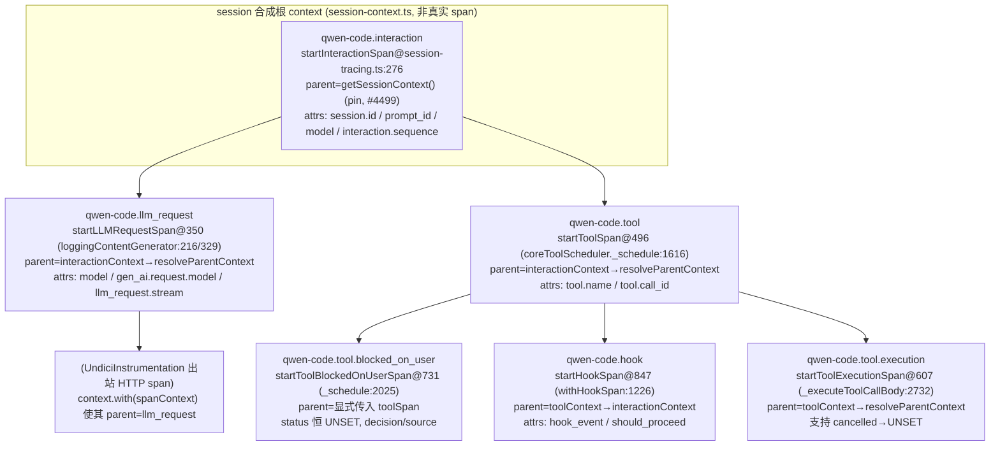
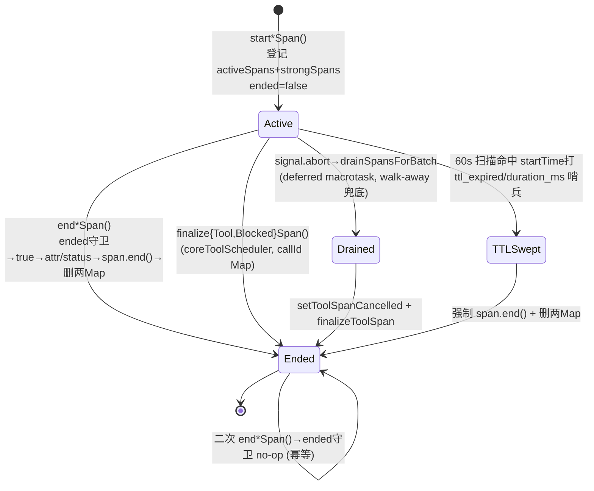
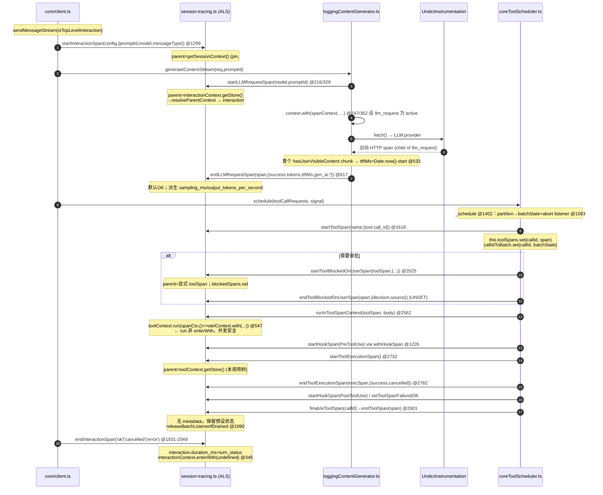

# 层级 span 树与统一创建（深入）

> telemetry 可观测性技术方案子文档；总览见 [`README.md`](README.md)。
> 本文 **取代** 总览 §3.2，下沉到 function/line 级。所有 `file:symbol`(+line) 锚点除特别说明外均以 **`main`** 分支为准（读取方式：`git -C <qwen-code 仓库根> show main:<path>`）。代码/路径用英文，正文用中文。
> 关键文件：`packages/core/src/telemetry/session-tracing.ts`（976 行）、`telemetry/tracer.ts`（271 行）、`telemetry/constants.ts`、`telemetry/session-context.ts`、`core/coreToolScheduler.ts`、`core/client.ts`、`core/loggingContentGenerator/loggingContentGenerator.ts`。

---

## 概述

qwen-code 的层级 span 树解决一个核心问题：把「一次用户回合（turn）」从一堆平铺的 OTel LogRecord，升级成一棵带 parent/child 因果关系的 trace 树，从而在后端（Jaeger / ARMS）还原「用户一句话 → 几次 LLM 请求 → 每次请求下挂哪些 tool → tool 内部的审批等待 / hook / 实际执行」的完整调用链。

这棵树的形态是：

```
session(合成根 context，非真实 span)
└─ qwen-code.interaction            ← 一次回合
   ├─ qwen-code.llm_request         ← 一次模型请求
   │   └─ (UndiciInstrumentation 出站 HTTP span)
   └─ qwen-code.tool                ← 一次工具调用（validate→approval→execute 全程）
       ├─ qwen-code.tool.blocked_on_user   ← 等待用户审批的时间窗
       ├─ qwen-code.hook                    ← Pre/PostToolUse / PostToolUseFailure
       └─ qwen-code.tool.execution          ← 工具实际执行子 span
```

实现上有三个支柱：

1. **集中式 helper**：所有 `start*Span` / `end*Span` 集中在 `session-tracing.ts`，每类 span 一对，调用方（`client.ts` / `loggingContentGenerator.ts` / `coreToolScheduler.ts`）只调 helper，不直接碰 OTel tracer。span 名常量全在 `constants.ts:SPAN_*`（L63–70）。
2. **统一 parent 解析**：`resolveParentContext`（`session-tracing.ts:135`）+ 它在 `tracer.ts` 的镜像 `getParentContext`（L81）。两者用 `// SYNC:` 注释互相约束，保证 ALS 驱动的 span 与 `withSpan` 驱动的 span 落在同一棵树上。这是 #4126 修复「trace 树扁平化」的关键。
3. **生命周期硬约束**：`ended` 幂等守卫 + 属性更新与 `span.end()` 分两个 try + callId-keyed Map + 60s 扫描 / 30min TTL 安全网，保证「遥测异常绝不阻止 span 结束、绝不泄漏、绝不向调用方抛错」。

本文逐层拆解这三个支柱，并给出一次 prompt 的完整 span 创建/结束时序。

---

## 涉及 PR

| PR | 状态 | 子主题 | 对本文的关键贡献 |
|---|---|---|---|
| [#4071](https://github.com/QwenLM/qwen-code/pull/4071) | MERGED | hierarchical session spans（初版） | 引入 `session-tracing.ts` 与首批 `start*/end*Span`，但**并发非安全、部分 API 未接线**（见「已知限制」） |
| [#4097](https://github.com/QwenLM/qwen-code/pull/4097) | MERGED | interaction span + 敏感属性 | 新增 `qwen-code.interaction` span 与 detailed sensitive attributes 写入点 |
| [#4126](https://github.com/QwenLM/qwen-code/pull/4126) | MERGED | **统一创建路径** | 把运行期散落的 `withSpan`/`startSpanWithContext` 全部替换为 typed helper，引入 `toolContext` ALS + `runInToolSpanContext`，修复 trace 树扁平 |
| [#4302](https://github.com/QwenLM/qwen-code/pull/4302) | MERGED | Phase 1.5 打磨 | fallback 顺序、abort-as-result、`cancelled` 保持 UNSET、stream idle 超时与 log/span 一致性 |
| [#4499](https://github.com/QwenLM/qwen-code/pull/4499) | MERGED | interaction 归属 | interaction span 直接 pin 到 session 根 context（不再被 `resolveParentContext` 改挂到 active span） |
| [#4321](https://github.com/QwenLM/qwen-code/pull/4321) | MERGED | Phase 2 | `tool.blocked_on_user` + `hook` span、TTL 哨兵属性、`truncateSpanError`、batch listener drain/release |
| [#4661](https://github.com/QwenLM/qwen-code/pull/4661) | MERGED | per-prompt traceId | interaction span 改为 trace root（`ROOT_CONTEXT`）；新增 `SessionIdSpanProcessor`；`resolveParentContext`/`getParentContext` 移除 session 根回落 |
| [#4212](https://github.com/QwenLM/qwen-code/issues/4212) | （issue） | deferred-status 一致性 | stream span idle 超时后不得再发 success/api_response，避免自相矛盾记录 |
| [#4058](https://github.com/QwenLM/qwen-code/pull/4058) | MERGED | trace 关联跟进 | parent-resolution follow-up |
| [#4693](https://github.com/QwenLM/qwen-code/pull/4693) | MERGED | response metadata & error enrichment | `endLLMRequestSpan` 新增 6 属性：`response_id`/`finish_reason`/`thoughts_token_count`/`subagent_name`/`error_type`/`error_status_code`（含 GenAI semconv 双发） |

> Phase 4a（TTFT + GenAI 双发，#4417）与 retry 字段（Phase 4b，#4432，未合入）也落在 `endLLMRequestSpan`，但属于「llm_request 计时分解」专题，本文只在「状态语义」与时序图中带过，详见同目录其它子文档。

---

## span 层级

### 各 span 一览（谁创建、parent 来源、属性、结束语义）

| span（常量） | start helper（`session-tracing.ts`） | 调用点（file:symbol+line） | parent 来源 | 关键属性 | 结束语义 |
|---|---|---|---|---|---|
| `qwen-code.interaction`（`SPAN_INTERACTION`） | `startInteractionSpan` L276 | `client.ts:sendMessageStream` L1299 | **直接 pin 到 session 根**（`getSessionContext()`，L296），不走 `resolveParentContext` | `session.id` / `qwen-code.prompt_id` / `message_type` / `model` / `approval_mode` / `interaction.sequence` | `endInteractionSpan` L316：写 `interaction.duration_ms`+`qwen-code.turn_status`，error→ERROR 否则 OK |
| `qwen-code.llm_request`（`SPAN_LLM_REQUEST`） | `startLLMRequestSpan` L350 | `loggingContentGenerator.ts` L216（非流式）/ L329（流式） | `interactionContext.getStore()` → `resolveParentContext` | `qwen-code.model` / `prompt_id` / `llm_request.context`（interaction\|standalone）/ `gen_ai.request.model` / `llm_request.stream` | `endLLMRequestSpan` L390：默认 OK，写 token/TTFT/`gen_ai.*`/派生 `sampling_ms`；#4693 新增 `response_id`(`gen_ai.response.id`) / `finish_reason`(`gen_ai.response.finish_reasons`[]) / `thoughts_token_count`(`gen_ai.usage.reasoning_tokens`) / `subagent_name` / `error_type`(`error.type`) / `error_status_code` |
| `qwen-code.tool`（`SPAN_TOOL`） | `startToolSpan` L496 | `coreToolScheduler.ts:_schedule` L1616；兜底 `executeSingleToolCall` L2554 | `interactionContext.getStore()` → `resolveParentContext` | `tool.name` / `tool.call_id`（+`call_id`/`tool_name` 兼容别名）/ 终态 `success` / `qwen-code.tool.failure_kind` | `endToolSpan` L556：**无 metadata 时不设 status**（失败路径必须预设） |
| `qwen-code.tool.execution`（`SPAN_TOOL_EXECUTION`） | `startToolExecutionSpan` L607 | `coreToolScheduler.ts:_executeToolCallBody` L2732 | `toolContext.getStore()` → `resolveParentContext` | `duration_ms` / `success` / `error` | `endToolExecutionSpan` L642：支持 `cancelled` 保持 UNSET |
| `qwen-code.tool.blocked_on_user`（`SPAN_TOOL_BLOCKED_ON_USER`） | `startToolBlockedOnUserSpan(toolSpan)` L731 | `coreToolScheduler.ts:_schedule` L2025 | **显式传入 toolSpan**（启动早于 `toolContext`） | `tool.name` / `tool.call_id` / 终态 `decision` / `source` | `endToolBlockedOnUserSpan` L784：status **恒 UNSET**，靠 `decision`/`source` 表达 |
| `qwen-code.hook`（`SPAN_HOOK`） | `startHookSpan` L847 | `coreToolScheduler.ts:withHookSpan` L1226（6 个 fire site） | `toolContext` → `interactionContext` → `resolveParentContext` | `hook_event` / `tool.name` / `tool.use_id` / `should_proceed` / `should_stop` / `block_type` | `endHookSpan` L896：阻断决策（denied/ask/stop）算正常 UNSET，仅 hook 抛错→ERROR |

每个 helper 起手都有 `if (!isTelemetrySdkInitialized()) return NOOP_SPAN;`（或 `return;`）短路——SDK 未初始化时 helper 退化成 no-op，返回一个全 0 traceId 的 `NOOP_SPAN`（`session-tracing.ts:146`），调用方无需做空判断。

### parent 链：`resolveParentContext` 的四级优先级

`session-tracing.ts:resolveParentContext`（L135）是除 interaction 外所有 span 的 parent 解析入口：

```ts
function resolveParentContext(parent: SpanContext | undefined): Context {
  if (parent) {                                   // ① 显式 ALS parent
    return trace.setSpan(otelContext.active(), parent.span);
  }
  const active = otelContext.active();
  if (trace.getSpan(active)) {                    // ② 当前 active OTel span
    return active;
  }
  return getSessionContext() ?? active;           // ③ session 合成根 → ④ active 兜底
}
```

四级优先级的动机（注释 L113–134）：

1. **显式 parent**：来自 `interactionContext` / `toolContext` 的 ALS store，把 span 挂到其逻辑 owner（llm_request/tool 挂 interaction，tool.execution/hook 挂 tool）。
2. **当前 active OTel span**：处理「ALS parent 已退出但仍嵌套在别的 span 内」——典型是 tool-in-tool、或 subagent 内的 side-query LLM。没有这一级，新 span 会直接 re-parent 到 session 合成根，trace 树**扁平化**（正是 #4212 要修的 bug）。
3. **session 合成根**（`getSessionContext()`）：让 side-query（auto-title、recap 等）即使跑在任何 interaction 之外，仍与 session 关联（共享同一确定性 traceId）。
4. **active context 兜底**：no-op fallback。

> **interaction 是例外**：`startInteractionSpan` L296 **不调** `resolveParentContext`，而是 `const sessionCtx = getSessionContext() ?? otelContext.active();` 直接 pin 到 session 根。原因（注释 L294 + #4499/#4486）：interaction 是「回合边界」，若走 `resolveParentContext` 会被上一级残留的 active span 抢去当 parent，导致两个回合的 interaction 嵌套。pin 到 session 根保证每个回合都是 session 下的平级直接子节点。

### `tracer.ts:getParentContext` 镜像 与 `// SYNC:` 约束

`tracer.ts:getParentContext`（L81）是 `resolveParentContext` 的**简化镜像**，服务于 `withSpan`（L141）/ `startSpanWithContext`（L202）这条「非 ALS」创建路径：

```ts
// SYNC: keep parent-resolution logic in step with resolveParentContext() ...
function getParentContext(): Context {
  const active = context.active();
  if (trace.getSpan(active)) return active;       // ②
  return getSessionContext() ?? active;           // ③→④
}
```

它没有「①显式 parent」级（因为 `withSpan` 不接 ALS），但 ②③④ 必须与 `resolveParentContext` 严格一致——两处头注释互相 `// SYNC:` 引用（`session-tracing.ts:131` ↔ `tracer.ts:77`）。一旦漂移，`withSpan` 产物（如某些 side-query）与 ALS 产物会落在不同 parent 上，重新引入 #4212 的扁平化。这是「人肉约束」，没有编译期保证（见「已知限制」）。

### session 合成根：不是真实 span

session 根由 `tracer.ts:createSessionRootContext(sessionId)`（L260）构造：

```ts
const traceId = deriveTraceId(sessionId);         // SHA-256(sessionId)[:32]
const spanId  = randomSpanId();
const rootSpan = trace.wrapSpanContext({ traceId, spanId,
  traceFlags: shouldForceSampled() ? SAMPLED : NONE, isRemote: false });
return trace.setSpan(ROOT_CONTEXT, rootSpan);
```

它是一个 **wrap 出来的 SpanContext**（不 `startSpan`、不导出、不 `end()`），仅用于给所有真实 span 提供确定性 traceId 与 SAMPLED 标志。持有方是 `session-context.ts`（`setSessionContext`/`getSessionContext`，L12/L20）。`deriveTraceId` 的确定性使「debug log 行注入的 traceId、log→span 桥接 span 的 traceId、真实 span 的 traceId」三者一致，从而在后端聚合到同一棵 trace。

> **#4661 后该机制已被取代**——见下一节「per-prompt traceId」。`createSessionRootContext` 保留并标记 `@deprecated`，但不再参与 span parenting。

### per-prompt traceId：每次交互独立 trace（#4661）

> **本节描述 PR [#4661](https://github.com/QwenLM/qwen-code/pull/4661) 的变更，取代上一节的 session 级 traceId 模型。**

**动机**：长时间 session 在一个 traceId 下累积成千上万个 span，ARMS / Jaeger 无法渲染如此庞大的 trace 树（UI 卡死或截断）。daemon 模式更严重——整个进程生命周期共享一个 traceId。这是 [#4554](https://github.com/QwenLM/qwen-code/issues/4554) 的遗留子项。

**核心变更**：

1. **interaction span 改为 trace root**：`startInteractionSpan`（`:308`）与 `withInteractionSpan`（`:382`）使用 `ROOT_CONTEXT` 作为 parent context（而非 `getSessionContext()`），使每次 prompt 获得 OTel SDK 随机生成的独立 traceId。
2. **`SessionIdSpanProcessor`**（`sdk.ts:151`）：新增 `SpanProcessor`，在每个 span 的 `onStart` 阶段自动附加 `session.id` 属性（若 span 未自带）。这保证**包括 auto-instrumented HTTP span 在内的所有导出 span** 都带有 session 归属信息，支持跨 prompt 的属性级关联查询。
3. **`resolveParentContext` 简化**（`:122`）：移除了原第 ③ 级的 session 根回落。现在只有两级：① 显式 ALS parent → ② `otelContext.active()` 兜底。无 parent 的 side-query span（auto-title、recap 等）不再挂到 session 根，而是成为独立 trace root；跨 prompt 关联改为依赖 `session.id` 属性。
4. **`getParentContext` 同步简化**（`tracer.ts:77`）：直接返回 `context.active()`，不再查 session 根。两处仍用 `// SYNC:` 互相约束。
5. **debug log 回落**（`debugLogger.ts:getSessionRootTraceContext`）：不再读取 session 根 span context，改为直接调 `deriveTraceId(sessionId)` 生成日志行 `trace_id`（仅用于 grep 关联，不影响真实 span 归属）。

**`resolveParentContext` 简化后**（对比上文四级优先级）：

```ts
// session-tracing.ts:122（#4661 后）
function resolveParentContext(parent: SpanContext | undefined): Context {
  if (parent) {                                   // ① 显式 ALS parent
    return trace.setSpan(otelContext.active(), parent.span);
  }
  return otelContext.active();                    // ② active context（含 active span 或空）
}
```

**对 span 树的影响**：

```
# #4661 之前：一个 session 一棵 trace
session 合成根 (traceId = SHA-256(sessionId)[:32])
├─ interaction-1  (同 traceId)
│   ├─ llm_request ...
│   └─ tool ...
├─ interaction-2  (同 traceId)
│   └─ ...
└─ side-query     (同 traceId)

# #4661 之后：每次 prompt 一棵 trace
interaction-1  (traceId = SDK 随机生成)            ← 独立 trace root
├─ llm_request ...
└─ tool ...

interaction-2  (traceId = SDK 随机生成)            ← 独立 trace root
└─ ...

side-query     (traceId = SDK 随机生成)            ← 独立 trace root
```

**ARMS 查询迁移**：`traceId = SHA256(sessionId)[:32]` → `attribute.session.id = <sessionId>`。旧 session（单 traceId）与新 session（per-prompt traceId）自然共存。

**不变的部分**：`session.id` 属性（interaction span 上已有）——现扩展到**所有** span；`LogToSpanProcessor` 桥接仍用 `deriveTraceId(sessionId)` 作兜底 traceId；`createSessionRootContext` 保留为 `@deprecated`，不影响现有测试。

### span 树图



---

## 统一创建路径（#4126）

### 为何要统一

#4071 落地初版层级 span 后，运行期实际还散落着两套创建方式：旧的 `withSpan('client.generateContent')`（在 `client.ts`）、`withSpan`/`startSpanWithContext`（在各处），与新的 `start*Span`。结果是 trace 树**扁平**——LLM span、tool span 都挂在 session 根下，与 interaction span 互为兄弟，而非 interaction 的子节点：

```
session-root          ← #4126 之前（flat）
  interaction
  api.generateContent  ← 应为 interaction 的子节点，却平级
  tool.Bash            ← 同上
  tool.Read
```

#4126 的核心动作（PR 描述）：把所有运行期 `withSpan`/`startSpanWithContext` 调用替换成 session-tracing 的 typed helper，并引入 `toolContext` ALS + `runInToolSpanContext`，使 LLM/tool span 真正成为 interaction 的 child：

```
interaction           ← #4126 之后（hierarchical）
  llm_request
  tool
    tool.execution
  tool
    tool.execution
  llm_request
```

具体改动落点：

- `client.ts`：删掉冗余的 `withSpan('client.generateContent')` 包装——LLM span 改在 `loggingContentGenerator` 内创建（更贴近真实请求边界）。
- `loggingContentGenerator.ts`：流式与非流式都接 `startLLMRequestSpan`/`endLLMRequestSpan`，并把上游的 `spanEndTimeout` idle 机制与 `endLLMRequestSpan` 的幂等性整合。
- `coreToolScheduler.ts`：抽出 `_executeToolCallBody`，用 `try/finally` 管理 tool span 生命周期，把 tool span 提前到 `_schedule` 创建（覆盖 validate→approval→execute 全程）。

### `_schedule` / `executeSingleToolCall` 的「包裹 + finally」

统一后 tool span 的生命周期跨越多个方法，由 callId-keyed 的 `this.toolSpans` Map（`coreToolScheduler.ts:808`）串起来：

1. **创建（validate 阶段）**：`_schedule` L1616 在每个 call 通过校验后立即 `startToolSpan(canonicalName, {...})`，存入 `this.toolSpans.set(reqInfo.callId, toolSpan)`（L1621）。span 一开就覆盖 validating → awaiting_approval → executing 全程（注释 L1603）。
2. **执行（包裹）**：`executeSingleToolCall` L2562 复用同一 span，用 `runInToolSpanContext` 包裹 body：

```ts
// coreToolScheduler.ts:2561
try {
  await runInToolSpanContext(toolSpan, () =>
    this._executeToolCallBody(scheduledCall, signal, toolSpan),
  );
} catch (error) {
  setToolSpanFailure(toolSpan, TOOL_FAILURE_KIND_TOOL_EXCEPTION, errorMessage);  // 前奏抛错兜底
  this.setStatusInternal(callId, 'error', ...);
  throw error;
} finally {
  this.finalizeToolSpan(callId);   // ← 一律在 finally 结束，预设状态被保留
}
```

`runInToolSpanContext`（`session-tracing.ts:542`）的实现是统一路径的并发安全基石：

```ts
export function runInToolSpanContext<T>(span: Span, fn: () => T): T {
  const spanCtx = activeSpans.get(getSpanId(span))?.deref();
  if (!spanCtx) return fn();
  const otelCtxWithSpan = trace.setSpan(otelContext.active(), span);
  return toolContext.run(spanCtx, () => otelContext.with(otelCtxWithSpan, fn));
}
```

- 同时设 **ALS（`toolContext.run`）** 与 **OTel context（`otelContext.with`）**：前者让 `startToolExecutionSpan`/`startHookSpan` 从 `toolContext.getStore()` 拿到本 tool 的 SpanContext 作 parent；后者让回调内任何嵌套 OTel span（HTTP 插桩、log→span 桥接）也自动 parent 到 tool span。
- 用 `run` 而非 `enterWith`：把上下文绑定到单个异步调用树（基于 async_hooks），并发的多个 tool call 各自独立的 `toolContext`，互不串属。这是统一路径相比 #4071 初版最关键的并发修复（并发隔离细节见 context-propagation 子文档）。

3. **结束**：`finally` 里调 `finalizeToolSpan(callId)`（L1085）。它从 Map 取 span、删 Map、`endToolSpan(span)`（无 metadata，保留 body 预设的 OK/FAILURE/CANCELLED 状态）、再 `releaseBatchListenerIfDrained`。

> 兜底创建（`executeSingleToolCall` L2549）：若 `this.toolSpans` 里没有该 callId 的 span（防御性，happy path 不会发生），就地 `startToolSpan` 一个，保证 success 路径仍有遥测。canonicalToolName 与 `_schedule` 路径一致，避免 dashboard 出现两条 span 名。

---

## 生命周期与防泄漏

四道防线，从「调用方协作」到「兜底安全网」逐级加固。

### ① `ended` 幂等守卫 + 属性/end 分离的三段式

每个 `end*Span` 都是同一模板（以 `endLLMRequestSpan` L390 为例）：

```ts
const spanCtx = activeSpans.get(spanId)?.deref();
if (!spanCtx || spanCtx.ended) return;     // ← 幂等守卫：重复调用直接 no-op
spanCtx.ended = true;                       // ← 立即置位，防并发二次进入
try {
  /* 更新 attributes + setStatus */
} catch (error) {
  debugLogger.warn(...);                    // ← OTel 抛错只告警，不外抛
}
try {
  spanCtx.span.end();                        // ← 独立 try：即便上面抛了也必执行
} catch (error) { debugLogger.warn(...); }
activeSpans.delete(spanId);                  // ← 双 Map 清理
strongSpans.delete(spanId);
```

三个不变量：

- **幂等**：`ended` flag 让「stream finally 调一次 + idle 超时调一次」「drain 调一次 + 正常路径调一次」都安全——后到者 no-op。
- **属性更新与 `span.end()` 分两个 try**：`setAttributes`/`setStatus` 抛错（畸形属性、collector 限制）绝不能阻止 `end()`，否则 span 永远不被 export、永远不从 Map 清除 → 泄漏（注释 L481）。
- **永不外抛**：catch 里只 `debugLogger.warn`，遥测异常绝不污染调用方控制流。

### ② callId-keyed Map：跨方法持有 span

tool span 的生命周期横跨 `_schedule`（创建）→ `handleConfirmationResponse`（审批）→ `executeSingleToolCall`（执行），不在一个调用栈内。`coreToolScheduler` 用三张 callId-keyed Map 持有：

| Map（`coreToolScheduler.ts`） | 键 | 值 | 清理点 |
|---|---|---|---|
| `toolSpans` L808 | callId | tool span | `finalizeToolSpan` L1085 |
| `blockedSpans` L817 | callId | blocked_on_user span | `finalizeBlockedSpan` L1099 |
| `callIdToBatch` L824 | callId | 该 call 所属 `BatchAbortState` | `releaseBatchListenerIfDrained` L1122 |

为什么 keyed by callId 而非挂在 `ToolCall` 对象上？注释 L805：`setStatusInternal` 每次状态变更都**重建** `ToolCall`（discriminated union），若把 span 作为字段就得在每次 transition 时手工 thread 过去；用独立 Map 解耦于 ToolCall identity 更稳。

### ③ batch abort listener 的 drain / release

awaiting_approval 阶段用户「走开 + session abort」是个泄漏陷阱：没有任何正常路径会去结束那些挂起的 tool/blocked span。#4321 用 per-batch 的 `BatchAbortState`（L739）+ 自动释放解决：

```
_schedule:1588   batchState = { signal, onAbort: ()=>drainSpansForBatch(callIds), callIds:Set }
_schedule:1593   signal.addEventListener('abort', batchState.onAbort, { once:true })
_schedule:1622   每个 callId 入 batchState.callIds + this.callIdToBatch.set(callId, batchState)
```

- **drain**（`drainSpansForBatch` L1166）：abort 触发时，**deferred 到 macrotask**（`setTimeout(…, 0)`）。这样在**同一** aborted signal 上 await 的正常 finalize 路径（用户显式 Cancel 的 `handleConfirmationResponse`、执行中 `setToolSpanCancelled`）先 win race、先设 canonical decision/status，把 Map 项清掉；等 timer 触发时这些都成了 no-op，**只有真正 walk-away 的 callId 残留**会被 drain 成 `decision:'aborted', source:'system'`。每个 callId 独立 try/catch（L1173），一个坏 finalize 不影响其余。
- **release**（`releaseBatchListenerIfDrained` L1122）：`finalizeToolSpan` 每次抽干一个 callId 后调它——把该 callId 从 batch 移除，若 batch 内**所有** callId 都已不在 `toolSpans`/`blockedSpans`，就 `signal.removeEventListener` 摘掉监听器。否则长 session 复用同一 `AbortSignal` 会累积监听器、触发 Node 的 `MaxListenersExceededWarning`（注释 L818–823）。
- **空批边界**（`_schedule` L2106）：若整批 call 全部 pre-validation 失败（`batchState.callIds.size === 0`），没有任何 `finalizeToolSpan` 会触发 release，于是在 `_schedule` 末尾显式 `removeEventListener` 兜底（#4321 review-5）。

> `finalizeBlockedSpan` **不** release listener（注释 L1108）：tool span 通常比 blocked span 活得久（proceed → execute），listener 释放统一交给 `finalizeToolSpan` 这个 canonical drain 点；cancel/error 终态会同时 finalize 两个 span。

### ④ 30min TTL 安全网

即便前三道都漏了（调用方忘记 end、异常路径未覆盖），`sweepStaleSpans`（`session-tracing.ts:163`）兜底：

- `ensureCleanupInterval`（L228）首次创建任意 span 时启动一个 `setInterval(…, 60_000)`，并 `interval.unref()`（不阻止进程退出）。`startInteractionSpan`/`startToolBlockedOnUserSpan`/`startHookSpan` 都调它（后两者注释明确：可能在任何 interaction span 之前就跑，所以也要 kick）。
- 每 60s 扫一遍 `activeSpans`：`WeakRef.deref()` 为 undefined（已 GC）→ 删两 Map；`startTime < now - SPAN_TTL_MS`（30min，L161）且 `!ended` → 强制收尾。
- 收尾时打**哨兵属性**让后端区分「TTL 回收」与「正常未设 status」：`qwen-code.span.ttl_expired:true` + `qwen-code.span.duration_ms:ageMs`；若是 blocked_on_user span 再补 `decision:'aborted', source:'system'`（L189），使 dashboard 的 walk-away 统计与显式 abort 口径一致。
- `setAttributes` 与 `span.end()` 同样分两个 try（L185/L214）：前者抛错（OTel 报错）不阻止后者，但会 `debugLogger.warn`——丢哨兵属性会让 TTL span 看起来和 deliberately-UNSET 一样，值得告警（#4321 review-7）。
- 日志带 `tool.name` + `tool.call_id`（L207），让生产环境无需查 trace 后端即可定位泄漏源。

### `truncateSpanError`：错误字符串有界化

所有写入 span 的错误串先过 `truncateSpanError`（L257）：按 UTF-16 code unit 截到 1024 字符。关键细节（L264–267）：若截断点落在**高代理位**（0xD800–0xDBFF），回退一个 code unit，避免输出孤立代理位——严格的 OTLP/gRPC collector 会因无效 UTF-8 **拒收整批 span**（#4321 review-8）。`setToolSpanFailure`（L182）在单一入口统一截断，所有调用方传 raw `error.message` 都被保护。

### 防泄漏状态机



---

## 状态语义

OTel `SpanStatusCode` 有三态：`UNSET`（默认）/ `OK` / `ERROR`。本系统的语义约定**刻意不对称**，核心原则是「让后端用 `code:ERROR` 过滤真实故障时不被用户取消、审批等待、阻断决策这些『正常非成功』状态污染」。

| span | 成功 | 失败 | 取消 | 特殊 |
|---|---|---|---|---|
| interaction | OK | ERROR（带 errorMessage） | `turn_status:'cancelled'` 但仍走 else 分支 → **OK**（`endInteractionSpan` L332–339 只有 'error' 才 ERROR） | — |
| llm_request | OK（默认；`metadata===undefined`\|`success` → OK，L466） | ERROR（success:false） | abort 走 ERROR 但 message=`API_CALL_ABORTED_SPAN_STATUS_MESSAGE`，与真实失败区分 | idle 超时 → ERROR `Stream span timed out (idle)` |
| tool | OK（success 路径 `safeSetStatus(span,{OK})` L3017） | ERROR（`setToolSpanFailure` L182：`failure_kind`+`success:false`+ERROR） | `setToolSpanCancelled` L188：`success:false` 但 **status=UNSET** | **无 metadata→不设 status**（`endToolSpan` L576，保留预设） |
| tool.execution | OK（success:true） | ERROR（success:false 且非 cancelled） | `cancelled:true` → **保持 UNSET**（L680） | 无 metadata→不设 status |
| tool.blocked_on_user | — | — | — | **status 恒 UNSET**（注释 L781），全靠 `decision`/`source` 表达 |
| hook | UNSET（含 shouldProceed:false/shouldStop:true 等阻断，注释 L890） | 仅 hook 实际抛错（`error` 字段）→ ERROR | — | — |

### `endToolSpan` 的「无 metadata 不设 status」

`endToolSpan`（L556）与 `endLLMRequestSpan`（默认 OK）的不对称是**刻意的**（注释 L550–555）：tool span 有多种失败模式（permission denied、tool exception、cancel），状态在 `endToolSpan` 之前就由 `setToolSpan{Failure,Cancelled}` / success 路径的 `safeSetStatus(OK)` 预设好了；`finalizeToolSpan` 调 `endToolSpan(span)` **不传 metadata**，于是 `if (metadata)` 整块跳过（L576），预设状态被原样保留。若像 llm_request 那样默认 OK，会把已 setToolSpanFailure 的 span 反转成 OK。

### cancelled 保持 UNSET 的传染性（#4302）

`setToolSpanCancelled`（`coreToolScheduler.ts:188`）显式 `safeSetStatus(span,{code:UNSET})` + `success:false` 属性。对应地 `endToolExecutionSpan` 的 `cancelled` 参数（L654）让子 span 也保持 UNSET：

```ts
// endToolExecutionSpan L680
if (metadata && !metadata.cancelled) {     // ← cancelled 时整块跳过，UNSET 保留
  if (metadata.success !== false) setStatus(OK); else setStatus(ERROR);
}
```

不这么做的话：一个观察到 `signal.aborted` 但仍正常 resolve（`toolResult.error===undefined`）的 tool，其 execution 子 span 会被记成 success，而 parent tool span 已被 `setToolSpanCancelled` 记成 cancelled——父子矛盾。`_executeToolCallBody` L2781–2790 显式检测 `signal.aborted` 并传 `cancelled:true`，使子 span 与父 span 口径一致（#4212/#4302）。

### deferred-status 边界（#4212）：stream span 超时后的一致性

流式 LLM 请求最棘手的状态边界。`loggingStreamWrapper`（`loggingContentGenerator.ts`）装了 `STREAM_IDLE_TIMEOUT_MS = 5min` 空闲计时器（L491），每 chunk `resetSpanTimeout()`（L536）。消费者放弃迭代而未 `.return()` 时，超时回调（L497）会：

```ts
span.setAttribute('stream.timed_out', true);
endLLMRequestSpan(span, { success:false, error:'Stream span timed out (idle)' });
spanEndedByTimeout = true;     // ← 闸门
```

之后**所有**收尾分支都被 `if (!spanEndedByTimeout)` 闸住（success 分支 L556、error 分支 L586、finally 的 `endLLMRequestSpan` L615）。否则会出现「span 已记 timed-out 失败」与「api_response success / api_error」**自相矛盾**的并存记录，在事故排查时极具误导（注释 L551–555、L581–585，即 #4212 要修的根因）。`endLLMRequestSpan` 自身的 `ended` 守卫是第二重保险，但这里提前用 `spanEndedByTimeout` 闸住，是为了**连 log 都不发**（不只是 span no-op）。

### `tracer.ts:withSpan` 的状态跟踪 Proxy

非 ALS 路径（`withSpan` L141）用 `wrapSpanWithStatusTracking`（L94）包一层 Proxy：拦截 `setStatus`，记一个 `statusSet` flag。`autoOkOnSuccess`（默认 true）下，仅当回调**未自设状态**且正常 resolve 才补 OK（L157）；回调已设 ERROR（如 hook 拒绝）则不覆盖。`autoOkOnSuccess:false` 用于「回调自己处理 success/error/cancel 多终态」的场景。这与 daemon 的 `withDaemonRequestSpan(autoOkOnSuccess:false)` 同理。

---

## 时序图：一次 prompt 的 span 全链



### interaction 结束的多出口

`endInteractionSpan` 在 `client.ts` 有十余个调用点（L1501–2049），覆盖：max turns 耗尽（'error'）、loop detected（'error'）、abort（'cancelled'）、自然结束（`signal.aborted ? 'cancelled' : 'ok'`）、异常（'error' + errMsg）。`endInteractionSpan`（L316）取 `interactionContext.getStore() ?? lastInteractionCtx`——`lastInteractionCtx`（模块级，L159）是 `enterWith` 语义下的兜底：若 end 调用点已不在 start 的 ALS 上下文里（异步回调），仍能找到当前 interaction。结束后 `interactionContext.enterWith(undefined)`（L345）+ 清 `lastInteractionCtx`，防止下一回合误挂。

---

## 边界与错误处理

- **SDK 未初始化**：所有 helper 起手 `if (!isTelemetrySdkInitialized())` 短路返回 `NOOP_SPAN`（全 0 traceId）。调用方对 NOOP_SPAN 调 `setAttribute`/`end` 无副作用，无需空判。
- **tool span 在 blocked span 之前结束（防御）**：`startToolBlockedOnUserSpan` L743 先按 spanId 查 `activeSpans`；若 tool span 已 ended（不该发生），降级走 `resolveParentContext(undefined)`（L755），仍产出一个与 session 关联的 span，只是 parent 不是 tool span。`debugLogger.debug` 记录。
- **`startToolExecutionSpan` 在 `runInToolSpanContext` 之外被调**：`toolContext.getStore()` 为空 → `debugLogger.warn`（L614）+ 走 `resolveParentContext`，span 不会 parent 到 tool span 但仍挂 session。
- **OTel 操作抛错**：`setToolSpanFailure`/`setToolSpanCancelled` 的属性写入用裸 `try{}catch{}`（L168/L189），`safeSetStatus`（`tracer.ts:56`）独立兜底；end 路径属性与 `end()` 分离。三处叠加保证「OTel 错误绝不掩盖调用方行为」。
- **`tracer.ts` 告警限频**：`warnTelemetryOperationFailed`（L30）按 `TELEMETRY_WARNING_INTERVAL_MS=30s` 限频，期间抑制计数，下次输出带 `suppressed N similar warning(s)`，避免 OTel 持续抛错刷爆 debug log。
- **abort 与正常 finalize 的 race**：靠 `drainSpansForBatch` 的 `setTimeout(…,0)` deferred + `finalize*` 的幂等（Map miss → no-op）解决，正常路径总是赢，drain 只兜真正 walk-away。
- **prelude 抛错**（`executeSingleToolCall` catch L2565）：`_executeToolCallBody` 在进入主 try 之前的前奏（`addToolInputAttributes`、`getMessageBus`、`startToolExecutionSpan`）若抛错，tool 会卡在 `scheduled` 永不终态。catch 里补 `setToolSpanFailure` + `setStatusInternal('error')`，使 `finally` 的 `finalizeToolSpan` 产出有意义遥测，调度器也能完成（#4321 review-7/8）。

---

## 关键设计决策与权衡

1. **集中 helper + typed `start*/end*`，禁止运行期直接 `withSpan`**（#4126）：所有层级 span 走 `session-tracing.ts` 的 typed helper，保证 parent 解析、Map 登记、TTL、幂等、截断逻辑只有一份。代价：新增 span 类型要改 `SpanContext['type']` 联合 + 加一对 helper；收益：trace 树形态由单点保证，不会再扁平化。

2. **interaction pin 到 session 根，其余走 `resolveParentContext`**（#4499）：interaction 是回合边界，必须是 session 的直接平级子节点；llm_request/tool 要能挂到「当前 active span」以支持 tool-in-tool / subagent side-query。两套 parent 策略刻意分开。

3. **`run` vs `enterWith`**：tool/exec/hook 用 `runInToolSpanContext` 的 `toolContext.run`（绑定单异步树，并发安全）；interaction 用 `interactionContext.enterWith`（回合串行驱动，进程级粘性可接受，且需要 `lastInteractionCtx` 兜底跨异步 end）。取舍：`run` 隔离强但要把后续逻辑收进回调，`enterWith` 写法简单但并发会串属——所以并发的 tool 必须用 `run`。

4. **span 一律 finally 结束、属性更新与 `end()` 分离**：保证遥测异常绝不阻止 span 结束/泄漏/外抛。`finalizeToolSpan` 放在 `executeSingleToolCall` 的 `finally`、`endHookSpan` 放在 `withHookSpan` 的 `finally`、`endLLMRequestSpan` 放在 stream wrapper 的 `finally`。

5. **`endToolSpan` 无 metadata 不设 status（与 llm_request 默认 OK 不对称）**：tool 有多失败模式，状态在 end 前由 `setToolSpan*` 预设；finalize 不传 metadata 以保留。这是刻意的 API 不对称，JSDoc（L550）明确标注。

6. **status 三态语义：UNSET 留给「正常非成功」**：cancelled→UNSET、blocked_on_user 恒 UNSET、hook 阻断决策 UNSET。只有真实故障才 ERROR，让后端 `code:ERROR` 过滤干净。abort 虽走 ERROR（llm_request）但用专门 message 区分。

7. **callId-keyed Map 解耦于 ToolCall identity**：`setStatusInternal` 重建 ToolCall，用独立 Map 持有 span 比加字段更稳；代价是多三张 Map + 显式 finalize/drain/release 协议。

8. **deferred drain + 自动 release listener**：abort 兜底用 `setTimeout(…,0)` 让正常路径赢 race；listener 在最后一个 callId 抽干时摘除，避免长 session 累积监听器。空批在 `_schedule` 末尾显式摘除。

9. **TTL 兜底而非依赖调用方**：30min 扫描 + 哨兵属性，牺牲「准确结束时间」换「绝不无限泄漏」，且哨兵让后端识别这类 span。`unref()` 不阻止进程退出。

10. **错误串 UTF-16 截断 + 代理位回退**：单点 `truncateSpanError` 防止畸形/超长错误串导致严格 collector 拒收整批 span。

---

## 已知限制 / 后续

1. **`resolveParentContext` ↔ `getParentContext` 靠 `// SYNC:` 注释人肉同步**：两份 parent 解析逻辑（`session-tracing.ts:135` 与 `tracer.ts:81`）无编译期约束，漂移会重新引入 #4212 的 trace 扁平化。理想方案是抽公共函数，但 `tracer.ts` 无 ALS、`session-tracing.ts` 有，目前未合并。

2. **`#4071` 初版遗留：并发非安全 + 部分 API 未接线（dead code）**：初版没有 `toolContext`/`runInToolSpanContext`，并发 tool 会串属；且导出的部分 span API 在合入时未被任何调用方使用（dead code）。后续由 #4126（统一）、#4302（一致性）、#4499（interaction 归属）逐步收敛。模块级单例（`activeSpans`/`strongSpans`/`interactionSequence`/`lastInteractionCtx`/`cleanupIntervalStarted`）非并发安全的细节见 context-propagation 子文档（本文只交叉引用）。

3. **`tool.blocked_on_user` / `hook` 仍恒在主线但 subagent span 缺位**：Phase 2 的两类 span 已合入；但 Phase 3 的 `qwen-code.subagent`（#4410）未合入，并发子 agent 的 llm_request/tool 子 span 会平铺挂在共享 interaction 下，无法区分归属。

4. **`SpanContext['type']` 联合已前向声明 `tool.blocked_on_user`/`hook`**（L106–110 注释），合入 Phase 2 后这两类已有 helper，但联合类型里没有 `subagent`——新增需改类型。

5. **`endInteractionSpan` 多出口的覆盖完整性依赖 client.ts 逐处显式调用**：十余个 return/throw 路径都得记得调 `endInteractionSpan`，靠 30min TTL 兜底未覆盖的路径，但 TTL 会让该 interaction 的真实 duration 失真为 ~30min。

6. **TTL 固定 30min 对长任务不友好**：fork/background 子 agent（#4410 设计的 4h TTL）尚未合入主线，当前长于 30min 的 tool 会被 TTL 强制收尾并打 `ttl_expired`，真实终态丢失。

---

## 测试覆盖

`packages/core/src/telemetry/session-tracing.test.ts`（47KB，主测试）按 span 类型 + 横切关注点分组：

| describe 块（行） | 覆盖点 |
|---|---|
| `interaction spans`（L172） | start/end、duration_ms、turn_status、error→ERROR |
| `interaction span — trace context (#4486)`（L284） | pin 到 session 根、不被 active span 抢 parent |
| `LLM request spans`（L330） | parent=interaction、success→OK、error→ERROR |
| `LLM request spans — Phase 4a`（L428） | TTFT/GenAI 双发、`sampling_ms`/`output_tokens_per_second` 派生 |
| `tool spans`（L636） | start/end、tool.name/call_id 属性、failure_kind |
| `tool execution sub-spans`（L711） | parent=toolContext、cancelled→UNSET |
| `blocked_on_user spans (#3731 Phase 2)`（L801） | 显式 toolSpan parent、decision/source、L901 已 ended 时 fallback |
| `hook spans (#3731 Phase 2)`（L917） | hook_event/should_proceed、阻断决策非 ERROR |
| `toolContext ALS lifecycle`（L1019） | `runInToolSpanContext` 用 `run()` 非 `enterWith`、`endToolSpan` 无 metadata 保留预设状态 |
| `getActiveInteractionSpan`（L1071） | active 时返回 span，ended 后返回 undefined |
| `clearSessionTracingForTesting`（L1119） | 清两 Map + ALS + session context（防跨测试泄漏） |
| `OTel error resilience`（L1142） | setStatus/setAttributes 抛错时 `end()` 仍跑、Map 仍清（4 个 helper 各一例） |
| `TTL safety net (#4321 review)`（L1197） | `ttl_expired`+`duration_ms` 哨兵、已 ended 不补标、blocked_on_user 补 `decision:aborted/source:system` |
| `truncateSpanError (#4321 review)`（L1256） | 短串不变、>1024 截断、不重复后缀、代理位回退 |

测试入口 `runTTLSweepForTesting(now)`（`session-tracing.ts:973`）+ `clearSessionTracingForTesting`（L956）让 TTL 路径可注入合成 `now`、跨测试隔离，无需等 30min 或 stub 全局 `setInterval`。

`tracer.test.ts`：`withSpan`（L142，含 autoOkOnSuccess、Proxy 不覆盖 caller-set ERROR、span end 失败不掩盖原异常）、`createSessionRootContext`（L389，确定性 traceId + `shouldForceSampled` 各采样器矩阵）、`parent context selection`（L526，session vs active span 优先级、`startSpanWithContext` 同逻辑）。

`coreToolScheduler.test.ts`：mock `session-tracing.js` 全套 helper（L150+），断言 `runInToolSpanContext`/`startToolExecutionSpan`/`startToolBlockedOnUserSpan`/`startHookSpan` 的调用与 metadata；L2290 验证 cancelled 时 `tool.execution` 子 span 与 parent 一致地记成 not-success。
