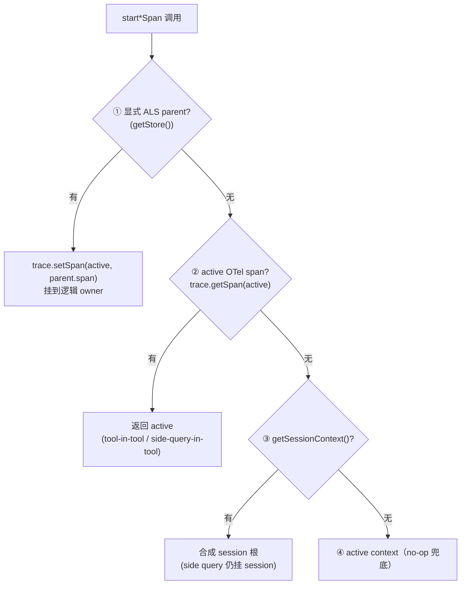
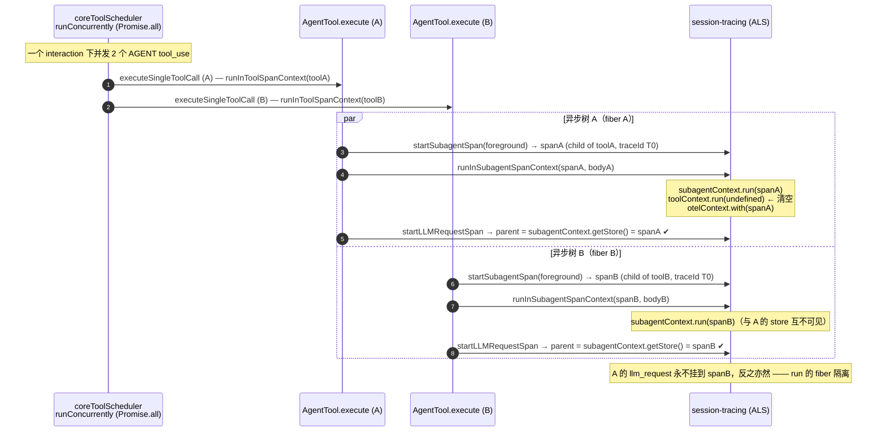
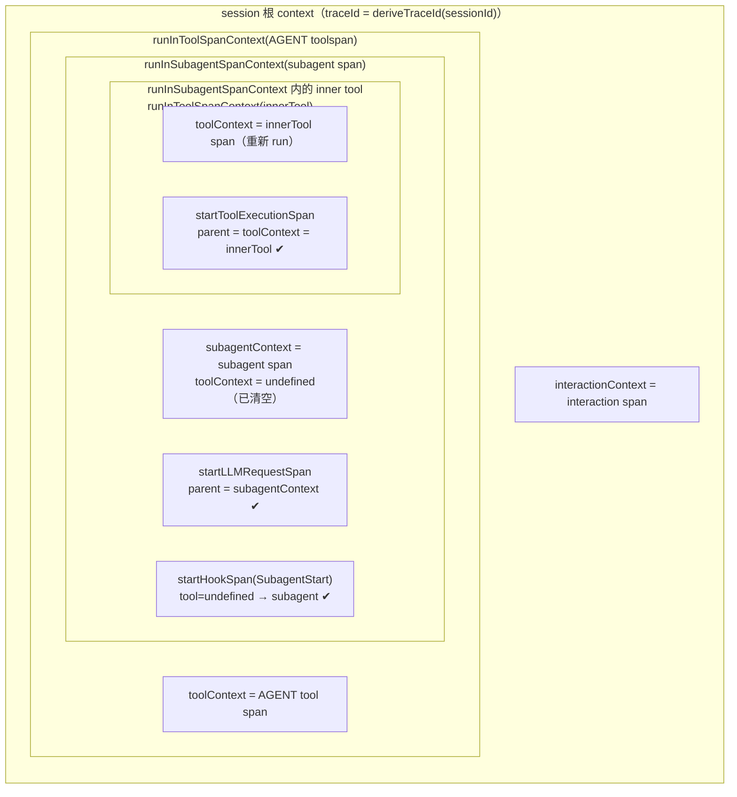
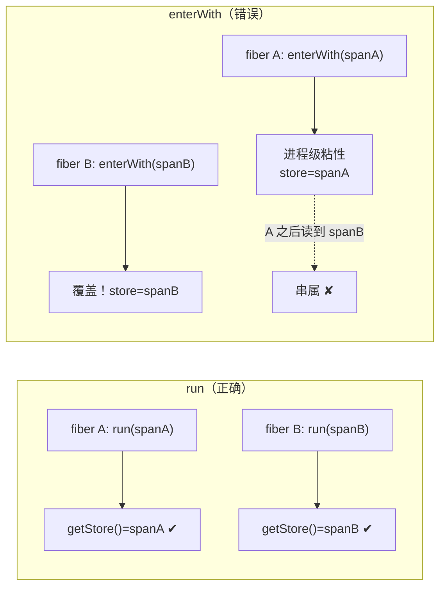

# 上下文传播与并发隔离（深入）

> 子文档；总览见 [README.md](README.md)。本文 **SUPERSEDES** 总览 `telemetry-observability.md` 的 3.3 节，下沉到函数 / 行级。
>
> 代码基线：`QwenLM/qwen-code@main`（`c699738f9`, v0.17.0 线）。所有 **MERGED** 符号均给出 `main` 上的 `file:symbol(+line)`。
>
> **重要标注**：`main` 当前**只有** `interactionContext` 与 `toolContext` 两个 ALS。
> - `subagentContext` + `runInSubagentSpanContext` + `qwen-code.subagent` span 来自 **PR #4410（MERGED 2026-06-05）**；
> - `retryContext` 来自 **PR #4432（MERGED 2026-06-05）**，且**不在** `session-tracing.ts`，而在新文件 `packages/core/src/utils/retryContext.ts`。
>
> 本文凡引用 PR 代码，均在代码块标题或行内显式写 `【#4410 已合入 main】`/`【#4432 已合入 main】`。未标注者即 `main` 现状。

---

## 概述

层级 span 树（`interaction → llm_request / tool → tool.execution / hook / blocked_on_user [→ subagent]`）的难点不在「创建 span」，而在**让每个新 span 找到正确的 parent**——尤其当：

1. parent 与 child 之间隔着任意多个 `await`（异步边界会丢失普通函数参数无法覆盖的「调用栈」）；
2. 同一个 `interaction` 下并发跑多个 tool / 多个 subagent（OTel 的 `context.active()` 是「当前执行点」语义，并发分支会互相覆盖）；
3. 进程内同时存在多个逻辑 session（daemon 形态），不能用单一进程级全局变量去「猜」当前 session。

qwen-code 的解法是 **AsyncLocalStorage（ALS）+ OTel `Context` 双轨**：

- **ALS 轨**（`interactionContext` / `toolContext` / `subagentContext`）承载 qwen-code 私有的 `SpanContext` 包装对象，供 `start*Span` helper 查 parent；
- **OTel `Context` 轨**（`otelContext.with` / `trace.setSpan`）承载标准 OTel active span，供 `UndiciInstrumentation`、log 桥接、`tracer.ts:withSpan` 等「不认识 qwen-code ALS」的下游识别 parent。

两轨在 `runInToolSpanContext`（MERGED）与 `runInSubagentSpanContext`（#4410 已合入 main）里被**同一个 `run`-style 调用同时设置**，从而把「逻辑归属」与「OTel 归属」绑定到同一棵异步调用树上，实现并发隔离。

本文的核心论点：**并发安全来自 `run`（绑定到单棵异步树）而非 `enterWith`（进程级粘性）**；**多 session / 并发 subagent 的 traceId 归属来自「优先读每条记录 / 每个 span 自带的 `session.id` 属性，全局 `getCurrentSessionId()` 仅兜底」**；**子 agent 不串属来自 `subagentContext` 在优先级上压过 `interactionContext`，并在 body 入口清空 `toolContext`**。

---

## 涉及 PR

| PR | 子主题 | 关键符号 | 状态 |
|---|---|---|---|
| #4071 | 初版层级 span（并发非安全） | 早期 `start*Span` | MERGED（已被后续重构） |
| #4126 | 统一 span 创建路径、修 trace 树扁平 | `resolveParentContext` / `getParentContext` 双镜像 | **MERGED** |
| #4302 | Phase 1.5：fallback 顺序、stream idle、log/span 一致 | `resolveParentContext` 优先级定稿 | **MERGED** |
| #4321 | Phase 2：blocked_on_user + hook span + TTL 哨兵 | `startToolBlockedOnUserSpan` / `startHookSpan` / `sweepStaleSpans` | **MERGED** |
| #4486 / #4499 | interaction 直接 pin 到 session 根 | `startInteractionSpan` 用 `getSessionContext()` 显式 parent | **MERGED** |
| #4367 | Resource + 基数控制；`session.id` 始终上 span/log | `getCommonAttributes` | **MERGED** |
| **#4410** | **Phase 3：subagent span + 并发隔离 + fork hybrid traceId + 4h TTL** | **`subagentContext` / `runInSubagentSpanContext` / `startSubagentSpan` / `ttlFor`** | MERGED（2026-06-05） |
| **#4432** | **Phase 4b：retry 可见性（per-attempt span）** | **`utils/retryContext.ts:retryContext`** | MERGED（2026-06-05） |

> `getParentContext`（`tracer.ts`）与 `resolveParentContext`（`session-tracing.ts`）是一对**手工同步的镜像实现**，二者用 `// SYNC:` 注释互相约束（见下文）。

---

## 为何用 AsyncLocalStorage

### 1. 跨 `await` 传播，且不污染业务函数签名

一次 prompt 的调用链横跨 `client.ts`（开 interaction）→ `loggingContentGenerator.ts`（开 llm_request）→ `coreToolScheduler.ts`（开 tool）→ 工具实现（开 tool.execution / hook），其间有任意多个 `await`。若要让深层的 `startToolExecutionSpan()` 知道自己的 parent 是哪个 tool span，传统做法是把 `parentSpan` 作为参数一层层往下穿——这会污染所有中间函数的签名，且工具实现是**插件式**的（无法强制三方工具透传 span）。

ALS（`node:async_hooks` 的 `AsyncLocalStorage`）把「当前 span」存入**异步执行上下文**，`await` 不会丢失它，深层任意位置用 `xxxContext.getStore()` 即可取回，无需穿参。

### 2. `context.with(...)`（run 式）vs `enterWith`（粘性）——为什么用 run

`AsyncLocalStorage` 有两种写入方式，语义截然不同：

| | `store.run(value, fn)` | `store.enterWith(value)` |
|---|---|---|
| 作用域 | 仅 `fn` 内部及其衍生的整棵异步树（基于 async_hooks 的 fiber 隔离） | **当前及之后**的同一执行上下文（进程级粘性，直到被下一次 `enterWith` 覆盖） |
| 并发安全 | ✔ 并发分支各持独立 store，互不可见 | ✘ 并发分支共享同一上下文，**后写覆盖先写** → 串属 |
| 写法成本 | 需把后续逻辑收进回调 | 一行，无回调 |

qwen-code 的取舍**按 span 的并发特性分别选择**：

- **`tool` / `tool.execution` / `hook` / `subagent`：用 `run`**。tool 天然并发（一个 turn 内模型可发多个 `tool_use`，`coreToolScheduler.runConcurrently` 用 `Promise.all` 并发跑，AGENT 工具并发上限 10）。必须 `run`，否则并发 tool 的 `toolContext` 会互相覆盖。
- **`interaction`：用 `enterWith`**（`session-tracing.ts:startInteractionSpan:313`、`endInteractionSpan:345`）。interaction 是「回合边界」、由 `client.ts` **串行驱动**（一个 turn 结束才开下一个），进程级粘性可接受；用 `enterWith` 免去把整个 turn 逻辑包进回调。

```ts
// session-tracing.ts:313（MERGED）— interaction 用 enterWith（串行回合可接受）
interactionContext.enterWith(spanContextObj);
// ...
// session-tracing.ts:345（MERGED）— 回合结束显式清空
interactionContext.enterWith(undefined);
```

```ts
// session-tracing.ts:542-548（MERGED）— tool 用 run（并发安全）
export function runInToolSpanContext<T>(span: Span, fn: () => T): T {
  const spanId = getSpanId(span);
  const spanCtx = activeSpans.get(spanId)?.deref();
  if (!spanCtx) return fn();
  const otelCtxWithSpan = trace.setSpan(otelContext.active(), span);
  return toolContext.run(spanCtx, () => otelContext.with(otelCtxWithSpan, fn));
}
```

注意 `runInToolSpanContext` **同时**做两件事：`toolContext.run`（ALS 轨）与 `otelContext.with`（OTel 轨）。后者保证回调内任何下游 OTel span（undici HTTP、log 桥接 span、`tracer.ts:withSpan`）也能通过标准 `context.active()` 找到 tool span 作 parent，而不仅是认识 qwen-code ALS 的 `start*Span`。

> daemon 分支（`daemon_mode_b_main`）更进一步：把 interaction 也改成 `interactionContext.run` + `otelContext.with`（`withInteractionSpan`），因为 daemon 同进程并发多 session，interaction 不再串行。这印证了「run vs enterWith 的选择取决于该层是否并发」这一原则。

---

## 上下文族

下表列出全部 ALS 及其 `file:symbol`。**注意 store 类型**：三个 span 级 ALS 存的是 qwen-code 私有的 `SpanContext` 包装对象（`session-tracing.ts:96`，含 `span` / `startTime` / `attributes` / `ended` / `type`），不是 OTel 的 `Context`。

| ALS | 存储内容 | 定义位置 | 写入方式 | 状态 |
|---|---|---|---|---|
| `interactionContext` | `SpanContext \| undefined` | `session-tracing.ts:152` | `enterWith` | **MERGED** |
| `toolContext` | `SpanContext \| undefined` | `session-tracing.ts:153` | `run`（`runInToolSpanContext`） | **MERGED** |
| `subagentContext` | `SpanContext \| undefined` | `session-tracing.ts`（#4410 在 `toolContext` 后新增） | `run`（`runInSubagentSpanContext`） | **【#4410 已合入 main】** |
| `retryContext` | `RetryAttemptContext` | **`utils/retryContext.ts:retryContext`**（非 session-tracing.ts） | `run`（`retry.ts:retryWithBackoff`） | **【#4432 已合入 main】** |
| `subagentNameContext` | 子 agent 名字字符串 | `utils/subagentNameContext.ts` | `run` | MERGED（弱归属兜底，非 span 级） |
| `agentContextStorage` | `AgentContext`（含 `agentId` / `depth`） | `agents/runtime/agent-context.ts:38` | `run`（`runWithAgentContext`） | MERGED；`depth` 字段为 **【#4410 已合入 main】** |

辅助的非 ALS 单例（session 根上下文）：

| 符号 | 作用 | 位置 |
|---|---|---|
| `sessionRootContext` | 进程级单例，持有合成 session 根 `Context`（含确定性 traceId） | `session-context.ts:9` |
| `currentSessionId` | 进程级单例，最近一次 `setSessionContext` 的 sessionId | `session-context.ts:10` |
| `getSessionContext()` | 读 `sessionRootContext` | `session-context.ts:20` |
| `getCurrentSessionId()` | 读 `currentSessionId`（**仅作 log 桥接的兜底**） | `session-context.ts:29` |

### `subagentContext` 的定义与注释【#4410 已合入 main】

```ts
// session-tracing.ts（#4410，紧跟 toolContext 之后）【#4410 已合入 main】
const subagentContext = new AsyncLocalStorage<SpanContext | undefined>();
// 注释（原文要点）：Child LLM/tool/hook spans created inside a subagent body
// read this BEFORE interactionContext so they parent under the subagent
// (not the outer interaction). Without this, foreground subagent spans are
// empty shells: resolveParentContext picks interactionContext.getStore()
// whenever it is non-null — which is always true during foreground
// execution — and re-parents every child span back to the interaction,
// bypassing the subagent span entirely.
```

这段注释点出了**并发隔离的核心矛盾**：foreground subagent 执行期间 `interactionContext` 永远非空（外层 interaction 还活着），若 `startLLMRequestSpan` 仍按 `main` 的逻辑只读 `interactionContext`，则 subagent 内部的 llm_request 会全部挂回外层 interaction，subagent span 变成空壳。解法见「并发隔离」节。

### `retryContext` 的定义【#4432 已合入 main】

```ts
// utils/retryContext.ts（新文件）【#4432 已合入 main】
export interface RetryAttemptContext {
  readonly attempt: number;           // 1-based 单调迭代计数（不受 persistent 模式 clamp 影响）
  readonly retryTotalDelayMs: number; // 本次 attempt 之前所有 backoff 之和（attempt 1 为 0）
  readonly requestSetupMs: number;    // 从 retryWithBackoff 入口到本 attempt 启动的耗时
}
export const retryContext = new AsyncLocalStorage<RetryAttemptContext>();
```

`retryContext` 与 span 级 ALS 不同：它承载的是**重试元数据值对象**，不是 span 包装。它在 `retry.ts` 层产生、在 `loggingContentGenerator.ts` 同步 prelude 消费（见「并发隔离 §retry」）。

---

## resolveParentContext 优先级 + session.id 派生

### `resolveParentContext` 四级优先级（MERGED）

```ts
// session-tracing.ts:135-144（MERGED）
function resolveParentContext(parent: SpanContext | undefined): Context {
  if (parent) {
    return trace.setSpan(otelContext.active(), parent.span);   // ① 显式 ALS parent
  }
  const active = otelContext.active();
  if (trace.getSpan(active)) {
    return active;                                              // ② 当前 active OTel span
  }
  return getSessionContext() ?? active;                         // ③ 合成 session 根；④ 兜底 active
}
```

| 级 | 来源 | 解决的问题 |
|---|---|---|
| ① | 调用方传入的 ALS store（`interactionContext` / `toolContext` / `subagentContext` 的 `getStore()`） | 把 llm_request / tool / exec span 挂到其逻辑 owner |
| ② | `otelContext.active()` 上的 active span | ALS parent 已退出、但仍嵌套在别的 span 内（tool-in-tool、side-query-in-tool）；没有这级会回落到 session 根 → trace 树扁平（#4212） |
| ③ | `getSessionContext()`（合成 session 根） | 完全无 parent 的 side query（auto-title、recap）仍挂在 session 下，共享 traceId |
| ④ | `otelContext.active()` | 连 session 根都没有时的 no-op 兜底 |

各 `start*Span` 传入 ① 的 store 不同（这是 parent 解析的「入口选择」）：

```ts
// startLLMRequestSpan:355（MERGED）
const parentCtx = interactionContext.getStore();
// startToolSpan:504（MERGED）
const parentCtx = interactionContext.getStore();
// startToolExecutionSpan:612（MERGED）
const parentCtx = toolContext.getStore();
// startHookSpan:859-860（MERGED）— tool 优先于 interaction
const parentCtx = toolContext.getStore() ?? interactionContext.getStore() ?? undefined;
```



### `getParentContext` 镜像（MERGED）

`tracer.ts:withSpan` / `startSpanWithContext` 走的不是 ALS（它们无 `parent` 入参），而是这套独立但**逻辑等价**的镜像，复用 ②③④（无 ①）：

```ts
// tracer.ts:81-87（MERGED）
// SYNC: keep parent-resolution logic in step with resolveParentContext()
function getParentContext(): Context {
  const active = context.active();
  if (trace.getSpan(active)) return active;   // ②
  return getSessionContext() ?? active;        // ③ / ④
}
```

两处用 `// SYNC:` 注释互相约束；若漂移会重新引入 #4212 的 trace 树扁平化问题。这是已知的「人肉约束」脆弱点（见「已知限制」）。

### session.id 派生：优先「每条记录 / 每个 span 自带的属性」，全局仅兜底

> **术语澄清（按分支区分）**：`resolveSessionId` 函数在 **`main` 上不存在**，但 **PR #4630（已合入 `daemon_mode_b_main`）新增了它**（`session-tracing.ts:resolveSessionId:175`）。它正是任务所说的逻辑：**优先读父 `SpanContext` 上的 `session.id` 属性，仅当无 parent 时才回落到进程级全局 `getCurrentSessionId()`**——因为 daemon「单进程多 session」时全局只反映「最后一次初始化遥测的 session」，直接读会把子 span 误盖成它。它作用于**真实子 span**：`startLLMRequestSpan`(`:478`)、`startToolSpan`(`:628`)、`startToolExecutionSpan`(`:744`) 在写 `session.id` 属性前都调 `resolveSessionId(parentCtx)`（`tool.execution` 入参为 `parentCtx ?? interactionContext.getStore()`）。
>
> 在 `main` 上没有这个函数；与之**功能类似**（每条记录自带 session.id 优先、全局兜底）的逻辑内联在 **`LogToSpanProcessor.onEmit`** 的 traceId 优先级链里（`log-to-span-processor.ts:188-203`）。注意二者是**两套不同机制**：#4630 是「真实 span 写 `session.id` 属性」，下文描述的是「log→span 桥接时定 traceId」。下文按 `main` 的桥接链展开。

为什么这是「多 session / 并发 subagent 防碰撞」的关键？因为同一棵 trace 的归属由 **traceId** 决定，而 traceId 有两条产生路径：

1. **真实 span 路径**：traceId 来自合成 session 根 `createSessionRootContext(sessionId)`，其 traceId = `deriveTraceId(sessionId)`（`trace-id-utils.ts:14`，`SHA-256(sessionId)[:32]`，确定性）。`session.id` 作为 span 属性由 `config.getSessionId()` 直接写在 interaction span 上（`session-tracing.ts:286`），并由 #4367 全局附着到所有 span/log。
2. **log→span 桥接路径**（`LogToSpanProcessor`）：一条业务事件 LogRecord 要桥接成 span 时，必须自己决定 traceId。这里就是碰撞高发区。

桥接路径的 traceId 解析链（`main` 上与 #4630 `resolveSessionId` **功能对应**、但落在 log→span 桥接的逻辑）：

```ts
// log-to-span-processor.ts:188-204（MERGED）
const parentSpanContext = getValidParentSpanContext(logRecord.spanContext);
// || (不是 ??) 以便空串 session.id 也落到全局兜底
const sessionId =
  logRecord.attributes?.['session.id'] || getCurrentSessionId();
let traceId: string;
if (parentSpanContext) {
  traceId = parentSpanContext.traceId;        // 【优先级 1】直接用父 span 的 traceId
} else if (sessionId) {
  const sid = String(sessionId);
  if (sid !== this.cachedSessionId) {         // 缓存：sessionId 不变就复用 traceId
    this.cachedSessionId = sid;
    this.cachedTraceId = deriveTraceId(sid);
  }
  traceId = this.cachedTraceId!;              // 【优先级 2】从「本记录自带的 session.id 属性」派生
} else {
  traceId = randomHexString(32);              // 【优先级 4】随机（最坏情况）
}
```

优先级（与任务表述对应）：

1. **`logRecord.spanContext` 上的有效父 span 上下文** → 直接复用其 traceId（最强信号，等价于「从父 span 派生」）；
2. **本条记录自带的 `session.id` 属性** → `deriveTraceId(session.id)`；
3. **全局 `getCurrentSessionId()`** → 仅当本记录**没有** `session.id` 属性时才兜底（如 `/clear`、`/resume` 后属性缺失）；
4. 随机 traceId。

**为什么这能避免碰撞**：在 daemon / 并发 subagent 等「单进程多逻辑 session」场景，全局 `getCurrentSessionId()` 是一个**进程级单例**（`session-context.ts:10`），任一时刻只能反映「最后一次 `setSessionContext` 的 session」。若桥接逻辑直接信任它，session B 的 LogRecord 可能在 session A 刚切入时被错误派生到 A 的 traceId。把「每条记录自带的 `session.id` 属性」放在全局之前，使每条记录**带着自己的归属信息**，全局退化为「属性缺失时的最后努力」——这正是「derive from per-record attribute, not global」的防碰撞设计。`this.cachedSessionId` 仅是「同 session 连续记录」的性能缓存，不改变优先级语义。

> 真实 span 路径上 `sessionRootContext` 仍是进程级单例，因此 `main` 的 CLI 形态隐含「一进程一 session」假设。多 session 并发的彻底解法在 daemon 分支用 W3C `traceparent` + `extractDaemonTraceContext` 每请求重放 OTel context 实现，而非依赖该全局——见 daemon 子文档。

---

## 并发隔离 ← 重点

这是本文核心。`main` 已能隔离**并发 tool**（靠 `runInToolSpanContext` 的 `toolContext.run`）；**并发 subagent** 的隔离是 #4410 的新增能力（已合入 main）。

### 问题：为什么并发 subagent 会串属

`coreToolScheduler.ts:728` 把 AGENT 工具标记为 `concurrent: true`，`runConcurrently`（`coreToolScheduler.ts:2512`）用 `Promise.all` 并发跑（上限 10）。每个 AGENT 调用都开自己的 `qwen-code.tool` span。但 subagent **内部**的 `llm_request` / `tool` / `hook` span 在 `main` 上只会读 `interactionContext`（`startLLMRequestSpan:355`）——而并发的 A、B、C 三个 subagent 共享同一个外层 `interaction`，于是它们的子 span 全部平铺挂在那一个 interaction 下，trace 浏览器**无法区分某个 llm_request 属于 A 还是 B**。

### 解法三件套【#4410 已合入 main】

#### (1) `subagentContext` 在优先级上压过 `interactionContext`

`startLLMRequestSpan` / `startToolSpan` 的 parent 入口改为「先读 subagent，再读 interaction」：

```ts
// startLLMRequestSpan（#4410 改）【#4410 已合入 main】
const parentCtx = subagentContext.getStore() ?? interactionContext.getStore();
// startToolSpan 同样改法【#4410 已合入 main】
const parentCtx = subagentContext.getStore() ?? interactionContext.getStore();
```

`startHookSpan` 则插在 tool 与 interaction 之间（`tool > subagent > interaction`）：

```ts
// startHookSpan（#4410 改）【#4410 已合入 main】
const parentCtx =
  toolContext.getStore() ??
  subagentContext.getStore() ??
  interactionContext.getStore() ??
  undefined;
```

这样 subagent body 内创建的子 span 会优先认 `subagentContext` 里的 subagent span 作 parent，不再逃逸回外层 interaction。`llm_request.context` 属性也从二态扩成三态（`subagent` / `interaction` / `standalone`），避免 dashboard 把 subagent 内的 LLM 调用误判为 interaction 级。

#### (2) `runInSubagentSpanContext` 进入 subagentContext 并**清空 toolContext**

这是与设计文档最不同、最关键的一处。设计文档原案只写了 `otelContext.with(ctx, fn)`；**实际实现**（经 wenshao review）做了三件事：

```ts
// session-tracing.ts（#4410 实际实现）【#4410 已合入 main】
export function runInSubagentSpanContext<T>(span: Span, fn: () => Promise<T>): Promise<T> {
  const spanId = getSpanId(span);
  const spanCtx = activeSpans.get(spanId)?.deref();
  if (!spanCtx) return fn();                         // NOOP span / 遥测关 → 不付 ALS.run 成本
  const otelCtxWithSpan = trace.setSpan(otelContext.active(), span);
  return subagentContext.run(spanCtx, () =>          // ① 进入 subagent ALS
    toolContext.run(undefined, () =>                 // ② 清空 toolContext！
      otelContext.with(otelCtxWithSpan, fn)));       // ③ 设 OTel active span
}
```

- **① `subagentContext.run(spanCtx, ...)`**：使 body 内的 `startLLMRequestSpan` / `startToolSpan` / `startHookSpan` 通过 (1) 的优先级认到本 subagent。`run` 而非 `enterWith` → 并发 A/B/C 各持独立 `subagentContext`，互不可见。
- **② `toolContext.run(undefined, ...)` —— 清空 toolContext**：subagent 是从 **AGENT 工具的 body** 里启动的，此刻外层 AGENT 工具的 `toolContext` 仍在作用域内。若不清空，subagent body 内、首个内部 tool 调用**之前**触发的 hook（如 `SubagentStart`）会因 `startHookSpan` 的 `tool > subagent` 优先级而错误挂到**外层 AGENT 工具的 tool span**，而非 subagent span。清空后这些 hook 正确挂到 subagent；subagent 自己的内部 tool 会通过 `runInToolSpanContext` **重新** `run` 一个新的 `toolContext`，内部 tool 的 parent 关系不受影响。
- **③ `otelContext.with(otelCtxWithSpan, fn)`**：让 undici 出站 span、log 桥接 span、`withSpan` 等标准 OTel 下游也认 subagent 作 parent。

#### (3) hybrid traceId：foreground = 子 span，fork/background = 新 traceId + Link

`startSubagentSpan` 按 `invocationKind` 分叉（`session-tracing.ts`，#4410）：

```ts
// startSubagentSpan（#4410）【#4410 已合入 main】
if (opts.invocationKind === 'foreground') {
  // 不传显式 context → 用 context.active()（= 外层 AGENT tool span）作 parent
  span = tracer.startSpan(SPAN_SUBAGENT, { kind: SpanKind.INTERNAL, attributes });
} else {
  // fork / background：linked-root
  span = tracer.startSpan(SPAN_SUBAGENT, {
    kind: SpanKind.INTERNAL,
    attributes,
    root: true,                                 // 强制新 traceId，忽略 active context 作 parent
    links: opts.invokerSpanContext
      ? [{ context: opts.invokerSpanContext, attributes: { 'qwen-code.link.kind': 'invoker' } }]
      : undefined,
  });
}
```

| invocationKind | parent 策略 | traceId | 理由 |
|---|---|---|---|
| `foreground` | `context.active()`（AGENT tool span）的子 span | 继承父 traceId T0 | 调用方完全时间包住被调方，自然单棵树 |
| `fork` | `root: true` + Link 指回 invoker | **新 traceId T1** | fire-and-forget，跨多个后续 turn 才结束；OTel 规范明确建议用 Link；避免把父 trace 时长 / span 数撑爆（LangSmith 25k span/trace 上限） |
| `background` | 同 fork | 新 traceId | 同 fork |

跨 trace 可查：所有 subagent span（含 linked-root）都带 `gen_ai.conversation.id = sessionId`，按 `session.id` 查 ARMS 同时返回 T0 与 T1；T1 根上的 Link（`qwen-code.link.kind: 'invoker'`）在父 trace UI 里显示为「Spawned: subagent X (other trace)」可点击跳转。

### agent.ts 实际接线：`runWithSubagentSpan`【#4410 已合入 main】

3 条调用路径（foreground / fork / background）经 `buildSubagentSpanSpec` 归一后，统一进 `runWithSubagentSpan`（`tools/agent/agent.ts`，#4410）。要点：

```ts
// agent.ts:runWithSubagentSpan（#4410，节选）【#4410 已合入 main】
const invokerSpanContext =
  spec.invocationKind === 'foreground'
    ? undefined                                                   // foreground 不需要 Link
    : trace.getSpan(otelContext.active())?.spanContext();         // fork/bg 捕获 invoker（在 void 出去前！）
const parentAgentId = getCurrentAgentId();
const span = startSubagentSpan({
  ...spec,
  parentAgentId: parentAgentId ?? undefined,
  depth: parentAgentId !== null ? getCurrentAgentDepth() + 1 : 0, // 区分「无 frame」与「frame@depth0」
  invokingRequestId: this.callId,
  sessionId: this.config.getSessionId(),
  invokerSpanContext,
});
let recordedMetadata: SubagentSpanMetadata | undefined;
const recordOutcome: SubagentOutcomeSink = (m) => { recordedMetadata ??= m; }; // first-write-wins
try {
  return await runInSubagentSpanContext(span, () => body(recordOutcome));
} catch (error) {
  recordedMetadata ??= deriveSubagentExceptionMetadata(error, signal?.aborted ?? false);
  throw error;
} finally {
  endSubagentSpan(span, recordedMetadata ?? { status: 'failed', /* wiring_bug sentinel */ });
}
```

几个被 review 打磨出的健壮性细节：

- **`invokerSpanContext` 必须在 `void runInForkContext(...)` 之前捕获**：fork body 真正跑起来时 caller 已返回，`context.active()` 不再是 invoker；故在同步流里先抓 `spanContext()` 存入 Link。
- **`recordOutcome` first-write-wins（`??=`）**：`runSubagentWithHooks` / `bgBody` 可能在成功路径与内层 catch 各调一次，`??=` 锁定首个真实终态，防止「成功后某 `UpdateDisplay` 抛错」把 `completed` 覆盖成 `failed`。
- **`depth` 计算**：`getCurrentAgentDepth()` 返回 0 同时表示「无 agent frame」与「顶层 frame@depth0」，故用 `getCurrentAgentId() !== null` 消歧——有 parent frame 才 `+1`。`runWithAgentContext`（`agent-context.ts:48`，#4410 改）内部自增 `depth = (current.depth ?? -1) + 1`，调用方无感知。
- **`finally` 默认 `failed` + `wiring_bug_record_outcome_not_called` 哨兵**：body 既没 `recordOutcome` 也没抛错 → 判定为接线 bug，主动暴露为 `status=failed` 而非静默成功。

### retry 上下文如何并发安全地传播【#4432 已合入 main】

Phase 4b 发现 qwen-code 的 `retryWithBackoff` 位于 `LoggingContentGenerator` **之上**——每次重试都会创建一个全新的 `llm_request` span（而非 claude-code 的「一个 span 包住整个重试循环」）。因此无法用「LCG 内累加器」，改用 ALS 把 per-attempt 元数据从 retry 层下传给 LCG：

```ts
// retry.ts:retryWithBackoff（#4432，节选）【#4432 已合入 main】
while (attempt < maxAttempts) {
  attempt++; iterationCount++;
  const requestSetupMs = Date.now() - requestEntryTime;
  const result = await retryContext.run(                       // ← 每个 attempt 各自 run
    { attempt: iterationCount, retryTotalDelayMs, requestSetupMs },
    () => fn());                                                // fn 内部就是 LCG 调用
  // ... 失败则 onRetry(...) 后 sleep，retryTotalDelayMs += delay ...
}
```

```ts
// loggingContentGenerator.ts:snapshotRetryMetadata（#4432）【#4432 已合入 main】
function snapshotRetryMetadata() {
  const ctx = retryContext.getStore();      // 在「同步 prelude」读，即第一个 await 之前
  return { attempt: ctx?.attempt ?? 1, requestSetupMs: ctx?.requestSetupMs, /* ... */ };
}
```

并发安全点：`retryContext.run` 把每个 attempt 的元数据绑定到该 attempt 的异步树；LCG 必须在**第一个 `await` 之前**（同步 prelude）调 `snapshotRetryMetadata()` 把值快照进闭包，之后所有 `endLLMRequestSpan` 调用点（success / error / idle-timeout / abort）都用这份快照——因为 ALS frame 在 `await` 后可能已退出。`onRetry` 回调则**显式禁止**读 `retryContext.getStore()`（它在 `retryContext.run` frame 之外执行），数据只经 `RetryAttemptInfo` 参数传递。

---

## 时序图与上下文栈图

### 并发两个 subagent 的隔离（headline）【#4410 已合入 main】



### 上下文栈图（foreground subagent 内部，单 fiber 视角）【#4410 已合入 main】



要点：`subagentContext.run` 内 `toolContext` 被清成 `undefined`（故 `SubagentStart` hook 不挂外层 AGENT tool）；而 subagent 自己的 inner tool 通过 `runInToolSpanContext` **重新** `run` 出一个 `toolContext`，使 `tool.execution` 正确挂到 inner tool。

### `run` vs `enterWith` 的串属对比（MERGED 概念，仍适用 subagent）



---

## 边界与错误处理

| 场景 | 处理 | 位置 |
|---|---|---|
| SDK 未初始化 | 所有 `start*Span` 返回 `NOOP_SPAN`（全 0 traceId/spanId，不登记 activeSpans）；`runInToolSpanContext`/`runInSubagentSpanContext` 检测到 `!spanCtx` 直接 `fn()`，不付 ALS.run 成本 | `session-tracing.ts:146`(NOOP)、`:545`、`runInSubagentSpanContext`【#4410】 |
| ALS parent 已退出但仍嵌套在别 span 内 | `resolveParentContext` 第 ② 级回落到 `otelContext.active()`，不扁平化 | `:139-142` |
| `startToolExecutionSpan` 在 `runInToolSpanContext` 外被调 | `toolContext.getStore()` 为空 → `debugLogger.warn` + 走 resolve 兜底，不抛错 | `:613-617` |
| `blocked_on_user` 早于 toolContext 建立 | parent **显式传入 toolSpan**（不靠 ALS），且刻意不学 claude-code 的 `findLast`-by-type（并发会取错） | `startToolBlockedOnUserSpan:731` |
| span 属性更新抛错 | 「`ended` 幂等守卫 → try 包属性 → 独立 try 包 `end()`」三段式，保证 `end()` 必跑、必从 activeSpans 清除（不泄漏） | 所有 `end*Span`，如 `:483-491` |
| 错误字符串过长 | `truncateSpanError` 按 UTF-16 截到 1024，回退孤立高代理位（防严格 collector 拒收整批） | `:257-268` |
| 测试间 ALS 泄漏 | `clearSessionTracingForTesting` 显式 `enterWith(undefined)` 清三个 ALS（#4410 补 `subagentContext`，因它优先级最高，泄漏会污染所有后续测试） | `:956`；`subagentContext` 清理为【#4410】 |
| subagent body 既不 `recordOutcome` 也不抛错 | `finally` 默认 `status='failed'` + `terminate_reason='wiring_bug_record_outcome_not_called'` 哨兵，主动暴露接线 bug | `agent.ts:runWithSubagentSpan` finally【#4410】 |
| `endSubagentSpan` 在 span 已被 TTL 扫走后调用 | `!spanCtx` 且 SDK 已初始化 → `debugLogger.warn` 记录「intended status / reason」，使「fork 恰好 4h 后几秒完成、真实终态被 sweep 的 aborted 覆盖」可观测 | `endSubagentSpan`【#4410】 |
| fork body rejection 逃逸 `void` 边界 | 文档化契约：void'd caller 不得移除 body 自身 try/catch，否则成 unhandled-promise（Node≥15 终止进程）；新增 void 调用点须 `.catch()` 兜底 | `runWithSubagentSpan` 注释【#4410】 |
| `onRetry` 回调抛错 | `retry.ts` 用 try/catch 吞掉并 `debugLogger.warn`，绝不影响重试循环；且 `signal?.aborted` 守卫避免为永不发生的 attempt 发幽灵 retry 事件 | `retry.ts` onRetry 块【#4432】 |

---

## 关键设计决策与权衡

1. **ALS 双轨（私有 SpanContext + OTel Context）而非单轨**：私有 ALS 让 `start*Span` 拿到带 `startTime`/`attributes`/`ended`/`type` 的完整包装（OTel `Context` 只含 span）；OTel `Context` 轨让不认识 qwen-code 的下游（undici、log 桥接、`withSpan`）也能正确 parent。代价是两轨必须在 `runIn*SpanContext` 里**同时**设置，漏一个就半隔离。

2. **`run` vs `enterWith` 按层并发性分别选**：并发层（tool/subagent）必须 `run`；串行层（CLI 的 interaction）可 `enterWith` 图省事。daemon 并发 session 则把 interaction 也升级为 `run`。**取舍**：`run` 隔离强但要把后续逻辑收进回调；`enterWith` 简单但并发串属。

3. **`subagentContext` 优先于 `interactionContext`（#4410）**：因为 foreground subagent 执行期 `interactionContext` 恒非空，不抬高 subagent 优先级，subagent span 就是空壳。**取舍**：多一层 ALS 查找 + 一处需与 `startHookSpan` 的 `tool>subagent>interaction` 三级协调。

4. **body 入口清空 `toolContext`（#4410）**：防 subagent 内、首个 inner tool 前的 hook 误挂外层 AGENT tool。**取舍**：body 内「首个 inner tool 之前」读 `toolContext` 会得 `undefined`（已文档化为预期行为）。

5. **hybrid traceId：foreground 子 span / fork·background 新 traceId+Link（#4410）**：foreground 单棵树自然；fork/background 跨多 turn、可能数小时，作子 span 会把父 trace 时长/体积撑爆（LangSmith 25k 上限）。**取舍**：概率采样器下父 trace 与 fork trace 可能一个被采一个被丢，父 trace 的 Link 点过去可能 404（已文档化，留待 config 强采）。

6. **session.id 优先读「每条记录/每个 span 自带属性」，全局 `getCurrentSessionId()` 仅兜底**：避免单进程多 session 时全局单例的归属碰撞。**取舍**：真实 span 路径的 `sessionRootContext` 仍是进程级单例，`main` CLI 隐含「一进程一 session」；彻底多 session 靠 daemon 的 traceparent 重放。

7. **retry 元数据用独立 `retryContext` ALS + 同步 prelude 快照（#4432）**：因 `retryWithBackoff` 在 LCG 之上、每 attempt 一个新 span，无法用累加器。**取舍**：LCG 必须在第一个 `await` 前快照（ALS frame 会随 await 退出）；`onRetry` 严禁读 ALS，只走参数。

8. **`getParentContext`/`resolveParentContext` 双镜像靠 `// SYNC:` 注释约束**：两条创建路径（ALS 驱动 vs `withSpan`）共享 ②③④ 逻辑但代码分离。**取舍**：人肉同步、有漂移风险（列为已知限制）。

---

## 已知限制 / 后续

1. **`subagentContext` / `qwen-code.subagent` span 已合入 main（#4410，2026-06-05）**：subagent 的 llm_request/tool 子 span 现已正确挂在 `qwen-code.subagent` span 下，可区分属于哪个子 agent。`subagentNameContext`（名字字符串）仍作为 api_* 事件的弱归属兜底保留。

2. **`retryContext` / retry 可见性已合入 main（#4432，2026-06-05）**：`LLMRequestMetadata.requestSetupMs`/`attempt`/`retryTotalDelayMs` 现已由 `retryContext` ALS 填充（位于 `utils/retryContext.ts`，非 `session-tracing.ts`）。该 PR 同时修复了 Phase 4a 的 `sampling_ms` 公式 bug（去掉重复扣 setup）。

3. **fork 子 span 的 4h vs 30min TTL 空洞（#4410 设计内已知，deferred）**：`ttlFor` 只给 **subagent span 本身** 4h TTL（`SPAN_TTL_MS_LONG`）；fork/background 内部的 llm_request/tool/hook **子 span 仍用 30min 默认 TTL**（`SPAN_TTL_MS_DEFAULT`）。后果：一个 2 小时的 background agent，其早期子 span 会在 30min 被 sweep 强制 `end()`（打 `ttl_expired`），晚期子 span 正常 —— trace 出现**空洞**。彻底修需把「long-TTL bucket」经 ALS 传进 `resolveParentContext`，或 sweep 时做 TTL 继承遍历，留待后续 PR。

4. **fork 内 log 桥接子 span 落在 session 派生 traceId、而非 fork 的 T1（#4410 edge case #5）**：原生 span 用 OTel context（T1），但 log 桥接 span 恒用 `deriveTraceId(sessionId)`（即 T0 系），故按 T1 查 ARMS 不会带上 fork 的 log 桥接子。属更广的「interaction span 不继承 session 根 context」议题，out of scope。

5. **`getParentContext` 与 `resolveParentContext` 双镜像漂移风险（MERGED）**：靠 `// SYNC:` 注释人肉约束，无编译期保证。

6. **`endSubagentSpan` 与 TTL sweep 的竞态（#4410，已部分缓解）**：fork 恰在 4h 后几秒完成时，sweep 可能先把 span 标 `aborted`/`ttl_swept`，随后 `endSubagentSpan` 发现 `!spanCtx`/`ended` 只能 `warn`，真实 `completed` 终态丢失（已加 warn 日志使其可观测，但状态仍丢）。

7. **真实 span 路径的 `sessionRootContext` 进程级单例（MERGED）**：`session-context.ts:9` 是单例，CLI 形态隐含「一进程一 session」。`refreshSessionContext` 在 `/clear`、`/resume` 时重建；但并发多 session 在 CLI 路径无法靠它隔离。

---

## 测试覆盖

| 测试主题 | 断言点 | 文件 / 状态 |
|---|---|---|
| `runInToolSpanContext` 并发隔离 | 并发两 tool 的 `tool.execution` 各挂各的 tool span，不串属 | `session-tracing.test.ts`（MERGED） |
| `resolveParentContext` 四级优先级 | 显式 parent / active span / session 根 / 兜底各命中正确分支；tool-in-tool 不扁平 | `session-tracing.test.ts`（MERGED） |
| TTL sweep（默认 30min） | 超期 span 被强制 `end()`、打 `ttl_expired`/`duration_ms`，blocked_on_user 额外打 `decision:'aborted'/source:'system'` | `session-tracing.test.ts:runTTLSweepForTesting`（MERGED） |
| `endXSpan` 幂等 + 属性抛错仍 end | 二次调用 no-op；`setAttributes` 抛错不阻止 `end()` | `session-tracing.test.ts`（MERGED） |
| log 桥接 traceId 优先级 | parent span context > 本记录 session.id 属性 > `getCurrentSessionId()` 兜底 > 随机 | `log-to-span-processor.test.ts`（MERGED） |
| **subagent foreground 子 span** | parent = 当前 active span，继承父 traceId | `session-tracing.test.ts`【#4410】 |
| **subagent fork linked-root** | `root:true` 新 traceId + Link.context == invoker 的 spanContext | `session-tracing.test.ts` / `agent.test.ts`【#4410】 |
| **`runInSubagentSpanContext` 跨 await/Promise.all 传播** | 隔离原语正确性 | `session-tracing.test.ts`【#4410】 |
| **3 并发 subagent 不共享子 span** | headline 并发保证；scheduler 级 `runConcurrently` 产 3 个独立 subtree | `session-tracing.test.ts` / `agent.test.ts`【#4410】 |
| **subagent body 清 toolContext** | body 内首个 inner tool 前 `toolContext.getStore()===undefined`；`SubagentStart` hook 挂 subagent 而非外层 tool | 【#4410】 |
| **type-aware TTL** | fork subagent 过 30min 不被扫、4h 被扫并打 `terminate_reason:'ttl_swept'`；foreground 仍 30min | `session-tracing.test.ts`【#4410】 |
| **`runWithAgentContext` depth 自增** | top=0, child=1, grandchild=2；兄弟同 depth；调用方不传 depth | `agent-context.test.ts`（#4410 新增 `describe('agent-context (depth)')`）【#4410】 |
| **log 桥接 skip-list** | `qwen-code.subagent_execution` 不再桥接成 span，但 RUM/metric 仍收 LogRecord；`tool_call` 等仍正常桥接 | `log-to-span-processor.test.ts`（#4410 新增 `bridge skip-list`）【#4410】 |
| **retry per-attempt 元数据** | `500→429→success` 产 3 个 llm_request span；成功 span 带 `attempt:3`/`request_setup_ms`/`retry_total_delay_ms` | `loggingContentGenerator.test.ts` / `retry.test.ts`【#4432】 |
| **`onRetry` 不读 ALS、抛错不破坏循环** | 数据只走 `RetryAttemptInfo` 参数；回调抛错被吞 | `retry.test.ts`【#4432】 |

---

## 各 PR 代码贡献

### #4126 — ALS toolContext + 统一 span 创建
- `session-tracing.ts:toolContext` — 新增 `AsyncLocalStorage<SpanContext>`；`runInToolSpanContext` 实现 `toolContext.run` + `otelContext.with` 双轨绑定
- `session-tracing.ts:resolveParentContext` — 定义四级优先级（显式 ALS parent → active OTel span → session 根 → 兜底）
- `coreToolScheduler.ts:executeSingleToolCall` — 用 `runInToolSpanContext` 包裹 `_executeToolCallBody`，并发 tool call 各持独立 ALS

### #4410 — subagentContext Phase 3
- `session-tracing.ts:subagentContext` — 新增 `AsyncLocalStorage<SpanContext>`；`runInSubagentSpanContext` 做三件事：`subagentContext.run` + `toolContext.run(undefined)` 清空外层 + `otelContext.with`
- `session-tracing.ts:startSubagentSpan` — hybrid traceId：foreground 继承父 traceId 作子 span；fork/background 用 `root:true` + Link 指回 invoker
- `session-tracing.ts:startLLMRequestSpan`/`startToolSpan`/`startHookSpan` — parent 入口改为 `subagentContext ?? interactionContext`（subagent 优先级压过 interaction）
- `tools/agent/agent.ts:runWithSubagentSpan` — 3 路径归一 + `recordOutcome` first-write-wins（`??=`）+ `depth` 消歧 + wiring_bug 哨兵

### #4432 — retryContext Phase 4b
- `utils/retryContext.ts` — 新增文件：`RetryAttemptContext`（`attempt`/`retryTotalDelayMs`/`requestSetupMs`）+ `retryContext` ALS
- `utils/retry.ts:retryWithBackoff` — 每 attempt `retryContext.run({ attempt, requestSetupMs, retryTotalDelayMs }, fn)`
- `loggingContentGenerator.ts:snapshotRetryMetadata` — 同步 prelude 快照 ALS → 闭包传递到 success/error/idle-timeout/abort 4 条 `endLLMRequestSpan` 路径
- `client.ts`/`baseLlmClient.ts`/`geminiChat.ts` — 4 个 `retryWithBackoff` 调用点新增 `onRetry` → `logApiRetry(ApiRetryEvent)`
