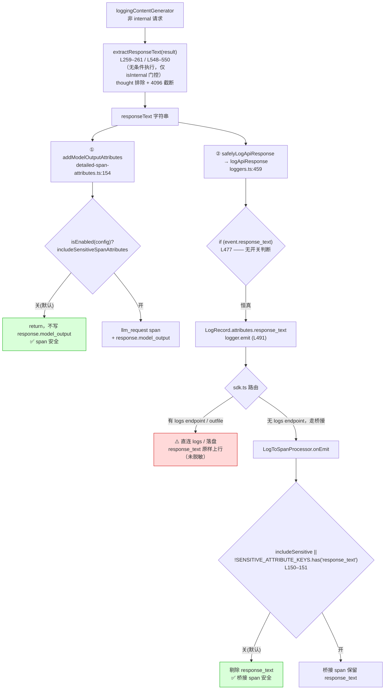
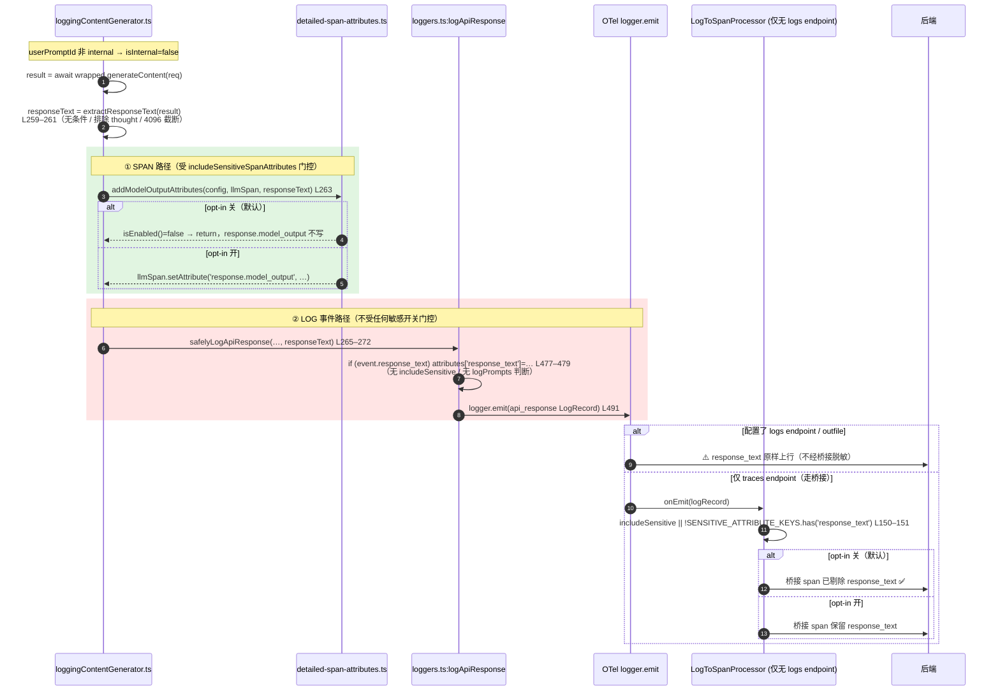

# 敏感属性 opt-in 与 PII（深入）

> 子文档；总览见 README.md
> 本文 **取代并细化** 总览 `telemetry-observability.md` 的 §3.4，下沉到 function/line 级。
> 代码均基于 `QwenLM/qwen-code@main`（除显式标注分支外）。引用格式 `file:symbol`（+行号），行号以阅读时的 `main` 为准。

---

## 概述

qwen-code 把「可能含 PII / 机密的高价值内容」分成两类载体写出：

1. **Span 属性**（trace 后端）：user prompt、system prompt、tool input/result、model output —— 全部集中在 `telemetry/detailed-span-attributes.ts`，由单一开关 `includeSensitiveSpanAttributes` 控制，**默认 OFF**。
2. **LogRecord 属性**（logs 后端 / log→span 桥接）：`api_request.request_text`、`tool_call.function_args`、`api_response.response_text`、`user_prompt.prompt` —— 分散在 `telemetry/loggers.ts` 各 `log*` 函数里，门控策略**不统一**。

本文的两条主线：

- **门控链**：`includeSensitiveSpanAttributes` 在 4 个层次（resolve / Config 构造 / getter / `LogToSpanProcessor`）全部 `?? false`，`detailed-span-attributes.ts` 每个 helper 入口 `isEnabled(config)` 短路，调用方再加一层「双守卫」避免昂贵的序列化。这条链是「默认安全」的落点。
- **泄露面**：`api_response` 这个 **LOG 事件** 的 `response_text` **不受** `includeSensitiveSpanAttributes` 也**不受** `logPrompts` 门控（只受 `isInternalPromptId` 门控）。也就是说 **SPAN 路径已门控、LOG 路径未门控**，配置了直连 OTLP logs 后端就会把模型回复原样上行。这是 #3893 review 留下的、当前仍存在于 `main` 的语义不一致 PII 泄露面。

「什么算敏感」：本文统一界定为 **prompt（用户输入）/ system_prompt（系统指令）/ function_args·tool I/O（工具入参出参）/ response_text·model_output（模型输出）/ request_text（整段请求会话）** 五类。

---

## 涉及 PR（表格）

| PR | 状态 | 子主题 | 与本文的关系 |
|---|---|---|---|
| **#3893** | MERGED | 敏感属性 opt-in | 引入 `includeSensitiveSpanAttributes` + `LogToSpanProcessor` 的 `SENSITIVE_ATTRIBUTE_KEYS` 二次脱敏；**同时**让 `api_response` 开始携带 `response_text`（非 internal）。PR body 自述「destinations that consume those events」会拿到 response_text —— 即本文重点泄露面的源头。 |
| **#4097** | MERGED (2026-05-16) | interaction span + detailed sensitive attrs | 新增 `detailed-span-attributes.ts` 全套 helper（`addUserPromptAttributes` / `addSystemPromptAttributes` / `addToolSchemaAttributes` / `addModelOutputAttributes` / `addToolInputAttributes` / `addToolResultAttributes`），并在调用方（`client.ts` / `coreToolScheduler.ts` / `loggingContentGenerator.ts`）加「双守卫」。这些 SPAN 属性是**双重门控**（`isEnabled` + 调用方守卫）。 |
| #3847 | MERGED | traceId/spanId 注入 | 部分相关：桥接 span 的 traceId 派生与本文的脱敏发生在同一个 `LogToSpanProcessor.onEmit` 里。 |

---

## opt-in 门控链（全默认 OFF + 每 helper `isEnabled` + 调用方双守卫）

### 0. 一图看全链

```mermaid
flowchart TB
  subgraph Resolve["① 配置解析层 telemetry/config.ts:resolveTelemetrySettings"]
    R["includeSensitiveSpanAttributes =\nparseBooleanEnvFlag(env[QWEN_TELEMETRY_INCLUDE_SENSITIVE_SPAN_ATTRIBUTES])\n?? settings.includeSensitiveSpanAttributes\n?? false  (L108–113)"]
  end
  subgraph Ctor["② Config 构造层 config.ts (L1138–1139)"]
    C["includeSensitiveSpanAttributes:\nparams.telemetry?.includeSensitiveSpanAttributes ?? false"]
  end
  subgraph Getter["③ getter 层 config.ts (L2997–2999)"]
    G["getTelemetryIncludeSensitiveSpanAttributes():\nreturn this.telemetrySettings.includeSensitiveSpanAttributes ?? false"]
  end
  subgraph Helpers["④a SPAN 写入 detailed-span-attributes.ts"]
    E["isEnabled(config) =\nisTelemetrySdkInitialized() && getTelemetryIncludeSensitiveSpanAttributes()\n(L20–25) —— 每个 add*Attributes 第一行短路"]
  end
  subgraph Bridge["④b 桥接脱敏 log-to-span-processor.ts"]
    B["constructor: includeSensitiveSpanAttributes ?? false (L117/L123)\nonEmit: includeSensitive || !SENSITIVE_ATTRIBUTE_KEYS.has(key) (L150–151)"]
  end
  subgraph Callers["⑤ 调用方双守卫 (#4097)"]
    K["if (getTelemetryIncludeSensitiveSpanAttributes?.()) { add*Attributes(...) }\nclient.ts:1305 / coreToolScheduler.ts:2626,2991"]
  end

  R --> C --> G
  G --> E
  G --> Callers
  G -.sdk.ts:296–297 注入.-> B
  K --> E
```

要点：**①②③** 是同一个布尔值流经「解析 → 落到 `telemetrySettings` → getter 暴露」的三段，每段都独立 `?? false`，任何一段读到 `undefined` 都收敛到 `false`；**④a/④b** 是两个真正消费这个布尔的子系统（SPAN 写入、桥接脱敏）；**⑤** 是调用方在 helper 之外再加的一层守卫。下面逐段拆。

### 1. 解析层 `telemetry/config.ts:resolveTelemetrySettings`（L108–113）

```ts
const includeSensitiveSpanAttributes =
  parseBooleanEnvFlag(
    env['QWEN_TELEMETRY_INCLUDE_SENSITIVE_SPAN_ATTRIBUTES'],
  ) ??
  settings.includeSensitiveSpanAttributes ??
  false;
```

- 优先级：环境变量 `QWEN_TELEMETRY_INCLUDE_SENSITIVE_SPAN_ATTRIBUTES`（`parseBooleanEnvFlag` 仅认 `'true'`/`'1'` 为 true，见 `config.ts:parseBooleanEnvFlag` L20–25）> `settings.json` 的 `telemetry.includeSensitiveSpanAttributes` > `false`。
- 注意它**没有 argv 来源**（不像 `enabled`/`logPrompts` 有 CLI flag），只有 env + settings 两条路径。这是个有意的克制：不给 CLI flag，降低误开概率。

### 2. Config 构造层 `config.ts`（L1129–1144）

`telemetrySettings` 在 `Config` 构造函数里再固化一次：

```ts
this.telemetrySettings = {
  ...
  logPrompts: params.telemetry?.logPrompts ?? true,                       // L1137 —— 注意默认 TRUE
  includeSensitiveSpanAttributes:
    params.telemetry?.includeSensitiveSpanAttributes ?? false,            // L1138–1139 —— 默认 FALSE
  ...
};
```

**关键对比**：同一个对象里，`logPrompts` 默认 **true**，`includeSensitiveSpanAttributes` 默认 **false**。两者门控的内容不同、默认姿态相反，是后文「泄露面」分析的根：`response_text` 既不在 `logPrompts` 的管辖下，也不在 `includeSensitiveSpanAttributes` 的管辖下。

### 3. getter 层 `config.ts:getTelemetryIncludeSensitiveSpanAttributes`（L2997–2999）

```ts
getTelemetryIncludeSensitiveSpanAttributes(): boolean {
  return this.telemetrySettings.includeSensitiveSpanAttributes ?? false;
}
```

第三次 `?? false`（纵深防御：即便上游构造漏填也兜底）。这是所有消费方唯一读取入口。`settingsSchema.ts:1010–1015` 给出 schema 默认 `false` + 警告文案（"Warning: this may expose sensitive data..."）。

### 4a. SPAN 写入：`detailed-span-attributes.ts` 每个 helper 的 `isEnabled` 短路

总闸 `isEnabled`（L20–25）：

```ts
function isEnabled(config: Config): boolean {
  return (
    isTelemetrySdkInitialized() &&                          // 闸门 1：SDK 已 init
    config.getTelemetryIncludeSensitiveSpanAttributes()     // 闸门 2：opt-in 开
  );
}
```

`isEnabled` = **「SDK 已初始化」AND「opt-in 开」** 双条件，缺一不写。六个写入 helper 全部把它放在函数体第一行短路：

| helper（`detailed-span-attributes.ts:symbol`） | 行 | 写入的 span 属性 | 入口守卫 |
|---|---|---|---|
| `addUserPromptAttributes` | L53–68 | `new_context = "[USER PROMPT]\n…"` | `if (!isEnabled(config) || !promptText) return;` (L58) |
| `addSystemPromptAttributes` | L72–97 | `system_prompt_hash` / `_preview` / `_length` /（去重后）`system_prompt` | `if (!isEnabled(config) || !systemInstruction) return;` (L77) |
| `addToolSchemaAttributes` | L101–150 | `tools`(summary) / `tools_count` / 逐 decl `tool_schema` event | `if (!isEnabled(config) || !tools?.length) return;` (L106) |
| `addModelOutputAttributes` | L154–169 | `response.model_output` | `if (!isEnabled(config) || !responseText) return;` (L159) |
| `addToolInputAttributes` | L173–189 | `tool_input = "[TOOL INPUT: …]\n…"` | `if (!isEnabled(config)) return;` (L179) |
| `addToolResultAttributes` | L193–209 | `tool_result = "[TOOL RESULT: …]\n…"` | `if (!isEnabled(config)) return;` (L199) |

即便调用方忘了守卫，helper 也保证「opt-in 关 → 不写任何属性」。

### 4b. 桥接脱敏：`LogToSpanProcessor` 的 `SENSITIVE_ATTRIBUTE_KEYS`

`log-to-span-processor.ts:39–46` 定义二次脱敏键集合：

```ts
const SENSITIVE_ATTRIBUTE_KEYS = new Set([
  'error', 'error.message', 'error_message',
  'prompt', 'function_args', 'response_text',
]);
```

构造函数两个重载都把 `includeSensitiveSpanAttributes` 默认 `false`（数字重载 L117、options 重载 L122–123）。`onEmit` 在把 LogRecord 属性拷贝进桥接 span 时按 key 过滤（L144–159）：

```ts
if (
  value !== undefined && value !== null &&
  (this.includeSensitiveSpanAttributes ||          // 开关开 → 全保留
    !SENSITIVE_ATTRIBUTE_KEYS.has(key))            // 否则剔除敏感键
) {
  attributes[key] = ...;
}
```

`sdk.ts:293–313` 构造桥接器时把开关注入：`includeSensitiveSpanAttributes: config.getTelemetryIncludeSensitiveSpanAttributes()`（L296–297）。**这是 `response_text` / `function_args` / `prompt` 在桥接路径上的唯一护栏**——下一节会展开它为何只在桥接路径生效。

### 5. 调用方双守卫（#4097）

`detailed-span-attributes.ts` 的 helper 虽已内部短路，但**入参往往需要昂贵的序列化**（`safeJsonStringify(toolInput)`、`partToString(request)`），若无条件计算再丢弃就白费 CPU/内存。调用方因此再加一层「开关守卫」把序列化也跳过：

- `core/client.ts:1305–1316`：
  ```ts
  if (interactionSpan && this.config.getTelemetryIncludeSensitiveSpanAttributes?.()) {
    // Guard partToString — addUserPromptAttributes would early-return
    // anyway, but the argument is evaluated unconditionally otherwise.
    addUserPromptAttributes(this.config, interactionSpan, partToString(request));
  }
  ```
- `core/coreToolScheduler.ts:2626–2633`（tool input）与 `:2991–3000`（tool result）：守卫包住 `safeJsonStringify(toolInput)` / `safeJsonStringify(content)`，注释明确「Tool results can contain Part[] with large inlineData/media payloads that we don't want to serialize when telemetry is off」。
- `core/loggingContentGenerator/loggingContentGenerator.ts:235–246, 350–361`：`addSystemPromptAttributes` / `addToolSchemaAttributes` 用 `if (!isInternal)` 守卫（注意这里守的是 **internal**，opt-in 守卫下沉在 helper 内 `isEnabled`）。

> `?.()` 可选调用：daemon / 非完整 `Config` 场景下 `getTelemetryIncludeSensitiveSpanAttributes` 可能不存在，`?.()` 让守卫退化为 falsy → 不写，安全。

---

## 截断与去重（60KB 截断、SHA-256 system_prompt 去重、`seenHashes` 进程级）

### 截断 `truncateContent`（L27–40）

```ts
const MAX_CONTENT_SIZE = 60 * 1024; // 60KB (L13)
export function truncateContent(content, maxSize = MAX_CONTENT_SIZE) {
  if (content.length <= maxSize) return { content, truncated: false };
  return {
    content: content.slice(0, maxSize) + '\n\n[TRUNCATED - Content exceeds 60KB limit]',
    truncated: true,
  };
}
```

- 单位是 **JS string length（UTF-16 code unit）**，不是字节；非 ASCII payload 实际字节会更多。60KB 是「噪声/泄露预算」而非硬字节上限。
- 返回 `{content, truncated}`；每个调用 helper 在 `truncated` 为真时附带旁注属性，便于后端识别被截断：
  - `addUserPromptAttributes`：`new_context_truncated` + `new_context_original_length`（L63–66）
  - `addModelOutputAttributes`：`response.model_output_truncated` + `response.model_output_original_length`（L164–167）
  - `addToolInputAttributes` / `addToolResultAttributes`：`*_truncated` + `*_original_length`（L184–187 / L204–207）
  - `addSystemPromptAttributes`：仅 `system_prompt_truncated`（L93–95，无 original_length，因为 `system_prompt_length` 已单独写）

> 注意这是 **SPAN 路径** 的 60KB 截断。**LOG 路径**（`response_text`）走的是另一套更小的 4096 截断（`loggingContentGenerator.ts:extractResponseText`，下一节），两条截断逻辑互相独立。

### system_prompt 去重（L82–96）

system prompt 通常体量大且每次请求重复，全量写每个 `llm_request` span 会爆基数与体积。`addSystemPromptAttributes` 用 SHA-256 去重：

```ts
const hash = `sp_${shortHash(text)}`;                 // shortHash = SHA-256(text).hex[:12]  (L42–44)
span.setAttributes({
  system_prompt_hash: hash,                            // 永远写：用于跨 span 关联
  system_prompt_preview: text.slice(0, 500),           // 永远写：前 500 字预览 (SYSTEM_PROMPT_PREVIEW_LENGTH)
  system_prompt_length: text.length,                   // 永远写
});
if (!seenHashes.has(hash)) {                           // 仅首次写全文
  seenHashes.add(hash);
  const { content, truncated } = truncateContent(text);
  span.setAttribute('system_prompt', content);
  if (truncated) span.setAttribute('system_prompt_truncated', true);
}
```

即：**每个 span 都带 hash/preview/length（轻量、可关联）；全文 `system_prompt` 只在该 hash 首次出现时写一次**。`addToolSchemaAttributes` 同理按 `tool_${hash}` 去重每个 declaration 的 `tool_schema` event（L133–143），且先把 Gemini 形态 `[{functionDeclarations:[...]}]` 扁平化（L113–121）再逐条 hash。

### `seenHashes` 进程级、生产不清（L16–18）

```ts
// Process-global; intentionally never cleared in production. Bounded by the
// number of unique system prompts + tool schemas seen in one session.
const seenHashes = new Set<string>();
```

- 进程级单例，跨 span / 跨 session 共享。`clearDetailedSpanState()`（L213–215）只清 `seenHashes`，测试中由 `beforeEach` 调用；**生产中由 chat compression callback 调用**（见下条）。
- #4660 修复了 chat compression 后 `seenHashes` 未清除的 bug——压缩使历史重置，但 dedup Set 残留导致压缩后首条 system prompt 的 hash 仍「已见」而跳过全量属性。现在 compression callback 中调用 `clearSeenHashes()`。
- 上界 = 「一个 session 内 unique system prompt + tool schema 数」，量级很小。但**对长寿 daemon 常驻进程（多 session 复用同一进程）会单调增长**，属慢内存增长点（见「已知限制」）。
- 副作用：去重是进程级，意味着**同一全量 system_prompt 在整个进程生命周期内只写一次**。若第一次写它的那条 trace 后来被采样丢弃 / 导出失败，后续 span 只剩 hash 引用，**全量内容在后端永久缺失**（见「已知限制」）。

---

## `response_text` 的未门控泄露面（#3893）

这是本文的核心。结论先行：

> **同一份 `responseText` 字符串，分两路写出。SPAN 路径（`addModelOutputAttributes`）受 `includeSensitiveSpanAttributes` 门控；LOG 事件路径（`logApiResponse` → `api_response` LogRecord）不受任何敏感开关门控，只受 `isInternalPromptId` 门控。**

### 源头：`extractResponseText` 无条件运行（非 internal）

`loggingContentGenerator.ts` 非流式 `generateContent` 路径，**L259–261**：

```ts
const durationMs = Date.now() - startTime;
const responseText = isInternal                    // ← 唯一门控是 isInternal
  ? undefined
  : this.extractResponseText(result);              // ← 非 internal 即无条件抽取
```

- `isInternal = isInternalPromptId(userPromptId)`（L228）；`isInternalPromptId`（`utils/internalPromptIds.ts:31`）只对 `prompt_suggestion` / `forked_query` / `speculation` / `side-query:*` 返回 true。**普通用户对话一律非 internal**。
- 也就是说，**只要是用户真实请求，`extractResponseText` 一定执行**，与 `includeSensitiveSpanAttributes`、`logPrompts` 都无关。
- `extractResponseText`（L829–876）：拼接 `candidates[0].content.parts` 的 `text`，**显式排除 thought**（`!('thought' in part && part.thought)`，L862–866），并在 `MAX_RESPONSE_TEXT_PREFIX_LENGTH = 4096 - len('...[truncated]')`（L70–71）处截断、追加 `...[truncated]` 后缀。
- 流式路径 **L548–550** 同构：`consolidateGeminiResponsesForLogging` 合并 chunk 后同样 `isInternal ? undefined : extractResponseText(consolidated)`。

### 分流：一个 responseText，两条出口

非流式 `generateContent`（L262–272）：

```ts
if (!isInternal) {
  addModelOutputAttributes(this.config, llmSpan, responseText);   // ① SPAN 路径（已门控）
}
this.safelyLogApiResponse(                                        // ② LOG 路径（未门控）
  result.responseId ?? '', durationMs,
  result.modelVersion || req.model, userPromptId,
  result.usageMetadata,
  responseText,                                                  // ← 同一个值喂给 log 事件
);
```

流式 `loggingStreamWrapper`（L556–569）结构一致：先 `safelyLogApiResponse(..., streamResponseText)`（②，L557–566），再 `if (!isInternal && span) addModelOutputAttributes(..., streamResponseText)`（①，L567–569）。

**① SPAN 路径 —— 已门控**：`addModelOutputAttributes`（`detailed-span-attributes.ts:154`）第一行 `if (!isEnabled(config) || !responseText) return;`。opt-in 关 → `response.model_output` 不写入 `llm_request` span。✅

**② LOG 路径 —— 未门控**：`safelyLogApiResponse`（L190–210）→ `_logApiResponse`（L122–143）→ `logApiResponse(config, new ApiResponseEvent(..., responseText, ...))`。`ApiResponseEvent`（`types.ts:340–387`）把 `response_text` 存进字段（L382）。最终在 `loggers.ts:logApiResponse` 落地：

```ts
// loggers.ts:459 logApiResponse
export function logApiResponse(config: Config, event: ApiResponseEvent): void {
  ...
  if (!isTelemetrySdkInitialized()) return;                  // L470
  const attributes: LogAttributes = { ...getCommonAttributes(config), ...event, ... };
  if (event.response_text) {                                 // L477 —— 无任何开关判断
    attributes['response_text'] = event.response_text;       // L478
  }
  ...
  logger.emit(logRecord);                                    // L491 → OTLP logs / 桥接
}
```

**L477–479 没有任何 `includeSensitiveSpanAttributes` / `shouldLogUserPrompts` 判断**。对照同文件 `logUserPrompt`（L189–191）—— `prompt` 至少被 `shouldLogUserPrompts(config)` 门控（虽然其默认 `logPrompts=true`）：

```ts
// loggers.ts:189 logUserPrompt —— 有门控（即便默认 ON）
if (shouldLogUserPrompts(config)) {          // = config.getTelemetryLogPromptsEnabled() (L123–124)
  attributes['prompt'] = event.prompt;
}
```

`response_text` **连这层「默认 ON 的门控」都没有**。

### 唯一护栏只在桥接路径生效

`response_text` 在 `SENSITIVE_ATTRIBUTE_KEYS` 里（`log-to-span-processor.ts:45`），所以**当 logs 经桥接转成 span 时**会被剔除（除非 opt-in 开）。但桥接器只在 **「有 traces endpoint 但无 logs endpoint」** 时才接线（`sdk.ts:287–314`）。两种场景因此漏掉护栏：

1. **直连 OTLP logs 后端**：`logger.emit` 直接走 logs exporter，根本不经 `LogToSpanProcessor`，`response_text` 原样上行。
2. **file outfile**：三 signal 全落盘（`FileLogExporter`），也不经桥接脱敏。

### 全量 LOG 事件泄露面（把 response_text 放进上下文）

把 `loggers.ts` 里所有承载敏感内容的 LOG 属性列齐，能看出 `response_text` 只是同一类问题的一个面：

| LOG 事件 (`loggers.ts:fn`) | 敏感属性 | 受 `logPrompts`? | 受 `includeSensitive`? | 桥接 `SENSITIVE_ATTRIBUTE_KEYS` 过滤? | 直连 logs / outfile 是否泄露 |
|---|---|---|---|---|---|
| `logUserPrompt` (L173) | `prompt` (L190) | **是**（默认 ON） | 否 | 是（`prompt` 在集合内） | 是（除非显式 `logPrompts=false`） |
| `logToolCall` (L220) | `function_args` (L238) | 否 | 否 | 是（`function_args` 在集合内） | **是** |
| `logApiRequest` (L327) | `request_text`（`...event` 展开） | 否 | 否 | **否**（`request_text` 不在集合内） | **是（连桥接都不过滤）** |
| `logApiResponse` (L459) | `response_text` (L478) | 否 | 否 | 是（`response_text` 在集合内） | **是（本文重点 #3893）** |

> 旁注：`api_request.request_text`（整段 `JSON.stringify(contents)` 会话历史）的泄露面**比 `response_text` 还大**——它既不受任何开关，且 key `request_text` 都不在桥接过滤集合里，连桥接路径都漏。同属 #3893 review 这一类语义不一致，本文以 `response_text` 为代表案例。

### 路径对比图



---

## 时序图（一次非 internal LLM 响应：span 属性受门控 vs log 事件 response_text 不受门控）



读图要点：**步骤 5（SPAN）默认被门控挡掉，步骤 8–9（LOG）默认畅通无阻**。两条路径同源（步骤 3 的 `responseText`），却由不同开关把守，这正是不一致所在。

---

## 边界与错误处理

- **SDK 未 init**：`isEnabled`（L22）要求 `isTelemetrySdkInitialized()`，未 init 时 SPAN 写入全 no-op；`logApiResponse` 也在 L470 `if (!isTelemetrySdkInitialized()) return;` 早退（但注意 `uiTelemetryService.addEvent` L465、`chatRecordingService` L466–468、`QwenLogger` L469 在该早退**之前**，仍会执行——这三者是本地 UI / RUM，不上 OTLP）。
- **空内容短路**：`addUserPromptAttributes`(`!promptText`)、`addSystemPromptAttributes`(`!systemInstruction`)、`addModelOutputAttributes`(`!responseText`)、`addToolSchemaAttributes`(`!tools?.length`) 都在守卫里带空值判断，避免写空属性。
- **不可序列化兜底**：`stringifyContentUnion`（L46–49）对非 string 走 `safeJsonStringify`，失败回退 `''`；`addToolSchemaAttributes` 对单个 declaration 序列化失败回退 `unstringifiable_<name>`（L129）。`LogToSpanProcessor.safeStringify`（L420–426）对循环引用 / BigInt 回退 `'[unserializable]'`。
- **best-effort span 属性**：`loggingContentGenerator.ts` 设 `llm_request.stream` 用 `try {} catch { /* best-effort */ }`（L218–221 / L330–334），OTel 抛错不影响请求。
- **idle 超时与一致性**：流式 span 若 5min 空闲被超时结束（`spanEndedByTimeout`），后续成功分支**跳过** `safelyLogApiResponse` + `addModelOutputAttributes`（L556 守卫），避免「span 已超时失败」与「api_response success（含 response_text）」自相矛盾。
- **桥接导出错误**：`LogToSpanProcessor.flush`（L287–331）用 30s 超时 + `formatExportError` 提取 httpCode/data，且 `emitDiagnostic` 吞掉 sink 自身异常（L279–285），保证脱敏/导出环节出错不阻断后续 ingest。

---

## 关键设计决策与权衡（默认安全、按需开启）

1. **SPAN 敏感属性默认 OFF + 四层 `?? false`**：解析/构造/getter/桥接四处独立兜底到 `false`，任一层漏填都不会意外开启。代价是开箱 trace 信息量少，深度排障需显式 `QWEN_TELEMETRY_INCLUDE_SENSITIVE_SPAN_ATTRIBUTES=true` 或 settings opt-in。
2. **helper 内 `isEnabled` + 调用方双守卫**：helper 内门控保证「绝不写」，调用方守卫额外省掉昂贵序列化（`safeJsonStringify` 大 Part[]、`partToString`）。两层职责分离：正确性在 helper，性能在调用方。
3. **SHA-256 去重 + preview/hash 永远写**：全量只写一次、轻量元数据每次写。权衡：12 字符 hash 有极小碰撞概率（可接受）；去重进程级导致「全量内容跨进程仅一次」的可见性风险。
4. **SPAN 60KB / LOG 4096 两套截断**：SPAN 给排障留更大窗口（60KB），LOG 事件（高频、易放大基数）收得更紧（4096）。`response_text` 走 4096 是因为它本就是高频 api_response 事件属性。
5. **`response_text` 写在「源事件」而非桥接处（#3893 的有意取舍）**：PR body 明确「response text is now populated on non-internal API response telemetry events, destinations that consume those events [will receive it]」。即作者**有意**让 api_response 携带 response_text 以服务「消费 api_response 的下游」，把脱敏责任放到桥接的 `SENSITIVE_ATTRIBUTE_KEYS`。**遗漏**在于：没有为「直连 logs / outfile」这两条不经桥接的路径补门控，导致 SPAN 与 LOG 的隐私姿态不一致。

---

## 已知限制 / 后续

1. **`response_text` 未受敏感开关门控（#3893 review 遗留，`main` 仍在）**：`loggers.ts:logApiResponse` L477–479 无条件写 `response_text`。**建议**：把它挂到一个门控下——最自然是 `shouldLogUserPrompts`（`logPrompts`），与 `prompt` 对齐（同为「对话内容」语义）；或新增专用 `logResponses` 开关。理由：`includeSensitiveSpanAttributes` 语义是「SPAN 属性」，而这是 LOG 事件，挂在 `logPrompts` 下语义更顺，也修掉「直连 logs 后端漏脱敏」。
2. **`request_text` 比 `response_text` 更裸露**：`api_request.request_text`（整段会话）既无开关，且 key 不在桥接 `SENSITIVE_ATTRIBUTE_KEYS` 内（连桥接都不过滤）。同一修复应一并覆盖。
3. **`seenHashes` 永不清理 → 长寿进程慢增长**：`detailed-span-attributes.ts:18` 进程级 Set，生产不清。daemon 多 session 复用同一进程时单调增长。
4. **`seenHashes` 跨 session 丢全量 system_prompt**：因进程级去重，全量 `system_prompt`/`tool_definition` 在进程生命周期内只写首次。若首次那条 trace 被采样丢弃或导出失败，后续 span 只有 hash 引用，**全量内容在后端永久缺失**；`clearDetailedSpanState` 只在测试调用，生产 `/clear`、`/resume` 不重置它。建议：要么按 session 维度分桶去重并随 session 切换清理，要么周期性写「全量 anchor span」。
5. **桥接默认不可达放大泄露面**：因 `getTelemetryOtlpEndpoint()` 恒非空 + 默认 grpc（见总览 §7.1），「无 logs endpoint 才触发」的 HTTP 桥接默认走不到，意味着 `SENSITIVE_ATTRIBUTE_KEYS` 这道唯一护栏在多数默认配置下根本不参与，`response_text` 更易直连泄露。

---

## 测试覆盖

| 测试文件:用例 | 覆盖点 |
|---|---|
| `detailed-span-attributes.test.ts` (404 行) | 全部 6 个 helper 的 happy path + `no-ops when flag is disabled`（L132/L213/L358 验证 opt-in 关短路）+ `no-ops when SDK is not initialized`（L141）+ 60KB 截断旁注（L158/L203/L328/L379）+ system_prompt SHA-256 去重（L181 `deduplicates full content on same hash`）+ Gemini `functionDeclarations` 扁平化（L277）+ `clearDetailedSpanState` 重置去重（L390） |
| `log-to-span-processor.test.ts` | `drops sensitive attributes before exporting bridged spans`（L155，默认关时 `prompt`/`function_args`/`response_text` 被剔除，L178–180）+ `keeps sensitive attributes when explicitly enabled`（L186，opt-in 开时三者保留，L214–216） |
| `loggers.test.ts` | `logApiResponse` 用例（L321–343）断言 `response_text: 'test-response'` **无条件**写入 LogRecord attributes —— 即**该测试本身固化了「response_text 不受敏感开关门控」的现状行为**（mockConfig 未设任何 sensitive flag） |
| `loggingContentGenerator.test.ts` | `extractResponseText` 行为：thought 排除（L331 `normalizes thought parts`，L412 断言 `response_text='ok'` 不含 thought）+ 4096 截断（L806 `truncates long response text`，L830–831）+ internal/thought-only 省略 response_text（L840–866 `omits response_text for %s`，L1953/L2021 internal 路径 `response_text` undefined） |

**覆盖缺口**：没有用例验证「**直连 logs endpoint（不经桥接）时 response_text 是否应被门控**」——因为现状就是「不门控」，测试只固化了现状（`loggers.test.ts:339`）。若按「已知限制 1」修复，需新增「`logPrompts=false`（或新开关关）→ api_response 不含 response_text」的回归用例。
