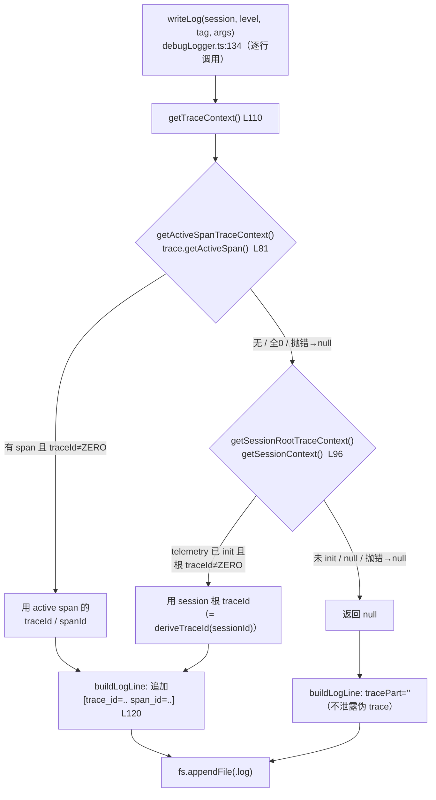
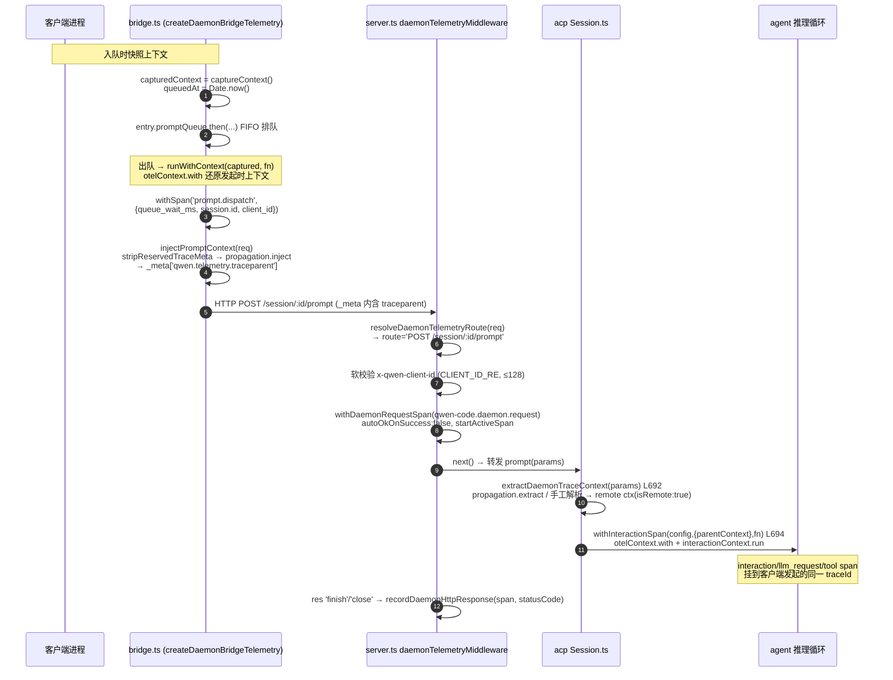

# trace↔日志关联与 daemon 端遥测（深入）

> 子文档；总览见 [README.md](README.md)。本篇**取代**总览 telemetry-observability.md 的 §3.5 / §3.6，下沉到函数与行级。
>
> **分支说明**：`getTraceContext` 及 debug log 注入位于 `main`（`packages/core/src/utils/debugLogger.ts`）；daemon 端遥测最初落在 **`daemon_mode_b_main`**，已随 #4490 于 2026-06-11 合入 `main`。文中保留 `daemon_mode_b_main` 标注用于说明原始落地位置，阅读当前代码时以 `main` 为准。

---

## 概述

本篇回答两个互锁的问题：

1. **同一进程内**，落盘的 debug 日志行如何与 trace 后端的 span 双向跳转——核心是 `debugLogger.ts:getTraceContext()` 的**三级回退序**（active span → session 根 context → 省略），以及「无 span 时绝不泄露伪 trace」的护栏。
2. **跨 CLI↔daemon 进程边界**，一次 prompt 如何缝合成一棵 trace——核心是经 ACP/MCP 消息体 `_meta` 字段透传 W3C `traceparent`、daemon 侧 route span 的生命周期、`AsyncLocalStorage` 上下文在 FIFO 队列后的延迟还原，以及对客户端伪造 trace 元数据的剥离。

两条线被同一个**确定性 traceId**（`trace-id-utils.ts:deriveTraceId(sessionId) = SHA-256(sessionId)[:32]`）串起来：无论是 debug log 行、log→span 桥接 span、真实业务 span，还是 daemon 远端继承的 span，只要 `sessionId` 一致，traceId 即一致，从而在后端聚合到同一棵 trace。

---

## 涉及 PR

| PR | 状态 | 子主题 | 落点 | 分支 |
|---|---|---|---|---|
| #3847 | MERGED | trace↔log 关联 | debug log 行注入 `trace_id` / `span_id`（`debugLogger.ts:getTraceContext`） | main |
| #4058 | MERGED | 关联跟进 | #3847 review 跟进修复（ZERO_TRACE_ID 守卫、回退序） | main |
| #4499 | MERGED | interaction 归属 | interaction span 直接 pin 到 session 根 context | main |
| #4482 | MERGED | 桥接错误信息 | 改进 LogToSpan export 错误信息 + TUI diagnosticsSink | main |
| #4556 | MERGED | daemon prompt 生命周期 | `daemon-tracing.ts` route/bridge span + `_meta` traceparent 注入/提取；`channel.spawn` / `channel.initialize` / `session.new` / `prompt.dispatch` / `session.cancel` / `session.close` | `daemon_mode_b_main` |
| #4628 | MERGED | client_id + 权限 span | `qwen-code.client_id` 属性 + 校验 + permission route span | `daemon_mode_b_main` |
| #4682 | MERGED | daemon 路由覆盖扩展 | 扩展 `resolveDaemonTelemetryRoute` 覆盖所有写路由（除 heartbeat）；修复尾部斜杠不匹配 + workspace sessions regex 过度匹配 | `daemon_mode_b_main` |
| #4749 | MERGED | daemon OTel metrics + structured log | 11 个 OTel metric instruments（Counter/Histogram/ObservableGauge）覆盖 HTTP 请求、session/channel 生命周期、prompt 队列等待与执行时长、bridge 错误、SSE 活跃连接、堆内存；扩展 `BridgeTelemetry` 接口增加 `metrics` 子对象；`emitDaemonLog` 泛化支持自定义事件名与 severity；`service.instance.id` Resource 属性 + `forceFlushMetrics()` 预关闭快照 | `daemon_mode_b_main` |
| #6907 | OPEN | cold first-session startup trace | deferred runtime wait、`channel.wait`、`session_start` stage timing 与 profiler `sessionId`，把首个 session 启动耗时拆进 daemon trace | `main` diff |
| #7003 | OPEN | legacy session workspace telemetry | 48 条 legacy session/permission route catalog、handler-resolved workspace hash late bind、SSE request metrics 隔离 | `main` diff |

---

## trace↔debug log 关联

### 注入点与三级回退序

入口 `debugLogger.ts:writeLog`（main, L134）在每写一行日志时**实时**调用 `getTraceContext()`（L147）——注意是**逐行**取，而非进程级缓存，这样同一进程内不同执行点的日志行能各自拿到「当时」的 span 上下文。

`getTraceContext()`（`debugLogger.ts:110`）：

```ts
function getTraceContext(): TraceContext | null {
  return getActiveSpanTraceContext() ?? getSessionRootTraceContext();
}
```

三级回退序（第三级是 `buildLogLine` 对 `null` 的处理）：

1. **active span**——`getActiveSpanTraceContext()`（L81）：`trace.getActiveSpan()` 取当前 OTel active span，返回其 `traceId` / `spanId`。当日志行恰好发生在某个 `interaction` / `llm_request` / `tool` span 活跃期内时，行会被标到**最精确**的 spanId。
2. **session 根 context**——`getSessionRootTraceContext()`（L96）：经 `session-context.ts:getSessionContext()`（main）取合成 session 根 context，`trace.getSpan(ctx)?.spanContext()`。**此分支仅在 telemetry SDK 已初始化、且 `setSessionContext` 已被调用后才有值**；它保证「即使当前没有任何 active span」，行仍能挂到 session 级 traceId。
3. **省略**——两者皆 `null` 时 `getTraceContext` 返回 `null`，`buildLogLine`（L120）的 `tracePart` 为空串，日志行**不含** `[trace_id=... span_id=...]` 段。

`buildLogLine` 输出格式（L131）：

```
2026-01-23T06:58:02.011Z [DEBUG] [TAG] [trace_id=xxx span_id=yyy] message
```

### 无 span 不泄露：三重护栏

「无 span 不泄露」指**绝不写出全 0 或伪造的 traceId**，要么写真实可关联的 id，要么什么都不写：

- **ZERO_TRACE_ID 守卫**（`debugLogger.ts:79`，`'0'×32`）：active span 与 session 根两条分支都显式判 `ctx.traceId !== ZERO_TRACE_ID`，剔除 OTel 在「无有效 span」时返回的全 0 invalid SpanContext。这是 #4058 的 review 跟进重点——否则会向日志写出形如 `trace_id=00000000...` 的无效段。
- **telemetry 未初始化即省略**：第 2 级依赖 `getSessionContext()` 返回非空，而它只在 SDK init / `refreshSessionContext` 调 `setSessionContext` 后才有值。SDK 未起时第 2 级返回 `null` → 第 3 级省略。
- **try/catch 吞错**（L82–93 / L97–107）：两个 getter 全包 try/catch 返回 `null`。**遥测异常绝不能让 debug 日志写入崩溃**——这是「关联是增益、不是依赖」的体现。

> **关键澄清——两套独立的 session 概念**：`debugLogger.ts` 内有一个**自己的** `sessionContext = new AsyncLocalStorage<DebugLogSession>()`（L33），它经 `getActiveSession()`（L47，`sessionContext.getStore() ?? globalSession`）决定日志**写到哪个文件**（按 `sessionId` 分文件）；而 trace 注入用的是 telemetry 子系统的 `session-context.ts:getSessionContext()`（OTel `Context`）。二者同名易混，但职责正交：前者选文件，后者选 traceId。

### 确定性 traceId 的串联作用

`getSessionRootTraceContext` 取到的 session 根 traceId，与 `LogToSpanProcessor`、真实 span 同源——都来自 `trace-id-utils.ts:deriveTraceId(sessionId)`。因此「一条没有 active span 的 debug log」写出的 traceId，与该 session 内任何真实 span、任何 log 桥接 span 的 traceId **逐字符相同**，后端据此聚合到同一棵 trace。这是用「确定性派生」换「无随机根也可关联」的取舍（总览决策 #6）。

---

## daemon 路由 span（原 `daemon_mode_b_main`，现 `main`）

> 全部位于 `daemon_mode_b_main:packages/core/src/telemetry/daemon-tracing.ts`（358 行），并由 `telemetry/index.ts`（L173–186）re-export。

### 中间件：daemonTelemetryMiddleware

`server.ts:daemonTelemetryMiddleware(boundWorkspace)`（`daemon_mode_b_main`, L331，装载于 L959 `app.use(...)`）是一个 Express 中间件工厂：

- 早期版本在闭包内一次性算出 `workspaceHash = hashDaemonWorkspace(boundWorkspace)`（`daemon-tracing.ts:hashDaemonWorkspace` = `SHA-256(workspace)[:16]`，**不落明文路径**）。#7003 后，legacy session route 的 workspace hash 可以在 handler 解析 owner runtime 后 late-bind；process-global 或无法解析 owner 的请求仍不写明文 path。
- 每请求先过 `resolveDaemonTelemetryRoute(req)`（见下）；**返回 `undefined` 的路由直接 `next()` 放行、不开 span**（白名单制，避免给健康检查等噪声路由建 span）。
- 读 `CLIENT_ID_HEADER`（`'x-qwen-client-id'`，L3134）做**软校验**（见 client_id 一节）。
- 调 `withDaemonRequestSpan(opts, fn)`，`fn` 把 `next()` 包进一个 Promise：监听 `res` 的 `'finish'` / `'close'`（用 `done` 标志去重，`finish()` 只跑一次），收尾时 `recordDaemonHttpResponse(span, res.statusCode)`；`next()` **同步**抛错则 `recordDaemonError(span, error)` 并 reject；尾部 `.catch(next)` 把异步错误交回 Express 错误链。

### 路由归一：resolveDaemonTelemetryRoute（基数控制）

`server.ts:resolveDaemonTelemetryRoute(req)`（`daemon_mode_b_main`, L280）是一张**显式路由白名单**，对每个匹配返回**模板化**的 `route` 字符串与抽出的 id。#7003 将其扩展为 legacy session/permission telemetry catalog：48 条 explicit route 中，7 条可在进入 handler 前 pre-resolve workspace，41 条必须等 handler 通过 session/runtime resolver 选中 owner 后再写入 workspace hash。

> **尾部斜杠归一化**（#4682）：匹配前先 `req.path.replace(/\/$/, '') || '/'` 去尾部斜杠，避免 `/session/abc/prompt/` 这类请求因多一个 `/` 而静默不匹配、丢失 span。

| 匹配 | 返回 route（`http.route` 值） | 旁带 |
|---|---|---|
| `POST /session` | `POST /session` | — |
| `POST /sessions/delete` | `POST /sessions/delete` | — |
| `POST /session/:id/{load\|resume\|prompt\|cancel\|recap\|btw\|model\|shell\|detach\|approval-mode}` | `POST /session/:id/{action}` | `sessionId` |
| `PATCH /session/:id/metadata` | `PATCH /session/:id/metadata` | `sessionId` |
| `POST /session/:id/permission/:requestId` | `POST /session/:id/permission/:requestId` | `sessionId`, `permissionRequestId` |
| `POST /permission/:requestId` | `POST /permission/:requestId` | `permissionRequestId` |
| `DELETE /session/:id` | `DELETE /session/:id` | `sessionId` |
| `GET /workspace/:id/sessions` | `GET /workspace/:id/sessions` | — |
| `POST /workspace/init` | `POST /workspace/init` | — |
| `POST /workspace/mcp/:server/restart` | `POST /workspace/mcp/:server/restart` | — |
| `POST /workspace/mcp/servers` | `POST /workspace/mcp/servers` | — |
| `DELETE /workspace/mcp/servers/:name` | `DELETE /workspace/mcp/servers/:name` | — |
| `POST /workspace/auth/device-flow` | `POST /workspace/auth/device-flow` | — |
| `DELETE /workspace/auth/device-flow/:id` | `DELETE /workspace/auth/device-flow/:id` | — |
| `POST /workspace/tools/:name/enable` | `POST /workspace/tools/:name/enable` | — |

> **regex 修正**（#4682）：`GET /workspace/:id/sessions` 的匹配从 `.+` 收紧为 `[^/]+`，防止跨路径段过度匹配。

**基数关键**：`http.route` 永远写**模板**（`:id` 占位），真实的 sessionId / requestId 落到**专属属性**（`session.id` / `qwen-code.daemon.permission.request_id`）。这样 `http.route` 维度只随显式 catalog 增长，不会被 UUID 撑爆时序基数；需要按具体 session 下钻时再用专属属性过滤。

**workspace 归因关键（#7003）**：handler-resolved route 在 `requireSessionRuntime`、session create/load/resume、export/transcript resolver 等路径拿到 selected runtime 后，调用 `setDaemonTelemetryWorkspace(res, runtime.workspaceCwd)` 写入 `qwen-code.workspace.hash`。unresolved、ambiguous、workspace mismatch、session not found 等情况不 fallback primary，以免把未知 owner 的请求误归到 primary workspace。`GET /session/:id/events` 这类长连接仍保留 request span，但从普通 request latency metrics 中排除，避免 SSE lifetime 污染短请求延迟直方图。

### route span：withDaemonRequestSpan

`daemon-tracing.ts:withDaemonRequestSpan(options, fn)` 委托给 `withDaemonSpan(SPAN_DAEMON_REQUEST, attrs, fn, { autoOkOnSuccess: false })`，span 名 `qwen-code.daemon.request`。属性（按需条件写入）：

- `http.request.method` / `http.route` / `qwen-code.daemon.operation = 'http_request'`（恒有）
- `qwen-code.workspace.hash`（hash，不落路径）
- `session.id` / `qwen-code.client_id`（#4628）/ `qwen-code.daemon.permission.request_id`（#4628）

`withDaemonSpan`（`daemon-tracing.ts`）的统一骨架：

- **SDK 未初始化短路**：`if (!isTelemetrySdkInitialized()) return await fn(undefined as Span)`——handler 照常执行，只是 span 为 `undefined`（下游 `recordDaemonHttpResponse(undefined, ...)` 等都做了空判）。
- `tracer.startActiveSpan(...)`——用 **active** 变体，使该 span 成为上下文中的 active span，从而其下创建的 `interaction` / `llm_request` / tool span 自动 parent 到它。
- `try → fn → (autoOkOnSuccess ? setStatus OK)`；`catch → recordDaemonError + 重抛`；`finally → span.end()`。
- **`autoOkOnSuccess: false`（route span 专属）**：成功路径**不**自动置 OK，终态留给 `recordDaemonHttpResponse` 写 `http.response.status_code`（注意它只写 status_code 属性、不动 span 的 OK/ERROR status）；只有异常才经 `recordDaemonError` 置 ERROR。于是「正常返回 4xx 的请求」span status 保持 UNSET，由 status_code 表达，而非误标 OK。

### client_id：双层校验与基数边界（#4628）

`qwen-code.client_id` 取自 HTTP header `x-qwen-client-id`，有**两层**校验，二者用同一组常量（`server.ts`，`daemon_mode_b_main`）：`MAX_CLIENT_ID_LENGTH = 128`（L3135）、`CLIENT_ID_RE = /^[A-Za-z0-9._:-]+$/`（L3140）：

1. **中间件软校验**（route span 用，L341–346）：非空 ∧ `≤128` ∧ 匹配 `CLIENT_ID_RE` 才取为 `clientId`，否则 `clientId = undefined`——**只是省略属性，绝不拒请求**（遥测不影响请求）。
2. **body handler 硬校验** `parseClientIdHeader(req, res)`（L3332）：三态返回——`undefined`（header 缺省）/ `null`（非法，**已回 400 `invalid_client_id`**）/ 原值。这是业务侧对伪造 client id 的拒绝点。

**基数边界**：client_id 只有过了字符集（仅 `A-Za-z0-9._:-`）+ 长度上限才进 span，杜绝「任意 header 值 → 无界 attribute 基数」与控制字符注入；恶意/畸形 header 在 span 维度上被挡在外面。

### permission 路由 span（#4628）

`resolveDaemonTelemetryRoute` 识别 `POST /session/:id/permission/:requestId` 与全局 `POST /permission/:requestId`，route span 因此携带 `qwen-code.daemon.permission.request_id`，让「一次工具审批投票」在 trace 上成为可定位的一跳。

### prompt.dispatch span（bridge 侧）

`bridge.ts`（`daemon_mode_b_main`, L2248）在 FIFO prompt 队列的 worker 内开 `prompt.dispatch` span（经 `telemetry.withSpan` → `withDaemonBridgeSpan` → span 名 `qwen-code.daemon.bridge`）。属性：`qwen-code.daemon.bridge.operation = 'prompt.dispatch'`、`session.id`、`qwen-code.daemon.prompt.queue_wait_ms = Date.now() - queuedAt`（**排队等待耗时**，量化 FIFO 队头阻塞）、可选 `qwen-code.client_id`。span 内调 `telemetry.injectPromptContext(normalized)` 把 traceparent 注入转发给 agent 的 `PromptRequest._meta`（见下节）。

### cold first-session startup span（#6907，open）

#6907 把 `POST /session` 冷启动拆成三层：route 层记录 deferred runtime wait 并把等待耗时回填到 HTTP span；bridge 层增加 `channel.wait` span，区分复用已有 channel、加入 in-flight spawn、还是本请求触发 spawn，并写入 channel 诊断 UUID；ACP child 收到 `session/new` traceparent 后，在 `Session.startChat()` 周围开 `qwen-code.daemon.session_start` span，记录 `newSession`、settings/bootstrap、`startChat()` 等阶段耗时。JSONL session-start profiler 同步带可选 `sessionId`，便于把本地 profiler 与 OTel trace 对齐。

### legacy session workspace telemetry（#7003，open）

#7003 专门处理 multi-workspace 后的 legacy route attribution：`/session/:id/*`、`/sessions/*`、`/permission/*` 中大量 route 的真实 owner 只有 handler 执行时才能知道，因此不能在 middleware 入口盲写 primary workspace hash。实现把 route 分成 pre-resolved 与 handler-resolved 两类，后者由 handler 在成功解析 selected runtime 后 late-bind workspace hash；如果解析结果是 ambiguous/mismatch/not found，则 span 仍保留 route、sessionId、permissionRequestId 等低基数字段，但不带 workspace hash。

这保持了两个边界：遥测失败或缺 owner 不能改变 HTTP 行为；workspace hash 是 hash 后的低敏归因字段，不暴露 cwd 明文，也不把 process-global route 强行解释成某个 workspace。

---

## 跨进程 W3C 传播（via `_meta`）

> 全部 `daemon_mode_b_main:daemon-tracing.ts`。保留键：`DAEMON_TRACEPARENT_META_KEY = 'qwen.telemetry.traceparent'`、`DAEMON_TRACESTATE_META_KEY = 'qwen.telemetry.tracestate'`。

### 为什么是 `_meta` 而非 HTTP header

prompt 的转发走 ACP/MCP 的 **JSON-RPC 消息体**，`_meta` 是该协议的标准扩展位。把 traceparent 放进 `_meta` 让 trace 上下文随消息体天然流转，无需为 bridge 形态另开一条 header 旁路；提取端（agent 进程）从同一条消息里就能拿到，不依赖 HTTP 层。

### 注入：injectDaemonTraceContext

`injectDaemonTraceContext<T>(request)`：

1. 读 `request._meta`。
2. **`activeSpanContextIsValid()` 守卫**（L57，判 active span 的 traceId/spanId 非全 0）：无效时**不注入**，仅返回 `stripReservedTraceMeta(currentMeta)` 后的 `_meta`（或原样）——避免把 `00000...` 之类无效 traceparent 传出去。
3. 有效时先 `stripReservedTraceMeta(currentMeta)`（**剥掉客户端可能自带的保留键，防伪造**），再 `propagation.inject(otelContext.active(), carrier)`，把 `carrier['traceparent']` / `['tracestate']` 写入 `nextMeta` 的两个保留键。
4. 返回 `{ ...request, _meta: nextMeta }`。

### 提取：extractDaemonTraceContext

`extractDaemonTraceContext(source)`（调用点 `Session.ts:692`，`daemon_mode_b_main`）：

1. 从 `source._meta` 取 `traceparent` 字符串（缺省/非串即返回 `undefined`）。
2. 先走标准 `propagation.extract(ROOT_CONTEXT, carrier)`；若 `trace.getSpanContext(extracted)` 有效则直接返回。
3. **手工兜底**：标准提取失败时（例如配置的 propagator 与 W3C 不符），手动 `split('-')` 解析 `00-<traceId>-<spanId>-<flags>`，正则校验（traceId 32-hex、spanId 16-hex、flags 2-hex）且**非全 0**，再 `trace.setSpan(ROOT_CONTEXT, trace.wrapSpanContext({ ..., isRemote: true }))`。`isRemote: true` 标记这是跨进程继承的远端父，后端据此识别进程边界。

提取出的 `Context` 作为 `parentContext` 传给 `withInteractionSpan`（见下），于是 daemon 侧的 `interaction` → `llm_request` / `tool` 子树全部挂到**客户端发起的同一 traceId** 下。

### FIFO 上下文捕获/还原：runWithDaemonTelemetryContext

dispatch 不是在请求线程同步执行，而是排在 `entry.promptQueue.then(...)` 的 FIFO 队列后**延迟**跑——届时 `otelContext.active()` 早已离开发起时的上下文。两个 API 解决之：

- `captureDaemonTelemetryContext()`：入队时（`bridge.ts` 内 `capturedContext = telemetry.captureContext()`）快照 `{ context: otelContext.active() }`。
- `runWithDaemonTelemetryContext(captured, fn)`：FIFO worker 取到该 prompt 时，`otelContext.with(captured.context, fn)` **还原**发起时上下文，再在其中开 `prompt.dispatch` span 并 inject。

「FIFO 还原」即：**capture 发生在入队点，restore 发生在出队点**；中间隔着前序 prompt 的执行时间。没有它，dispatch span 会孤立、inject 会读不到正确 active span。`createDaemonBridgeTelemetry()`（`daemon-tracing.ts`）把 `captureContext` / `runWithContext` / `withSpan` / `event` / `injectPromptContext` 打包成 bridge 友好的小对象，装配于 `runQwenServe.ts:715`（`daemon_mode_b_main`，紧随 `initializeTelemetry(createDaemonTelemetryRuntimeConfig(..., 'daemon:${hash}:${pid}'))`）。

### 防伪造：stripReservedTraceMeta

`stripReservedTraceMeta(meta)`（`daemon-tracing.ts`）：若 `_meta` 不含两个保留键，返回浅拷贝；若含，则**删掉**这两键后返回。语义是**反伪造**——客户端理论上可在自己的 `_meta` 里塞 `qwen.telemetry.traceparent` 来伪造父 span；inject 时**总是先 strip**，于是：

- 有合法 active span → daemon 自己注入的 traceparent **覆盖**客户端值（client 值已被 strip）。
- 无合法 active span → 客户端伪造值被**整体移除**而非被信任。

由此 daemon 端 trace 父子关系只认 daemon 自己的 active context，不被入参 `_meta` 污染。

---

## daemon prompt 生命周期 span（#4556）

> `daemon_mode_b_main:packages/acp-bridge/src/bridge.ts`。除 `session.close` 用 `telemetry.event`（点事件）外，其余均经 `telemetry.withSpan`（→ `withDaemonBridgeSpan`，span 名 `qwen-code.daemon.bridge`，属性 `qwen-code.daemon.bridge.operation`）。

| operation | 行 | 包裹的动作 | 备注 |
|---|---|---|---|
| `channel.spawn` | L1004 | `channelFactory(...)` 拉起 agent 子进程 | 属性 `qwen-code.daemon.channel.reused = false`；并发调用经 `inFlightChannelSpawn` 合并，不会重复开 span 也不会双 spawn |
| `channel.initialize` | L1174 | `connection.initialize(...)` ACP 握手 | 套 `withTimeout(..., 'initialize')`；失败标记 channel `isDying` 并 kill |
| `session.new` | L1262 | `connection.newSession(...)` | 属性 `qwen-code.daemon.session_scope`（single/thread） |
| `prompt.dispatch` | L2248 | 一次 prompt 转发 | 见上节；带 `queue_wait_ms` |
| `session.cancel` | L2470 | `connection.cancel(notif)` | 吞 `isNotCurrentlyGeneratingCancelError`（取消无活跃 turn 不算错） |
| `session.close` | L2674 | —（`telemetry.event`，点事件） | close 是瞬时点，用 event 而非区间 span |
| `session.close.cancel_active_prompt` | L2758 | 关闭前对活跃 prompt 的最后一次 `cancel` | 失败静默（无活跃 prompt 或已拆除） |

这些 bridge span 经 `withDaemonSpan` 的 `startActiveSpan` 创建，会 parent 到当时的 active context；`telemetry.event`（`createDaemonBridgeTelemetry` 内）则优先 `addEvent` 到 active span，**无 active span 时退化为一个独立的 `qwen-code.daemon.bridge` span 承载该 event**（见测试 L72）。

daemon 侧的 interaction span 由 `session-tracing.ts:withInteractionSpan(config, options, fn, getResultStatus?)`（`daemon_mode_b_main`, L350）创建，关键差异：

- 接受 `options.parentContext`——`Session.ts:#executePrompt`（L694）把 `extractDaemonTraceContext(params)`（L692）的远端 context 作为 `parentContext` 传入，于是 interaction span **直接挂到客户端 trace**。
- 用 `otelContext.with(activeContext, () => interactionContext.run(spanCtx, ...))`——**`run` 而非 `main` 上的 `enterWith`**，为 daemon 的并发 session 提供更强的上下文隔离（总览决策 #1）。
- `finally` 三段式收尾：幂等 `ended` 守卫 → 写 `interaction.duration_ms` / `qwen-code.turn_status` → `span.end()` + 清 `activeSpans` / `strongSpans`，保证不泄漏。

---

## 时序图

### ① 一条 debug log 行注入 trace_id / span_id（`main`）



### ② CLI→daemon 一次 prompt 的 W3C traceparent 注入→提取→route span→prompt.dispatch（`daemon_mode_b_main`）



---

## 边界与错误处理

- **遥测绝不影响请求/转发/bridge**：`daemon-tracing.ts` 中 `recordDaemonHttpResponse` / `addDaemonRequestAttribute` / `recordDaemonError` / `emitDaemonLog` / `createDaemonBridgeTelemetry.event` 全部 `try/catch` 静默，注释统一为「Telemetry must not affect request handling / prompt forwarding / bridge behavior」。
- **SDK 未初始化即降级**：`withDaemonSpan` / `emitDaemonLog` 用 `isTelemetrySdkInitialized()` 短路；`withDaemonSpan` 短路时仍以 `span = undefined` 调用业务 `fn`，下游全部空判。
- **debug log 双 getter 吞错**：`getActiveSpanTraceContext` / `getSessionRootTraceContext` 各自 try/catch 返回 `null`，遥测异常不阻断日志写入。
- **错误字符串有界化**：`recordDaemonError` 经 `truncateSpanError`（从 `session-tracing.ts` import）截断到 1024 code unit 并回退孤立高代理位，防严格 OTLP/gRPC collector 拒收整批 span。
- **中间件回调去重**：`res` 的 `'finish'` 与 `'close'` 都触发 `finish()`，用 `done` 标志保证 `recordDaemonHttpResponse` 只跑一次。
- **提取/注入的无效值防护**：inject 端 `activeSpanContextIsValid()` 拦全 0；extract 端正则 + 非全 0 双判，标准 `propagation.extract` 失败再手工解析兜底。

---

## 关键设计决策与权衡

1. **逐行取 trace 上下文（而非缓存）**：`writeLog` 每行调 `getTraceContext()`，使日志行能各自标到「写入时」的最精确 span，但代价是每行一次 `trace.getActiveSpan()`。debug 日志本就低频，取精确性。
2. **三级回退 + 确定性 traceId**：active span（最精确）→ session 根（无 span 也可关联）→ 省略（绝不写伪 id）。确定性 traceId 让第 2 级与真实 span 同 traceId。**取舍**：放弃「每进程随机根」的标准做法，换无 active span 时仍可关联。
3. **`http.route` 模板化、id 入专属属性**：route span 的 `http.route` 永远是 `:id` 模板，真实 id 落 `session.id` / `permission.request_id`，把 route 维度基数压到个位数。
4. **client_id 双层校验 + 字符集/长度上限**：软校验（遥测：省略而非拒绝）与硬校验（业务：400）分离；`CLIENT_ID_RE` + `MAX_CLIENT_ID_LENGTH` 既防注入又给 attribute 基数封顶。
5. **`_meta` 而非 HTTP header 传 traceparent**：贴合 JSON-RPC/ACP bridge 形态，trace 上下文随消息体流转。**取舍**：与 W3C HTTP header 生态不直接互通，故 extract 端补了手工解析兜底。
6. **总是先 strip 再 inject（防伪造）**：不信任入参 `_meta` 里的保留键，daemon 父子关系只认自身 active context。**取舍**：极端场景下客户端无法「主动声明」父 trace，但换来不可被外部污染的 trace 树。
7. **FIFO capture/restore 而非 `enterWith`**：dispatch 延迟执行，靠入队 capture + 出队 `otelContext.with` 还原，避免上下文丢失导致 dispatch span 孤立。
8. **route span `autoOkOnSuccess:false`**：终态交给 `http.response.status_code`，避免把返回 4xx 的请求误标 OK。

---

## 已知限制 / 后续

1. **daemon 遥测分支标注是历史语境**：`daemon-tracing.ts` / `withInteractionSpan(parentContext)` / `daemonTelemetryMiddleware` 先在 `daemon_mode_b_main` 落地，已随 #4490 进入 `main`；#5047 又补齐 daemon ACP trace continuity。维护时应以当前 `main` 为准，旧分支锚点只用于追溯原始实现。
2. **W3C 单向继承**：daemon 侧只**提取**客户端 traceparent 作为父；客户端侧是否注入取决于其 active span 是否有效。若客户端进程**自身**未起 telemetry（`activeSpanContextIsValid()` 假），则 `_meta` 不带 traceparent，daemon 侧 interaction 退回 session 根，跨进程父子链缺失（但同 sessionId 仍可经 traceId 在后端聚合）。
3. **`recordDaemonHttpResponse` 不设 span status**：route span 成功路径 status 恒 UNSET、仅靠 `http.response.status_code`，依赖后端「无 status 即按 status_code 判定」的约定；不识此约定的后端可能把所有 daemon.request 视作 UNSET。
4. **`session.id` 等专属属性的基数仍随 session 增长**：`http.route` 已模板化，但 `session.id` / `permission.request_id` 作为高基数属性写在 span 上（span 后端可接受），若被误用于 metric 维度仍会 fan-out（metric 侧另有 `includeSessionId` 开关约束，见总览 §3.8）。
5. **手工 traceparent 解析仅支持 version `00`**：extract 兜底只认 `00-...`，未来 W3C version 升级时手工分支会静默失配（标准 `propagation.extract` 分支仍可能兜住）。

---

## 测试覆盖

`daemon_mode_b_main:packages/core/src/telemetry/daemon-tracing.test.ts`（`describe('daemon-tracing')`）：

| 用例（行） | 验证点 |
|---|---|
| extracts daemon trace context from reserved prompt metadata keys（L34） | `extractDaemonTraceContext` 从 `_meta` 保留键还原 remote context |
| strips reserved metadata when no active daemon span exists（L49） | **防伪造**：无 active span 时 inject 剥离客户端自带保留键 |
| hashes workspace paths without exposing the raw path（L65） | `hashDaemonWorkspace` 不泄露明文路径 |
| emits bridge events as standalone spans without an active span（L72） | `createDaemonBridgeTelemetry.event` 无 active span 时退化为独立 bridge span |
| includes clientId and permissionRequestId in request span attributes（L122） | #4628 route span 写 `qwen-code.client_id` / `permission.request_id` |
| omits clientId and permissionRequestId when not provided（L152） | 缺省时不写对应属性（不污染、不伪空值） |
| addDaemonRequestAttribute sets attribute on the active span（L169） | 在 active span 上补属性 |
| addDaemonRequestAttribute is a no-op without an active span（L183） | 无 active span 时静默 no-op |

`getTraceContext` 的回退序 / ZERO_TRACE_ID 守卫 / 无 span 省略，对应 `main` 的 `packages/core/src/utils/debugLogger.test.ts`（#3847 / #4058 引入）。

---

## 各 PR 代码贡献

### #3847 — traceId in debug logs

- `debugLogger.ts:getTraceContext` / `getActiveSpanTraceContext` / `getSessionRootTraceContext`：三级回退序，逐行注入 `trace_id` / `span_id`。
- `debugLogger.ts:buildLogLine`：格式化 `[trace_id=xxx span_id=yyy]` 段，`null` 时省略。
- `debugLogger.ts:ZERO_TRACE_ID`：全 0 守卫常量，拒绝写出无效 traceId。
- 配套测试 `debugLogger.test.ts`：回退序 / 无 span 省略 / ZERO 守卫。

### #4556 — daemon prompt lifecycle spans

- `daemon-tracing.ts:withDaemonBridgeSpan` / `createDaemonBridgeTelemetry`：bridge 侧 span 工厂，封装 `channel.spawn` / `channel.initialize` / `session.new` / `prompt.dispatch` / `session.cancel` / `session.close` 六类 operation。
- `daemon-tracing.ts`（#6907 open）：`channel.wait` span 与 deferred runtime wait 属性用于解释 cold first-session startup，避免把 runtime/channel/ACP/core 初始化都压在 route duration 里。
- `daemon-tracing.ts:injectDaemonTraceContext` / `extractDaemonTraceContext`：W3C `traceparent` 经 `_meta` 保留键的注入与提取（含手工兜底解析）。
- `daemon-tracing.ts:stripReservedTraceMeta`：反伪造——总先剥掉客户端自带保留键再 inject。
- `daemon-tracing.ts:captureDaemonTelemetryContext` / `runWithDaemonTelemetryContext`：FIFO 上下文捕获/还原，解决 prompt 队列延迟执行后 active context 丢失。

### #5047 — daemon ACP trace context continuity

- daemon bridge 在 active `prompt.dispatch` span 下派生 ACP prompt metadata `traceparent`，让 HTTP route span → bridge span → ACP Session 的父子链不断裂。
- request span 回填 `promptId`，deferred span 使用正确 session id 归因，避免排队/延迟执行后落到错误 session。
- focused tests 覆盖 daemon tracing 和 ACP Session 提取路径，保证 `_meta` 中的 trace context 可被 agent 侧还原。

### #4628 — client_id + permission spans

- `server.ts:CLIENT_ID_HEADER` / `CLIENT_ID_RE` / `MAX_CLIENT_ID_LENGTH`：`x-qwen-client-id` 常量与双层校验（软校验用于 span 属性、硬校验用于业务 400）。
- `daemon-tracing.ts:withDaemonRequestSpan`：route span 新增 `qwen-code.client_id` 与 `qwen-code.daemon.permission.request_id` 属性。
- `server.ts:resolveDaemonTelemetryRoute`：识别 `POST /session/:id/permission/:requestId` 与 `POST /permission/:requestId` 两条权限路由。

### #4682 — expand route coverage

- `server.ts:resolveDaemonTelemetryRoute`：扩展路由白名单覆盖所有写路由（`POST /workspace/init`、`POST /workspace/mcp/servers`、`DELETE /workspace/mcp/servers/:name`、`POST /workspace/auth/device-flow`、`POST /workspace/tools/:name/enable` 等）。
- 修复尾部斜杠归一化（`req.path.replace(/\/$/, '')`），防止 `/session/abc/prompt/` 静默不匹配。
- 修复 `GET /workspace/:id/sessions` regex 从 `.+` 收紧为 `[^/]+`，防跨路径段过度匹配。

### #4749 — OTel metrics + structured log

- `daemon-tracing.ts`：新增 11 个 OTel metric instruments（Counter / Histogram / ObservableGauge），覆盖 HTTP 请求、session/channel 生命周期、prompt 队列等待与执行时长、bridge 错误、SSE 活跃连接、堆内存。
- `daemon-tracing.ts:BridgeTelemetry`：接口扩展 `metrics` 子对象，供 bridge 层按需记录 counter/histogram。
- `daemon-tracing.ts:emitDaemonLog`：泛化支持自定义事件名与 severity 级别。
- `sdk.ts:initializeTelemetry`：新增 `service.instance.id` Resource 属性 + `forceFlushMetrics()` 预关闭快照。
