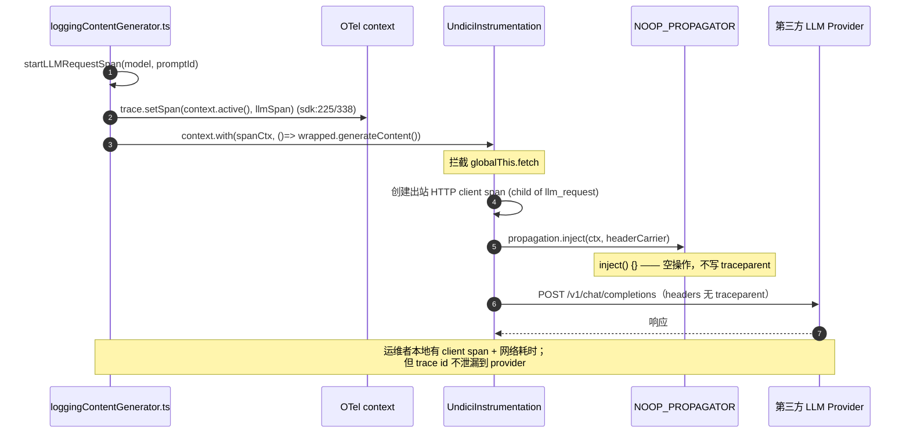
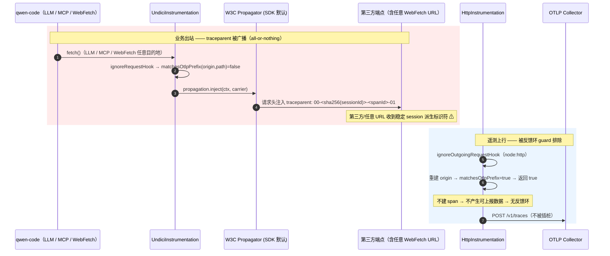

# 出站关联：HTTP span 与 W3C traceparent 传播（深入）

> 子文档；总览见 [README.md](README.md)。本文 **SUPERSEDES** 总览 `telemetry-observability.md` 的 §3.9，进入 function / line 级。
> 代码基准：`QwenLM/qwen-code@main`。核心文件 `packages/core/src/telemetry/sdk.ts`（全文 629 行）、`packages/core/src/config/config.ts`、`packages/cli/src/config/settingsSchema.ts`。
> 引用约定：`file:symbol`（+行号），行号对应 `main` 当前快照，仅作定位锚点。
> **标记**：凡引用 **CLOSED PR #4393** 的代码（`llm-correlation-fetch.ts` 等），均显式标注 `[CLOSED #4393 · 未合入]`——这些符号在 `main` 上**不存在**，仅存在于 `gh pr diff 4393` 的 diff 中。

---

## 概述

本文讲清两件**正交**的事，以及一件**没做成**的事：

1. **出站 client HTTP span**（始终开）：`UndiciInstrumentation` patch `globalThis.fetch` / undici，给每个出站请求（LLM SDK、MCP StreamableHTTP、WebFetch）建一个客户端 HTTP span。这让 trace 树不止步于 qwen-code 进程边界，能看到对 LLM provider 的网络耗时。**与任何开关无关**。
2. **wire 上的 `traceparent` header**（默认关）：是否把 trace id 写进**第三方请求流**。默认装入 `NOOP_PROPAGATOR`（`inject` 空操作），trace 上下文只留在运维者自己的 OTLP collector 内；仅当 `outboundCorrelation.propagateTraceContext: true` 时才放回 OTel 默认 W3C composite propagator。
3. **`X-Qwen-Code-Session-Id` 出站透传**（**未做成**）：PR #4393 曾实现 `wrapFetchWithCorrelation`，但它**只用 `getTelemetryEnabled()` 门控、无 host allowlist**——会把一个 session 派生标识符广播给所有第三方 provider。该隐私隐患触发重构，#4393 被 **CLOSED**，机制整体移出 scope。

把这三件事拆开理解，是读懂 `#4384` / `#4390` / `#4393` 这条线的关键。一句话总结当前 `main` 的状态：**出站 client span 永远有；traceparent 默认不上 wire、可 opt-in；session-id header 完全没有。**

> 一个贯穿全文的安全判断先点名：当 `propagateTraceContext` 被打开，它是 **进程级、全局、all-or-nothing** 的——`traceparent` 会注入**所有**经 `globalThis.fetch`/undici 发出的请求（LLM + MCP + WebFetch），无法按目的地 host 区分。而 `traceparent` 里的 trace id 在本项目里是 `sha256(sessionId)[:32]`（确定性派生，见 [03 文档](03-context-propagation-and-concurrency.md) 与 `trace-id-utils.ts:deriveTraceId`），等于把一个**稳定的、session 级的标识符**泄漏给每一个第三方端点。这正是 #4393 的 host-allowlist 讨论想解决、而当前 opt-in 设计**仍未解决**的那一面。

---

## 涉及 PR

| PR / Issue | 状态 | 标题 | 落在本文的哪一部分 |
|---|---|---|---|
| [#4384](https://github.com/QwenLM/qwen-code/issues/4384) | **CLOSED**（被 #4390 closes） | feat(telemetry): propagate W3C traceparent **+** X-Qwen-Code-Session-Id to LLM service calls | 需求源头：要求 traceparent **与** session-id **双**传播；实际只交付前者 → 追踪缺口 |
| [#4390](https://github.com/QwenLM/qwen-code/pull/4390) | **MERGED** `2026-05-25` | feat(telemetry): client-side HTTP span + opt-in W3C traceparent propagation (#4384) | 本文主体：`UndiciInstrumentation` 出站 span、`NOOP_PROPAGATOR` 默认、`matchesOtlpPrefix` 反馈环守卫、`outboundCorrelation.*` 配置 |
| [#4393](https://github.com/QwenLM/qwen-code/pull/4393) | **CLOSED** `2026-05-21`（`closingIssuesReferences: []`，未 close 任何 issue） | feat(telemetry): propagate X-Qwen-Code-Session-Id on outbound LLM requests (part 2 of #4384) | 「session-id 传播的废弃」一节：`wrapFetchWithCorrelation` 无 allowlist → 隐私隐患 → 被关闭/重构 |

合入 #4390 的提交链（`git log --oneline`，自底向上即 R1→R4 演进）：

```
a1a8a5ac6 fix(telemetry): R2 review fixes — critical correctness + tsc + boundary safety
cb3452620 chore(deps): allow patch updates for @opentelemetry/instrumentation-undici
e1cd29584 fix(telemetry): R3 review fixes — port + protocol + quote + safety
fc6c13a9e fix(telemetry): strip port from req.host fallback + document undici scope
1c8528a56 feat(telemetry): scope X-Qwen-Code-Session-Id to first-party hosts by default   ← R3 host allowlist（设计层）
9bdd3bd6f refactor(telemetry): split outbound correlation out of telemetry scope (R4)        ← R4 把 session-id 整体移出
c0352fd5b test(config): cover getOutboundCorrelationPropagateTraceContext defaults
6518e6d87 refactor: simplify post-R4 polish per /simplify review
62ed44e1f feat(telemetry): client-side HTTP span + opt-in W3C traceparent propagation (#4384) (#4390)  ← 最终合入
```

设计文档 `docs/design/telemetry-outbound-propagation-design.md`（随 #4390 合入，878 行）的修订历史 R1–R4 是理解这条线的钥匙：

| 修订 | 日期 | 触发 | 关键变化 |
|---|---|---|---|
| R1 | 05-21 | 初稿 | **全广播**：所有出站 LLM 请求都带 `X-Qwen-Code-Session-Id` + `traceparent` |
| R2 | 05-22 | wenshao review | **边界安全**：URL normalize、port matching、quote 对齐、host:port fallback strip（见「OTLP 反馈环防护」） |
| R3 | 05-23 | LaZzyMan REQUEST_CHANGES | **语义收窄**：`X-Qwen-Code-Session-Id` 默认作用域收到 first-party（Alibaba/DashScope）host **白名单**——开源 CLI 连接多个第三方 provider，不能向所有人广播 session id |
| R4 | 05-25 | LaZzyMan round-8（scope conflation） | **scope 大幅收窄**：本 PR 仅保留 client HTTP span + OTLP loop guard；`traceparent` 默认 off（`NoopTextMapPropagator`）；新增 `outboundCorrelation.*` 顶级 namespace；**整套 `X-Qwen-Code-Session-Id` 机制移出本 PR**，搬到独立 follow-up |

注意时序细节：#4393（独立的「part 2」session-id PR）于 **05-21 即被 CLOSED**——它实现的是 R1 式无 allowlist 广播；其后的 R3 host-allowlist 只是**设计文档层面**的缓解提案，从未以代码形式 ship。R4 最终把整个 session-id 机制移出 scope。

---

## 默认安全（NOOP_PROPAGATOR）

### 符号定义

`sdk.ts:110-118` 定义了一个「什么都不发」的 `TextMapPropagator`：

```ts
// sdk.ts:110
const NOOP_PROPAGATOR: TextMapPropagator = {
  inject() {},                                  // ← 关键：写入空操作
  extract(context: Context): Context {
    return context;
  },
  fields(): string[] {
    return [];
  },
};
```

三个方法的语义：
- `inject()` 空实现：`UndiciInstrumentation` 在发出请求前会调 `propagation.inject(carrier)` 把当前 context 写进 header carrier。装了这个 propagator 后，`inject` 不写任何东西 → **出站请求不带 `traceparent`**。
- `extract()` 原样返回 context：不解析入站 `traceparent`（qwen-code 作为 CLI 客户端无入站场景，此方法实际不被触发）。
- `fields()` 返回 `[]`：告诉 instrumentation「我没有要清理/管理的 header 字段名」。

### 安装决策

`sdk.ts:449-452` 是 opt-in 的唯一开关点：

```ts
// sdk.ts:449
const textMapPropagator: TextMapPropagator | undefined =
  config.getOutboundCorrelationPropagateTraceContext()
    ? undefined          // undefined → NodeSDK 保留默认 W3C composite propagator
    : NOOP_PROPAGATOR;   // 默认分支
```

随后 `sdk.ts:460` 用条件展开把它塞进 `NodeSDK` 构造参数：

```ts
// sdk.ts:454,460
sdk = new NodeSDK({
  resource,
  autoDetectResources: false,
  ...(textMapPropagator && { textMapPropagator }),   // 仅当非 undefined 时才传 key
  // ...
});
```

这里的精妙之处：
- **默认（关）**：`getOutboundCorrelationPropagateTraceContext()` 返回 `false` → `textMapPropagator = NOOP_PROPAGATOR` → 显式传给 NodeSDK → `inject` 空操作 → **wire 上无 traceparent**。
- **opt-in（开）**：返回 `true` → `textMapPropagator = undefined` → `...(undefined && {...})` 展开为**空**（key 根本不出现）→ NodeSDK 走它自己的默认逻辑，即 `CompositePropagator([W3CTraceContextPropagator, W3CBaggagePropagator])` → `inject` 真正写 `traceparent`。

> 为什么用「传 NOOP / 不传 key」而不是「传 NOOP / 传 W3C」两种显式 propagator？因为 OTel 的 W3C composite 是在 `@opentelemetry/sdk-node` 内部构造的，应用层不持有它的引用；「不传 `textMapPropagator` key」是让 NodeSDK 回退到内建默认的标准手法。`sdk.test.ts:774` 的断言正是「opt-in 时 `textMapPropagator` 在构造参数里 `toBeUndefined()`」。

### 配置链路

opt-in flag 从 `settings.json` 一路到 SDK 的完整链路：

| 层 | 位置 | 内容 |
|---|---|---|
| schema | `settingsSchema.ts:1041-1062` | `outboundCorrelation` 对象，`category: 'Advanced'`、`requiresRestart: true`、`showInDialog: false`、`default: undefined`；`jsonSchemaOverride` 内 `propagateTraceContext: { type: 'boolean', default: false }`、`additionalProperties: false` |
| settings→Config 参数 | `cli/src/config/config.ts:1808` | `outboundCorrelation: settings.outboundCorrelation` |
| Config 接口 | `config.ts:383-401` `OutboundCorrelationSettings` | `propagateTraceContext?: boolean` |
| Config 字段初始化 | `config.ts:1145-1147` | `this.outboundCorrelationSettings = { propagateTraceContext: params.outboundCorrelation?.propagateTraceContext ?? false }` |
| getter | `config.ts:3042-3044` `getOutboundCorrelationPropagateTraceContext()` | `return this.outboundCorrelationSettings.propagateTraceContext ?? false` |

注意 schema 把 `outboundCorrelation` 独立成**顶级 namespace**，而非塞进 `telemetry.*`——这是 R4 的有意设计（提交 `9bdd3bd6f`）。`settingsSchema.ts:1048` 的 description 一字未改地写明了理由：

> "**SECURITY-RELEVANT.** Controls what client-side correlation data qwen-code writes into outbound LLM API requests (DashScope, OpenAI, Anthropic, etc.) — separate from `telemetry.*` which governs data flow into the operator's OWN OTLP collector. All values default to off."

即：`telemetry.*` 管「数据流进运维者**自己**的 collector」，`outboundCorrelation.*` 管「数据写进发往**第三方**的请求流」——两者信任边界不同，故不可共用一个开关。这条边界是整个 #4390 review 的核心结论。

---

## 出站 HTTP span（undici 客户端 span）

### 注册

`sdk.ts:531-540` 在 `NodeSDK` 的 `instrumentations` 数组里注册 `UndiciInstrumentation`（与 `HttpInstrumentation` 并列）：

```ts
// sdk.ts:531
new UndiciInstrumentation({
  ignoreRequestHook: (request) => {
    if (otlpUrlPrefixes.length === 0) return false;
    const path =
      typeof request.path === 'string'
        ? stripPathSuffix(request.path)
        : '';
    return matchesOtlpPrefix(request.origin, path);
  },
}),
```

依赖声明在 `packages/core/package.json`：`"@opentelemetry/instrumentation-undici": "^0.14.0"`（导入见 `sdk.ts:27`）。

### 为什么必须是 undici 而非 HttpInstrumentation

三套 LLM SDK 全部走 `globalThis.fetch`（Node 18+ 即 undici），而非 `node:http`：

| SDK | HTTP 实现 | `HttpInstrumentation` 覆盖？ | `UndiciInstrumentation` 覆盖？ |
|---|---|---|---|
| `openai`（含 DashScope/Qwen/DeepSeek/…） | `globalThis.fetch` | ❌ | ✅ |
| `@google/genai` | `globalThis.fetch` + `new Headers()` | ❌ | ✅ |
| `@anthropic-ai/sdk` | `globalThis.fetch` | ❌ | ✅ |

`HttpInstrumentation`（`sdk.ts:469`）只 patch `node:http`/`https`——它的作用域是 **OTLP HTTP exporter 自身**（exporter 用 node:http 上行）。两个 instrumentation 分工明确：undici 管 LLM/工具出站，http 管 OTLP 上行（且两者都要做反馈环守卫，见下节）。

### span 如何正确 parent 到 llm_request

undici 建的出站 span 需要挂在 `qwen-code.llm_request` 下（而非 session 根），否则 trace 树会断层。这靠 `loggingContentGenerator.ts` 在调用底层 SDK 前，用 `context.with` 把 `llm_request` span 设为 active context 实现：

```ts
// loggingContentGenerator.ts:225（非流式）/ :338（流式）
const spanContext = trace.setSpan(context.active(), llmSpan);
// ...
// loggingContentGenerator.ts:247（非流式）
const response = await context.with(spanContext, async () => {
  // ... this.wrapped.generateContent(...) → 底层 SDK fetch()
});
```

`loggingContentGenerator.ts:222-224` 的注释点明了动机：

> "Capture span context so the API call and logging activate it via `context.with()`. Without this, nested OTel spans (HTTP instrumentation, log-bridge spans) parent to session root instead of llm_request."

流式路径更进一步：`spanContext` 还被流迭代 helper（`loggingContentGenerator.ts:485` `spanContext ? context.with(spanContext, fn) : fn()`）在**每次 chunk 消费**时重新激活——因为异步生成器的迭代发生在原始 `context.with` 回调之外，必须在迭代点重新 enter，否则迭代期间触发的 fetch（如分页/重试）会丢失 parent。

> 推论：出站 span 的创建**完全不依赖** `propagateTraceContext` 开关——无论开关如何，`UndiciInstrumentation` 都建 span。开关只决定 `inject` 是否把这个 span 的 traceId 写到 **wire header** 上。这正是「两件正交的事」的代码落点。

---

## OTLP 反馈环防护（matchesOtlpPrefix origin+path 边界）

### 问题

OTel SDK 自己用 fetch（undici）/ node:http 把遥测数据 POST 到 OTLP collector。如果不做排除，`UndiciInstrumentation` 会给「上报数据」这个请求也建一个 span → 这个新 span 又被上报 → **无限反馈环 / 巨量噪声**。这是每个 OTel 接入都会踩的坑，故 #4390 的两个 instrumentation 都装了 ignore hook。

### 前缀构建：`normalizeOtlpPrefix`（sdk.ts:368-400）

把 4 个可能的 OTLP endpoint（base + 3 个 per-signal）规整成 `{ origin, pathname }`：

```ts
// sdk.ts:401
const otlpUrlPrefixes = [
  config.getTelemetryOtlpEndpoint(),
  config.getTelemetryOtlpTracesEndpoint(),
  config.getTelemetryOtlpLogsEndpoint(),
  config.getTelemetryOtlpMetricsEndpoint(),
]
  .map(normalizeOtlpPrefix)
  .filter((u): u is { origin: string; pathname: string } => !!u);
```

`normalizeOtlpPrefix` 的关键处理（`sdk.ts:380-399`）：
1. **trim + 去引号**：`raw.trim().replace(/^["']|["']$/g, '')`——与 `parseOtlpEndpoint`（`sdk.ts:136`）用**同一套**宽松正则，确保「exporter 能连上的 endpoint」与「guard 能匹配的 prefix」一致。若两者不一致，会出现 exporter 上行但 guard 漏判 → 反馈环复活（`sdk.ts:374-379` 注释明确点出这一风险，归功 wenshao review）。
2. **去 query/fragment + 去尾斜杠**：`pathname = u.pathname === '/' ? '' : u.pathname.replace(/\/$/, '')`。
3. **不可解析 URL → 返回 undefined + `diag.warn`**（`sdk.ts:388-399`）：这是 R2 的**关键修复**。旧实现的 catch 分支会做字符串级 fallback——输入 `"http"` 会产出 prefix `"http"`，而 `"http".startsWith` 会匹配**每一个**出站 HTTP 请求 → 静默关掉所有 instrumentation。新实现宁可让这个配错的 endpoint「失去反馈环守卫」，也绝不引入「误伤一切」的危险 fallback。

### 匹配：`matchesOtlpPrefix`（sdk.ts:417-428）

```ts
// sdk.ts:417
const matchesOtlpPrefix = (origin: string, path: string): boolean => {
  for (const prefix of otlpUrlPrefixes) {
    if (origin !== prefix.origin) continue;          // ① origin 精确相等
    if (prefix.pathname === '') return true;          // ② 无路径前缀 → origin 命中即可
    if (!path.startsWith(prefix.pathname)) continue;
    const next = path.charAt(prefix.pathname.length); // ③ 路径边界检查
    if (next === '' || next === '/' || next === '?' || next === '#') {
      return true;
    }
  }
  return false;
};
```

`sdk.ts:410-416` 注释列了 `url.startsWith(prefix)` 的三类不安全，本实现逐一封堵：

| 攻击/误伤 | 朴素 `startsWith` 的问题 | 本实现的封堵 |
|---|---|---|
| **port** | prefix `http://host:4318` 匹配 `http://host:43180/x` | `origin` 精确相等（`:4318` ≠ `:43180`） |
| **path** | prefix `http://host/v1` 匹配 `http://host/v1foo/x` | 边界检查：`/v1` 后必须是 `'' / '/' / '?' / '#'` |
| **host** | prefix `https://otlp.example.com` 匹配 `https://otlp.example.com.evil.net` | `origin` 精确相等 |

### 两个 instrumentation 的 hook 形态差异

- **`UndiciInstrumentation.ignoreRequestHook`**（`sdk.ts:532`）：undici 直接给出 `request.origin` 与 `request.path`，故只需 `stripPathSuffix(request.path)` 后调 `matchesOtlpPrefix`。
- **`HttpInstrumentation.ignoreOutgoingRequestHook`**（`sdk.ts:474-525`）：node:http 的请求对象**没有现成 origin**，要从 `req.protocol` / `req.hostname` / `req.host` / `req.port` 手工拼。这里有三处 R2/R3 加固：
  1. **protocol fail-open**（`sdk.ts:485-488`）：旧实现 `|| 'http'` fallback 会把 HTTPS 误判成 HTTP → HTTPS OTLP endpoint 匹配不上 → guard 失效。新实现：protocol 不确定时 `return false`（fail-open，最坏只是给 OTLP 请求多建一个 span，可观测可恢复，远好于无限环）。
  2. **`req.host` 去 port**（`sdk.ts:497-504`）：`req.host` 可能已含 `:port`（如 `"collector:4318"`），若再拼 `:${req.port}` 会得到 `"http://collector:4318:4318"` → `new URL()` 抛错 → catch 返回 false → 静默漏判。故先剥离 port（IPv6 字面量如 `"[::1]:443"` 保留方括号）。
  3. **走 URL 重建 origin**（`sdk.ts:509-518`）：让手工拼的串经过 `new URL(...).origin`，享受与 `normalizeOtlpPrefix` 相同的默认端口剥离（http `:80` / https `:443`），否则 prefix `http://collector`（无端口）匹配不上请求 `http://collector:80/v1/traces`。

`stripPathSuffix`（`sdk.ts:432-439`）用 `indexOf`（而非正则）切掉 `?`/`#`，注释注明是为 CodeQL ReDoS 卫生。

---

## opt-in 传播的安全面（启用时的 all-or-nothing 广播 · SECURITY-RELEVANT）

这是本文最需要读者警惕的一节。当运维者设 `outboundCorrelation.propagateTraceContext: true`，他打开的是一个**进程级、全局、无目的地区分**的开关。

### 广播范围 = 所有经 global fetch 的出站

`textMapPropagator = undefined` 让 NodeSDK 装回 W3C composite propagator，而 propagator 是**全局**的——`UndiciInstrumentation` 对**每一个** `globalThis.fetch` 出站请求都会调 `propagation.inject`。经核对，qwen-code 里走 global fetch / undici 的出站包括：

| 出站类别 | 代码路径 | 目的地 |
|---|---|---|
| LLM SDK 请求 | `openai` / `@google/genai` / `@anthropic-ai/sdk` | DashScope（first-party）**以及** OpenAI / Anthropic / OpenRouter / DeepSeek / Mistral / ModelScope / …（**第三方**） |
| MCP StreamableHTTP / SSE | `tools/mcp-client.ts`（`StreamableHTTPClientTransport`） | 用户配置的任意 MCP server（**第三方**） |
| WebFetch 工具 | `tools/web-fetch.ts:102` → `utils/fetch.ts:68` `fetch(url, …)` | 模型在对话中给出的**任意 URL**（完全不可控） |

`settingsSchema.ts:1055` 的 description 本身就如实列举了这个范围：

> "Inject W3C `traceparent` header on outbound `fetch` requests (LLM SDK calls, **MCP StreamableHTTP, WebFetch**, ...)."

### 为什么这比 host allowlist 粗

- **粒度**：opt-in 是「全开 / 全关」。无法表达「只给 first-party（DashScope/ARMS）发 traceparent，不给 OpenAI / 不给 WebFetch 命中的随机 URL 发」。而这正是 R3 设计文档想引入的 `sessionIdHeaderHosts` 白名单粒度。
- **泄漏内容**：`traceparent` 的 trace id = `sha256(sessionId)[:32]`（确定性派生）。它在**整个 session 生命周期内稳定不变**，因此对第三方而言是一个**可用于跨请求关联的稳定标识符**。WebFetch 场景尤其危险：模型可能被引导去 fetch 一个攻击者控制的 URL，该 URL 就能收到这个 session 标识符，并把同一 session 内的多次 WebFetch 串起来。
- **不可逆的信任假设**：把 traceparent 发给「也接入运维者自己 collector 的 provider」（如 ARMS+DashScope）是合理的——这是该 flag 的**预期用途**。但全局开关无法限定「只发给这类 provider」，一旦打开，第三方/任意 URL 一并收到。

### 当前的缓解与残留风险

- **默认关**是首要缓解：绝大多数用户的出站 wire 上没有任何 trace 标识符。
- **`baggage` 不发**：虽然 W3C composite 含 `W3CBaggagePropagator`，但 qwen-code 从不调 `propagation.setBaggage()`，故 `baggage` header 实际不会产生（设计文档 §3.2 非目标）。
- **残留**：一旦 opt-in，上述 all-or-nothing 广播即生效，**无 per-destination 收窄**。设计文档把「`telemetry.propagateTraceContext` 加 per-destination toggle」列为未来工作，但 `main` 未实现。这是本能力当前**已知的、设计层面的安全粗粒度**，应在文档/告警中向运维者明示。

---

## session-id 传播的废弃（#4393 无 host allowlist → 关闭/重构）

### #4393 实际实现了什么

`[CLOSED #4393 · 未合入]` 新增文件 `packages/core/src/telemetry/llm-correlation-fetch.ts`（81 行），核心是一个 per-request fetch 包装器：

```ts
// [CLOSED #4393] llm-correlation-fetch.ts
export const SESSION_ID_HEADER = 'X-Qwen-Code-Session-Id';

export function wrapFetchWithCorrelation(
  baseFetch: typeof fetch,
  config: Config,
): typeof fetch {
  return async function correlationFetch(input, init) {
    if (!config.getTelemetryEnabled()) {        // ← 唯一门控
      return baseFetch(input, init);
    }
    const sid = config.getSessionId();
    if (!sid) {                                  // 空 sid 跳过（某些中间件拒空 header）
      return baseFetch(input, init);
    }
    const headers = new Headers(init?.headers);
    headers.set(SESSION_ID_HEADER, sid);         // ← 无条件 set 到每个出站
    return baseFetch(input, { ...init, headers });
  };
}
```

并提供 `staticCorrelationHeaders(config)` 给无法接 `fetch` hook 的 SDK（Gemini）。集成点共 4 个（均在 #4393 diff 中）：
- `openaiContentGenerator/provider/default.ts` —— `fetch: wrapFetchWithCorrelation(baseFetch, this.cliConfig)`
- `openaiContentGenerator/provider/dashscope.ts` —— 同上（它 override `buildClient`）
- `anthropicContentGenerator/anthropicContentGenerator.ts` —— 同上
- `geminiContentGenerator/index.ts` —— 走 `staticCorrelationHeaders` merge 进 `httpOptions.headers`

### 为什么用 per-request fetch wrapper 而非 `defaultHeaders`

`[CLOSED #4393]` 的注释记录了一个**真 bug** 的规避：SDK client 在 contentGenerator 构造时一次性 build，其 `defaultHeaders` 在那一刻 capture session id；而 `/clear` 触发的 session reset 会更新 `Config.sessionId` 但**不重建** contentGenerator。若把 session id bake 进 `defaultHeaders`，reset 后 wire 上仍是旧 id。故必须 per-request 读 `config.getSessionId()` 取实时值。

> **Gemini known limitation**：`@google/genai` 的 `HttpOptions` 接口**不暴露 `fetch` hook**（只有 static `headers`），故 Gemini 只能用 `staticCorrelationHeaders` 在构造时注入 → `/clear` 后出站 Gemini 请求会带**旧** session id，直到底层 content generator 被重建。这是 #4393 自己承认的不一致（其 `telemetry.md` doc 段落明确写出）。

### 致命缺陷：无 host allowlist

`wrapFetchWithCorrelation` 的门控**只有** `getTelemetryEnabled()`——只要遥测开着，就把 `X-Qwen-Code-Session-Id` set 到**每一个**出站 LLM 请求，**不区分目的地 host**。后果与上一节的 traceparent all-or-nothing 同构，但更糟：

- `X-Qwen-Code-Session-Id` 是**明文 session id**（不是 hash），直接泄漏到所有第三方 provider（OpenAI / Anthropic / OpenRouter / …）。
- 它**默认随 `telemetry.enabled` 一起开**（不像 traceparent 后来被收到独立的 opt-in flag）——即「开遥测」这个看似只影响**自己 collector** 的动作，会**顺带**把 session id 广播给第三方。这恰恰违背了 R4 最终确立的「`telemetry.*` 与 `outboundCorrelation.*` 信任边界分离」原则。

### 关闭/重构的经过

1. **#4393（05-21 CLOSED）**：作为「part 2 of #4384」的独立 PR 实现上述无 allowlist 广播，被关闭（`closingIssuesReferences: []`，未 close 任何 issue）。
2. **设计文档 R3（05-23）**：LaZzyMan `REQUEST_CHANGES` 指出——qwen-code 是连接多个第三方 provider 的开源 CLI，claude-code 那种「first-party→first-party」类比不成立，session id header **必须按 host 区分**，默认只发 first-party（Alibaba/DashScope）白名单。提交 `1c8528a56` 在设计层落地了这个 scoping。
3. **设计文档 R4（05-25）**：进一步认定 session-id 与 traceparent 是两件不同 scope 的事（scope conflation），提交 `9bdd3bd6f` 把**整套 session-id 机制移出** #4390，仅保留 client span + traceparent（默认 off）。session-id 改投未来 follow-up PR。
4. **结果**：`main` 上**不存在** `llm-correlation-fetch.ts` / `wrapFetchWithCorrelation` / `staticCorrelationHeaders` / `SESSION_ID_HEADER`。出站只可能带 `traceparent`（且默认关）。

### `Closes #4384` 的追踪缺口

Issue **#4384** 的标题与正文要求 traceparent **与** `X-Qwen-Code-Session-Id` **双**传播。#4390 的 PR 描述写 `Closes #4384`（`closingIssuesReferences` 确含 #4384），合入即把 #4384 标记为 **CLOSED**——但 #4390 **只交付了 traceparent（且默认关）**，session-id 部分（#4393）已 CLOSED 未合入。于是：

> **一个「半完成」的 issue 被 Closes 关掉了。** 跨进程的 session 级关联当前仍需 collector 侧用 traceId（=`sha256(sessionId)`）反查，缺少直接的 session header。这是一个文档/追踪缺口——读 issue tracker 会以为 #4384 全部交付，实际只交付了一半。后续若要补 session-id，需新开 issue/PR，且按 R3 结论必须带 host allowlist。

---

## 时序图

### ① 默认（`propagateTraceContext: false`）：出站请求**不带** traceparent



### ② opt-in（`propagateTraceContext: true`）：traceparent 注入**所有**出站 + OTLP 自请求被 guard 排除



---

## 边界与错误处理

| 场景 | 行为 | 位置 |
|---|---|---|
| 遥测未启用 | `initializeTelemetry` 直接 `return`，整个 SDK（含 instrumentation/propagator）不安装；无任何出站 span / header | `sdk.ts:179` |
| `outboundCorrelation` 未配置 | `settings.outboundCorrelation` 为 `undefined` → `params.outboundCorrelation?.propagateTraceContext ?? false` → 默认关 | `config.ts:1145-1147` |
| OTLP endpoint 配错（不可解析 URL） | `normalizeOtlpPrefix` 返回 `undefined` + `diag.warn`；该 endpoint 失去反馈环守卫，但**绝不**误伤其它出站（不走危险 fallback） | `sdk.ts:388-399` |
| 无任何 OTLP endpoint（如 outfile 模式） | `otlpUrlPrefixes.length === 0` → 两个 hook 都 `return false`（不 ignore 任何请求）→ 所有出站都建 span（outfile 模式下期望行为，无上行故无环） | `sdk.ts:475,533` |
| node:http 请求 protocol 不可知 | fail-open `return false`（宁可给 OTLP 请求多建一个可观测的 span，也不要无限环） | `sdk.ts:485-488` |
| `req.host` 含 `:port` 的 fallback | 剥离 port 再拼，避免 `new URL()` 抛错导致静默漏判（当前 exporter 总设 hostname，故此路实际不可达，但 fallback 必须正确） | `sdk.ts:497-504` |
| 流式迭代期间的 fetch | 迭代 helper 在每个 chunk 重新 `context.with(spanContext, fn)`，保证迭代期触发的 fetch 仍 parent 到 llm_request | `loggingContentGenerator.ts:485` |
| `[CLOSED #4393]` 空 session id | `wrapFetchWithCorrelation` / `staticCorrelationHeaders` 跳过注入（空 header value 会被某些中间件拒），不发 `X-Qwen-Code-Session-Id:` | `llm-correlation-fetch.ts`（未合入） |

---

## 关键设计决策与权衡

1. **出站 wire 行为与遥测默认开关解耦（#4390 核心）**：「创建出站 client span」（始终开）与「写 traceparent 到第三方请求」（默认关、opt-in）彻底分离，且后者收到独立的 `outboundCorrelation.*` namespace 而非 `telemetry.*`。**取舍**：默认不向 provider 泄漏内部 trace id（隐私/安全优先），需要服务端缝合（ARMS+DashScope）的场景显式开启；代价是默认开箱即用时 trace 树止步于进程边界（但 client span 仍给出网络耗时）。

2. **用 NOOP propagator 而非「不装 instrumentation」来关传播**：instrumentation 始终装（保证 client span），仅用 propagator 的 `inject` 空实现来掐断 wire 注入。**取舍**：实现上「关传播」与「关 span」正交可控；代价是多一个 NOOP 对象与一处 `...(x && {x})` 条件展开的认知成本。

3. **边界安全的 origin+path 匹配，拒绝 startsWith**：`matchesOtlpPrefix` 精确比 origin + 路径边界检查，封堵 port/host/path 三类前缀碰撞；`normalizeOtlpPrefix` 对不可解析 URL 宁可放弃守卫也不做危险字符串 fallback。**取舍**：代码量与注释远多于一行 `startsWith`，换来「绝不误伤业务出站、绝不静默关停所有 instrumentation」。

4. **fail-open 而非 fail-closed 的反馈环守卫**：protocol/URL 不可判时 `return false`（请求被插桩）。**取舍**：最坏是给某个 OTLP 请求多建一个**可观测、可恢复**的寄生 span；远好于 fail-closed 可能导致的「业务请求被误 ignore、彻底看不到」或旧实现的无限环。

5. **session-id header 从「随遥测广播」改为「需 host allowlist」并最终移出 scope（R1→R3→R4）**：#4393 的无 allowlist 广播被判定为隐私不可接受。**取舍**：宁可让 #4384 的 session-id 部分「未交付」，也不 ship 一个把明文 session id 广播给所有第三方的机制。代价是 `Closes #4384` 关掉了半完成 issue，留下追踪缺口。

6. **per-request 读 session id（#4393 设计，虽未合入但其结论仍成立）**：因 `/clear` reset 不重建 SDK client，session id 必须 per-request 从 `Config.getSessionId()` 读，不能 bake 进 `defaultHeaders`。**取舍**：fetch wrapper 比 static header 多一层闭包开销，换来 reset 后立即生效的正确性；Gemini 因 SDK 无 fetch hook 无法享受此修复，成为已知不一致点。

---

## 已知限制 / 后续

1. **opt-in 后无 per-destination 收窄（设计层安全粗粒度）**：`propagateTraceContext: true` 是进程级 all-or-nothing，traceparent 会进入**所有** global-fetch 出站（LLM 第三方 + MCP + WebFetch 任意 URL）。trace id=`sha256(sessionId)` 是 session 内稳定标识符。设计文档把「per-destination toggle / host allowlist」列为未来工作，`main` **未实现**。建议：opt-in 时在文档/启动告警里明示「会向所有出站目的地写 traceparent」。

2. **`X-Qwen-Code-Session-Id` 完全缺失（#4384 半完成）**：#4390 `Closes #4384` 但只交付 traceparent。跨进程 session 级关联当前只能 collector 侧用 traceId 反查，无直接 session header。后续补做需新 issue/PR 且必须带 host allowlist（R3 结论）。

3. **Gemini provider 的 session-id staleness（仅在 #4393 复活时相关）**：`@google/genai` 的 `HttpOptions` 无 `fetch` hook，只能 static header → `/clear` 后带旧 session id 直到 content generator 重建。若未来重做 session-id 传播，此限制依旧存在，除非改为在 reset 时重建 Gemini content generator。

4. **`normalizeOtlpPrefix` 与 `parseOtlpEndpoint` 的去引号正则需手工保持同步**：两者必须用同一套 trim/去引号规则，否则「exporter 能连、guard 漏判」→ 反馈环复活。当前靠注释（`sdk.ts:374-379`）约束，无编译期保证，存在漂移风险。

5. **HttpInstrumentation 的 `req.host` 去 port fallback 当前不可达但保留**：`@opentelemetry/otlp-exporter-base` 总设 `hostname`，故 `sdk.ts:497-504` 的 host:port 剥离分支实际走不到——属防御性死代码，依赖未来 exporter 行为不变。

6. **daemon 分支分叉是历史语境**：早期 `daemon_mode_b_main` 的 `sdk.ts` 基于较早 main，不含 #4390 的 `UndiciInstrumentation` / `NOOP_PROPAGATOR` / `matchesOtlpPrefix`。#4490 已将 daemon feature batch 合入 main，继续维护时以当前 `main` 的出站传播实现为准。

---

## 测试覆盖

`packages/core/src/telemetry/sdk.test.ts` 对本能力的覆盖（`describe('Outbound trace-context propagation gate')` + `describe('Instrumentations')`）：

| 测试用例（it） | 位置 | 验证点 |
|---|---|---|
| installs a no-op TextMapPropagator by default | `sdk.test.ts:752` | 默认 `propagateTraceContext=false` → propagator 存在、`fields()===[]`、`inject` 不抛错且不改 carrier |
| uses the SDK default propagator when propagateTraceContext=true | `sdk.test.ts:774` | opt-in → 构造参数里 `textMapPropagator` `toBeUndefined()`（→ SDK 用默认 W3C composite） |
| registers both HttpInstrumentation and UndiciInstrumentation | `sdk.test.ts:795` | 两个 instrumentation 都在 `instrumentations` 数组 |
| UndiciInstrumentation receives ignoreRequestHook that skips OTLP | `sdk.test.ts:808` | OTLP endpoint → `true`；DashScope → `false` |
| ignoreRequestHook is a pure no-op when no OTLP endpoint | `sdk.test.ts:833` | outfile 模式无 prefix → 一律 `false`（所有请求建 span） |
| handles per-signal endpoint configuration | `sdk.test.ts:859` | traces/logs 各自 endpoint 都被命中 |
| strips query string / #fragment from incoming path | `sdk.test.ts:895` / `:914` | `/v1/traces?token=secret`、`/v1/traces#fragment` 仍命中 |
| normalizes endpoint quoted in settings.json | `sdk.test.ts:931` | `"\"http://...\""` 去引号后命中（防反馈环复活） |
| strips #fragment from configured endpoint | `sdk.test.ts:951` | 配置侧带 `#anchor` 也正确归一 |
| does NOT bleed across port boundary (4318 vs 43180) | `sdk.test.ts:968` | 不同 port → `false`（origin 精确） |
| does NOT bleed across hostname boundary (otlp vs otlp.evil) | `sdk.test.ts:989` | `otlp.example.com.evil.net` → `false` |
| does NOT bleed across path-segment boundary (/v1 vs /v1foo) | `sdk.test.ts:1009` | `/v1foo/x` → `false`；`/v1/traces` → `true` |
| normalizeOtlpPrefix rejects unparseable URLs (no "http" fallback) | `sdk.test.ts:1034` | 配 `not-a-valid-url` → 不误伤 `api.openai.com`，且 `diag.warn` 含 "not a valid URL" |
| HttpInstrumentation also receives ignoreOutgoingRequestHook for OTLP | `sdk.test.ts:1072` | node:http 侧 OTLP 上行被 ignore |
| getOutboundCorrelationPropagateTraceContext defaults | `config.test.ts`（提交 `c0352fd5b`） | getter 默认 `false` |

`[CLOSED #4393 · 未合入]` 的测试（仅存在于 #4393 diff，`main` 无）：`llm-correlation-fetch.test.ts` 覆盖 `wrapFetchWithCorrelation` 的 telemetry-on/off、空 sid 跳过、**session reset 后读到新 id（staleness regression guard）**、baseFetch reject 透传；各 provider `*.test.ts` 断言构造时 `fetch` 是 wrapped 版本（OpenAI/Anthropic）/ `httpOptions.headers` 含 `X-Qwen-Code-Session-Id`（Gemini）。这些测试随 #4393 一同未合入。

---

## 各 PR 代码贡献

### #4390 — client HTTP span + opt-in traceparent

- `sdk.ts:NOOP_PROPAGATOR`：`inject()` 空操作的 `TextMapPropagator`，默认装入 NodeSDK 阻止 `traceparent` 上 wire。
- `sdk.ts:UndiciInstrumentation`：注册出站 HTTP client span（patch `globalThis.fetch` / undici），`ignoreRequestHook` 经 `matchesOtlpPrefix` 排除 OTLP 自请求。
- `sdk.ts:normalizeOtlpPrefix` / `matchesOtlpPrefix`：origin+path 精确匹配反馈环守卫，封堵 port / host / path 三类前缀碰撞；不可解析 URL fail-open + `diag.warn`。
- `config.ts:getOutboundCorrelationPropagateTraceContext` / `settingsSchema.ts:outboundCorrelation`：独立于 `telemetry.*` 的顶级安全命名空间，opt-in 时 NodeSDK 回退到 W3C composite propagator。
- `loggingContentGenerator.ts`：`context.with(spanContext, fn)` 把 `llm_request` span 设为 active context，使出站 HTTP span 正确 parent 到 `llm_request`。

### #4906 — TRACEPARENT env for shell child processes

- 共享 `trace-context` helper 从当前 active span 构造 W3C `TRACEPARENT` 环境变量，供 shell / hook / monitor 子进程读取。
- shell spawn env 受 `outboundCorrelation.propagateTraceContext` 门控；默认不传播，开启后把 trace context 带到外部进程边界。
- sanitize / NOOP 守卫保证无效或未采样上下文不会产生伪造 `TRACEPARENT`，focused tests 覆盖 telemetry 与 shell 路径。

### #4393 — session-id 透传（CLOSED，未合入，补记）

- `llm-correlation-fetch.ts:wrapFetchWithCorrelation`：per-request fetch 包装器，从 `Config.getSessionId()` 实时读取 session id 写入 `X-Qwen-Code-Session-Id` header。
- `llm-correlation-fetch.ts:staticCorrelationHeaders`：给无 `fetch` hook 的 SDK（Gemini）提供 static header 注入。
- 4 个 provider 集成点（`default.ts` / `dashscope.ts` / `anthropicContentGenerator.ts` / `geminiContentGenerator/index.ts`）各自接入 wrapped fetch 或 static headers。
- **致命缺陷**：仅以 `getTelemetryEnabled()` 门控、无 host allowlist → 明文 session id 广播给所有第三方 provider → 被 CLOSED。
