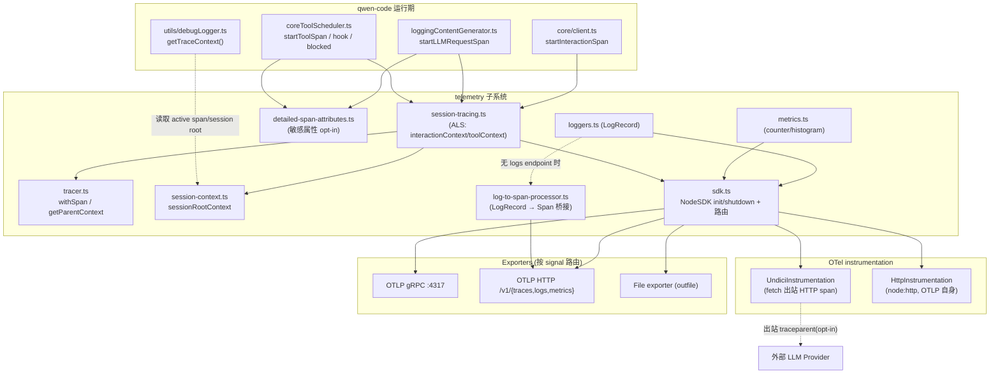
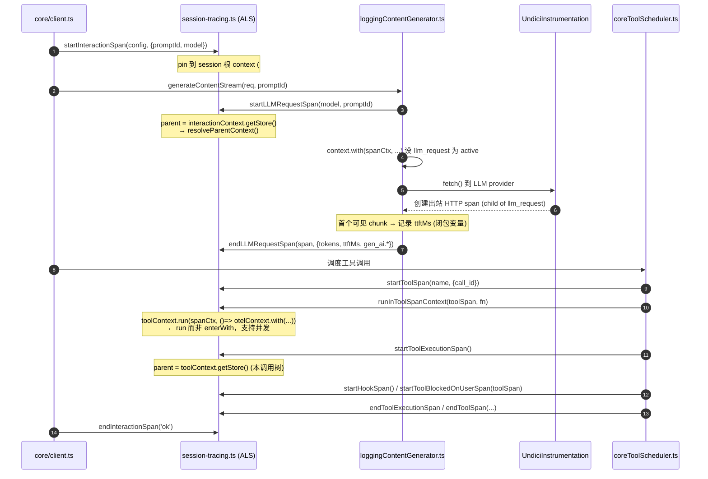
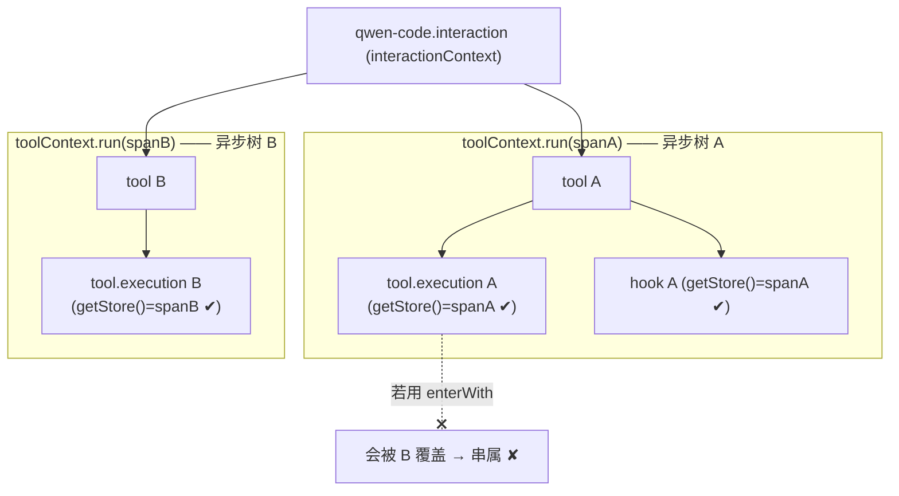
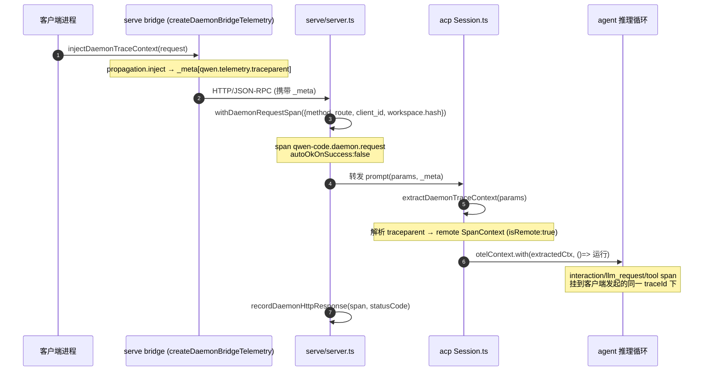

# telemetry 可观测性技术方案

> 适用代码库：`QwenLM/qwen-code`（TypeScript CLI agent）
> 主分支：`main`。早期 daemon 端遥测先落在 `daemon_mode_b_main`，已随 #4490 于 2026-06-11 合入 `main`；文中历史分支标注用于解释演进来源。
> 关联 epic：[#3731 harden OpenTelemetry](https://github.com/QwenLM/qwen-code/issues/3731)、关联需求 [#4384 propagate W3C traceparent + X-Qwen-Code-Session-Id](https://github.com/QwenLM/qwen-code/issues/4384)。

---

## 深入子文档导航

本 README 为**总览**；下列子文档对每个子系统做**函数/行级深入**（数据结构、控制流、时序图、边界与错误、测试覆盖），逐处锚定 `file:symbol`：

| # | 子文档 | 覆盖 |
|---|---|---|
| 01 | [SDK 初始化与 OTLP 信号路由](01-sdk-init-and-otlp-routing.md) | init/shutdown、grpc/http/file 路由、NOOP propagator、桥接死代码(#3779)，以及 #7276 的 lazy SDK facade / protocol exporter split |
| 02 | [层级 span 树与统一创建](02-span-tree-and-creation.md) | session→interaction→llm_request/tool→tool.execution/hook/blocked、防泄漏 |
| 03 | [上下文传播与并发隔离](03-context-propagation-and-concurrency.md) | ALS、resolveParentContext、subagent 并发隔离(#4410) |
| 04 | [敏感属性 opt-in 与 PII](04-sensitive-attributes-and-pii.md) | 门控链、截断 / SHA-256 去重、response_text 未门控泄露面 |
| 05 | [trace↔日志关联与 daemon 端遥测](05-correlation-and-daemon-telemetry.md) | getTraceContext、daemon route span、W3C 跨进程传播 |
| 06 | [GenAI 语义双发 / TTFT / 重试 / 指标](06-genai-ttft-retry-and-metrics.md) | TTFT、dual-emit、retry 可见性(#4432)、LLM request breakdown(#5904)、资源属性与基数 |
| 07 | [出站关联与 traceparent 传播](07-outbound-correlation.md) | 默认安全、OTLP 反馈环防护、opt-in 广播安全面 |

---

## 1. 背景与动机

qwen-code 早期的遥测只是「事件埋点」：通过 `@opentelemetry/api-logs` 把一批 `qwen-code.*` 业务事件（`user_prompt`、`tool_call`、`api_request/response/error` 等，见 `telemetry/constants.ts`）作为 OTel **LogRecord** 发出，再叠加一组 **Metrics** counter/histogram（`telemetry/metrics.ts`）。这套埋点能回答「发生了什么、多少次、多少 token」，但回答不了三类问题：

1. **一次 prompt 的因果链（trace 树）**：用户一句话触发了几次 LLM 请求、每次请求下挂了哪些 tool、tool 内部又做了什么（审批等待、hook、子 agent）——这些事件在旧模型里是平铺的 log，没有 parent/child 关系，无法在 trace 后端还原调用树。
2. **与外部 OTLP / 阿里云 ARMS 的对接**：很多企业后端（典型如阿里云 ARMS）支持 traces + metrics 但**不支持 logs over OTLP**，且使用**非标准 signal 路径**（如 `/api/otlp/traces`）。旧实现既没有 HTTP signal 路由，也没有「log→span 桥接」，导致这些后端拿不到任何业务数据。
3. **daemon / serve 端到端可观测**：当 qwen-code 以常驻 daemon（`qwen serve`）+ ACP/MCP bridge 形态运行时，一次 prompt 横跨「客户端进程 → daemon HTTP server → ACP session → agent 推理循环」多个执行上下文，trace 在进程边界断裂。

epic **#3731** 的目标即「Harden OpenTelemetry」——把遥测从「事件埋点」升级为「带因果结构、可对接外部后端、运行期安全（不泄漏、不污染 UI、不无限反馈）」的一等公民可观测体系。在此之上，**#4384** 进一步要求把 trace 上下文跨进程 / 跨服务传播（出站 LLM 请求的 W3C `traceparent`、daemon 内部的 `_meta` 透传），从而把外部 LLM provider、daemon 子进程都缝合进同一棵 trace 树。

本方案覆盖的核心能力（均已在 `main` / `daemon_mode_b_main` 落地或在途）：

- **统一 OTel SDK 生命周期**：单例 init / 有界 shutdown / signal 路由（traces/metrics/logs → grpc / http / file），见 `telemetry/sdk.ts`。
- **层级化 span 树**：`session → interaction → llm_request / tool → tool.execution / hook / tool.blocked_on_user / subagent`，见 `telemetry/session-tracing.ts` + `telemetry/constants.ts`。
- **基于 AsyncLocalStorage 的上下文传播与并发隔离**，见 `session-tracing.ts` 的 `interactionContext` / `toolContext` 与 `tracer.ts` 的 `getParentContext`。
- **敏感属性 opt-in**：prompt / system prompt / tool input·result / 模型输出默认不写入 span，见 `telemetry/detailed-span-attributes.ts`。
- **敏感属性长度上限可配置（#5804）**：启用 sensitive span attributes 后，user/system prompt、tool schema、模型输出、tool input/result 的截断上限由 `telemetry.sensitiveSpanAttributeMaxLength` 或 `QWEN_TELEMETRY_SENSITIVE_SPAN_ATTRIBUTE_MAX_LENGTH` 控制，默认 1 MiB。
- **trace ↔ debug log 关联**：debug 日志行注入 `trace_id` / `span_id`，见 `utils/debugLogger.ts:getTraceContext`。
- **GenAI 语义双发 + TTFT + retry 可见性 + LLM request phase breakdown（#5904）**，见 `session-tracing.ts:endLLMRequestSpan` 与 `core/loggingContentGenerator/loggingContentGenerator.ts`。
- **telemetry docs/schema refresh（#5960）**：上游 developer telemetry docs 补齐事件/指标/span 覆盖，并把硬编码 `tool_output_truncated` 事件名统一为 `qwen-code.tool_output_truncated`；下游按旧未加前缀事件名过滤的消费者需要迁移。
- **daemon pipe pressure observability（#6263/#6335）**：daemon/ACP event-loop lag gauge、daemon pipe message byte histogram、`/daemon/status.runtime.perf` pipe stats，以及大 ACP pipe frame 的低敏 source-class 日志/telemetry 归因。
- **daemon 遥测**：route span + W3C traceparent 经 `_meta` 透传；#7003 进一步给 legacy session/permission route 建 workspace ownership catalog，并在 handler 解析 owner runtime 后 late-bind workspace hash；#7145 给 ACP `channel.initialize` 增加 opt-in child startup profile attributes，见 `telemetry/daemon-tracing.ts`、serve telemetry middleware 与 acp-bridge startup profile helper。
- **telemetry SDK lazy loading（#7276）**：最终实现把 `telemetry/sdk.ts` 拆成轻量 facade 与 heavy `sdk-impl.ts`，关闭 telemetry 时不静态加载 NodeSDK/exporters/instrumentation，开启时再按 HTTP/gRPC/file protocol 动态加载对应 exporter chain；daemon metrics 初始化前会显式 await，普通 Config/startup 路径使用 fire-and-forget prefetch。

---

## 2. 整体架构

### 2.1 模块分层

整个 telemetry 子系统位于 `packages/core/src/telemetry/`，对外的唯一出口是 `telemetry/index.ts`（聚合 re-export）。核心可分为四层：

| 层 | 关键文件 | 职责 |
|---|---|---|
| SDK / 路由层 | `sdk.ts`、`file-exporters.ts`、`log-to-span-processor.ts`、`resource-attributes.ts` | NodeSDK 初始化/关闭；按 signal 路由到 grpc/http/file exporter；log→span 桥接；Resource 属性解析 |
| Span / 上下文层 | `session-tracing.ts`、`tracer.ts`、`session-context.ts`、`trace-id-utils.ts`、`constants.ts` | 层级 span 创建/结束；ALS 上下文传播；session 根 context；确定性 traceId 派生 |
| 属性 / 语义层 | `detailed-span-attributes.ts`、`loggers.ts`、`metrics.ts`、`types.ts`、`uiTelemetry.ts` | 敏感属性写入；业务事件 LogRecord；metrics counter/histogram；事件类型定义 |
| daemon 层（`daemon_mode_b_main`） | `daemon-tracing.ts`、`runtime-config.ts` | daemon route/bridge span；W3C traceparent 注入/提取；遥测配置与 `Config` 解耦 |

调用方（instrumented sites）主要在 `core/loggingContentGenerator/loggingContentGenerator.ts`（LLM 请求 span）、`core/coreToolScheduler.ts`（tool / tool.execution / hook / blocked_on_user span）、`core/client.ts`（interaction span）。

### 2.2 架构图



### 2.3 Span 树总览

```
qwen-code.interaction                         ← 一次用户「回合」(turn)，挂在 session 根 context 下
├─ qwen-code.llm_request                      ← 一次模型请求（流式/非流式）
│   └─ (UndiciInstrumentation 出站 HTTP span) ← fetch 到 LLM provider
├─ qwen-code.tool                             ← 一次工具调用（覆盖 validate→approval→execute）
│   ├─ qwen-code.tool.blocked_on_user         ← 等待用户审批的时间窗
│   ├─ qwen-code.hook                          ← PreToolUse / PostToolUse / PostToolUseFailure
│   └─ qwen-code.tool.execution                ← 工具实际执行子 span
└─ qwen-code.subagent (规划中, #4410, 已合入 main)  ← 子 agent 子树；fork/background 用 Link 另起 trace
```

- ~~session 根**不是真实 span**，而是一个由 `tracer.ts:createSessionRootContext(sessionId)` 构造的、`traceId = SHA-256(sessionId)[:32]` 的合成根 context（`session-context.ts` 持有）。同一 session 内所有 span 与 log 桥接 span 共享同一 traceId。~~ **#4661 后已取代**：每次 interaction 以 `ROOT_CONTEXT` 为 parent，获得独立 traceId；跨 prompt 关联改用 `session.id` span 属性查询（由 `SessionIdSpanProcessor` 全 span 自动附加）。详见 [02-span-tree-and-creation.md § per-prompt traceId](02-span-tree-and-creation.md#per-prompt-traceid每次交互独立-trace4661)。
- 上图所有 span 名称常量定义在 `constants.ts`（`SPAN_INTERACTION`、`SPAN_LLM_REQUEST`、`SPAN_TOOL`、`SPAN_TOOL_EXECUTION`、`SPAN_TOOL_BLOCKED_ON_USER`、`SPAN_HOOK`）。

---

## 3. 子系统详解

### 3.1 SDK init / shutdown 与 OTLP 路由

**入口**：`sdk.ts:initializeTelemetry(config)`。单例幂等（`telemetryInitialized` 标志 + `getTelemetryEnabled()` 短路）。

**signal 路由决策**（`sdk.ts` L235–356）：
- 读取 `config.getTelemetryOtlpEndpoint()` / `getTelemetryOtlpProtocol()` / per-signal endpoint / `getTelemetryOutfile()`。
- `useOtlp = (!!parsedEndpoint || hasPerSignalEndpoint) && !telemetryOutfile`——**outfile 优先级最高**，一旦设置则三个 signal 全部走 `File{Span,Log,Metric}Exporter`（`file-exporters.ts`）。
- `protocol === 'http'`：每个 signal 独立解析 URL。`resolveHttpOtlpUrl(base, signal)`（`sdk.ts:resolveHttpOtlpUrl`）按 OTel spec 追加 `v1/traces` / `v1/logs` / `v1/metrics`，若用户已显式写全路径则原样使用（`#3779`，支持 ARMS 的非标准前缀如 `/api/otlp/traces`）。per-signal endpoint **仅 HTTP 支持**。
- `protocol === 'grpc'`：不支持 per-signal，只能用 base endpoint，三 signal 共用一个 origin，统一 GZIP 压缩；若无 base endpoint 则告警并跳过启动。
- **log→span 桥接**（HTTP 分支，`sdk.ts` L289–314）：当存在 traces endpoint 但**无 logs endpoint** 时，自动用 `LogToSpanProcessor` 把 LogRecord 转成 span 经 traces exporter 发出（详见 3.5 末与第 7 节关于该桥接默认不可达的限制）。

**propagator 安装**（`sdk.ts` L441–452）：默认装入 `NOOP_PROPAGATOR`（`inject` 为空操作），使 `traceparent` **不会**写到出站 fetch；仅当 `config.getOutboundCorrelationPropagateTraceContext()` 为 true 时让 NodeSDK 保留其默认 W3C composite propagator（详见 3.9）。

**instrumentation**（`sdk.ts` L468–541）：注册 `HttpInstrumentation`（patch `node:http`，OTLP HTTP exporter 自身用）与 `UndiciInstrumentation`（patch `fetch`/undici，LLM SDK 用）。两者都装有 `ignoreOutgoingRequestHook` / `ignoreRequestHook`，通过 `normalizeOtlpPrefix` + `matchesOtlpPrefix` 做**边界安全的 origin+path 前缀匹配**，避免 OTLP 上行请求自身被插桩 → 产生 span → 再次上行的**无限反馈环**（`#4390` review，wenshao）。

**shutdown**（`sdk.ts:shutdownTelemetry`）：
- 幂等（`telemetryShutdownPromise` 缓存）；先 `endInteractionSpan('cancelled')` 收尾未结束的 interaction span。
- `Promise.race([sdk.shutdown(), timeout(10s)])`——`SHUTDOWN_TIMEOUT_MS = 10_000` 为兜底；交互模式下 `runExitCleanup()` 另施加更紧的 2s/5s 超时（`#3813`）。
- 处理「超时后 shutdown 才 reject」的未捕获 rejection；`finally` 中复位所有单例状态并清空 session context。

`refreshSessionContext(sessionId)`（`sdk.ts`）在 `/clear`、`/resume` 等 session 切换时重建 session 根 context，保证新 span 继承正确 traceId。

### 3.2 层级 span 与统一创建路径（ALS）

所有层级 span 的创建/结束 helper 集中在 `session-tracing.ts`，对应一组 `start*Span` / `end*Span`：

| span | start helper | parent 来源 | 结束语义要点 |
|---|---|---|---|
| interaction | `startInteractionSpan` | **直接 pin 到 session 根**（`getSessionContext()`，`#4499`） | `endInteractionSpan(status)` 写 `interaction.duration_ms` / `turn_status` |
| llm_request | `startLLMRequestSpan` | `interactionContext` → `resolveParentContext` | `endLLMRequestSpan` 默认 OK；写 token/TTFT/gen_ai.* |
| tool | `startToolSpan` | `interactionContext` → `resolveParentContext` | `endToolSpan` **无 metadata 时不设 status**（失败路径需预设） |
| tool.execution | `startToolExecutionSpan` | `toolContext` → `resolveParentContext` | 支持 `cancelled` 保持 UNSET |
| tool.blocked_on_user | `startToolBlockedOnUserSpan(toolSpan)` | **显式传入 toolSpan**（启动早于 toolContext） | status 恒 UNSET，靠 `decision`/`source` 表达 |
| hook | `startHookSpan` | `toolContext` → `interactionContext` → resolve | 阻断决策（denied/ask/stop）算正常，非 ERROR |

**统一的内部数据结构** `SpanContext`（`session-tracing.ts` L96）保存 `span` / `startTime` / `attributes` / `ended` / `type`，登记在两张表：
- `activeSpans: Map<spanId, WeakRef<SpanContext>>`——主索引，弱引用便于 GC。
- `strongSpans: Map<spanId, SpanContext>`——强引用防止 WeakRef 在 span 仍活跃时被提前回收。

**防泄漏 TTL 安全网**（`session-tracing.ts:sweepStaleSpans` + `ensureCleanupInterval`）：每 60s 扫描，超过 `SPAN_TTL_MS = 30min` 未结束的 span 被强制 `end()`，并打上 `qwen-code.span.ttl_expired` / `qwen-code.span.duration_ms` 哨兵属性（`#4321`），让后端能区分「被 TTL 回收」与「正常未设 status」。`setAttributes` 与 `end()` 分两个 try 包裹，确保前者抛错不阻止后者（`#4321` review-3）。

**错误字符串有界化** `truncateSpanError`（L257）：按 UTF-16 code unit 截断到 1024 字符，并在截断点回退一个高代理位，避免输出孤立代理位导致严格 OTLP/gRPC collector 拒收整批 span（`#4321` review-8）。

**统一结束模式**：每个 `end*Span` 都遵循「`ended` 幂等守卫 → try 内更新 attr/status → 独立 try 内 `span.end()`」三段式，保证即使属性更新抛错 span 仍会结束（不泄漏）。这是第 5 节「span 在 finally 结束防泄漏」决策的具体落点。

### 3.3 上下文传播与并发隔离

**两个 ALS**（`session-tracing.ts` L152–153）：
```ts
const interactionContext = new AsyncLocalStorage<SpanContext | undefined>();
const toolContext        = new AsyncLocalStorage<SpanContext | undefined>();
```

**parent 解析统一算法** `resolveParentContext(parent)`（L135，优先级）：
1. 显式 parent（来自 `interactionContext` / `toolContext` 的 store）→ 把该 span 设为 active；
2. 当前 active OTel span（处理「ALS parent 已退出但仍嵌套在别的 span 内」，如 tool-in-tool）；
3. 合成 session 根 context（`getSessionContext()`，让 side-query 仍挂在 session 下）；
4. 兜底返回 active context。

`tracer.ts:getParentContext()` 是其在 `withSpan`/`startSpanWithContext` 路径上的**镜像实现**，两处用 `// SYNC:` 注释互相约束——若漂移会重新引入 trace 树扁平化问题（`#4212`/`#4302` review）。

**并发隔离关键**：`runInToolSpanContext(span, fn)`（L542）用 `toolContext.run(spanCtx, () => otelContext.with(otelCtxWithSpan, fn))`——**`run` 而非 `enterWith`**，把上下文绑定到单个异步调用树。这样并发的多个 tool call 各自持有独立的 toolContext，`startToolExecutionSpan` / `startHookSpan` 从 `toolContext.getStore()` 取到的永远是「本调用树」的父 span，不会串属。

> 对比：`startInteractionSpan` / `endInteractionSpan` 用的是 `interactionContext.enterWith(...)`（L313/L345）。这是因为 interaction 是「回合边界」、由 client 串行驱动，`enterWith` 的进程级粘性可接受；而 tool 天然并发，必须用 `run`。这一取舍见第 5 节。

> **注意（与任务描述的差异）**：`main` 的 `session-tracing.ts` **只有 `interactionContext` 与 `toolContext` 两个 ALS**，并**不存在** `subagentContext` / `retryContext`。
> - 子 agent 的并发隔离 span（`qwen-code.subagent` + `runInSubagentSpanContext`）属于 **Phase 3 / PR #4410**，目前 **MERGED**（详见第 7 节）。`main` 现状的「子 agent 归属」只能靠 `utils/subagentNameContext.ts` 这个**另一套 ALS**（`subagentNameContext`，承载子 agent 名字字符串）在 `loggingContentGenerator` 里把名字打到 api_* 事件上，并非 span 级隔离。
> - retry 上下文（`requestSetupMs`/`attempt`/`retryTotalDelayMs`）属于 **Phase 4b / PR #4432**，目前 **MERGED**——这些字段在 `LLMRequestMetadata`（L46）已**前向声明**但 Phase 4a 下恒为 `undefined`。

### 3.4 敏感属性 opt-in 与 PII

**总开关**：`detailed-span-attributes.ts:isEnabled(config)` = `isTelemetrySdkInitialized() && config.getTelemetryIncludeSensitiveSpanAttributes()`，默认 **false**（`config.ts:resolveTelemetrySettings` 中 `includeSensitiveSpanAttributes ?? false`）。#5804 之后，写入时的截断上限不再是硬编码 60KB，而是 `telemetry.sensitiveSpanAttributeMaxLength` / `QWEN_TELEMETRY_SENSITIVE_SPAN_ATTRIBUTE_MAX_LENGTH` / 默认 1 MiB 三层解析。该模块负责把以下「可能含 PII」的内容写入 span：

| 写入函数 | span 属性 | 去重/截断策略 |
|---|---|---|
| `addUserPromptAttributes` | `new_context` | 可配置上限截断，默认 1 MiB |
| `addSystemPromptAttributes` | `system_prompt_hash` / `_preview(500)` / `_length` / `system_prompt` | **按 SHA-256 去重**：同一 system prompt 全文只写一次 |
| `addToolSchemaAttributes` | `tools`(summary) / 逐 tool `tool_schema` event | 每个 declaration 按 hash 去重 |
| `addModelOutputAttributes` | `response.model_output` | 可配置上限截断，默认 1 MiB |
| `addToolInputAttributes` / `addToolResultAttributes` | `tool_input` / `tool_result` | 可配置上限截断，默认 1 MiB |

**去重机制**：进程级 `seenHashes: Set<string>`（L18），key 形如 `sp_<hash>` / `tool_<hash>`，生产环境**故意不清理**（上界 = 一个 session 内 unique system prompt + tool schema 数）。`hash = SHA-256(content)[:12]`。这样大体量、重复出现的 system prompt / tool schema 只随首次出现写一次全文，后续仅写 hash 引用——既保留可关联性又控制基数与体积。

`SYSTEM_PROMPT_PREVIEW_LENGTH = 500`；sensitive span attribute 全文截断上限由配置解析得到，默认 1 MiB。`truncateContent` 返回 `{content, truncated}`，截断时附带 `*_truncated` / `*_original_length` 旁注属性。

### 3.5 trace ↔ debug log 关联

目标：让落盘的 debug 日志行能与 trace 后端里的 span 互相跳转（`#3847` / `#4058`）。

**注入点** `utils/debugLogger.ts:getTraceContext()`（L110）：
```
getActiveSpanTraceContext()  // 优先取当前 active span 的 traceId/spanId
  ?? getSessionRootTraceContext()  // 退化到 session 根 context 的 traceId
```
- `getActiveSpanTraceContext`：`trace.getActiveSpan()`，并用 `ZERO_TRACE_ID` 守卫剔除无效（全 0）trace。
- `getSessionRootTraceContext`：从 `session-context.ts:getSessionContext()` 取合成根 span 的 context。

`buildLogLine`（L120）把它格式化为：
```
2026-01-23T06:58:02.011Z [DEBUG] [TAG] [trace_id=xxx span_id=yyy] message
```

**确定性 traceId 的关键作用**：debugLogger 与 `LogToSpanProcessor` 都用 `trace-id-utils.ts:deriveTraceId(sessionId) = SHA-256(sessionId)[:32]`。这保证「即使某条 log 没有 active span」，debug 日志里写的 traceId、log 桥接 span 的 traceId、session 内其它真实 span 的 traceId **三者一致**，从而在后端聚合到同一棵 trace。

**OTel SDK 自身诊断不污染 UI**（`#3986`）：`sdk.ts:createTelemetryDiagLogger()` 把 OTel `diag` 全部重定向到 debug log 文件（`createDebugLogger('OTEL')`），并 `diag.setLogger(..., DiagLogLevel.WARN)`——绝不写 console，避免在 Ink TUI 渲染区炸出原始 stderr。

**log→span 桥接器** `log-to-span-processor.ts:LogToSpanProcessor`：实现 `LogRecordProcessor`，`onEmit` 时直接构造 `ReadableSpanLike` 投递给 SpanExporter，而不走全局 TracerProvider（bundling 环境更稳）。要点：
- traceId 优先级：log 自带的有效 spanContext → `session.id` 属性派生 → `getCurrentSessionId()` 兜底 → 随机。
- `duration_ms` 属性会被换算成 span 的真实持续时间（否则瞬时 span）。
- **二次脱敏**：`SENSITIVE_ATTRIBUTE_KEYS = {error, error.message, error_message, prompt, function_args, response_text}`，桥接时若未开启 `includeSensitiveSpanAttributes` 则剔除——这是 `response_text` 等字段在桥接路径上的**唯一**护栏（见第 7 节 #3893）。
- 缓冲上界 `DEFAULT_MAX_BUFFER_SIZE = 10_000`，溢出丢最旧并限频告警；export 失败用 `formatExportError` 提取 httpCode/data（`#4482`，应对 ARMS 返回空 body 的 403）。
- 诊断走可注入的 `diagnosticsSink`：交互模式注入 `debugLogger.warn`（不污染 TUI），非交互保留 stderr（`#4482`）。

### 3.6 daemon 遥测（route span + W3C 传播）

> 全部位于 `daemon_mode_b_main:packages/core/src/telemetry/daemon-tracing.ts`，并由 `telemetry/index.ts` re-export（该分支新增）。

**目标**：把「客户端 → daemon HTTP server → ACP session → agent 循环」缝合成一棵跨进程 trace（`#4556` / `#4628` / `#4630`）。

**route span**：`withDaemonRequestSpan(options, fn)` 包裹每个 HTTP 请求处理，span 名 `qwen-code.daemon.request`，属性含 `http.request.method` / `http.route` / `qwen-code.workspace.hash`（`hashDaemonWorkspace` = SHA-256[:16]，不落明文路径）/ `session.id` / `qwen-code.client_id`（`#4628`）/ `qwen-code.daemon.permission.request_id`。`autoOkOnSuccess: false`，由 handler 自行 `recordDaemonHttpResponse(span, statusCode)` 决定终态。调用点：`daemon_mode_b_main:packages/cli/src/serve/server.ts:349`。

**W3C traceparent 跨进程透传**（核心）：
- 注入 `injectDaemonTraceContext(request)`：把当前 active context 经 `propagation.inject` 写入 carrier，再塞进请求的 `_meta` 字段，键为 `DAEMON_TRACEPARENT_META_KEY = 'qwen.telemetry.traceparent'`（及 `...tracestate`）。注入前用 `stripReservedTraceMeta` 清掉旧值防污染；`activeSpanContextIsValid()` 守卫无效 context。
- 提取 `extractDaemonTraceContext(source)`：从 `_meta` 取回 traceparent，先 `propagation.extract`，失败再手工解析 `00-<traceId>-<spanId>-<flags>` 并 `wrapSpanContext({isRemote: true})`。调用点：`daemon_mode_b_main:packages/cli/src/acp-integration/session/Session.ts:692`。
- 选择 `_meta` 而非 HTTP header：因为 prompt 转发走的是 MCP/ACP 的 JSON-RPC 消息体，`_meta` 是协议内的标准扩展位，比另开 header 更贴合 bridge 形态。

**context 捕获/重放**：`captureDaemonTelemetryContext()` + `runWithDaemonTelemetryContext(captured, fn)`——把发起时的 OTel context 快照下来，在异步 handler 真正执行时用 `otelContext.with` 重放（fire-and-forget 场景下发起时的 `context.active()` 已丢失）。`createDaemonBridgeTelemetry()` 把这套能力打包成 bridge 友好的小对象（`captureContext`/`runWithContext`/`withSpan`/`event`/`injectPromptContext`），调用点 `daemon_mode_b_main:packages/cli/src/serve/runQwenServe.ts:715`。

**daemon 日志**：`emitDaemonLog(body, attrs)` 经 `@opentelemetry/api-logs` 发 `qwen-code.daemon.error` 事件；所有 daemon 遥测 API 都包了 `try/catch` 且 SDK 未初始化时静默——遵循「遥测绝不影响请求处理」原则。

#6907 已把 cold first-session startup 拆进同一棵 daemon trace：`POST /session` 的 HTTP span 会回填 deferred runtime wait timing；bridge 侧增加 `channel.wait` span，标记 reused / joined / spawned-on-request，并为 channel 生成诊断 UUID；`session/new` 请求携带 traceparent，ACP child 在 `Session.startChat()` 周围记录 `qwen-code.daemon.session_start` 子 span 和阶段耗时。这样首个 session 的慢启动能区分 daemon runtime、channel preheat/attach、ACP child bootstrap 与 core chat 初始化，而不是只看到一个长 HTTP route duration。

**配置解耦**：daemon 分支新增 `runtime-config.ts:TelemetryRuntimeConfig` 接口，`initializeTelemetry` 改为接收该接口而非具体 `Config`（`sdk.ts` 签名改动），便于 daemon / SDK 等非完整 `Config` 场景复用遥测初始化。

### 3.7 GenAI 语义双发 / TTFT / retry 可见性

**双发（dual-emit）**：`session-tracing.ts:endLLMRequestSpan`（L390）在写私有属性的同时，并行写一份 OTel GenAI 语义约定属性（`#4417` Phase 4a）：

| 私有属性（权威） | gen_ai.* 双发 | 稳定度 |
|---|---|---|
| `input_tokens` | `gen_ai.usage.input_tokens` | Stable |
| `output_tokens` | `gen_ai.usage.output_tokens` | Stable |
| `cached_input_tokens` | `gen_ai.usage.cached_tokens` | Experimental |
| `ttft_ms` | `gen_ai.server.time_to_first_token`（秒，double） | Experimental |
| `qwen-code.model`（start 时） | `gen_ai.request.model` | Stable |

私有名始终权威，`gen_ai.*` 只是给「懂 spec 的后端」的兼容层。**关键设计：双发只写在 span attribute，而不再发一份 metric counter**——token 用量的 metric 已由 `loggers.ts:logApiResponse → recordTokenUsageMetrics` 计过一次，再发 counter 会**双计**（详见第 5 节）。

**TTFT 采集**（`loggingContentGenerator.ts:loggingStreamWrapper` L468–535）：`ttftMs` 是**方法内闭包变量**（注释明确「绝不能是实例字段」，因为 `LoggingContentGenerator` 在并发 stream 间共享）。在流式迭代中，遇到**首个含用户可见内容**的 chunk（`hasUserVisibleContent`，跳过纯 role/usageMetadata chunk）时记录 `Date.now() - startTime`。语义上是「首个真实 token」的时间，与 claude-code 的 message_start 口径不同。

由 TTFT 进一步在 `endLLMRequestSpan` 派生：`sampling_ms = duration - ttft - requestSetupMs`、`output_tokens_per_second`（仅 `sampling_ms>0` 且有 outputTokens 时）。

**stream span 防泄漏**：`loggingStreamWrapper` 装了 `STREAM_IDLE_TIMEOUT_MS = 5min` 空闲计时器，每个 chunk 重置；消费者放弃迭代而未 `.return()` 时，超时会 `endLLMRequestSpan({success:false, error:'Stream span timed out (idle)'})` 并置 `stream.timed_out`，且后续成功/错误日志被 `spanEndedByTimeout` 闸住，避免出现「span 已超时失败」与「api_response success」自相矛盾的记录（`#4212`/`#4302`）。

**retry 可见性**：`requestSetupMs`/`attempt`/`retryTotalDelayMs` 由 retry 层在 **Phase 4b（#4432，已合入）** 填充；Phase 4a 下恒 `undefined`，但 `endLLMRequestSpan` 的派生公式已对 `requestSetupMs ?? 0` 做了兼容，合入后无需改派生逻辑。

### 3.8 资源属性与基数控制

**Resource 解析**（`resource-attributes.ts` + `config.ts:resolveTelemetrySettings`）：
- 来源合并优先级：`OTEL_RESOURCE_ATTRIBUTES`（最低） < `settings.telemetry.resourceAttributes`（key 冲突时胜出）；`OTEL_SERVICE_NAME` 作为 `service.name` 的标准逃生口覆盖一切（`#4367`）。
- `parseOtelResourceAttributes`：按 W3C Baggage 解析，key 与 value **都** `decodeURIComponent`（否则 `service%2Eversion` 会绕过保留字过滤）；坏 pair 跳过 + 告警，绝不阻断启动。
- **保留字** `RESERVED_RESOURCE_ATTRIBUTE_KEYS = {service.version, session.id}`（`resource-attributes.ts` L22）：任何用户源都不能覆盖。`service.version` 防版本伪造；`session.id` 绝不能上 Resource——因为 **Resource 属性会自动附着到每个 metric data point**，会绕过 metric 基数开关。`sdk.ts:initializeTelemetry` 在构造 Resource 时再次 destructure 剥离这三者作为纵深防御。
- 所有 drop/coerce 累积到 `resourceAttributeWarnings`，`sdk.ts` 启动时**一次性 console.warn 汇总**（因为逐条 `diag.warn` 只进 debug log，用户看不到静默丢弃）。

**metric 基数控制**（`metrics.ts:baseMetricDefinition.getCommonAttributes` L62）：metric 默认**不带 `session.id`**——每个 session 都是新值，默认带会导致时序无限 fan-out。需要的运维者通过 `QWEN_TELEMETRY_METRICS_INCLUDE_SESSION_ID` / `telemetry.metrics.includeSessionId` opt-in（`#4367`）。**span 与 log 永远带 `session.id`**（用于 trace/log 关联），只有 metric 受此开关约束——这是「关联性」与「基数成本」的精确分界。

### 3.9 出站 HTTP span 与 traceparent 传播

**两件正交的事**（`#4390` review，LaZzyMan 拆分）：
1. **出站 client HTTP span**：由 `UndiciInstrumentation` 创建，patch `globalThis.fetch`（`openai` / `@google/genai` / `@anthropic-ai/sdk` 都走 undici）。**无论开关如何都会创建**——这样 trace 树不会止步于 qwen-code 进程边界，能看到对 LLM provider 的请求耗时。
2. **wire 上的 `traceparent` header**：是否把 trace id 写进**第三方请求流**。默认 **关闭**——`sdk.ts` 装入 `NOOP_PROPAGATOR`（`inject` 空操作），trace 上下文只留在运维者自己的 OTLP collector 内，不泄漏到 LLM provider。

opt-in 路径：`config.ts:getOutboundCorrelationPropagateTraceContext()`（默认 false，见 `OutboundCorrelationSettings`，`config.ts` L383/L3042）。设为 true 时 `textMapPropagator = undefined`，NodeSDK 保留默认 W3C composite propagator，`traceparent` 才会注入出站 fetch（用于 ARMS+DashScope 这类「OTel 感知的 provider」做服务端 trace 缝合）。settings schema 见 `packages/cli/src/config/settingsSchema.ts:1041`。

`loggingContentGenerator.ts:generateContentStream/generateContent` 用 `context.with(spanContext, ...)` 把 `llm_request` span 设为 active，从而让其下的 undici 出站 span 正确 parent 到 `llm_request` 而非 session 根（L225/L338）。

> `#4384` 的「第二部分」——透传自定义 `X-Qwen-Code-Session-Id` header（**PR #4393**）已 **CLOSED 未合入**；当前出站只传 W3C `traceparent`（且默认关），session 级关联仍依赖 collector 侧。

---

## 4. 关键流程（时序图 / 调用链）

### 4.1 一次 prompt 的 span 创建链 + ALS 传播



### 4.2 并发 subagent / 并发 tool 的隔离（为何用 `run`）



要点：`enterWith` 修改的是「当前及后续」执行上下文（进程级粘性），并发 tool 之间会相互覆盖 store；`run` 把 store 绑定到回调内的整棵异步树（基于 async_hooks），并发树互不可见，因此 `startToolExecutionSpan`/`startHookSpan` 从 `toolContext.getStore()` 拿到的永远是本树父 span。子 agent 的同类隔离（`runInSubagentSpanContext`）在 #4410 中沿用此模式，但**已合入 main（2026-06-05）**。

### 4.3 daemon 路由 span + W3C traceparent 注入/提取（`daemon_mode_b_main`）



---

## 5. 关键设计决策与权衡

1. **ALS `run` vs `enterWith`**：tool/hook/exec 用 `runInToolSpanContext` 的 `toolContext.run`（绑定到单异步树，并发安全）；interaction 用 `interactionContext.enterWith`（回合边界、串行驱动，进程级粘性可接受）。daemon 分支的 `withInteractionSpan`（`daemon_mode_b_main`）进一步把 interaction 也改为 `interactionContext.run` + `otelContext.with`，为 daemon 的并发 session 提供更强隔离。**取舍**：`run` 隔离强但需把后续逻辑收进回调；`enterWith` 写法简单但并发会串属。

2. **span 一律在 `finally` 结束、属性更新与 `end()` 分离**：所有 `end*Span` 用「`ended` 幂等守卫 + try 包属性 + 独立 try 包 `end()`」。保证遥测异常绝不阻止 span 结束、绝不泄漏（`activeSpans`/`strongSpans` 必被清理），也绝不向调用方抛错。`tracer.ts:withSpan` 同理在 `finally` 里 `safeEndSpan`，并用 Proxy 跟踪 caller 是否已自行 setStatus，避免覆盖已设的 ERROR。

3. **敏感属性默认 OFF**：`includeSensitiveSpanAttributes` 默认 false，prompt/输出/工具入参出参默认不入 span。**取舍**：默认安全、可审计，代价是开箱即用的 trace 信息量较少；需要深度排障的运维者显式 opt-in。

4. **`getTelemetryOtlpEndpoint()` 默认值导致桥接死代码（#3779）**：`config.ts:3002` 返回 `otlpEndpoint ?? DEFAULT_OTLP_ENDPOINT('http://localhost:4317')`——**永不为 undefined**；叠加默认 `protocol='grpc'`（`config.ts:3006`），`sdk.ts` 的 gRPC 分支会无条件创建 logExporter。结果是「有 traces 但无 logs endpoint 才触发」的 HTTP `LogToSpanProcessor` 桥接在**默认配置下永远不可达**，只有显式 `protocol=http` + 仅配 traces endpoint 才会走到。**取舍**：默认值降低了「零配置本地 collector」门槛，但让桥接成为隐性死路径（第 7 节列为已知限制）。

5. **dual-emit 写 attr 而非 counter，避免双计**：GenAI token 语义（`gen_ai.usage.*`）只写到 `llm_request` span 的属性上；token 的 metric 计数已由 `loggers.ts:logApiResponse → recordTokenUsageMetrics` 承担。若 dual-emit 再发一份 counter 就会双计 token 用量。**取舍**：span attribute 不能像 metric 那样被后端预聚合，但避免了计量错误，且 span 已能满足 per-request 维度分析。

6. **按名 SHA-256 去重 + 确定性 traceId**：system prompt / tool schema 按内容 SHA-256 去重（`detailed-span-attributes.ts:seenHashes`），大体量重复内容只写一次全文；traceId 由 `deriveTraceId(sessionId)=SHA-256(sessionId)[:32]` 确定性派生，使 debug log、log 桥接 span、真实 span 跨载体共享同一 trace。**取舍**：12 字符 hash 有极小碰撞概率（可接受）；确定性 traceId 牺牲了「每进程随机根」的标准做法，换来无 active span 时仍可关联。

7. **出站 wire 行为与遥测默认开关解耦（#4390）**：「创建出站 client span」（始终开）与「写 `traceparent` 到第三方请求」（默认关，opt-in）分离。**取舍**：默认不向 LLM provider 泄漏内部 trace id（隐私/安全），需要服务端缝合的场景显式开启。

8. **TTL 安全网兜底而非依赖调用方**：30min（fork/background 在 #4410 中拟 4h）TTL 扫描强制结束遗漏的 span 并打哨兵属性。**取舍**：牺牲一点「准确的结束时间」换「绝不无限泄漏」，且哨兵属性让后端能识别这类 span。

---

## 6. 涉及 PR

> 标注：Phase 1（地基/路由/关联/Resource）、Phase 1.5（打磨）、Phase 2（blocked/hook）、Phase 3（subagent，未合入）、Phase 4a（TTFT+GenAI）、Phase 4b（retry，未合入）、Corr（#4384 出站关联）、Daemon。

### 6.1 SDK init / 路由 / Resource

| PR | 子主题 | 作用 | Phase |
|---|---|---|---|
| #3779 | HTTP OTLP 路由 + 桥接 | `resolveHttpOtlpUrl`、per-signal endpoint、`LogToSpanProcessor` 自动接线 | 1 |
| #3807 | 启动告警 | 抑制 async resource detector 在启动时的 attribute 告警 | 1 |
| #3813 | shutdown 健壮性 | 有界 shutdown 超时 + 修复 `service.version` resource 属性 | 1 |
| #3986 | UI 不污染 | 把 OTel diagnostics 重定向到 debug log，不写 console | 1 |
| #4061 | 清死代码 | 移除 `useCollector`、不可达的 `TelemetryTarget.QWEN` | 1 |
| #4066 | 文档对齐 | target/outfile/CLI flag 语义与文档对齐 | 1 |
| #4367 | Resource + 基数 | 自定义 resource attributes + metric 基数控制（session.id opt-in） | 1 |
| #4482 | 桥接错误信息 | 改进 LogToSpan 的 export 错误信息 + TUI 处理（diagnosticsSink） | 1.5 |

### 6.2 Span 层级 / 上下文 / 关联

| PR | 子主题 | 作用 | Phase |
|---|---|---|---|
| #3847 | trace↔log 关联 | debug log 行注入 trace_id/span_id | 1 |
| #4058 | 关联跟进 | #3847 review 跟进修复 | 1 |
| #4071 | 层级 span（基础） | 引入 hierarchical session tracing span（早期版本） | 1 |
| #4097 | interaction + 敏感属性 | 新增 interaction span + detailed sensitive attributes | 1 |
| #4126 | 统一创建路径 | 统一 span 创建路径，修复 trace 树扁平 | 1 |
| #4302 | Phase 1.5 打磨 | fallback 顺序、abort-as-result、log/span 一致性、stream idle 超时 | 1.5 |
| #4499 | interaction 归属 | interaction span 直接 pin 到 session 根 context | 1.5 |
| #4661 | per-prompt traceId | interaction 改为 trace root（`ROOT_CONTEXT`）；`SessionIdSpanProcessor` 全 span 附加 `session.id`；移除 session 根回落 | 1.5 |
| #4321 | blocked + hook span | `tool.blocked_on_user` + `hook` span + TTL 哨兵属性 | 2 |
| #4410 | subagent span | `qwen-code.subagent` + 并发隔离 + fork/Link + 4h TTL（**MERGED**） | 3 |

### 6.3 敏感属性 / GenAI / retry

| PR | 子主题 | 作用 | Phase |
|---|---|---|---|
| #3893 | 敏感属性 opt-in | 引入 `includeSensitiveSpanAttributes` 开关 | 1 |
| #4417 | TTFT + GenAI 双发 | 流式 TTFT 采集 + `gen_ai.*` 语义双发 | 4a |
| #4432 | retry 可见性 | `requestSetupMs`/`attempt`/`retryTotalDelayMs`（**MERGED**） | 4b |

### 6.4 出站关联（#4384）

| PR | 子主题 | 作用 | Phase |
|---|---|---|---|
| #4390 | client HTTP span + traceparent | UndiciInstrumentation 出站 span + opt-in W3C traceparent + 反馈环守卫 | Corr |
| #4906 | shell child TRACEPARENT | 把当前 trace context 写入 shell / hook / monitor 子进程环境变量，扩展链路到外部进程 | Corr |
| #4393 | session-id header | 出站透传 `X-Qwen-Code-Session-Id`（**CLOSED 未合入**） | Corr |

### 6.5 daemon 遥测（`daemon_mode_b_main`）

| PR | 子主题 | 作用 | Phase |
|---|---|---|---|
| #4556 | daemon prompt 生命周期 | `daemon-tracing.ts` route/bridge span + `_meta` traceparent 注入/提取 | Daemon |
| #4628 | client_id + 权限 span | `qwen-code.client_id` 属性 + permission route span | Daemon |
| #4630 | daemon/ACP tool span | 在 daemon/ACP 路径补 tool span + `session.id` | Daemon |
| #5047 | daemon ACP trace continuity | 从 daemon bridge active span 派生 ACP prompt traceparent，修 deferred span 的 session 归因 | Daemon |
| #6907 | cold first-session startup trace | deferred runtime wait、`channel.wait`、`session_start` stage timing 与 session-start profiler `sessionId` | Daemon |
| #6969 | bounded daemon log status | stable daemon/access log rotation 的 mode/health/issues/drop counters 进入 `/daemon/status`，辅助和 OTel trace/log 对照 | Daemon logs |
| #7003 | legacy session workspace telemetry | 48 条 legacy session/permission route catalog + handler-resolved workspace hash attribution；unresolved/ambiguous 不 fallback primary，SSE request spans 与普通 latency metrics 分离 | Daemon |

### 6.6 文档/schema 对齐与事件名规范化

| PR | 子主题 | 作用 | Phase |
|---|---|---|---|
| #5960 | telemetry docs refresh + event constant | 上游 developer docs 补齐未记录的 events/metrics/spans，修正 `diff_stat` attribute schema 描述，并把硬编码 `tool_output_truncated` 提取为 `EVENT_TOOL_OUTPUT_TRUNCATED = 'qwen-code.tool_output_truncated'` | Docs/schema |

### 6.7 daemon event-loop lag 与 pipe payload metrics

| PR | 子主题 | 作用 | Phase |
|---|---|---|---|
| #6263 | daemon NDJSON perf observability | 新增 `startEventLoopLagMonitor()`，用 `monitorEventLoopDelay` 读取 mean/p50/p99/max；注册 `qwen-code.daemon.event_loop.lag` 与 `qwen-code.acp.event_loop.lag` OTel gauge；daemon-child pipe payload size 通过 `qwen-code.daemon.pipe.message_bytes` histogram 记录 inbound/outbound。 | Daemon perf |

#6263 的观测面服务于 daemon/ACP child stdio 热路径：daemon 进程把 event-loop snapshot 与 pipe byte 聚合同时接到 `/daemon/status.runtime.perf`，ACP child event-loop lag 不进入 status JSON，只通过 OTel gauge 和 forwarded stderr stall warning 暴露。这样 status endpoint 保持 daemon-local 诊断语义，跨进程细节仍交给 telemetry backend。

---

## 7. 已知限制 / 后续

1. **HTTP log→span 桥接默认不可达（#3779）**：`getTelemetryOtlpEndpoint()` 因 `?? DEFAULT_OTLP_ENDPOINT` 恒非空，叠加默认 grpc 协议（grpc 分支无条件建 logExporter），导致桥接路径只在「显式 http + 仅 traces endpoint」时才触发。建议：要么让默认 endpoint 真正可为 undefined，要么把桥接判定上移到协议无关层。

2. **`response_text` 未受敏感开关门控（#3893 review 遗留）**：`loggers.ts:logApiResponse`（L477–479）把模型输出 `response_text` **无条件**写入 `qwen-code.api_response` 的 LogRecord 属性，既不看 `includeSensitiveSpanAttributes` 也不看 `logPrompts`（对比：user prompt 受 `shouldLogUserPrompts` 门控、`addModelOutputAttributes` 受 sensitive 开关门控）。唯一护栏是 `LogToSpanProcessor` 的 `SENSITIVE_ATTRIBUTE_KEYS` 二次脱敏——但它**只在桥接路径生效**；直连 OTLP logs 后端时 `response_text` 仍会原样上行。属于语义不一致的 PII 泄漏面。

3. **`#4071` 早期层级 span：并发非安全 / 部分 API 未接线**：`#4071` 引入的初版 span API 在并发与接线上不完善，后续由 `#4126`（统一创建路径）、`#4302`（fallback/一致性）、`#4499`（interaction 归属）逐步修正。当前 `main` 已收敛到 `resolveParentContext`/`getParentContext` 双镜像 + `runInToolSpanContext` 的并发安全模型，但两处镜像靠 `// SYNC:` 注释人肉约束，存在漂移风险。

4. **`#4390` 声称 Closes #4384 但仅完成一半**：#4384 要求 traceparent **与** `X-Qwen-Code-Session-Id` 双传播；#4390 只落地了 traceparent（且默认关），承载 session-id header 的 #4393 已 **CLOSED 未合入**。因此跨进程的 session 级关联目前仍需 collector 侧用 traceId 反查，缺少直接的 session header。

5. **subagent span（Phase 3 / #4410）已合入 → 并发子 agent 串属**：`main` 不存在 `qwen-code.subagent` span 与 `subagentContext`/`runInSubagentSpanContext`。多个并发 AGENT 工具调用产生的 llm_request/tool 子 span 会平铺挂在共享的 interaction span 下，**无法区分属于哪个子 agent**；现状只能靠 `subagentNameContext`（名字字符串）在 api_* 事件上做弱归属。#4410 的设计还包含「fork/background 子 agent 用 OTel `Link` 另起 trace（T1）+ 4h 长 TTL」——其中 **fork 子 agent 的 4h TTL 空洞**值得注意：fork 出去的后台子 agent 可能数小时后才结束，若在 4h 内未结束会被 TTL 扫描强制收尾并打 `ttl_swept`，长任务的真实终态会丢失。

6. **retry 可见性（Phase 4b / #4432）**已合入（2026-06-05）****：`LLMRequestMetadata` 的 `requestSetupMs`/`attempt`/`retryTotalDelayMs` 已前向声明但恒 `undefined`；当前 trace 无法体现「一次 llm_request 内部重试了几次、退避总耗时多少」。派生的 `sampling_ms` 在有重试时会偏大（因为 setup 时间未被扣除）。

7. **`shouldForceSampled` 基于环境变量的启发式**：`tracer.ts:shouldForceSampled` 仅读 `OTEL_TRACES_SAMPLER` 环境变量推断采样器类型；若采样器是经 NodeSDK 构造函数以编程方式配置（未设环境变量），该启发式会失效，可能导致合成 session 根的 SAMPLED 标志与实际采样器不匹配（要么全采、要么零采）。

8. **`seenHashes` 永不清理**：`detailed-span-attributes.ts` 的去重集合进程级常驻、生产环境不清。虽然上界是「一个 session 的 unique system prompt + tool schema 数」，但对超长 daemon 常驻进程（多 session 复用同一进程）会单调增长，属潜在的慢内存增长点。

9. **daemon 遥测分支标注为历史语境**：早期文档中的 `daemon_mode_b_main` 标注表示原始落地位置。#4490 已在 2026-06-11 将 daemon feature batch 合入 `main`，#5047 又补了 daemon ACP trace continuity；继续维护时应以当前 `main` 的 `daemon-tracing.ts` / `Session.ts` / `runtime-config.ts` 为准。

10. **`tool_output_truncated` 事件名有兼容性变更（#5960）**：#5960 把原先 hardcoded、未加命名空间的 `tool_output_truncated` 改为 `qwen-code.tool_output_truncated`，与其它 event constants 对齐。代码侧更一致，但下游 collector/dashboard/filter 如果按旧事件名筛选，需要同时迁移 filter。

11. **#6263 的 child lag 只走 telemetry/stderr**：`/daemon/status.runtime.perf` 只表示 daemon 进程；ACP child event-loop lag 不在 status JSON 内。dashboard 若只读 `/daemon/status`，不能把 child 卡顿误判为缺失数据，需要同时看 OTel gauge 或 stderr stall warning。
