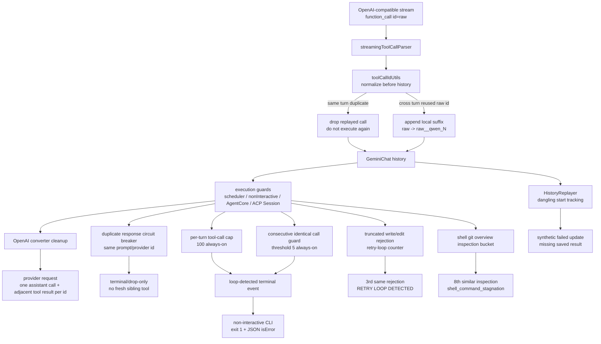

# 工具调用 ID 完整性技术方案

> 适用代码库：`QwenLM/qwen-code` `main`。
> 关联 PR：[#5107](https://github.com/QwenLM/qwen-code/pull/5107) `fix(core): Repair duplicate tool call IDs`、#5279 `fix(core): per-turn tool-call circuit breaker`、#5564 `fix(cli): fail non-interactive runs on loop detection`、#5573 `fix(core): always-on guard for consecutive identical tool calls`、#5624 `fix(cli): Fail dangling replayed tool calls`、#5657 `fix(core): Stop repeated duplicate provider tool-call responses`、#5934 `fix(core): stop repeated truncated write_file/edit retries from looping`、#5944 `fix(core): halt repeated shell inspection variants`；关联 issue：#5099、#4695、#5019、#5234、#5554。

---

## 1. 背景与动机

OpenAI-compatible provider 的 tool-call 协议要求：一次 assistant tool call 与后续 tool result 要用同一个 `tool_call.id` 一一配对，且请求 payload 内不能出现重复 surviving pair。现实里部分 provider 会出现两类异常：

1. **同一 turn 内 replay 已完成的 call id**：stream 中又发一次相同 id 的 function call。如果照常执行，会重复触发 shell/edit 等副作用。
2. **跨 turn 复用 raw id**：模型下一轮又返回旧 id。qwen-code 若把 raw id 原样写进 history，后续 OpenAI payload 会带多个同 id tool result，导致 payload 膨胀和 provider 校验错误，例如 `duplicate_tool_result_in_request dup_id_0001`。

#5107 的目标不是改 provider 协议，而是在 qwen-code 内部建立一个稳定的本地 ID 不变量：**同 turn 重复 id 只执行一次；跨 turn 复用 raw id 进入 history 前必须变成新的唯一 local id；出站 OpenAI payload 最后再清理一次重复 surviving pair。**

#5624 处理的是另一类历史完整性问题：保存的 session 里可能只有 tool start，没有匹配 tool result。恢复或导出 transcript 时，如果原样 replay，会重新创建一个永远 in-progress 的工具卡片。修复后 replay 阶段会把 dangling historical tool calls 合成为 failed terminal update，保证恢复出的 UI 是终态。

#5657 进一步处理 provider 持续 replay 同一 tool id 的循环：第一次重复可以作为 duplicate-error tool response 回给模型，让模型有机会自我修正；如果同一 prompt 内又重复同一个 provider id，就进入 terminal/drop-only 路径，不再调度新的 sibling tool，避免工具调用和 duplicate response 互相喂出无限循环。

#5279/#5573 把通用 tool-call runaway 防线拆成“永远开启的硬保护”和“可配置的启发式检测”：per-turn 工具调用数硬上限不受 `model.skipLoopDetection` 影响，连续完全相同的工具调用 guard 也保持 always-on；更宽泛的全局重复/交替模式仍尊重 loop-detection 配置。#5564 则把 loop-detected 事件在非交互式 CLI 中改成失败退出，避免 CI 把未完成任务当成成功。

#5934 处理的是另一条 retry-loop：模型输出被 `max_tokens` 截断后，scheduler 会拒绝残缺的 `write_file`/edit，模型又反复重发同一个超大调用。修复分两层：默认 `max_tokens` 改用模型声明输出上限，减少正常大响应被 8K cap 截断；残余的重复截断拒绝接入已有 retry-loop detector，第三次同类错误给出 `RETRY LOOP DETECTED` stop directive。

#5944 处理的是“工具调用文本不完全重复但语义停滞”的 shell loop：模型在 `git status`、overview `git diff`、`git ls-files` 等只读仓库概览命令之间变体循环，exact repeated-call guard 捕不到，默认 `model.skipLoopDetection` 又可能跳过启发式 stagnation。修复后核心 loop detection service 增加 always-on `shell_command_stagnation` guard。

---

## 2. 整体架构

关键边界：

- **进入 history 前规范化**：把 provider raw id 与 qwen-code local id 分开。跨 turn 复用 raw id 时，local id 加 suffix；同 turn replay 的 id 被丢弃，不进入可执行路径。
- **执行路径兜底**：core scheduler、non-interactive CLI、AgentCore、ACP Session 都加 duplicate-id guard，即便上游 parser 漏掉，也不会让同一 id 重复执行。
- **出站 payload 最终清理**：OpenAI converter 在发请求前保守清理重复 surviving pair，保证 provider 看到的是合法的 call/result 邻接结构。
- **speculation 配对**：follow-up speculation 生成的 function call 与 function response 继续共用同一 local id，避免 speculative path 自己制造不配对。

---

## 3. 关键流程

### 3.1 同 turn replay：只保留第一次

同一个模型 turn 内，如果 provider 用相同 `tool_call.id` replay 已完成调用，qwen-code 视为无效重复。保留第一次 call，后续同 id call 不再触发工具执行。这个选择偏安全：如果两个调用语义不同但 id 相同，provider 已违反协议；重复执行 shell/edit 的风险比丢弃 replay 更高。

### 3.2 跨 turn raw id 复用：追加 suffix

跨 turn 出现旧 raw id 时，不能简单丢弃，因为模型可能确实想发起一个新调用；也不能原样写 history，因为会污染后续 payload。#5107 将其映射为新的本地 id，例如 `dup_id_0001__qwen_2`，让后续 assistant call 和 tool result 用 local id 配对。

### 3.3 OpenAI 出站转换：最后一道清理

历史里可能已经存在旧版本留下的损坏记录。OpenAI converter 在出站前再做一次 cleanup：同一 id 只保留一个存活 assistant tool call 与一个相邻 tool result，避免把重复 pair 发给 provider。对旧腐化 reused-id history，microcompaction 仍保留保守 disarm 行为，避免把不可信历史继续压进模型上下文。

### 3.4 dangling replay：历史 start 必须有终态

#5624 在 `HistoryReplayer` 中跟踪 replay 出来的 assistant tool starts：真实 tool result 会按 call ID 移除 pending entry；如果保存历史结束时仍有 pending call，replayer 会补发 `tool_call_update{status:'failed'}`，错误信息说明 saved history 缺失工具结果，上一轮可能在工具完成前结束。匹配逻辑会从 saved result call id fallback 到 function response id，再回退 record uuid，兼容旧历史形态。这个变化只影响历史 transcript reconstruction，不改变 live tool execution、REST、SDK 或 ACP wire shape。

### 3.5 repeated duplicate provider response 熔断（#5657）

#5107 的 duplicate guard 解决“同 turn replay 不重复执行”和“跨 turn raw id suffix”两个基础不变量，但仍存在一种 provider 级循环：模型收到 duplicate-error tool response 后，又继续用同一个 provider tool id 发起重复调用。若每次都安排一个 fresh sibling tool 再回 duplicate-error，模型和运行时会形成无意义的循环。

#5657 增加 shared helper 跟踪“同一 prompt 内，同一个 provider id 的重复次数”：

- 第一次 duplicate 仍生成 synthetic duplicate-error response，给模型一次修正机会；
- 同一 prompt 内再次出现相同 provider id 时，直接 terminal/drop-only，不再执行工具，也不再调度 fresh sibling；
- non-interactive、TUI、AgentCore、ACP Session 都走同一口径；
- AgentCore 命中重复循环时以 `LOOP_DETECTED` 终止；
- ACP duplicate tracking 按 prompt 清空，避免上一轮的 provider id 污染下一轮。

这个策略的取舍是保守的：provider id 协议已经损坏时，宁可终止该 prompt 的异常循环，也不继续执行可能有副作用的工具。

### 3.6 per-turn circuit breaker 与 identical-call guard（#5279/#5573/#5564）

#5279 给单个模型 turn 增加 tool-call circuit breaker：无论用户是否设置 `model.skipLoopDetection`，每个 turn 都有 100 次工具调用硬上限。这个上限是资源保护，不是启发式判断；它在调度继续执行前生效，避免模型把 CLI/daemon 跑成无界工具循环。PR 同时保留 opt-in 的 loop heuristics：全局重复调用、交替模式等更容易误伤正常探索的检测仍受 skipLoopDetection 控制，并通过 telemetry 标记 loop 类型，便于后续调参。

#5573 把“连续完全相同的工具调用”从可关闭启发式里拿出来，提升为 always-on guard。连续第 5 次出现同一工具与同一参数时，运行时判定为 `consecutive_identical_tool_calls` 并停止当前 turn；但 session 内显式 `disableForSession` 仍可禁用 loop detection service，保留人工接管或测试逃生口。这样解决 #5019 里模型重复同一副作用工具的风险，同时不会把语义相似但参数不同的正常文件审查归入该 guard。

#5564 补的是非交互式出口语义：loop detection 在 TUI 里可以显示为用户可见的终止信息，但在 CI / `--prompt` / JSON 输出里应视为任务失败。修复后 non-interactive run 收到 loop-detected 事件会跳过同一响应里排队的后续工具，文本仍输出 loop message，进程退出码为 1，JSON 输出标记 `isError` / `is_error`。

### 3.7 truncated write/edit retry-loop backstop（#5934）

#5934 针对 issue #5756 的失败循环：默认 8K output cap 会截断合法的大文件生成，`write_file`/edit scheduler 为了避免写入残缺内容拒绝该 tool call，模型收到普通 hint 后又重发同一个超大调用。

修复分两层：

| 层 | 做法 |
|---|---|
| 根因 | OpenAI-compatible、DashScope、Anthropic 等 generator 默认 `max_tokens` 改成模型声明的输出上限，不再无配置时强制 `min(modelLimit, 8K)`。已有 escalation 到 64K floor / model limit 的多轮 recovery 仍保留。 |
| backstop | core scheduler 把 repeated truncated `write_file`/edit rejection 接入与 schema validation 相同的 `(tool,error)` retry-loop counter；第 1/2 次仍给普通拒绝，第 3 次附带 `RETRY LOOP DETECTED` stop directive。 |

显式用户/env `max_tokens` 仍然优先，并继续禁用自动 escalation；容量受限的自建后端如果依赖低 slot reservation，可以设置 `QWEN_CODE_MAX_OUTPUT_TOKENS=8000` 恢复旧的 8K 上限。这把默认行为调成适合第三方/自建 provider 的“用模型上限”，把低预留变成 operator opt-in。

### 3.8 repeated shell inspection variants guard（#5944）

#5944 给 `LoopDetectionService` 增加一个 always-on guard，专门拦截重复的 shell git overview inspection 变体。它解决的是 #4695 这类场景：模型不断调用 `run_shell_command`，但每次把命令文本略微变一下，exact duplicate guard 不会命中。

入桶范围刻意窄：

| 入桶 | 不入桶 |
|---|---|
| `git status`、overview-style `git diff`、`git ls-files` 等只读仓库概览检查。 | `git diff -- src/file.ts` / `git diff src/file.ts` 这类文件级 review；包含 `git add` / `git commit` 等写操作的 compound shell；被非 inspection tool call 打断的 streak。 |

命中策略：同一 prompt 中连续相似 shell inspection 到第 8 次时，中止运行并返回 `shell_command_stagnation`，文案明确这是 always-on guard，不能被 `model.skipLoopDetection` 关闭。这个设计避免模型烧到 `--max-tool-calls` 或 100 次硬上限，同时降低误伤正常代码审查中“看多个具体文件 diff”的概率。

---

## 4. 涉及 PR

| PR | 子主题 | 作用 |
|---|---|---|
| [#5107](https://github.com/QwenLM/qwen-code/pull/5107) | duplicate tool call id repair | 规范化模型返回 id；同 turn replay 去重；跨 turn raw id suffix；OpenAI payload cleanup；core/CLI/AgentCore/ACP Session 执行 guard；speculation id 配对 |
| #5279 | per-turn tool-call circuit breaker | 增加 always-on 100 次工具调用硬上限，并保留 opt-in global duplicate / alternating loop heuristics 与 telemetry loop type |
| #5564 | non-interactive loop failure | 非交互式 CLI 命中 loop detection 时退出码改为 1，JSON 标记错误，并跳过同一模型响应中尚未执行的工具调用 |
| #5573 | consecutive identical tool calls | 连续完全相同工具调用 guard 改为 always-on，第 5 次触发 `consecutive_identical_tool_calls`，同时保留 session escape hatch |
| #5624 | dangling replay tool calls | replay 历史时跟踪 tool start/result 配对，对缺失 result 的 historical tool call 合成 failed terminal update，避免恢复 UI 卡在 processing |
| #5657 | repeated duplicate provider responses | 同一 prompt 内 provider 反复 replay 同一 tool id 时触发 circuit breaker，首次 synthetic duplicate-error，后续 terminal/drop-only，AgentCore 报 `LOOP_DETECTED` |
| #5934 | truncated write/edit retry loop | 默认 output cap 改为模型声明上限；重复截断 write/edit 拒绝接入 retry-loop detector，第 3 次返回 stop directive |
| #5944 | repeated shell inspection variants | always-on shell git overview inspection guard：相似 `git status` / overview diff / `git ls-files` 连续循环时以 `shell_command_stagnation` 中止；文件级 diff 和写操作复合命令不入桶 |

---

## 5. 已知限制 / 后续

1. **同 turn 相同 id 的两个不同调用只保留第一个**：这是刻意的安全取舍。OpenAI-compatible 协议不允许同一 turn 内复用 id；重复执行副作用更危险。
2. **Anthropic-compatible 出站转换未改**：#5107 针对 OpenAI-compatible provider 的历史和 payload 修复；其它 provider 协议仍按原路径。
3. **旧损坏历史只能保守处理**：已经写入 session 的重复 id 记录无法可靠还原模型真实意图；出站 cleanup 与 microcompaction disarm 是防止继续放大的保护，不是历史迁移。
4. **dangling replay 修复仅限历史重建**：#5624 不改变 live tool lifecycle；它只保证旧 transcript 恢复时不会留下无终态 tool block。
5. **duplicate circuit breaker 是 prompt-scoped**：#5657 按 prompt 清理重复跟踪；跨 prompt 的 raw id 复用仍由 #5107 的 local suffix / cleanup 处理。
6. **100 次硬上限是资源保护，不代表任务语义失败分类完整**：#5279 只保证单 turn 不会无限调用工具；模型为何进入循环、是否可自动恢复，仍由更具体的 retry-loop / duplicate / shell stagnation guard 或上层错误恢复处理。
7. **identical-call guard 只看完全相同工具与参数**：#5573 有意不把“相似但不同”的调用纳入 always-on guard，避免误伤正常 review。语义停滞类 shell 变体由 #5944 的更窄 bucket 处理。
8. **高 `max_tokens` 会改变自建后端 slot reservation**：#5934 默认使用模型上限，容量受限部署如需旧 8K 预留，应显式设置 `QWEN_CODE_MAX_OUTPUT_TOKENS=8000`。
9. **shell inspection guard 只覆盖 git overview 变体**：#5944 不尝试识别所有 shell 循环；它刻意 fail open，避免把文件级 diff review、带写操作的 shell chain 或穿插其它工具的正常探索误判为 stagnation。

---

## 6. 代码贡献

### PR #5107 — repair duplicate tool call IDs

- `packages/core/src/core/toolCallIdUtils.ts`：新增工具调用 ID 规范化/去重 helper。
- `packages/core/src/core/geminiChat.ts`：模型返回 function call 进入 history 前做 id 规范化。
- `packages/core/src/core/openaiContentGenerator/{streamingToolCallParser,converter}.ts`：解析与出站转换阶段清理重复 id 和 surviving pair。
- `packages/core/src/core/coreToolScheduler.ts`、`packages/cli/src/nonInteractiveCli.ts`、`packages/core/src/agents/runtime/agent-core.ts`、`packages/cli/src/acp-integration/session/Session.ts`：执行路径增加 duplicate-id guard。
- `packages/core/src/followup/speculation.ts`：保持 speculative function call / response 使用同一 local id 配对。

### PR #5279 — per-turn tool-call circuit breaker

- core loop detection service：新增 per-turn tool-call count hard cap，100 次后终止当前 turn，且不受 `model.skipLoopDetection` 关闭。
- loop heuristics：保留 opt-in global duplicate / alternating detection，避免宽泛启发式误伤正常探索。
- telemetry：loop detection event 标记具体 loop type，便于区分 hard cap、duplicate、alternating 等来源。
- tests：覆盖 hard cap always-on 与 skipLoopDetection 下启发式 guard 的开关边界。

### PR #5564 — fail non-interactive runs on loop detection

- `packages/cli/src/nonInteractiveCli.ts`：收到 loop-detected 事件后把 run 标记为失败，退出码返回 1。
- pending tool handling：跳过同一模型响应里尚未执行的工具调用，避免失败检测后继续产生副作用。
- JSON output：`isError` / `is_error` 置为 true；文本输出仍保留 loop message，便于 CI 日志诊断。
- tests：non-interactive CLI 回归覆盖 exit code、JSON error flag 和 queued tool skip。

### PR #5573 — always-on consecutive identical tool-call guard

- `LoopDetectionService`：连续完全相同工具名和参数的调用第 5 次触发 `consecutive_identical_tool_calls`，独立于 `model.skipLoopDetection`。
- session escape：保留 `disableForSession`，便于人工接管或测试需要时关闭整个 loop detection service。
- gated heuristics：更宽泛的 duplicate/alternating heuristics 仍按配置 gate，不被该 PR 一并提升。
- tests：覆盖 skipLoopDetection 开启时 identical guard 仍触发，以及 session disable 后不触发。

### PR #5624 — fail dangling replayed tool calls

- `HistoryReplayer.ts`：replay assistant tool starts 时按 call id 记录 pending，replay tool result 时移除匹配项。
- result matching：从 saved result call id fallback 到 function response id，再回退 record uuid，覆盖旧历史数据形态。
- replay 完成后对剩余 pending calls 发 failed terminal update，说明 saved history 缺失 tool result。
- `selectors.test.ts`：确保 webui restored transcript 中 failed/completed tool blocks 都被视为 idle，不再让 session 卡在 responding。

### PR #5657 — repeated duplicate provider response breaker

- shared duplicate helper：记录 prompt-scoped provider tool id duplicate state，区分首次 duplicate 和 repeated duplicate。
- core/TUI/non-interactive/ACP/AgentCore 执行路径：首次 duplicate 生成 synthetic duplicate-error tool response；重复 duplicate 直接 terminal/drop-only，不调度 fresh sibling tool。
- AgentCore：repeated duplicate 命中时以 `LOOP_DETECTED` 结束，避免后台 agent 无限工具循环。
- ACP Session：duplicate tracking 在每个 prompt 结束后清空，防止上一轮异常影响下一轮正常调用。

### PR #5934 — truncated write/edit retry-loop backstop

- `tokenLimits` / provider generators：删除 8K capped default，未显式配置 `max_tokens` 时使用模型声明输出上限；OpenAI-compatible、DashScope、Anthropic 路径同步更新测试。
- `coreToolScheduler`：截断 `write_file`/edit 拒绝进入 retry-loop detector，第三次相同拒绝返回 `RETRY LOOP DETECTED`。
- docs/config：说明 operator 可用 `QWEN_CODE_MAX_OUTPUT_TOKENS=8000` 恢复低 slot reservation。

### PR #5944 — repeated shell inspection variants guard

- `LoopDetectionService`：新增 read-only git overview inspection bucketing，把 `git status`、overview `git diff`、`git ls-files` 等语义相近命令计入同一 streak。
- false-positive guards：file-specific diff、带 repo 写操作的 compound commands、非 inspection tool call 打断后的新 streak 都不触发。
- `client.ts` / non-interactive path：命中时以 `shell_command_stagnation` 终止 turn，避免继续跑到工具调用硬上限。
- tests/E2E：loop detection service 覆盖正负例，nonInteractive CLI 和 tmux fake OpenAI-compatible endpoint 验证第 8 次请求前后行为。
