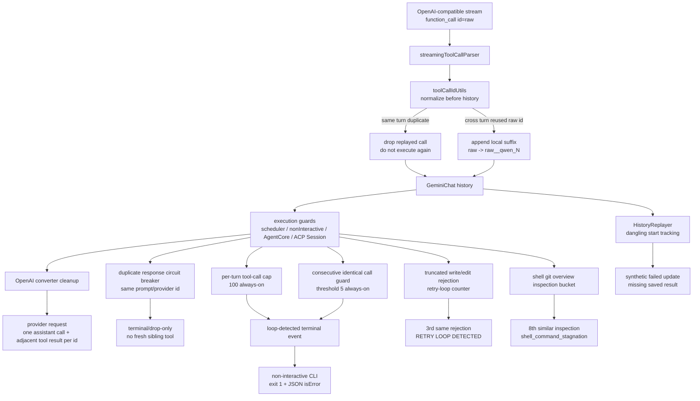

# 工具调用 ID 完整性技术方案

> 适用代码库：`QwenLM/qwen-code` `main`。

---

## 1. 背景与动机

OpenAI-compatible provider 的 tool-call 协议要求：一次 assistant tool call 与后续 tool result 要用同一个 `tool_call.id` 一一配对，且请求 payload 内不能出现重复 surviving pair。现实里部分 provider 会出现两类异常：

1. **同一 turn 内 replay 已完成的 call id**：stream 中又发一次相同 id 的 function call。如果照常执行，会重复触发 shell/edit 等副作用。
2. **跨 turn 复用 raw id**：模型下一轮又返回旧 id。qwen-code 若把 raw id 原样写进 history，后续 OpenAI payload 会带多个同 id tool result，导致 payload 膨胀和 provider 校验错误，例如 `duplicate_tool_result_in_request dup_id_0001`。

#5107 的目标不是改 provider 协议，而是在 qwen-code 内部建立一个稳定的本地 ID 不变量：**同 turn 重复 id 只执行一次；跨 turn 复用 raw id 进入 history 前必须变成新的唯一 local id；出站 OpenAI payload 最后再清理一次重复 surviving pair。**

#5624 处理的是另一类历史完整性问题：保存的 session 里可能只有 tool start，没有匹配 tool result。恢复或导出 transcript 时，如果原样 replay，会重新创建一个永远 in-progress 的工具卡片。修复后 replay 阶段会把 dangling historical tool calls 合成为 failed terminal update，保证恢复出的 UI 是终态。

---

## 2. 整体架构

关键边界：

- **进入 history 前规范化**：把 provider raw id 与 qwen-code local id 分开。跨 turn 复用 raw id 时，local id 加 suffix；同 turn replay 的 id 被丢弃，不进入可执行路径。
- **执行路径兜底**：core scheduler、non-interactive CLI、AgentCore、ACP Session 都加 duplicate-id guard，即便上游 parser 漏掉，也不会让同一 id 重复执行。
- **出站 payload 最终清理**：OpenAI converter 在发请求前保守清理重复 surviving pair，保证 provider 看到的是合法的 call/result 邻接结构。
- **speculation 配对**：follow-up speculation 生成的 function call 与 function response 继续共用同一 local id，避免 speculative path 自己制造不配对。

---

## 3. 关键流程

### 3.1 同 turn replay：只保留第一次

同一个模型 turn 内，如果 provider 用相同 `tool_call.id` replay 已完成调用，qwen-code 视为无效重复。保留第一次 call，后续同 id call 不再触发工具执行。这个选择偏安全：如果两个调用语义不同但 id 相同，provider 已违反协议；重复执行 shell/edit 的风险比丢弃 replay 更高。

### 3.2 跨 turn raw id 复用：追加 suffix

跨 turn 出现旧 raw id 时，不能简单丢弃，因为模型可能确实想发起一个新调用；也不能原样写 history，因为会污染后续 payload。#5107 将其映射为新的本地 id，例如 `dup_id_0001__qwen_2`，让后续 assistant call 和 tool result 用 local id 配对。

### 3.3 OpenAI 出站转换：最后一道清理

历史里可能已经存在旧版本留下的损坏记录。OpenAI converter 在出站前再做一次 cleanup：同一 id 只保留一个存活 assistant tool call 与一个相邻 tool result，避免把重复 pair 发给 provider。对旧腐化 reused-id history，microcompaction 仍保留保守 disarm 行为，避免把不可信历史继续压进模型上下文。

### 3.4 dangling replay：历史 start 必须有终态

#5624 在 `HistoryReplayer` 中跟踪 replay 出来的 assistant tool starts：真实 tool result 会按 call ID 移除 pending entry；如果保存历史结束时仍有 pending call，replayer 会补发 `tool_call_update{status:'failed'}`，错误信息说明 saved history 缺失工具结果，上一轮可能在工具完成前结束。匹配逻辑会从 saved result call id fallback 到 function response id，再回退 record uuid，兼容旧历史形态。这个变化只影响历史 transcript reconstruction，不改变 live tool execution、REST、SDK 或 ACP wire shape。

## 4. 涉及 PR

| PR | 子主题 | 作用 |
|---|---|---|
| [#5107](https://github.com/QwenLM/qwen-code/pull/5107) | duplicate tool call id repair | 规范化模型返回 id；同 turn replay 去重；跨 turn raw id suffix；OpenAI payload cleanup；core/CLI/AgentCore/ACP Session 执行 guard；speculation id 配对 |
| #5624 | dangling replay tool calls | replay 历史时跟踪 tool start/result 配对，对缺失 result 的 historical tool call 合成 failed terminal update，避免恢复 UI 卡在 processing |

---

## 5. 已知限制 / 后续

1. **同 turn 相同 id 的两个不同调用只保留第一个**：这是刻意的安全取舍。OpenAI-compatible 协议不允许同一 turn 内复用 id；重复执行副作用更危险。
2. **Anthropic-compatible 出站转换未改**：#5107 针对 OpenAI-compatible provider 的历史和 payload 修复；其它 provider 协议仍按原路径。
3. **旧损坏历史只能保守处理**：已经写入 session 的重复 id 记录无法可靠还原模型真实意图；出站 cleanup 与 microcompaction disarm 是防止继续放大的保护，不是历史迁移。
4. **dangling replay 修复仅限历史重建**：#5624 不改变 live tool lifecycle；它只保证旧 transcript 恢复时不会留下无终态 tool block。

---

## 6. 代码贡献

### PR #5107 — repair duplicate tool call IDs

- `packages/core/src/core/toolCallIdUtils.ts`：新增工具调用 ID 规范化/去重 helper。
- `packages/core/src/core/geminiChat.ts`：模型返回 function call 进入 history 前做 id 规范化。
- `packages/core/src/core/openaiContentGenerator/{streamingToolCallParser,converter}.ts`：解析与出站转换阶段清理重复 id 和 surviving pair。
- `packages/core/src/core/coreToolScheduler.ts`、`packages/cli/src/nonInteractiveCli.ts`、`packages/core/src/agents/runtime/agent-core.ts`、`packages/cli/src/acp-integration/session/Session.ts`：执行路径增加 duplicate-id guard。
- `packages/core/src/followup/speculation.ts`：保持 speculative function call / response 使用同一 local id 配对。

### PR #5624 — fail dangling replayed tool calls

- `HistoryReplayer.ts`：replay assistant tool starts 时按 call id 记录 pending，replay tool result 时移除匹配项。
- result matching：从 saved result call id fallback 到 function response id，再回退 record uuid，覆盖旧历史数据形态。
- replay 完成后对剩余 pending calls 发 failed terminal update，说明 saved history 缺失 tool result。
- `selectors.test.ts`：确保 webui restored transcript 中 failed/completed tool blocks 都被视为 idle，不再让 session 卡在 responding。
