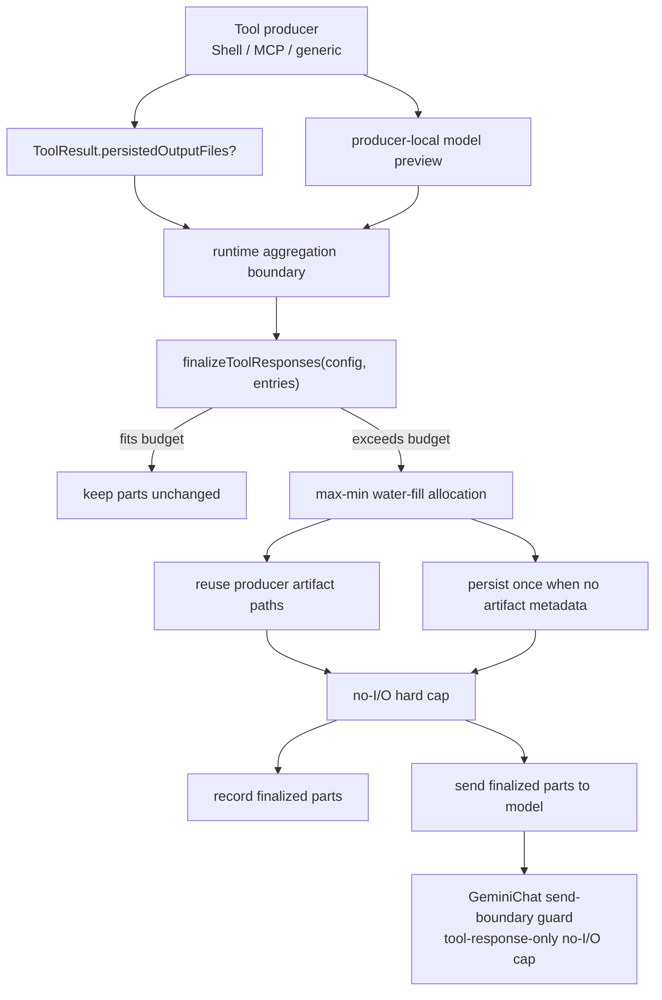

# 最终工具响应预算技术方案

> 适用范围：`QwenLM/qwen-code` 的 Core scheduler、interactive TUI、headless、ACP session、Agent runtime 与 speculative follow-up。
> 当前记录：#7323 已合入；#7470 已合入并补 Shell 无 artifact truncation 回归测试。该方案按 merged diff、changed files 和当前 `main` 相邻实现整理。

---

## 1. 背景与动机

qwen-code 已有多层工具输出治理，但它们原本各自为政：

- Shell producer 约 30K 字符触发截断并落文件；
- generic tool result 约 2K 字符触发持久化 preview；
- Core scheduler 对一批 completed tool call 做 aggregate offload；
- interactive、headless、ACP、Agent、speculation 还会在 scheduler 外组合 duplicate、skipped、cancelled 或 synthetic response。

旧 scheduler 会把“已经出现 truncation marker”当作不需要 aggregate budget 的信号。这样多个 producer-local 已截断结果仍可能合计超过 `toolOutputBatchBudget`。此外，不同 runtime 录制到 transcript 的 parts 可能和下一次发给模型的 parts 不一致，或者因为缺少结构化元数据而重复持久化同一段输出。

#7323 的目标是把“最终发给模型、同时录进 transcript 的 tool response batch”变成唯一权威边界：最后一个聚合点必须做一次 deterministic budget finalization，成功后记录和发送使用同一份 finalized parts。

---

## 2. 整体架构

关键不变量：

1. 预算约束的是 model-facing tool response text，不约束 rich display、media parts 或普通 assistant/user text。
2. `functionResponse.response.output`、`error` 和 top-level text 可以被缩短；response order、function identity 和 non-text parts 必须保留。
3. producer 已经持久化的 artifact path 要复用，不能靠人类可读 truncation text 反推。
4. persistence failure 不允许打破预算：最后有一层不做 I/O 的 hard cap。
5. finalized parts 同时用于下一次 model request 和 chat recording。
6. 成功 `enter_plan_mode` 的 output 是 lifecycle policy，不能作为普通诊断输出被截断。

---

## 3. 子系统详解

### 3.1 结构化持久化元数据

#7323 给 `ToolResult` 与 `ToolCallResponseInfo` 增加内部字段 `persistedOutputFiles?: string[]`：

- `undefined`: producer 没有做过持久化判断；
- `[]`: producer 判断过，但没有可复用文件；
- 非空数组: producer 已经把完整输出写入这些 artifact path。

该字段只服务 runtime 内部预算决策，不进入 hook serialization、ACP wire payload、JSON output、telemetry attributes 或 persisted UI metadata。hook 如果重建 response，不会自动继承 metadata，除非 runtime 显式复制。

#7470 锁定了 `[]` 这个 sentinel 的行为：Shell producer 可能因为输出超过直接模型预算而返回短 preview，但完整输出保存失败或没有生成 artifact。此时必须写 `persistedOutputFiles: []`，表示 producer 已经判断过且没有可复用文件；finalizer 看到空数组后按“无 artifact metadata”路径继续预算，而不是误以为 producer 未判断、再尝试从人类可读 preview 反推完整输出。

### 3.2 producer-local preview

producer 仍负责本地体验和首层防护，但不再承担最终 aggregate enforcement：

- Shell 保留当前约 30K trigger，并返回约 4K head/tail 模型预览，exit/error 信息仍可见；
- MCP large output 保留完整 transformed rich display，模型侧给约 2K preview；
- generic `persistAndTruncateToolResult()` 返回 primary/fallback writer 的实际 path，供后续 finalizer 复用。

因此“已经 producer 截断”不再意味着“batch 已满足最终预算”。

### 3.3 shared finalizer

`packages/core/src/utils/tool-response-finalizer.ts` 是唯一共享实现：

- `collectTextSlots()` 按 response order 收集 bounded text slot：top-level `text`、`functionResponse.response.output`、`error`；
- `allocateTextBudget()` 用 max-min water-fill 给各 slot 分配字符预算，小结果可完整保留，大结果公平分摊剩余预算；
- `fitText()` 在预算内写入 artifact path header、head/tail preview，并避免切断 UTF-16 surrogate pair；
- `finalizeToolResponses()` 先复用 `persistedOutputFiles`，必要时对未持久化 entry 调一次 `persistAndTruncateToolResult()`，失败则用空 metadata 继续；
- `enforceFunctionResponseBudget()` 是无 I/O 的发送边界兜底，只处理 function response 文本。

`toolResponseTextLength()` 用返回后的 parts 重新计算 model-facing 长度，供 `contentLength` 与测试断言使用。

### 3.4 runtime 聚合边界

#7323 把 finalizer 接入所有“最后聚合点”：

| runtime | finalization 边界 |
|---|---|
| Core scheduler | `PostToolBatch` hook 前 finalize，hook 可能追加/替换 response 后再 finalize 一次 |
| interactive TUI | executable、duplicate、synthetic response 按 call order 合并后，record/submit 前 finalize |
| headless | 整个 turn 的 duplicate、skipped、cancelled、executed response 在外层一次 finalize |
| ACP session | pending tool result records 带 ordinal/sequence 排序，record/return 前 finalize |
| Agent runtime | aggregate model-facing result append history 前 finalize |
| speculation | speculative loop 写入 history / emit tool result 前 finalize |
| GeminiChat send boundary | 对任何漏过外层的 function response 做 no-I/O safety cap |

这条设计把“录制内容”和“下一轮请求内容”绑定为同一份 finalized parts，避免 resume/replay 和 live request 看到不同版本。

### 3.5 `enter_plan_mode` 例外

成功 `enter_plan_mode` 返回的是 Plan mode lifecycle policy。截断它会改变后续执行规则，而不是缩短诊断输出。因此 finalizer 按 tool name 把它的 successful output 排除在 ordinary output allocation 外。

失败 text 不安装 lifecycle policy，仍按普通 tool error 参与预算。同批其它工具输出也不因 `enter_plan_mode` 存在而逃过预算。

---

## 4. 设计边界

- 预算单位仍是字符，不是 tokenizer 精确 token 或 wire byte。
- media parts 不计入当前预算；未来可单独设计 media-specific budget。
- rich UI display 与 model response 分离；Ctrl+O transcript 只能展开 UI/history 已保留的 detail，不能恢复被 model response budget 或历史 display compaction 移除的内容。
- existing sessions 不迁移；只有新录制的 tool result 获得更强一致性。
- storage lifecycle、artifact hash、cleanup policy 和远端 artifact retrieval 都是后续独立问题。

---

## 5. 验证方式

- `packages/core/src/utils/tool-response-finalizer.test.ts`: allocation、artifact reuse、persistence failure、surrogate safety、media preservation、Plan mode exception。
- `packages/core/src/utils/truncation.test.ts`, `packages/core/src/tools/shell.test.ts`, `packages/core/src/tools/mcp-tool.test.ts`: producer preview 与 metadata。
- `packages/core/src/tools/shell.test.ts`: #7470 增加 Shell truncation without artifact 回归，断言保留短 preview、移除原始超长 model content、返回空 artifact list。
- `packages/core/src/core/coreToolScheduler.test.ts`: pre/post hook finalization、record/send equality。
- `packages/cli/src/ui/hooks/useGeminiStream.test.tsx`, `packages/cli/src/nonInteractiveCli.test.ts`, `packages/cli/src/acp-integration/session/Session.test.ts`: interactive/headless/ACP 聚合边界。
- `packages/core/src/agents/runtime/agent-core.test.ts`, `packages/core/src/followup/speculation.test.ts`, `packages/core/src/core/geminiChat.test.ts`: Agent/speculation/send guard。

---

## 6. 涉及 PR

| PR | 状态 | 子主题 | 作用 |
|---|---|---|---|
| [#7323](https://github.com/QwenLM/qwen-code/pull/7323) | merged | final tool response budget | 增加结构化 persisted-output metadata、共享 finalizer、runtime aggregation boundaries、send-boundary guard 和 Plan mode policy exception。 |
| [#7470](https://github.com/QwenLM/qwen-code/pull/7470) | merged | Shell truncation without artifact regression | 为 Shell producer 没有 artifact 但已有短 preview 的路径补测试，固定 `persistedOutputFiles: []` sentinel 和三态语义。 |

---

## 7. 已知限制 / 后续

- #7323/#7470 已合入；文档记录当前 main 的最终实现方案。
- 不提供精确 token 预算，不改变 provider context window 估算与自动压缩策略。
- 不保证 artifact path 在远端 UI 中可直接读取；这里只保证模型响应里有可诊断的 path reference。
- 后续如要在 Ctrl+O transcript 中读取完整 artifact，需要独立设计权限、路径暴露、大小限制和 UI streaming。

_按个人 PR 口径更新于 2026-07-22_
