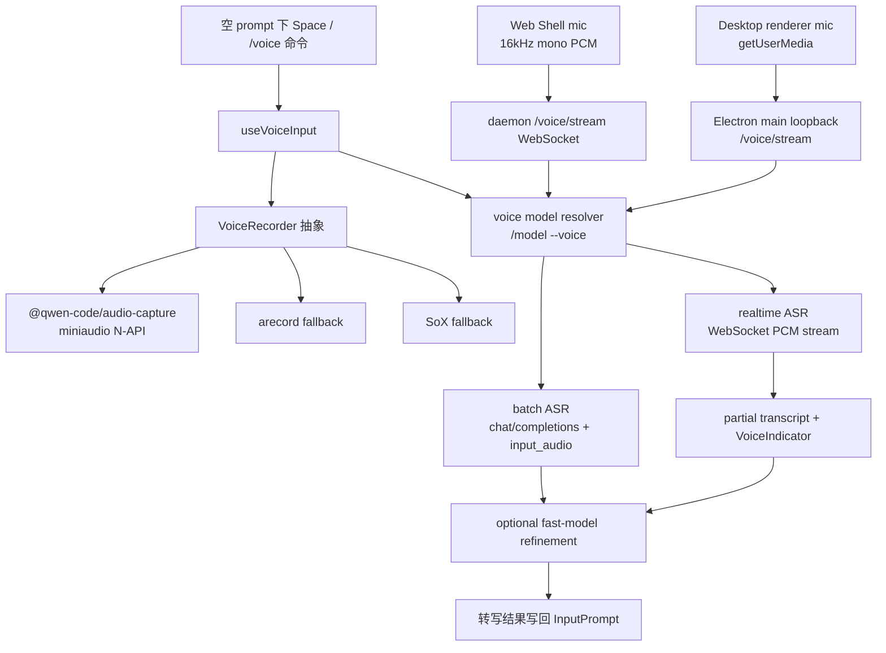

# Voice dictation 技术方案

> 适用范围：`QwenLM/qwen-code` CLI、daemon-hosted Web Shell 与 desktop app 的输入框语音听写能力。
> 涉及 PR：#5502（voice dictation with native capture, streaming, and biasing）、#5605（native recorder fallback logging）、#5609（retry after native stop errors）、#5628（bundle native audio addon into standalone archives）、#5632（fastOnly/voiceOnly model flags）、#5747（mirror install audio capture bundling）、#5755（Web Shell voice over daemon）、#5765（daemon workspace voice APIs）、#5794（fast-model ASR transcript refinement）、#5817（user keyterms file）、#5856（desktop voice dictation）、#5947（ComposerToolbarAction voice visibility）。
> 状态：2026-06-22 起主链路合入；2026-06-28 补齐 desktop surface 与 Web Shell embed 侧 voice toolbar action 控制。

---

## 1. 背景与动机

Voice dictation 让用户在交互式 CLI、daemon-hosted Web Shell 或 desktop app 的输入框里直接说话生成 prompt。它不是独立语音服务，而是复用现有 OpenAI-compatible / DashScope provider 配置，把音频采集、批量或实时 ASR、输入框状态和模型选择统一进 qwen-code 现有 CLI/TUI/daemon/desktop 体系。

核心目标：

- `/voice hold|tap|off|status` 控制听写；hold 模式按住 Space 说话，tap 模式按一次开始、再按一次或静音自动结束。
- `/model --voice <id>` 选择 ASR 模型；`general.voice.{enabled,mode,language}` 持久化用户偏好。
- 本机采集优先使用 `@qwen-code/audio-capture` 原生 addon，Linux 可回退 `arecord`，再回退 SoX。
- `qwen3-asr-flash` 走批量转写；realtime 模型走 WebSocket PCM streaming 并显示 partial transcript。
- Web Shell 不把 provider 凭据下发到浏览器；浏览器只采集麦克风 PCM，转写请求由 daemon 端完成。
- Desktop 不把 provider 凭据下发到 renderer；renderer 只采集 PCM，Electron main / server-core loopback voice server 复用 CLI ASR pipeline。
- ASR 原始 transcript 可经 fast model 做保守清理，超时、错误、空结果或不安全改写都会回退原文。
- 项目或用户可通过 keyterms file 扩展 ASR bias 词表，改善专有名词识别。

---

## 2. 整体架构

实现按三层切开：

| 层 | 作用 | 代表路径 |
|---|---|---|
| 音频采集 | native mic、permission query、fallback recorder、silence stop、native stop 后 active-state 释放 | `packages/audio-capture/`、`packages/cli/src/ui/voice/*recorder.ts` |
| 转写协议 | batch `input_audio`、realtime WebSocket、重试、语言/词表 bias | `voice-transcriber.ts`、`voice-stream-session.ts`、`qwen-asr-realtime-session.ts` |
| daemon / Web Shell 集成 | 浏览器麦克风 PCM → daemon `/voice/stream`，Web Shell `/model --voice`，composer transcript 回填 | `packages/cli/src/serve/voice/*`、`packages/web-shell/client/voice/*` |
| desktop 集成 | Electron renderer 采集 PCM → main process loopback voice server，Settings/Input 与 composer model dropdown 控制 voice | `packages/desktop/apps/electron/src/renderer/.../voice/*`、`packages/desktop/packages/server-core/src/voice/*` |
| TUI 集成 | `/voice`、`/model --voice`、Space key matcher、状态/音量/partial UI | `voice-command.ts`、`use-voice-input.ts`、`VoiceIndicator.tsx` |

---

## 3. 关键实现

### 3.1 采集后端与 fallback

PR #5502 新增 `packages/audio-capture`，用 miniaudio 封装跨平台麦克风采集。CLI 侧抽象出 recorder interface，优先加载 native backend；不可用时 Linux 回退 `arecord`，再回退 SoX。这样普通安装路径依赖预编译产物，开发或 CI 可以通过 `node-gyp` 构建验证。

macOS 增加麦克风权限查询，避免无权限时只表现为“没有声音”。原生加载有冷启动预热，降低第一次按 Space 时 addon 初始化吞掉交互的概率。

### 3.2 batch 与 realtime 两条 ASR 路径

模型 id 决定转写路径：

- `qwen3-asr-flash`：把录音后的音频作为 OpenAI-compatible `chat/completions` 的 `input_audio` 发送，得到一次性结果。
- `qwen3-asr-flash-realtime`、`fun-asr-realtime`、`paraformer-realtime-v2` 等：把 PCM chunk 推到 WebSocket，实时展示 partial transcript，最终结果写回输入框。

两条路径都会使用语言偏好和开发术语 keyterms 做 bias，但不发送项目路径或 git branch 元数据。若非语音音频导致模型只回显 bias 词，结果会被丢弃，避免把提示词噪声写进用户输入。

### 3.3 输入框状态机

`useVoiceInput` 负责把 key event、voice mode、recorder、transcriber 和 `InputPrompt` 串起来：

- hold：空 prompt 下按住 Space 开始录音，释放后停止并转写。
- tap：第一次 Space 开始，第二次 Space 或 silence auto-stop 结束。
- off：Space 恢复普通输入行为。

`VoiceIndicator` 渲染 recording / transcribing / error 状态、音量条和 realtime partial transcript。转写完成只更新输入框内容，不直接绕过用户提交动作。

### 3.4 6/22-6/23 follow-up：fallback、重试与打包

#5605 把 native recorder 加载失败的 fallback 变成可诊断行为：当 `@qwen-code/audio-capture` 不可用、权限异常或平台不支持时，CLI 会记录清晰原因，再按 Linux `arecord` → SoX 的顺序回退，避免用户只看到“语音没反应”。

#5609 修复 stop 阶段异常后的状态释放。native recorder 在 stop 抛错时也会清理 active state，使用户下一次按 Space 或执行 `/voice` 能重新开始录音，而不是卡在“已有录音进行中”的假状态。

#5628 把 native audio addon 和 `node-gyp-build` 放进 standalone archives。发布包不再只依赖源码树里的 native addon，用户安装 standalone CLI 后也能走 native mic capture；打包失败时仍保留 fallback recorder 路径。

#5747 进一步处理 mirror/private registry 场景：准备 npm publish package 时，如果 native audio capture artifacts 可用，就把 `@qwen-code/audio-capture` 复制进主包 bundled dependencies，降低“主包已同步、optional native 包未同步”导致 `/voice` 运行时缺 native recorder 的概率。若仍缺包，错误文案会指向 mirror/private registry optional dependency sync 问题，而不是只给 Node 的 generic module resolution error。

#5632 给模型定义增加 `fastOnly` / `voiceOnly` 旗标。`voiceOnly` 模型不会出现在主 `/model` 列表里，而是供 `/model --voice` 使用；这避免 ASR 模型被误选为对话模型，也让语音模型选择有独立过滤条件。

### 3.5 6/24 follow-up：Web Shell daemon voice（#5755）

#5755 把语音听写从本地 CLI 扩展到 daemon-hosted Web Shell。关键边界是：浏览器负责麦克风采集，daemon 负责模型调用和 provider 凭据使用。

实现链路：

1. Web Shell 通过浏览器麦克风 API 采集音频，并在前端转换为 raw 16kHz mono PCM。
2. 前端打开 daemon 的 `/voice/stream` WebSocket，把 PCM chunk 持续推给 daemon。
3. daemon 侧复用现有 CLI voice pipeline：根据当前 voice model 选择 batch 或 realtime ASR，并使用 daemon 进程里的 provider 配置发起转写。
4. Web Shell 收到 partial/final transcript 后写入 composer；`/model --voice` 在 Web Shell 中复用同一 voice model 选择语义。

安全和兼容性约束：

- provider API key / OAuth token 不进入浏览器，浏览器只持有音频流和 daemon 会话态。
- 浏览器 WebSocket 原生不能像 `fetch` 那样自由携带 Authorization header，因此该能力只对 loopback、无 token 的 daemon 路径可靠；远程带 token 部署仍需要后续认证设计。
- 为了兼容前端 CSP，录音路径使用 `ScriptProcessorNode`，避免 AudioWorklet 需要 blob worker；同时放开 daemon-hosted Web Shell 的 microphone permission policy 到 `microphone=(self)`。

### 3.6 6/24 follow-up：ASR transcript refinement（#5794）

#5794 在 batch 和 realtime ASR 的最终 transcript 之后加一层 fast-model refinement。它的目标不是“重写用户意图”，而是做保守文本清理：去掉明显口头填充、修正常见识别错字、整理标点和开发术语，同时保留用户原始表达。

实现方式：

- 配置项 `general.voice.refineTranscript` 默认开启；没有可用 `fastModel` 时自动跳过。
- 转写完成后进入 `refining` 状态，UI 显示 `✦ refining...`，避免用户误以为录音已经卡住。
- fast model 调用有短超时预算（2.5s）。超时、API 错误、空结果或输出被判定为过度改写时，直接回退 raw transcript。
- refinement 只作用于最终写入 input/composer 的文本，不改变原始音频、partial transcript 或语音模型选择。

### 3.7 daemon workspace voice APIs（#5765）

#5765 把 CLI-only `/voice` 能力拆成 daemon 可消费的 workspace API，让 Web Shell、desktop、SDK 等客户端不用依赖 TUI slash command 也能读取和更新 voice 配置。

主要 surface：

- `GET /workspace/voice`：返回 voice enable/mode/language/model/keyterms 状态和可选 voice models，不暴露 provider secret。
- `POST /workspace/voice`：增量更新 voice settings，复用 CLI 侧 voice model validation 和 settings persistence。
- `POST /workspace/voice/transcribe`：接受 binary `audio/*` 或 `application/octet-stream`，由 daemon 端做 batch transcription；拒绝 unsupported content type、空音频、realtime-only model、oversized body、missing model 和不安全 upstream error。
- ACP / SDK helpers 与 REST route 使用同一 workspace service facade，避免 daemon client 与 CLI/TUI 走不同验证路径。

这与 #5755 的 `/voice/stream` 互补：#5755 偏 realtime Web Shell stream，#5765 提供 workspace config 和 batch transcription API。

### 3.8 user keyterms file（#5817）

#5817 给 ASR bias 词表增加用户扩展入口：

- 显式设置：`general.voice.keytermsFile`，可为绝对路径或相对 workspace root。
- 自动发现：未设置时，trusted workspace 下自动读取 `.qwen/voice-keyterms.txt`。
- 文件格式：一行一个 term，空行和 `#` 注释忽略。
- 合并策略：用户 terms 与内置全局开发术语合并，大小写不敏感去重；全局术语保留 canonical casing。
- 安全边界：只在 trusted workspace 读取；拒绝 symlink / 非 regular file；有 file-size、term-count 和 total-length cap；读取失败回退内置 globals，不让坏文件破坏 dictation。

合并后的 keyterms 会进入 Qwen ASR realtime 的 `corpus_text`，batch path 则作为 leading system message 注入。DashScope `fun-asr` / `paraformer` 的 stateful `vocabulary_id` 不在本 PR 范围。

### 3.9 desktop voice dictation（#5856）

#5856 把语音听写补到 desktop app，目标是与 CLI 和 Web Shell 的能力面一致，但保持 desktop 的 Electron 安全边界：

| 能力 | 实现方式 |
|---|---|
| composer mic UI | composer toolbar 增加 microphone button；录音中切为 recording bar（leader / waveform / elapsed timer / stop button）；停止后 transcript 插入输入框供用户复核。 |
| renderer capture | renderer 使用浏览器 `getUserMedia` 采集麦克风，不使用 native `@qwen-code/audio-capture` addon；音频被转换为 raw 16kHz mono PCM。 |
| loopback transport | PCM 流向 Electron main process 的 loopback `/voice/stream` WebSocket；provider credentials 留在 main/server-core 侧，不进入 renderer。 |
| ASR pipeline | server-core 复用 CLI voice pipeline，支持 batch `qwen3-asr-flash` 与 realtime `*-realtime`，realtime 模型可回传 interim text。 |
| settings | Settings → Input 和 composer model dropdown 可开关 voice dictation、选择 voice model；新增 `voiceEnabled`（默认 true）和 `voiceModel`（默认 `qwen3-asr-flash`）。 |

风险边界也要保留：PR 本地跑了 typecheck、voice unit tests 和 i18n parity，但 in-app mic → transcript 的真实运行时流程在合入时尚未截屏/录屏验证；DashScope key 也必须具备 ASR 权限，否则转写会返回 4xx 并展示为错误。

### 3.10 Web Shell voice toolbar visibility（#5947）

#5947 不改变 daemon voice pipeline，而是补 Web Shell 被外部宿主嵌入时的 toolbar 控制面。`ComposerToolbarAction` union 新增 `voice`，`VoiceButton` 使用已有 `showToolbarAction()` gate：

- 不传 `composerToolbarActions` 时仍展示所有默认 action，包括 voice，保持向后兼容；
- 宿主传 `composerToolbarActions={['approvalMode','model','commands','files']}` 时可隐藏 voice button；
- 宿主只传 `['voice']` 时，toolbar action 区只展示 voice；
- daemon 侧 `voice_transcribe` capability check 不变，#5947 只是让 embedding host 有一个与 `approvalMode` / `model` / `commands` / `files` / `widthMode` 一致的显隐入口。

---

## 4. 设计约束

- **默认 opt-in**：语音由 `general.voice.enabled` 和 `/voice` 控制，不改变默认键盘输入。
- **不新增专用后端**：ASR 走已有 provider 配置，减少凭据和 endpoint 的新分支。
- **跨平台以预编译优先**：native addon 是最大风险面，因此通过 prebuildify + node-gyp-build + CI matrix 降低安装门槛。
- **隐私边界**：bias 只使用全局开发术语，不采集项目路径、git branch 等本地上下文。

---

## 5. 涉及 PR

| PR | 状态 | 作用 |
|---|---|---|
| #5502 | merged | 新增 voice command、voice model 选择、native/fallback recorder、batch/realtime ASR、VoiceIndicator、设置 schema、打包与 prebuild CI。 |
| #5605 | merged | native recorder fallback 记录可诊断原因，fallback 到 arecord/SoX 时不再静默失败。 |
| #5609 | merged | native stop 失败后释放 active recorder state，允许下一次录音重试。 |
| #5628 | merged | standalone archive 打包 native audio addon 与 `node-gyp-build`，让发布包可直接加载 native mic capture。 |
| #5632 | merged | 新增 `voiceOnly` 模型 flag，`/model --voice` 只展示语音模型；同时 `fastOnly` 隔离快模型。 |
| #5747 | merged | 发布包可把 native audio capture package bundling 进主包，改善 mirror/private registry optional dependency 未同步时的安装体验。 |
| #5755 | merged | Web Shell 浏览器麦克风采集 PCM，经 daemon `/voice/stream` 复用 CLI ASR pipeline 转写，避免 provider 凭据下发到浏览器。 |
| #5765 | merged | daemon workspace voice config 与 batch transcription API，REST/ACP/SDK 复用 CLI voice validation 和安全边界。 |
| #5794 | merged | ASR 最终 transcript 通过 fast model 做保守清理；超时、失败、空结果或不安全改写回退原始转写。 |
| #5817 | merged | `general.voice.keytermsFile` 和 `.qwen/voice-keyterms.txt` 支持用户扩展 ASR bias 词表。 |
| #5856 | merged | Desktop composer 增加 mic button / recording bar；renderer 采集 16kHz mono PCM 到 Electron main loopback `/voice/stream`，server-core 复用 CLI ASR pipeline。 |
| #5947 | merged | `ComposerToolbarAction` 新增 `voice`，外部宿主可通过 `composerToolbarActions` 控制 Web Shell voice button 显隐，默认行为不变。 |

---

## 6. 已知限制 / 后续

1. **Windows/Linux live mic 端到端仍依赖 CI 与后续实机验证**。PR 本地主要验证 macOS；Windows/Linux prebuild 与 realtime mic-to-WebSocket 需要持续关注。
2. **hold 模式依赖终端按键行为**。终端通常没有 key-up 事件，release 检测依赖 key repeat/输入事件模型，不同终端可能存在交互差异。
3. **语音 telemetry 未纳入本次 PR**。当前文档仅覆盖输入与转写链路，不把 voice 事件指标归入 telemetry 专题。
4. **Web Shell voice 的认证边界仍有限**。#5755 依赖 loopback 无 token daemon；带 token 或远程 Web Shell 场景需要后续解决浏览器 WebSocket 鉴权。
5. **DashScope stateful vocabulary 不在当前范围**。#5817 只覆盖 inline bias path；`fun-asr` / `paraformer` 需要预注册 `vocabulary_id` 的路径仍未展开。
6. **desktop 运行时 mic→transcript 仍需实机补证据**。#5856 的静态检查和单测通过，但合入时尚未完成跨 OS in-app 录音转写验证；后续如果 desktop 语音报错，应优先检查 Electron permission、loopback `/voice/stream` 和 ASR key 权限。

_新增于 2026-06-23；更新于 2026-06-29_
