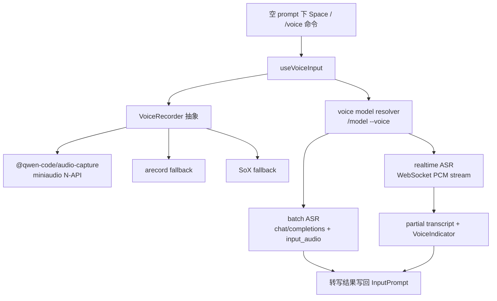

# Voice dictation 技术方案

> 适用范围：`QwenLM/qwen-code` CLI 输入框语音听写能力。
> 涉及 PR：#5502（voice dictation with native capture, streaming, and biasing）、#5605（native recorder fallback logging）、#5609（retry after native stop errors）、#5628（bundle native audio addon into standalone archives）、#5632（fastOnly/voiceOnly model flags）。
> 状态：2026-06-22 已合入；上周 PR 口径中属于 W25 创建、06-22 合入的跨周尾部 PR。

---

## 1. 背景与动机

Voice dictation 让用户在交互式 CLI 的空输入框里直接说话生成 prompt。它不是独立语音服务，而是复用现有 OpenAI-compatible / DashScope provider 配置，把音频采集、批量或实时 ASR、输入框状态和模型选择统一进 qwen-code 现有 CLI/TUI 体系。

核心目标：

- `/voice hold|tap|off|status` 控制听写；hold 模式按住 Space 说话，tap 模式按一次开始、再按一次或静音自动结束。
- `/model --voice <id>` 选择 ASR 模型；`general.voice.{enabled,mode,language}` 持久化用户偏好。
- 本机采集优先使用 `@qwen-code/audio-capture` 原生 addon，Linux 可回退 `arecord`，再回退 SoX。
- `qwen3-asr-flash` 走批量转写；realtime 模型走 WebSocket PCM streaming 并显示 partial transcript。

---

## 2. 整体架构

实现按三层切开：

| 层 | 作用 | 代表路径 |
|---|---|---|
| 音频采集 | native mic、permission query、fallback recorder、silence stop、native stop 后 active-state 释放 | `packages/audio-capture/`、`packages/cli/src/ui/voice/*recorder.ts` |
| 转写协议 | batch `input_audio`、realtime WebSocket、重试、语言/词表 bias | `voice-transcriber.ts`、`voice-stream-session.ts`、`qwen-asr-realtime-session.ts` |
| TUI 集成 | `/voice`、`/model --voice`、Space key matcher、状态/音量/partial UI | `voice-command.ts`、`use-voice-input.ts`、`VoiceIndicator.tsx` |

---

## 3. 关键实现

### 3.1 采集后端与 fallback

PR #5502 新增 `packages/audio-capture`，用 miniaudio 封装跨平台麦克风采集。CLI 侧抽象出 recorder interface，优先加载 native backend；不可用时 Linux 回退 `arecord`，再回退 SoX。这样普通安装路径依赖预编译产物，开发或 CI 可以通过 `node-gyp` 构建验证。

macOS 增加麦克风权限查询，避免无权限时只表现为“没有声音”。原生加载有冷启动预热，降低第一次按 Space 时 addon 初始化吞掉交互的概率。

### 3.2 batch 与 realtime 两条 ASR 路径

模型 id 决定转写路径：

- `qwen3-asr-flash`：把录音后的音频作为 OpenAI-compatible `chat/completions` 的 `input_audio` 发送，得到一次性结果。
- `qwen3-asr-flash-realtime`、`fun-asr-realtime`、`paraformer-realtime-v2` 等：把 PCM chunk 推到 WebSocket，实时展示 partial transcript，最终结果写回输入框。

两条路径都会使用语言偏好和开发术语 keyterms 做 bias，但不发送项目路径或 git branch 元数据。若非语音音频导致模型只回显 bias 词，结果会被丢弃，避免把提示词噪声写进用户输入。

### 3.3 输入框状态机

`useVoiceInput` 负责把 key event、voice mode、recorder、transcriber 和 `InputPrompt` 串起来：

- hold：空 prompt 下按住 Space 开始录音，释放后停止并转写。
- tap：第一次 Space 开始，第二次 Space 或 silence auto-stop 结束。
- off：Space 恢复普通输入行为。

`VoiceIndicator` 渲染 recording / transcribing / error 状态、音量条和 realtime partial transcript。转写完成只更新输入框内容，不直接绕过用户提交动作。

### 3.4 6/22-6/23 follow-up：fallback、重试与打包

#5605 把 native recorder 加载失败的 fallback 变成可诊断行为：当 `@qwen-code/audio-capture` 不可用、权限异常或平台不支持时，CLI 会记录清晰原因，再按 Linux `arecord` → SoX 的顺序回退，避免用户只看到“语音没反应”。

#5609 修复 stop 阶段异常后的状态释放。native recorder 在 stop 抛错时也会清理 active state，使用户下一次按 Space 或执行 `/voice` 能重新开始录音，而不是卡在“已有录音进行中”的假状态。

#5628 把 native audio addon 和 `node-gyp-build` 放进 standalone archives。发布包不再只依赖源码树里的 native addon，用户安装 standalone CLI 后也能走 native mic capture；打包失败时仍保留 fallback recorder 路径。

#5632 给模型定义增加 `fastOnly` / `voiceOnly` 旗标。`voiceOnly` 模型不会出现在主 `/model` 列表里，而是供 `/model --voice` 使用；这避免 ASR 模型被误选为对话模型，也让语音模型选择有独立过滤条件。

---

## 4. 设计约束

- **默认 opt-in**：语音由 `general.voice.enabled` 和 `/voice` 控制，不改变默认键盘输入。
- **不新增专用后端**：ASR 走已有 provider 配置，减少凭据和 endpoint 的新分支。
- **跨平台以预编译优先**：native addon 是最大风险面，因此通过 prebuildify + node-gyp-build + CI matrix 降低安装门槛。
- **隐私边界**：bias 只使用全局开发术语，不采集项目路径、git branch 等本地上下文。

---

## 5. 涉及 PR

| PR | 状态 | 作用 |
|---|---|---|
| #5502 | merged | 新增 voice command、voice model 选择、native/fallback recorder、batch/realtime ASR、VoiceIndicator、设置 schema、打包与 prebuild CI。 |
| #5605 | merged | native recorder fallback 记录可诊断原因，fallback 到 arecord/SoX 时不再静默失败。 |
| #5609 | merged | native stop 失败后释放 active recorder state，允许下一次录音重试。 |
| #5628 | merged | standalone archive 打包 native audio addon 与 `node-gyp-build`，让发布包可直接加载 native mic capture。 |
| #5632 | merged | 新增 `voiceOnly` 模型 flag，`/model --voice` 只展示语音模型；同时 `fastOnly` 隔离快模型。 |

---

## 6. 已知限制 / 后续

1. **Windows/Linux live mic 端到端仍依赖 CI 与后续实机验证**。PR 本地主要验证 macOS；Windows/Linux prebuild 与 realtime mic-to-WebSocket 需要持续关注。
2. **hold 模式依赖终端按键行为**。终端通常没有 key-up 事件，release 检测依赖 key repeat/输入事件模型，不同终端可能存在交互差异。
3. **语音 telemetry 未纳入本次 PR**。当前文档仅覆盖输入与转写链路，不把 voice 事件指标归入 telemetry 专题。
4. **Web Shell daemon voice 仍是 follow-up**。#5755/#5765 处于 open 状态，本文件当前只覆盖 CLI/TUI 语音输入和模型选择。

_新增于 2026-06-23；更新于 2026-06-24_
