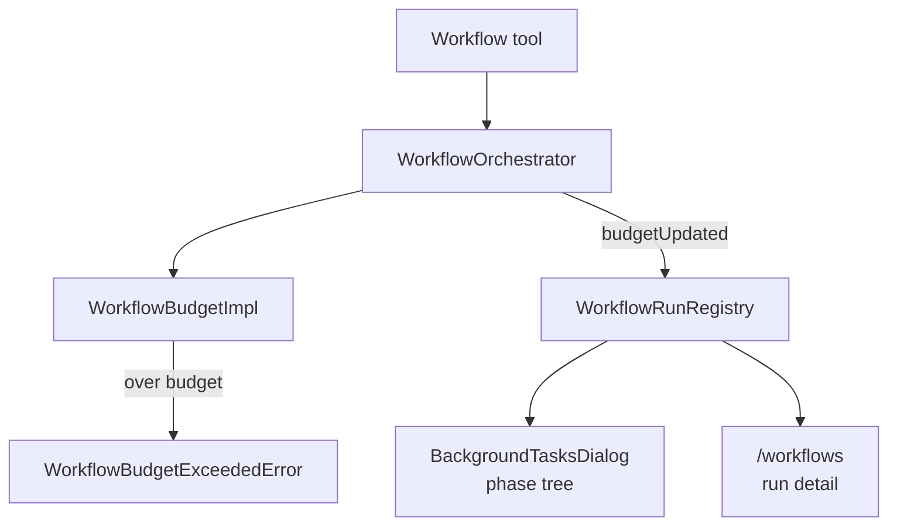

# Workflow token budget 技术方案

> 适用范围：`QwenLM/qwen-code` Workflow tool、workflow orchestrator、CLI `/workflows` UI。
> 涉及 PR：#5231（Workflow tool token budget + per-run UI surfacing）。
> 关联 issue：#4721（Dynamic Workflows port）。

---

## 1. 背景与动机

Workflow 可以在一个 run 内派发大量 agent。没有按 run 的 output token 预算时，脚本错误或过度 fan-out 会持续消耗 token，用户只能事后从日志和账单里发现问题。#5231 给 Workflow 加入 per-run 软预算，并把预算状态显示进后台任务 UI 与 `/workflows` 命令。

新增控制项：

- `QWEN_CODE_MAX_TOKENS_PER_WORKFLOW=<int>`：每个 workflow run 的 output token 上限，env 覆盖，100M 为硬上限。
- `skipWorkflowUsageWarning: true`：关闭首次 workflow 成功结果里的使用提示 banner。

---

## 2. 整体架构

预算链路贯通四层：

| 层 | 作用 |
|---|---|
| dispatch gate | 每次 workflow 派发 agent 前检查累计 output token |
| `WorkflowBudgetImpl` | 解析 env、维护 spent、抛 `WorkflowBudgetExceededError` |
| `WorkflowRunRegistry` | 记录 `tokensSpent`、`tokenBudgetTotal`、`perPhaseTokens` |
| CLI UI | `/workflows` 和后台任务 phase tree 显示 tokens / cap / per-phase totals |

---

## 3. 关键实现

### 3.1 软预算而非预留预算

预算检查发生在 dispatch 入口，不在 fan-out 前做保守预留。因此并发 `parallel()` / `pipeline()` 里，预算可能在并发窗口内 overshoot，最大约为 `(concurrency_window - 1) * per_dispatch_tokens`。这个 tradeoff 保持实现简单，并与上游 Claude Code 2.1.168 的语义一致。

### 3.2 per-phase 归因

orchestrator 发出 `budgetUpdated` 事件时，registry 按当时的 `currentPhase` 归属 token delta，更新 `perPhaseTokens`。这能让 `/workflows <runId>` 和后台任务 detail 看到每个 phase 的 token 消耗，但如果 agent 输出跨越 phase 边界，归因可能按事件触发时刻而非真实开始时刻落到新 phase。

### 3.3 使用提示不污染模型上下文

首次 workflow 成功结果前会在 `returnDisplay` prepend 一条 usage banner，提示如何设置 token cap；该 banner 不进入 `llmContent`，因此不会污染模型上下文。`shouldShowUsageWarning()` latch 在 `reset()` 后仍保持，避免 `/clear` 后重复提示。

---

## 4. 涉及 PR

| PR | 状态 | 作用 |
|---|---|---|
| #5231 | merged | 新增 Workflow per-run output-token budget、预算事件、registry 字段、CLI UI、env/settings schema 和测试。 |

---

## 5. 已知限制 / 后续

1. **预算是软门**。并发 fan-out 可能 overshoot；硬预留需要更复杂的 per-agent estimate 或调度协议，不在 #5231 范围。
2. **per-phase 归因有竞态边界**。agent 跨 phase 输出时，delta 归属以事件触发时刻的 `currentPhase` 为准。
3. **只管 output token**。本文不覆盖输入 token、模型价格或跨 run 总预算。

_新增于 2026-06-23_
