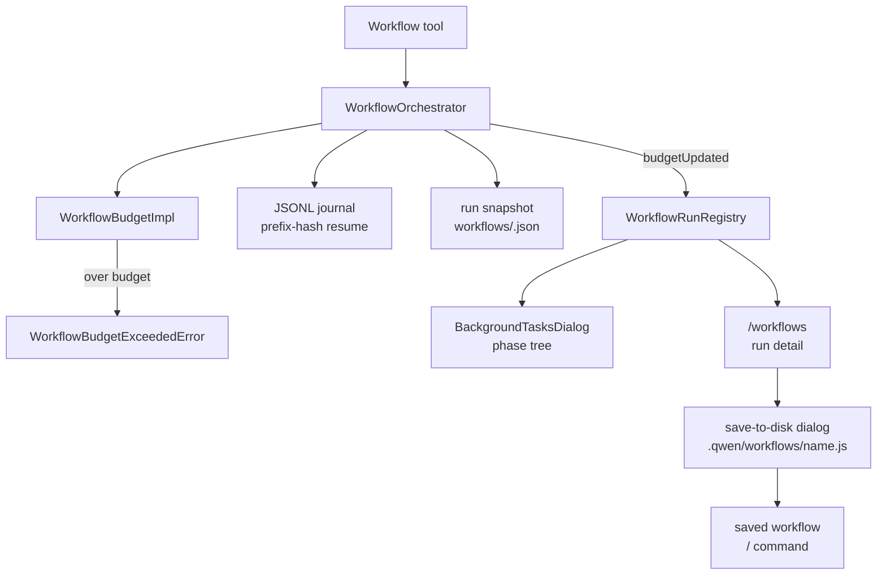

# Workflow token budget / Dynamic Workflows 技术方案

> 适用范围：`QwenLM/qwen-code` Workflow tool、workflow orchestrator、CLI `/workflows` UI、saved workflow slash commands。
> 涉及 PR：#5231（Workflow tool token budget + per-run UI surfacing）、#5600（Dynamic Workflows port completion）、#5679（agent/workflow integer env strict parse）、#5740（workflow snapshot prune path-traversal guard）。
> 关联 issue：#4721（Dynamic Workflows port）。

---

## 1. 背景与动机

Workflow 可以在一个 run 内派发大量 agent。没有按 run 的 output token 预算时，脚本错误或过度 fan-out 会持续消耗 token，用户只能事后从日志和账单里发现问题。#5231 先给 Workflow 加入 per-run 软预算，并把预算状态显示进后台任务 UI 与 `/workflows` 命令。#5600 在这个基础上补完 Dynamic Workflows 的可复用能力：saved workflow、同会话 resume、run snapshot、nested workflow、stall retry、keyword trigger 和 completion notification。

新增控制项：

- `QWEN_CODE_MAX_TOKENS_PER_WORKFLOW=<int>`：每个 workflow run 的 output token 上限，env 覆盖，100M 为硬上限。#5679 后使用严格正整数解析，拒绝 hex/scientific/float 等非规范写法。
- `skipWorkflowUsageWarning: true`：关闭首次 workflow 成功结果里的使用提示 banner。
- `.qwen/workflows/<name>.js` / `~/.qwen/workflows/<name>.js`：saved workflow 脚本目录，被发现为 `/<name>` slash command。

---

## 2. 整体架构

预算链路贯通四层：

| 层 | 作用 |
|---|---|
| dispatch gate | 每次 workflow 派发 agent 前检查累计 output token；预算耗尽的 dropped slot 与普通错误区分 |
| `WorkflowBudgetImpl` | 解析 env、维护 spent、抛 `WorkflowBudgetExceededError` |
| journal / snapshot | JSONL journal 用 prefix hash 支持 same-session resume；terminal run snapshot 让 `/workflows` 跨重启保留最近历史 |
| `WorkflowRunRegistry` | 记录 `tokensSpent`、`tokenBudgetTotal`、`perPhaseTokens`、terminal snapshot 信息 |
| CLI UI | `/workflows` 和后台任务 phase tree 显示 tokens / cap / per-phase totals；detail view 支持 save workflow |

---

## 3. 关键实现

### 3.1 软预算而非预留预算

预算检查发生在 dispatch 入口，不在 fan-out 前做保守预留。因此并发 `parallel()` / `pipeline()` 里，预算可能在并发窗口内 overshoot，最大约为 `(concurrency_window - 1) * per_dispatch_tokens`。这个 tradeoff 保持实现简单，并与上游 Claude Code 2.1.168 的语义一致。

### 3.2 per-phase 归因

orchestrator 发出 `budgetUpdated` 事件时，registry 按当时的 `currentPhase` 归属 token delta，更新 `perPhaseTokens`。这能让 `/workflows <runId>` 和后台任务 detail 看到每个 phase 的 token 消耗，但如果 agent 输出跨越 phase 边界，归因可能按事件触发时刻而非真实开始时刻落到新 phase。

### 3.3 使用提示不污染模型上下文

首次 workflow 成功结果前会在 `returnDisplay` prepend 一条 usage banner，提示如何设置 token cap；该 banner 不进入 `llmContent`，因此不会污染模型上下文。`shouldShowUsageWarning()` latch 在 `reset()` 后仍保持，避免 `/clear` 后重复提示。

### 3.4 同会话 resume：JSONL journal + prefix hash

#5600 增加 `resumeFromRunId`。每个 `agent()` dispatch 会把输入和结果写入 rolling prefix-hash journal。再次运行同一脚本并传入 `resumeFromRunId` 时，orchestrator 先 replay journal：`(prompt, opts)` 与 hash 链匹配的 `agent()` 直接从 cache 返回，直到第一个不匹配点再切回 live 执行。这样脚本前缀未变时可复用历史 agent 输出；脚本一旦变更，后续分支不会误用旧结果。

### 3.5 saved workflows 与 `/workflows` 持久历史

Terminal run 会写入 `<projectDir>/workflows/<runId>.json` snapshot，`/workflows` 启动时可从磁盘加载最近历史，不再只依赖内存 registry。完成 run 的 detail view 支持 `s` 保存脚本到 project/user scope，下次启动被 `saved-workflow-loader` 发现为 `/<name>` command。`workflow` tool 因此新增 `scriptPath` 参数，并与 inline `script` 做 XOR 校验，避免一次调用同时给两份脚本来源。

#5740 修复 snapshot retention 的删除边界：递归删除 journal dir 前必须确认 runId 满足 `wf_<hex>` 形态。恶意或损坏的 `.json` snapshot 仍可被当作 stray 文件 unlink，但不能用伪造 runId 驱动 `fs.rm` 删除 workflows 目录外的路径。

### 3.6 stall watchdog / nested workflow / keyword trigger

#5600 的 per-dispatch stall watchdog 会在 subagent 长时间无 round/stream/usage/tool 事件时 abort 并重试，工具执行期间暂停 watchdog，避免把长工具调用误判为 agent 卡死。每个 dispatch path 外包 3 次 retry。

Workflow sandbox 新增全局 `workflow('<name>')`，允许运行中的 workflow 调 saved workflow，但仅允许一层 nested 调用；nested sandbox 不再注入 `workflow` 实现，深层 nesting 会抛错，避免无限递归和复杂的预算归属。

CLI 侧新增 keyword trigger：prompt 中出现独立单词 `workflow` 时注入一条 `<system-reminder>` 软提示，并在 footer 显示 workflow active。它不是强制 tool call，可通过 `ui.disableWorkflowKeywordTrigger` 关闭。

---

## 4. 涉及 PR

| PR | 状态 | 作用 |
|---|---|---|
| #5231 | merged | 新增 Workflow per-run output-token budget、预算事件、registry 字段、CLI UI、env/settings schema 和测试。 |
| #5600 | merged | 补完 Dynamic Workflows：nested workflow、stall watchdog/retry、budget drop accounting、JSONL journal resume、run snapshot、saved workflow slash command、save dialog、keyword trigger、completion notification 和 telemetry。 |
| #5679 | merged | workflow/agent 相关 env var 使用严格正整数解析，防止 `1e3`、`0x10`、`1.5` 等非规范值被宽松接受。 |
| #5740 | merged | workflow snapshot pruning 先验证 runId 再递归删除 journal dir，堵住恶意 snapshot name 造成的路径穿越删除。 |

---

## 5. 已知限制 / 后续

1. **预算是软门**。并发 fan-out 可能 overshoot；硬预留需要更复杂的 per-agent estimate 或调度协议，不在 #5231/#5600 范围。
2. **per-phase 归因有竞态边界**。agent 跨 phase 输出时，delta 归属以事件触发时刻的 `currentPhase` 为准。
3. **只管 output token**。本文不覆盖输入 token、模型价格或跨 run 总预算。
4. **resume 只复用最长不变前缀**。journal cache 以脚本执行顺序和 `agent()` 输入匹配为准；第一个不匹配点之后必须 live 执行，不能做任意 DAG 级复用。
5. **per-agent pause/retry/skip 与 ACP workflow propagation 未落地**。#5600 明确把这两块作为 follow-up，当前只支持 whole-run cancel 和 CLI 侧 saved workflow surface。

_新增于 2026-06-23；更新于 2026-06-24_
